# 🌍 Buckminster Fuller Knowledge Graph

```ascii
 ____             _              _           _              _____ _ _           
|  _ \           | |            (_)         | |            |  ___| | |         
| |_) |_   _  ___| | ___ __ ___ _ _ __  ___| |_ ___ _ __ | |_  _| | | ___ _ __ 
|  _ <| | | |/ __| |/ / '_ ` _ \| | '_ \/ __| __/ _ \ '__||  _|| | | |/ _ \ '__|
| |_) | |_| | (__|   <| | | | | | | | | \__ \ ||  __/ |   | | | | | |  __/ |   
|____/ \__,_|\___|_|\_\_| |_| |_|_|_| |_|___/\__\___|_|   \_| |_|_|_|\___|_|   
```

> 🎯 "You never change things by fighting the existing reality. To change something, build a new model that makes the existing model obsolete." 

A comprehensive, modular knowledge repository documenting the work, ideas, and impact of [[Buckminster_Fuller]], implemented through modern knowledge graph technologies.

## 🎯 Vision
Building a living, versioned, plain-text documentation of Fuller's comprehensive anticipatory design science principles through:
- 🧠 Interconnected knowledge structures
- 🔄 Dynamic relationship mapping
- 🌐 Cross-disciplinary integration
- 📚 Comprehensive archival approach

## 🏗️ Technical Framework


## 📚 Core Components

### 🔧 Technical Implementation
- 📑 Markdown-based documentation
- 🐜 [[Obsidian]] linking style 
- 🔗 Wiki-style cross-referencing
- 📊 Graph visualization
- 🔄 Bidirectional linking
- 🏷️ Semantic tagging

## 🚀 Getting Started

1. 📥 **Clone and Setup**
   ```bash
   # Clone the repository
   git clone https://github.com/your-username/School_of_Tomorrow.git
   cd School_of_Tomorrow

   # Run the setup script
   ./setup.sh

   # Start the interactive explorer
   ./run
   ```

2. 🛠️ **Tools & Requirements**
   - Python 3.8+ for the interactive explorer
   - [[Obsidian]] for knowledge graph navigation
   - [[Cursor]] and [[LLM]] computational methods 
   - Synthetic intelligence & OSINT methods
   - Git for version control
   - Markdown editor

3. 📖 **Rules**
   - [[Style_Guide|Style Guide]]
   - [[Metadata_Schema|Metadata Schema]]
   - [[Contribution_Guide|Contribution Guide]]

4. 🧮 **Content Pools**
   - **[[Synergetics|Synergetics]]** - Systematic geometric exploration
   - **[[Tensegrity|Tensegrity]]** - Structural integrity principles
   - **[[Dymaxion|Dymaxion]]** - Maximum efficiency systems
   - **[[Design_Science]]** - Design methodology
   - **[[World_Game|World Game]]** - Global simulation framework
   - [[Tetrahedron]] - Form with [[4]] [[Plane]]s, [[6]] [[Edge]]s, [[4]] [[Vertex]]es, [[1]] [[Space]].

## 📊 Project Structure

```ascii
+------------------+
|   Knowledge      |
|    Graph         |
+--------+---------+
         |
    +----+----+
    |         |
+---+---+ +---+---+
|Concepts| |Systems|
+---+---+ +---+---+
    |         |
+---+---+ +---+---+
|Theory  | |Practice|
+--------+ +--------+
```

### 📁 Directory Organization
```ascii
School_of_Tomorrow/
├── 📂 concepts/          # Core ideas and principles
├── 📂 technical/         # Technical implementations
├── 📂 research/          # Research documentation
├── 📂 people/           # Biographical information
├── 📂 places/           # Location documentation
├── 📂 fonds/            # Archival collections
└── 📂 documentation/    # Project guides and docs
```

## 🔗 Related Resources
- 🏛️ [Buckminster Fuller Institute](https://www.bfi.org/)
- 📚 [Stanford Archives](https://archives.stanford.edu/)
- 🎓 [Design Science Lab](https://designsciencelab.org/)

## 📄 License
This project is licensed under the MIT License - see the [LICENSE](LICENSE) file for details.

## 🙏 Acknowledgments
- [[4D|Time-Space Design]]s
- Open Source
- Contributors
- 

---

🏷️ **Tags**: #buckminster-fuller #knowledge-graph #design-science #synergetics #documentation #obsidian

## Concept Map

```mermaid
graph TD
    A[Fuller's Work] --> B[Design Science]
    A --> C[Geometry]
    A --> D[Philosophy]
    
    B --> E[CADS]
    B --> F[World Game]
    B --> G[Anticipatory Design]
    
    C --> H[Synergetics]
    C --> I[Tensegrity]
    C --> J[60° Coordination]
    
    D --> K[Spaceship Earth]
    D --> L[Comprehensive Thinking]
    D --> M[System Wholeness]
    
    E --> N[Global Solutions]
    F --> N
    G --> N
    
    H --> O[Practical Applications]
    I --> O
    J --> O
    
    style A fill:#f9f,stroke:#333,stroke-width:4px
    style B fill:#aaf,stroke:#333
    style C fill:#afa,stroke:#333
    style D fill:#faa,stroke:#333
```



## Overview

This knowledge graph captures the interconnected nature of Fuller's work across multiple domains, including:

- **[[concepts/Synergetics|Synergetics]]** - Fuller's systematic study of geometric systems and nature's coordinate system
- **[[concepts/Tensegrity|Tensegrity]]** - Structural integrity through tension and compression
- **[[concepts/Chronofile|Chronofile]]** - Fuller's detailed life documentation system
- **[[concepts/Dymaxion|Dymaxion]]** - Fuller's approach to maximum efficiency through minimum means
- **[[concepts/4D|4D]]** - Four-dimensional approaches to design and thinking
- **[[concepts/Comprehensive_Anticipatory_Design_Science|CADS]]** - Comprehensive approach to global problem-solving
- **[[concepts/World_Game|World Game]]** - Global simulation for resource optimization
- **[[concepts/Ephemeralization|Ephemeralization]]** - Doing progressively more with less
- **[[concepts/60_Degree_Coordination|60° Coordination]]** - Nature's fundamental angular relationship

## Repository Structure

### System Organization


### 1. Core Sections
- **[[People|People]]** - Individuals and relationships
  - [[Buckminster_Fuller|Bucky Fuller]]
  
- **[[Places|Places]]** - Locations and contexts
  - [[Black_Mountain_College|Black Mountain College]]
  - [[Southern_Illinois_University|Southern Illinois University]]
  
- **[[Concepts|Concepts]]** - Ideas and principles
  - [[Synergetics|Synergetics]]
  - [[Dymaxion|Dymaxion]]
  - [[Tensegrity|Tensegrity]]
  
- **[[Mathematics|Mathematics]]** - Geometric principles
  - [[Vector_Mathematics|Vector Mathematics]]
  - [[Geodesic_Mathematics|Geodesic Mathematics]]
  
- **[[Formalisms|Formalisms]]** - Systematic approaches
  - [[Design_Science|Design Science]]
  - [[System_Theory|System Theory]]
  
- **[[Philosophy|Philosophy]]** - Worldview and teachings
  - [[Comprehensive_Thinking|Comprehensive Thinking]]
  - [[Spaceship_Earth|Spaceship Earth]]
  
- **[[Technical|Technical]]** - Engineering and design
  - [[Geodesic_Dome|Geodesic Dome]]
  - [[Dymaxion_House|Dymaxion House]]
  - [[Dymaxion_Car|Dymaxion Car]]
  - [[Dymaxion_Map|Dymaxion Map]]

- **[[Research|Research]]** - Scientific foundations
  - [[Vector_Mathematics|Vector Mathematics]]
  - [[Geodesic_Mathematics|Geodesic Mathematics]]
  - [[Synergetic_Geometry|Synergetic Geometry]]
  - [[Tensegrity_Principles|Tensegrity Principles]]

- **[[Organizations|Organizations]]** - Institutional connections
  - [[BFI|Buckminster Fuller Institute]]
  - [[WRI|World Resources Inventory]]
  - [[WGI|World Game Institute]]

## Significant Places

### Educational Institutions


### Key Project Locations


### Historical Timeline


### Archive Locations
1. **Primary Collections**
   - [[Stanford_Special_Collections]]
     - [[Chronofile]] 
   
   - [[SNAC_Archives|SNAC Archives]]
     - [[Fuller_Correspondence|Correspondence]]
     - [[Project_Records|Project Documents]]
     - [[Research_Archive|Research Materials]]

2. **Research Centers**
   - [[BFI_Collection|BFI Archives]]
   - [[SIU_Archives|SIU Special Collections]]
   - [[LOC_Collection|Library of Congress Collection]]

### Geographic Impact


### Place Connections
1. **[[Educational_Institutions|Educational Institutions]]**
   - [[Black_Mountain_College|Black Mountain College]]
     - Experimental education
     - Interdisciplinary approach
     - Collaborative projects
   
   - [[Southern_Illinois_University|Southern Illinois University]]
     - World Game development
     - Design Science research
     - Student engagement

2. **[[Research_Centers|Research Centers]]**
   - [[MIT_Research|MIT Dome Projects]]
   - [[Cornell_Projects|Cornell Research]]
   - [[Washington_Labs|Washington University Labs]]

3. **[[Implementation_Sites|Implementation Sites]]**
   - [[Montreal_Biosphere|Montreal Biosphere]]
   - [[Union_Tank_Car_Dome|Union Tank Car Dome]]
   - [[Wichita_House|Wichita House]]

## Key Concepts and Applications

### Concept Integration


### Core Principles
1. **[[Design_Science|Design Science]]**
   - [[Comprehensive_Anticipatory_Design_Science]]
   - [[Anticipatory_Design|Anticipatory Design]]
   - [[System_Wholeness|System Wholeness]]

2. **[[Geometric_Principles|Geometric Principles]]**
   - [[Vector_Equilibrium|Vector Equilibrium]]
   - [[60_Degree_Coordination|60° Coordination]]
   - [[Closest_Packing_of_Spheres]]

3. Principles and Concepts
   - [[Ephemeralization|Ephemeralization]]
   - [[Dymaxion|Dymaxion]]
   - [[Goldilocks_Conjecture|Optimal Balance Theory]]

### Major Applications
1. **[[Structural_Systems|Structural Systems]]**
   - [[Geodesic_Dome|Geodesic Dome]]
   - [[Tensegrity_Structures|Tensegrity Structures]]
   - [[Space_Frames|Space Frames]]

2. **[[Transportation|Transportation Systems]]**
   - [[Dymaxion_Car|Dymaxion Car]]
   - [[Efficient_Transport|Efficient Transport]]

3. **[[Housing|Housing Systems]]**
   - [[Dymaxion_House|Dymaxion House]]
   - [[Wichita_House|Wichita House]]

## Implementation

### Knowledge Structure


### Development Flow


This knowledge base is implemented using Obsidian.md, featuring:
- Plain text Markdown files
- Wiki-style linking using [[filename]] syntax
- Graph visualization
- Bidirectional linking
- Tags and metadata

### Document Types
1. **[[Person_Template|Profiles]]** - People, organizations, institutions
2. **[[Concept_Template|Concepts]]** - Ideas, theories, principles
3. **[[Technical_Template|Technical]]** - Designs, structures, systems
4. **[[Place_Template|Places]]** - Locations, buildings, sites
5. **[[Resource_Template|Resources]]** - References, archives, materials

### Development Channels
1. **Education/Documentation**
   - [[Technical_Docs|Technical Documentation]]
   - [[Social_Studies|Social Impact]]
   - [[Historical_Records|Historical Context]]
   - [[Teaching_Resources|Teaching Materials]]

2. **Research/Analysis**
   - [[Math_Theory|Mathematical Formalisms]]
   - [[Code_Projects|Code Implementations]]
   - [[Category_Studies|Category Theory]]
   - [[Analysis_Methods|Analytical Frameworks]]

## Getting Started

1. Install [Obsidian](https://obsidian.md/)
2. Clone this repository
3. Open the repository as an Obsidian vault
4. Review the [[documentation/guides/Style_Guide|Style Guide]]
5. Explore using the graph view or folder structure

## Contributing

### Contribution Flow


Contributions are welcome! Please follow these steps:

1. Review the [[documentation/guides/Style_Guide|Style Guide]]
2. Use appropriate [[documentation/templates/index|Templates]]
3. Follow the [[documentation/schemas/Metadata_Schema|Metadata Schema]]
4. Submit changes through pull requests

## Resources

### Documentation
- [[documentation/guides/Style_Guide|Style Guide]]
- [[documentation/schemas/Metadata_Schema|Metadata Schema]]
- [[documentation/guides/Obsidian_Features|Obsidian Features]]
- [[documentation/templates/index|Templates]]

### Key Entry Points
- [[Buckminster_Fuller|R. Buckminster Fuller]] - Main profile
- [[Synergetics|Synergetics]] - Core concept
- [[Geodesic_Dome|Geodesic Dome]] - Key innovation
- [[World_Game|World Game]] - Global vision
- [[CADS|Comprehensive Anticipatory Design Science]] - Design methodology

## License

This project is licensed under [appropriate license] - see the LICENSE file for details.

---

> "You never change things by fighting the existing reality. To change something, build a new model that makes the existing model obsolete." - [[people/Fuller_Buckminster|R. Buckminster Fuller]]

## Tags
#knowledge-graph #buckminster-fuller #documentation #obsidian #design-science #systems-thinking

## Key Concepts and Applications

### Technical Systems Integration


### Core Technical Principles
1. **[[concepts/Mathematical_Framework|Mathematical Foundations]]**
   - [[mathematics/Vector_Equilibrium|Vector Equilibrium Mathematics]]
   - [[mathematics/Geodesic_Math|Geodesic Mathematics]]
   - [[mathematics/Synergetic_Geometry|Synergetic Geometry]]
   - [[mathematics/Jitterbug_Transformation|Jitterbug Transformation]]

2. **[[concepts/Structural_Systems|Structural Principles]]**
   - [[technical/Tensegrity_Systems|Tensegrity Systems]]
   - [[technical/Geodesic_Structures|Geodesic Structures]]
   - [[technical/Space_Frame_Design|Space Frame Design]]
   - [[technical/Octet_Truss|Octet Truss]]

3. **[[concepts/Design_Methodology|Design Methodology]]**
   - [[technical/Design_Science_Process|Design Science Process]]
   - [[technical/Anticipatory_Design_Methods|Anticipatory Design Methods]]
   - [[technical/System_Analysis|System Analysis]]
   - [[technical/Resource_Optimization|Resource Optimization]]

## Implementation

### Technical Implementation


## Research Areas

### Technical Research
1. **[[Mathematical_Studies|Mathematical Studies]]**
   - [[Vector_Analysis|Vector Analysis]]
   - [[Geometric_Systems|Geometric Systems]]
   - [[Structural_Mathematics|Structural Mathematics]]

2. **[[Engineering_Research|Engineering Research]]**
   - [[Tensegrity_Research|Tensegrity Development]]
   - [[Geodesic_Studies|Geodesic Analysis]]
   - [[Materials_Research|Materials Science]]

3. **[[Design_Science_Research|Design Science Research]]**
   - [[System_Analysis|System Analysis]]
   - [[Resource_Studies|Resource Studies]]
   - [[Global_Planning|Global Planning]]

## Timeline & Evolution


### Development Phases
```ascii
Past ────────────────────●─────────────────────> Future
                        │
           ┌────────────┼────────────┐
    Theory Generation   NOW    Practical Application
           │            │            │
    ┌──────┴──────┐    │    ┌──────┴──────┐
    │ Mathematics  │    │    │ Engineering │
    │ Geometry    │    │    │ Building    │
    │ Physics     │    │    │ Testing     │
    └─────────────┘    │    └────────────┘
                       │
              Documentation & 
               Preservation
```

## Component Relationships


### Resource Flow
```ascii
                    ┌─────────────┐
                    │  Research   │
                    └──────┬──────┘
                           │
                    ┌──────▼──────┐
            ┌──────►│ Documentation│◄─────┐
            │       └──────┬──────┘      │
            │              │             │
    ┌───────┴──────┐ ┌────▼────┐ ┌──────┴──────┐
    │   Analysis   │ │ Storage │ │  Validation  │
    └───────┬──────┘ └────┬────┘ └──────┬──────┘
            │             │             │
            └─────────────┼─────────────┘
                         │
                    ┌────▼────┐
                    │ Output  │
                    └─────────┘
```

## Navigation Guide

```ascii
+-------------------------------------------------------------------------+
|                        KNOWLEDGE BASE NAVIGATION                         |
+-------------------------------------------------------------------------+
|                                                                         |
|  [START HERE] ──► README.md                                            |
|                   │                                                     |
|           ┌───────┴───────┐                                            |
|           ▼               ▼                                            |
|     Documentation     Concepts                                         |
|           │               │                                            |
|     ┌─────┴─────┐   ┌────┴────┐                                       |
|     ▼           ▼   ▼         ▼                                       |
|  Guides    Templates  Core    Applications                            |
|                                                                         |
+-------------------------------------------------------------------------+
```

## Implementation Architecture


## Knowledge Domains


### System Interconnections


## 🚀 Quick Start

### Interactive Explorer
The repository comes with an interactive terminal-based explorer that helps you navigate the knowledge graph:

1. **First-time setup:**
   ```bash
   ./setup.sh
   ```

2. **Run the explorer:**
   ```bash
   ./run
   ```

The explorer provides:
- 📂 Browse repository structure
- 📖 View markdown files with formatting
- 🔍 Search functionality
- 🗺️ Visual repository map
- 💻 Syntax highlighting for code

## 🔗 Live Resources & Integration

### Live Access Points
- 🌐 **Live Knowledge Graph**: [Synergetics Knowledge Graph](https://publish.obsidian.md/synergetics)
- 💻 **GitHub Repository**: [School of Tomorrow](https://github.com/docxology/School_of_Tomorrow/)
- 📚 **GitHub Tools**: [[documentation/tools/GitHub_Tools|GitHub Integration Guide]]

### Sync Architecture


