# 4D

4D represents Fuller's early conceptual framework integrating time with three-dimensional space, leading to his [[Dymaxion]] principles and later evolving into his comprehensive [[Synergetics|synergetic geometry]].

## Historical Development

### Origins
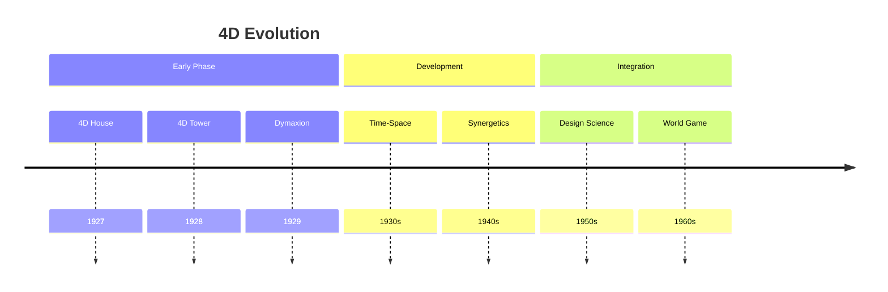

### Conceptual Framework
1. Time Integration
   - Fourth dimension as time
   - Dynamic systems thinking
   - Evolutionary design
   - Process orientation

2. Spatial Understanding
   - Three-dimensional space
   - Movement patterns
   - Structural dynamics
   - Energy flows

## Core Principles

### Dimensional Integration
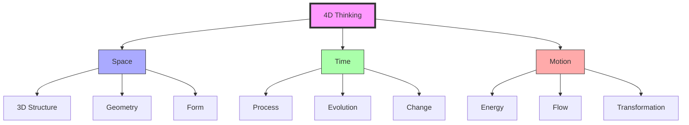

### Key Elements
1. [[Time_Space_Mathematics|Time-Space Mathematics]]
   - Four-dimensional geometry
   - Dynamic systems
   - Process modeling
   - Energy patterns

2. [[Design_Science|Design Integration]]
   - Time-based design
   - Process thinking
   - Evolution planning
   - System dynamics

## Applications

### Design Implementation
1. [[Dymaxion_House|4D House]]
   - Dynamic architecture
   - Time efficiency
   - Resource optimization
   - Process integration

2. [[Dymaxion_Car|4D Transport]]
   - Movement design
   - Energy efficiency
   - Flow optimization
   - System integration

### System Applications
```mermaid
mindmap
    root((4D Systems))
        Architecture
            [[Dynamic Design]]
            [[Process Integration]]
            [[Resource Flow]]
        Transport
            [[Movement Systems]]
            [[Energy Efficiency]]
            [[Flow Patterns]]
        Planning
            [[Time Management]]
            [[Process Design]]
            [[Evolution Strategy]]
```

## Mathematical Framework

### 4D Mathematics
1. [[Time_Space_Mathematics|Mathematical Principles]]
   - Four-dimensional geometry
   - Dynamic calculations
   - Process modeling
   - System analysis

2. [[Synergetics|Geometric Integration]]
   - Vector mathematics
   - Energy patterns
   - System dynamics
   - Transformation models

### Analysis Framework
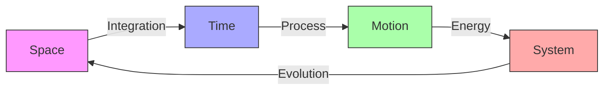

## Educational Integration

### Learning Framework
1. [[Design_Science_Education|Educational Methods]]
   - Four-dimensional thinking
   - Process understanding
   - System dynamics
   - Evolution planning

2. [[World_Game|Global Implementation]]
   - Time-based simulation
   - Process modeling
   - System evolution
   - Dynamic planning

### Teaching Methods
```mermaid
mindmap
    root((Education))
        Theory
            [[4D Concepts]]
            [[Time-Space]]
            [[Process Thinking]]
        Practice
            [[Dynamic Design]]
            [[System Analysis]]
            [[Evolution Planning]]
        Application
            [[Project Design]]
            [[Implementation]]
            [[Assessment]]
```

## Legacy

### Impact Areas
1. [[Design_Science|Design Evolution]]
   - Time-based design
   - Process integration
   - System thinking
   - Evolution planning

2. [[Synergetics|Geometric Development]]
   - Four-dimensional geometry
   - Dynamic systems
   - Energy patterns
   - Transformation models

### Innovation Framework
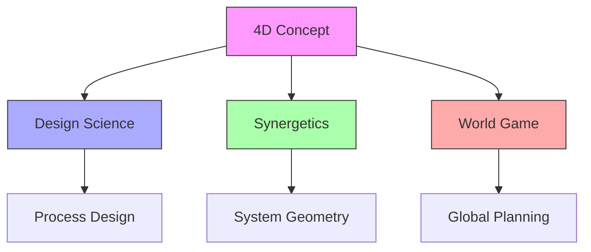

## References

### Primary Sources
1. [[4D_Timelock|4D Timelock]] (1928)
2. [[Nine_Chains_to_the_Moon|Nine Chains to the Moon]] (1938)
3. [[Synergetics|Synergetics]] (1975)

### Related Resources
1. [[papers/4D_Design|4D Design Principles]]
2. [[papers/Time_Space|Time-Space Integration]]
3. [[papers/Process_Design|Process Design Methods]]

## Notes
- Foundation for Fuller's early work
- Evolution into Dymaxion concept
- Integration with Synergetics
- Continuing influence on design

## Tags
#concept #geometry #time-space #design-science #fuller-principle

## Technical Specifications

### Mathematical Models
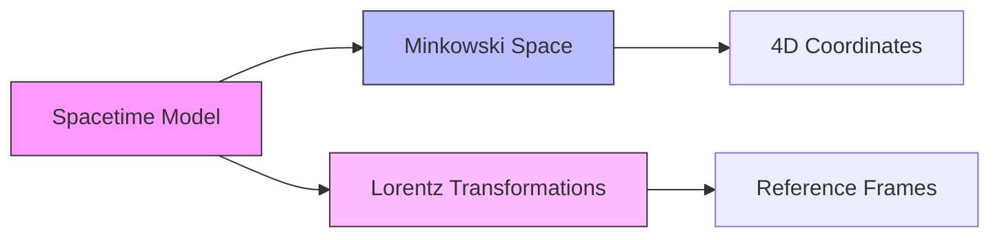

### Geometric Relationships
```math
\begin{aligned}
ds^2 &= -c^2dt^2 + dx^2 + dy^2 + dz^2 \\
\text{where:} \\
ds^2 &= \text{spacetime interval} \\
c &= \text{speed of light} \\
t &= \text{time coordinate} \\
x,y,z &= \text{spatial coordinates}
\end{aligned}
```

### Implementation Framework
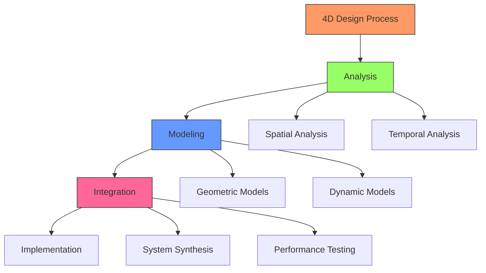

## System Components

### Core Elements
1. Spatial Framework
   - [[Coordinate_Systems|Coordinate Systems]]
   - [[Reference_Frames|Reference Frames]]
   - [[Geometric_Transformations|Geometric Transformations]]

2. Temporal Framework
   - [[Time_Evolution|Time Evolution]]
   - [[State_Changes|State Changes]]
   - [[Dynamic_Behavior|Dynamic Behavior]]

### Integration Methods
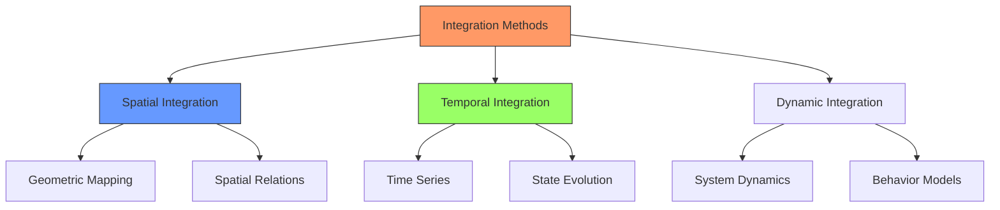

## Performance Metrics

### Evaluation Criteria
1. Spatial Efficiency
   - Volume optimization
   - Material usage
   - Structural integrity
   - Space utilization

2. Temporal Efficiency
   - Time-based performance
   - Adaptation rate
   - Evolution speed
   - Response time

### Measurement Framework
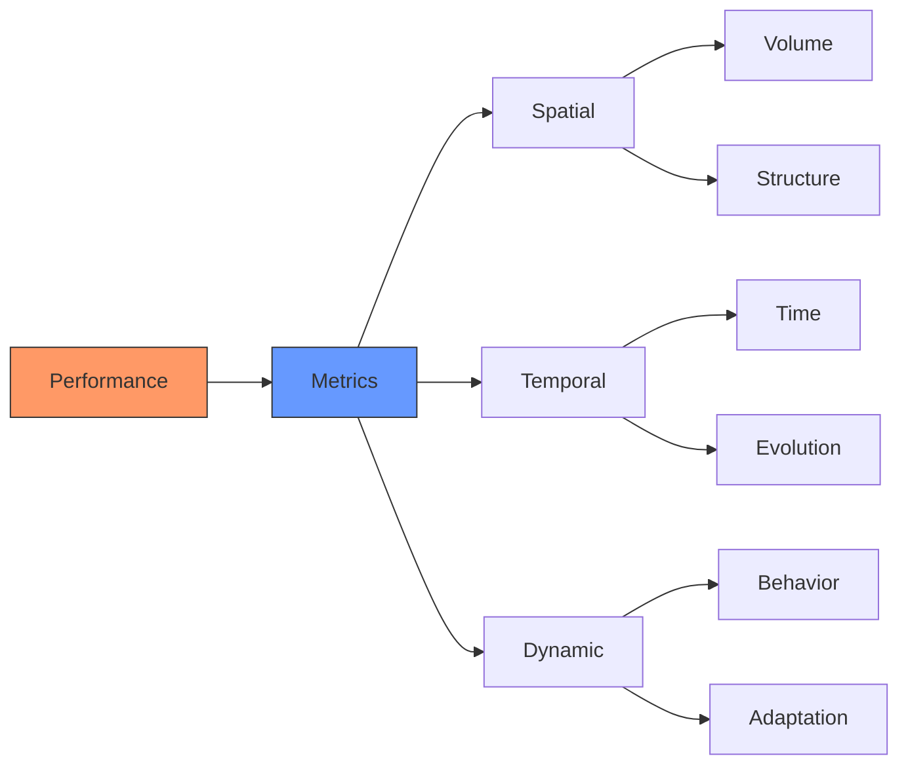

## Implementation Guidelines

### Technical Requirements
1. Spatial Design
   ```yaml
   requirements:
     geometric:
       - Coordinate system definition
       - Reference frame alignment
       - Transformation matrices
     structural:
       - Load distribution
       - Material properties
       - Stability analysis
   ```

2. Temporal Design
   ```yaml
   requirements:
     dynamic:
       - State evolution models
       - Time-based behaviors
       - Adaptation mechanisms
     performance:
       - Response metrics
       - Efficiency measures
       - Optimization criteria
   ```

### Integration Process
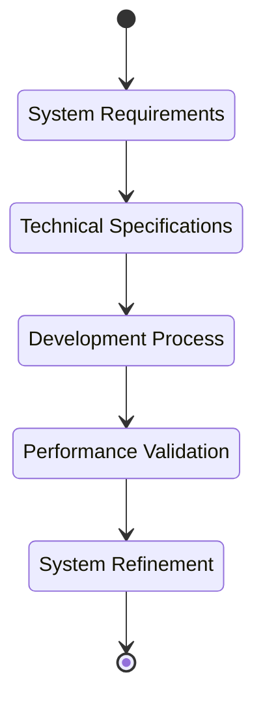

## Advanced Topics

### Differential Geometry
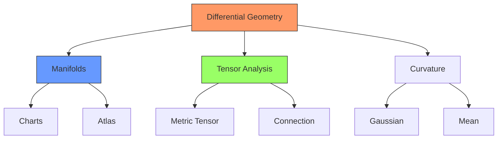

### Topological Considerations
1. Manifold Structure
   - [[Differential_Topology|Differential Topology]]
   - [[Manifold_Theory|Manifold Theory]]
   - [[Chart_Maps|Chart Maps]]
   - [[Atlas_Structure|Atlas Structure]]

2. Metric Properties
   - [[Metric_Tensor|Metric Tensor]]
   - [[Connection_Theory|Connection Theory]]
   - [[Parallel_Transport|Parallel Transport]]
   - [[Geodesic_Curves|Geodesic Curves]]

### Advanced Mathematics
```math
\begin{aligned}
g_{\mu\nu} &= \begin{pmatrix}
-c^2 & 0 & 0 & 0 \\
0 & 1 & 0 & 0 \\
0 & 0 & 1 & 0 \\
0 & 0 & 0 & 1
\end{pmatrix} \\
\Gamma^\lambda_{\mu\nu} &= \frac{1}{2}g^{\lambda\sigma}
(\partial_\mu g_{\nu\sigma} + \partial_\nu g_{\mu\sigma} - \partial_\sigma g_{\mu\nu})
\end{aligned}
```

## Computational Methods

### Numerical Analysis
1. Discretization Methods
   - [[Finite_Elements|Finite Elements]]
   - [[Finite_Differences|Finite Differences]]
   - [[Spectral_Methods|Spectral Methods]]
   - [[Mesh_Generation|Mesh Generation]]

2. Solution Techniques
   - [[Iterative_Methods|Iterative Methods]]
   - [[Direct_Solvers|Direct Solvers]]
   - [[Optimization_Algorithms|Optimization Algorithms]]
   - [[Error_Analysis|Error Analysis]]

### Implementation Strategies
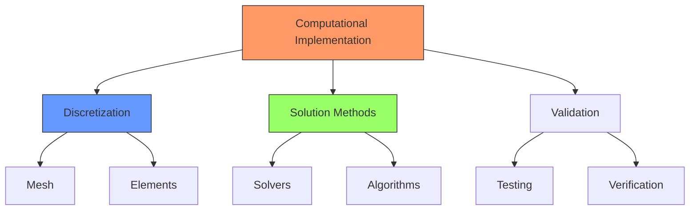

## Physical Applications

### Relativistic Considerations
1. Spacetime Physics
   - [[Special_Relativity|Special Relativity]]
   - [[General_Relativity|General Relativity]]
   - [[Lorentz_Transformations|Lorentz Transformations]]
   - [[Reference_Frames|Reference Frames]]

2. Physical Implications
   - [[Time_Dilation|Time Dilation]]
   - [[Length_Contraction|Length Contraction]]
   - [[Simultaneity|Simultaneity]]
   - [[Proper_Time|Proper Time]]

### Engineering Applications
```yaml
applications:
  structural:
    - Dynamic response analysis
    - Time-dependent deformation
    - Material evolution
    - Adaptive structures
  systems:
    - Control systems
    - Feedback mechanisms
    - State evolution
    - Performance optimization
  design:
    - 4D modeling
    - Time-based simulation
    - Evolution prediction
    - Optimization strategies
```

## Software Implementation

### Development Framework
1. Core Components
   - [[Geometric_Engine|Geometric Engine]]
   - [[Physics_Simulator|Physics Simulator]]
   - [[Evolution_Engine|Evolution Engine]]
   - [[Analysis_Tools|Analysis Tools]]

2. Integration Layers
   - [[Data_Management|Data Management]]
   - [[Visualization_System|Visualization System]]
   - [[Computation_Engine|Computation Engine]]
   - [[User_Interface|User Interface]]

### System Architecture
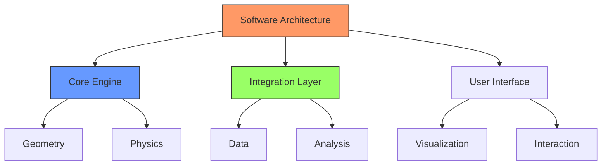

## See Also
- [[Relativity_Theory|Relativity Theory]]
- [[Differential_Geometry|Differential Geometry]]
- [[Computational_Methods|Computational Methods]]
- [[Engineering_Applications|Engineering Applications]]
- [[Software_Systems|Software Systems]]

## External Links
- [Stanford Encyclopedia - Spacetime](https://plato.stanford.edu/entries/spacetime/)
- [MIT OpenCourseWare - Differential Geometry](https://ocw.mit.edu/courses/mathematics/18-950-differential-geometry-fall-2008/)
- [Buckminster Fuller Institute](https://www.bfi.org/)
- [4D Design Principles](https://www.4ddesign.org/)

## Bibliography
1. Fuller, R. B. (1975). Synergetics: Explorations in the Geometry of Thinking
2. Wheeler, J. A. (1990). A Journey into Gravity and Spacetime
3. Misner, C. W., Thorne, K. S., & Wheeler, J. A. (1973). Gravitation
``` 