# 4D

4D represents Fuller's early conceptual framework integrating time with three-dimensional space, leading to his [[Dymaxion]] principles and later evolving into his comprehensive [[Synergetics|synergetic geometry]].

## Historical Development

### Origins
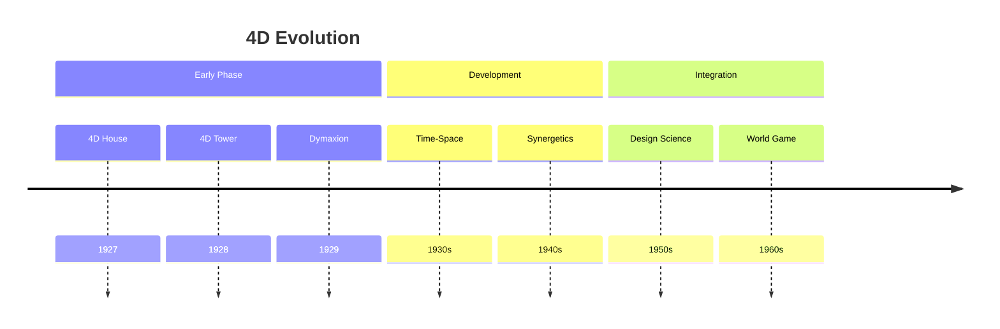

### Conceptual Framework
1. Time Integration
   - Fourth dimension as time
   - Dynamic systems thinking
   - Evolutionary design
   - Process orientation

2. Spatial Understanding
   - Three-dimensional space
   - Movement patterns
   - Structural dynamics
   - Energy flows

## Core Principles

### Dimensional Integration
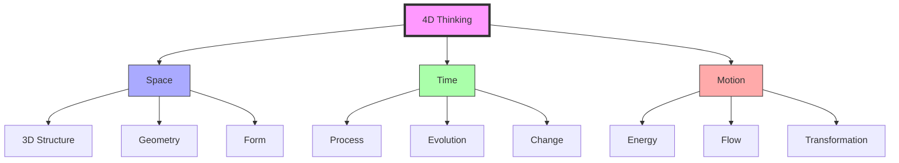

### Key Elements
1. [[Time_Space_Mathematics|Time-Space Mathematics]]
   - Four-dimensional geometry
   - Dynamic systems
   - Process modeling
   - Energy patterns

2. [[Design_Science|Design Integration]]
   - Time-based design
   - Process thinking
   - Evolution planning
   - System dynamics

## Applications

### Design Implementation
1. [[Dymaxion_House|4D House]]
   - Dynamic architecture
   - Time efficiency
   - Resource optimization
   - Process integration

2. [[Dymaxion_Car|4D Transport]]
   - Movement design
   - Energy efficiency
   - Flow optimization
   - System integration

### System Applications
```mermaid
mindmap
    root((4D Systems))
        Architecture
            [[Dynamic Design]]
            [[Process Integration]]
            [[Resource Flow]]
        Transport
            [[Movement Systems]]
            [[Energy Efficiency]]
            [[Flow Patterns]]
        Planning
            [[Time Management]]
            [[Process Design]]
            [[Evolution Strategy]]
```

## Mathematical Framework

### 4D Mathematics
1. [[Time_Space_Mathematics|Mathematical Principles]]
   - Four-dimensional geometry
   - Dynamic calculations
   - Process modeling
   - System analysis

2. [[Synergetics|Geometric Integration]]
   - Vector mathematics
   - Energy patterns
   - System dynamics
   - Transformation models

### Analysis Framework
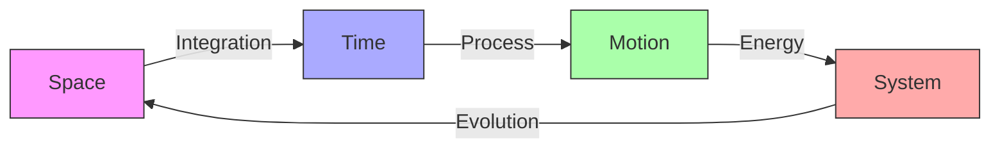

## Educational Integration

### Learning Framework
1. [[Design_Science_Education|Educational Methods]]
   - Four-dimensional thinking
   - Process understanding
   - System dynamics
   - Evolution planning

2. [[World_Game|Global Implementation]]
   - Time-based simulation
   - Process modeling
   - System evolution
   - Dynamic planning

### Teaching Methods
```mermaid
mindmap
    root((Education))
        Theory
            [[4D Concepts]]
            [[Time-Space]]
            [[Process Thinking]]
        Practice
            [[Dynamic Design]]
            [[System Analysis]]
            [[Evolution Planning]]
        Application
            [[Project Design]]
            [[Implementation]]
            [[Assessment]]
```

## Legacy

### Impact Areas
1. [[Design_Science|Design Evolution]]
   - Time-based design
   - Process integration
   - System thinking
   - Evolution planning

2. [[Synergetics|Geometric Development]]
   - Four-dimensional geometry
   - Dynamic systems
   - Energy patterns
   - Transformation models

### Innovation Framework
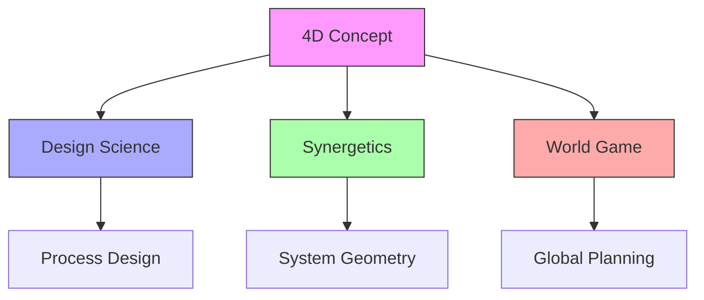

## References

### Primary Sources
1. [[4D_Timelock|4D Timelock]] (1928)
2. [[Nine_Chains_to_the_Moon|Nine Chains to the Moon]] (1938)
3. [[Synergetics|Synergetics]] (1975)

### Related Resources
1. [[papers/4D_Design|4D Design Principles]]
2. [[papers/Time_Space|Time-Space Integration]]
3. [[papers/Process_Design|Process Design Methods]]

## Notes
- Foundation for Fuller's early work
- Evolution into Dymaxion concept
- Integration with Synergetics
- Continuing influence on design

## Tags
#concept #geometry #time-space #design-science #fuller-principle

## Technical Specifications

### Mathematical Models
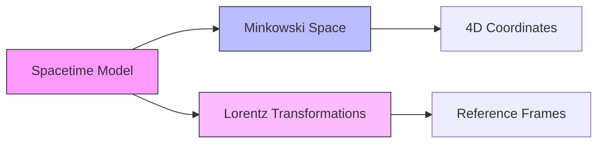

### Geometric Relationships
```math
\begin{aligned}
ds^2 &= -c^2dt^2 + dx^2 + dy^2 + dz^2 \\
\text{where:} \\
ds^2 &= \text{spacetime interval} \\
c &= \text{speed of light} \\
t &= \text{time coordinate} \\
x,y,z &= \text{spatial coordinates}
\end{aligned}
```

### Implementation Framework
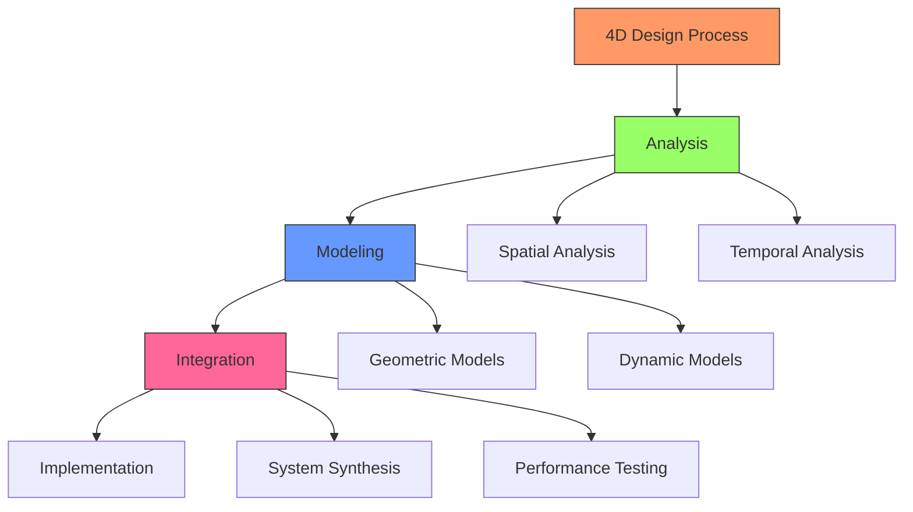

## System Components

### Core Elements
1. Spatial Framework
   - [[Coordinate_Systems|Coordinate Systems]]
   - [[Reference_Frames|Reference Frames]]
   - [[Geometric_Transformations|Geometric Transformations]]

2. Temporal Framework
   - [[Time_Evolution|Time Evolution]]
   - [[State_Changes|State Changes]]
   - [[Dynamic_Behavior|Dynamic Behavior]]

### Integration Methods
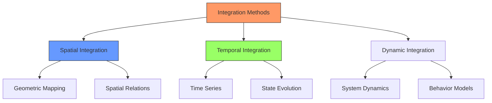

## Performance Metrics

### Evaluation Criteria
1. Spatial Efficiency
   - Volume optimization
   - Material usage
   - Structural integrity
   - Space utilization

2. Temporal Efficiency
   - Time-based performance
   - Adaptation rate
   - Evolution speed
   - Response time

### Measurement Framework
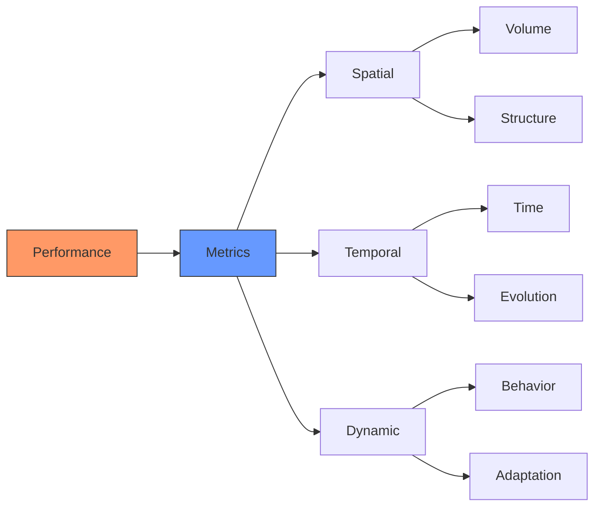

## Implementation Guidelines

### Technical Requirements
1. Spatial Design
   ```yaml
   requirements:
     geometric:
       - Coordinate system definition
       - Reference frame alignment
       - Transformation matrices
     structural:
       - Load distribution
       - Material properties
       - Stability analysis
   ```

2. Temporal Design
   ```yaml
   requirements:
     dynamic:
       - State evolution models
       - Time-based behaviors
       - Adaptation mechanisms
     performance:
       - Response metrics
       - Efficiency measures
       - Optimization criteria
   ```

### Integration Process
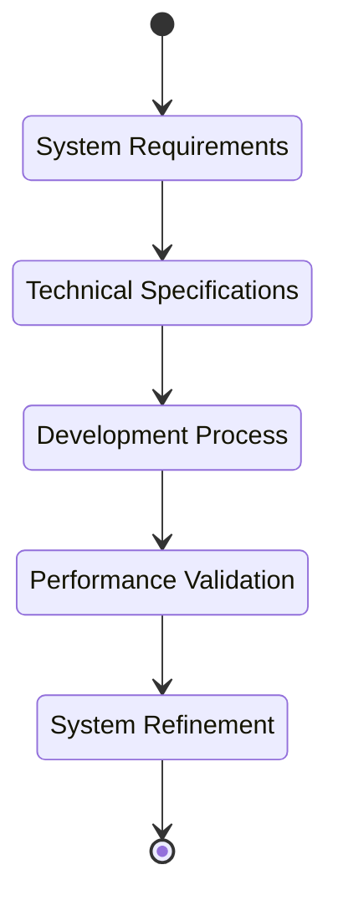

## Advanced Topics

### Differential Geometry
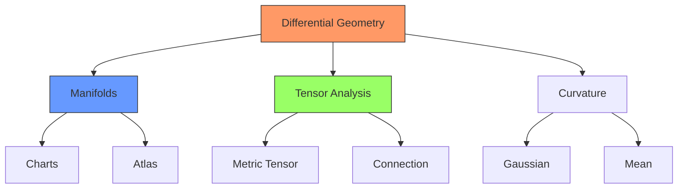

### Topological Considerations
1. Manifold Structure
   - [[Differential_Topology|Differential Topology]]
   - [[Manifold_Theory|Manifold Theory]]
   - [[Chart_Maps|Chart Maps]]
   - [[Atlas_Structure|Atlas Structure]]

2. Metric Properties
   - [[Metric_Tensor|Metric Tensor]]
   - [[Connection_Theory|Connection Theory]]
   - [[Parallel_Transport|Parallel Transport]]
   - [[Geodesic_Curves|Geodesic Curves]]

### Advanced Mathematics
```math
\begin{aligned}
g_{\mu\nu} &= \begin{pmatrix}
-c^2 & 0 & 0 & 0 \\
0 & 1 & 0 & 0 \\
0 & 0 & 1 & 0 \\
0 & 0 & 0 & 1
\end{pmatrix} \\
\Gamma^\lambda_{\mu\nu} &= \frac{1}{2}g^{\lambda\sigma}
(\partial_\mu g_{\nu\sigma} + \partial_\nu g_{\mu\sigma} - \partial_\sigma g_{\mu\nu})
\end{aligned}
```

## Coordinate System Integration

### Quadray-IVM Relationships
1. [[Quadray_Coordinates|Quadray System]]
   - Four-dimensional basis vectors
   - Tetrahedral symmetry group
   - Natural volume relationships
   - Coordinate transformations

2. [[IVM_XYZ|IVM Integration]]
   - Vector equilibrium mapping
   - Synergetics constant (S3)
   - System transformations
   - Volume preservation

### Transformation Framework
```math
\begin{aligned}
T_{Q\rightarrow I} &= \begin{pmatrix}
1 & -\frac{1}{3} & -\frac{1}{3} & -\frac{1}{3} \\
0 & \frac{2\sqrt{2}}{3} & -\frac{\sqrt{2}}{3} & -\frac{\sqrt{2}}{3} \\
0 & 0 & \frac{\sqrt{6}}{3} & -\frac{\sqrt{6}}{3}
\end{pmatrix} \\
V_{IVM} &= V_{Quadray} \cdot S_3
\end{aligned}
```

## Advanced Geometric Relationships

### 4D Polytope Integration
1. [[24_Cell|24-Cell Structure]]
   - Tetrahedral symmetries
   - 4D rotations
   - Polytope relationships
   - Cross-sections

2. [[Vector_Equilibrium|VE Relationships]]
   - Higher-dimensional analogs
   - Symmetry groups
   - Volume relationships
   - Transformation matrices

### Geometric Framework
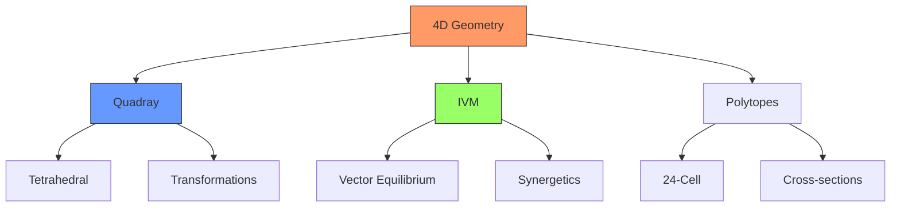

## Unified Mathematical Framework

### System Integration
1. Coordinate Transformations
   ```yaml
   transformations:
     quadray_to_ivm:
       - Tetrahedral basis mapping
       - Volume preservation
       - Symmetry maintenance
     ivm_to_xyz:
       - Cartesian projection
       - Scale factors
       - Metric relationships
   ```

2. [[Synergetics_Constant|Synergetics Constants]]
   - S3 relationship
   - Volume ratios
   - Geometric factors
   - System invariants

### Mathematical Properties
```math
\begin{aligned}
ds^2_{Quadray} &= \sum_{i,j=1}^4 g_{ij}dq^idq^j \\
ds^2_{IVM} &= S_3^2\sum_{i=1}^3 dx^idx^i \\
V_{ratio} &= \frac{V_{IVM}}{V_{XYZ}} = S_3
\end{aligned}
```

## Computational Implementation

### Core Algorithms
1. [[Geometric_Engine|Geometric Processing]]
   ```python
   class QuadrayTransform:
       def __init__(self):
           self.S3 = np.sqrt(9/8)  # Synergetics constant
           
       def to_ivm(self, quadray: np.ndarray) -> np.ndarray:
           """Convert quadray coordinates to IVM."""
           # Apply transformation matrix
           return self.transform_matrix @ quadray
           
       def compute_volume(self, vertices: np.ndarray) -> float:
           """Compute volume in quadray coordinates."""
           return np.abs(np.linalg.det(vertices[1:] - vertices[0])) / 6
   ```

2. [[Physics_Simulator|Physical Modeling]]
   ```python
   class SpacetimeModel:
       def __init__(self):
           self.c = 1.0  # Speed of light (natural units)
           
       def compute_interval(self, event1: np.ndarray, 
                          event2: np.ndarray) -> float:
           """Compute spacetime interval between events."""
           dt = event2[0] - event1[0]
           dx = event2[1:] - event1[1:]
           return -c**2 * dt**2 + np.sum(dx**2)
   ```

### Numerical Methods
1. [[Finite_Elements|FEM Implementation]]
   - Tetrahedral elements
   - Basis functions
   - Integration schemes
   - Boundary conditions

2. [[Optimization_Algorithms|Optimization Techniques]]
   - Geometric optimization
   - Volume minimization
   - Path integration
   - Energy methods

### Implementation Framework
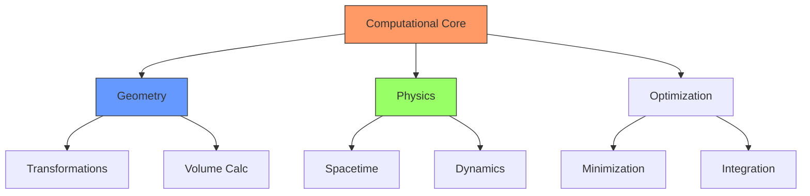

## Advanced Applications

### Geometric Analysis
1. [[Differential_Topology|Topological Methods]]
   ```python
   class ManifoldAnalysis:
       def compute_characteristic(self, 
                                vertices: np.ndarray,
                                faces: np.ndarray) -> int:
           """Compute Euler characteristic."""
           V = len(vertices)
           E = len(faces) * 3 // 2
           F = len(faces)
           return V - E + F
   ```

2. [[Chart_Maps|Coordinate Charts]]
   ```python
   class CoordinateAtlas:
       def transition_map(self, 
                        coords: np.ndarray,
                        chart1: str,
                        chart2: str) -> np.ndarray:
           """Compute transition between coordinate charts."""
           if chart1 == "quadray" and chart2 == "ivm":
               return self.quadray_to_ivm(coords)
           elif chart1 == "ivm" and chart2 == "xyz":
               return self.ivm_to_xyz(coords)
   ```

### Physical Applications
1. [[Special_Relativity|Relativistic Framework]]
   - Lorentz transformations
   - Proper time calculations
   - Light cone analysis
   - Causal structure

2. [[Engineering_Applications|Engineering Implementation]]
   ```yaml
   applications:
     structural:
       - 4D stress analysis
       - Dynamic response
       - Material evolution
     systems:
       - Control optimization
       - State evolution
       - Performance metrics
   ```

### Visualization Methods
```python
class Visualizer4D:
    def __init__(self):
        self.projection = "stereographic"
        
    def project_to_3d(self, points_4d: np.ndarray) -> np.ndarray:
        """Project 4D points to 3D for visualization."""
        if self.projection == "stereographic":
            w = points_4d[:, 3]
            scale = 1 / (1 - w)
            return points_4d[:, :3] * scale[:, np.newaxis]
        else:
            return points_4d[:, :3]  # Orthogonal projection
            
    def plot_4d_polytope(self, vertices_4d: np.ndarray,
                        edges: list[tuple[int, int]]) -> None:
        """Plot 4D polytope with interactive rotation."""
        vertices_3d = self.project_to_3d(vertices_4d)
        self._plot_structure(vertices_3d, edges)
```

## Software Architecture

### System Components
1. [[Geometric_Engine|Core Geometry Engine]]
   ```python
   class GeometryEngine:
       def __init__(self):
           self.transformers = {
               'quadray': QuadrayTransform(),
               'ivm': IVMTransform(),
               'xyz': XYZTransform()
           }
           
       def transform_coordinates(self, 
                               coords: np.ndarray,
                               source: str,
                               target: str) -> np.ndarray:
           """Transform coordinates between systems."""
           if source == target:
               return coords
           
           # Convert to intermediate representation if needed
           if source != 'ivm':
               coords = self.transformers[source].to_ivm(coords)
           
           # Convert to target system
           if target != 'ivm':
               coords = self.transformers[target].from_ivm(coords)
               
           return coords
   ```

2. [[Physics_Simulator|Physics Engine]]
   ```python
   class PhysicsEngine:
       def __init__(self):
           self.spacetime = SpacetimeModel()
           self.dynamics = DynamicsSimulator()
           
       def simulate_evolution(self, 
                            initial_state: np.ndarray,
                            time_steps: int) -> np.ndarray:
           """Simulate system evolution through spacetime."""
           states = [initial_state]
           for t in range(time_steps):
               next_state = self.dynamics.step(states[-1])
               states.append(next_state)
           return np.array(states)
   ```

### Integration Framework
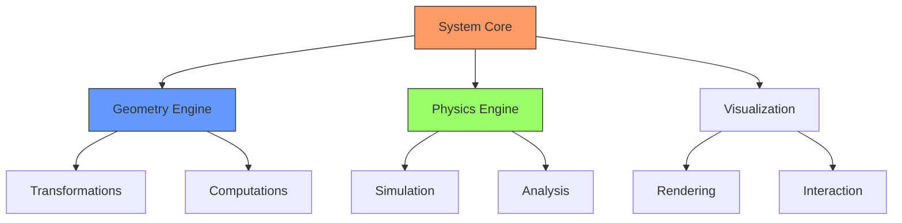

### Data Management
1. [[Data_Management|Data Structures]]
   ```python
   class GeometricData:
       def __init__(self):
           self.vertices = []
           self.edges = []
           self.faces = []
           self.metadata = {}
           
       def add_polytope(self, 
                       vertices: np.ndarray,
                       edges: list[tuple[int, int]],
                       faces: list[tuple[int, ...]]) -> None:
           """Add polytope data to storage."""
           start_idx = len(self.vertices)
           self.vertices.extend(vertices)
           self.edges.extend([(start_idx + i, start_idx + j) 
                            for i, j in edges])
           self.faces.extend([tuple(start_idx + i for i in face)
                            for face in faces])
   ```

2. [[Computation_Engine|Computation Management]]
   ```python
   class ComputationManager:
       def __init__(self):
           self.cache = {}
           self.engines = {
               'geometry': GeometryEngine(),
               'physics': PhysicsEngine(),
               'visualization': Visualizer4D()
           }
           
       def compute_with_caching(self, 
                              operation: str,
                              *args,
                              **kwargs) -> Any:
           """Compute result with caching."""
           cache_key = self._make_cache_key(operation, args, kwargs)
           if cache_key in self.cache:
               return self.cache[cache_key]
           
           result = self._perform_computation(operation, *args, **kwargs)
           self.cache[cache_key] = result
           return result
   ```

### User Interface
1. [[User_Interface|Interactive Components]]
   ```python
   class UI4D:
       def __init__(self):
           self.viewer = Visualizer4D()
           self.controller = InteractionController()
           
       def setup_interface(self) -> None:
           """Setup interactive 4D visualization interface."""
           self.viewer.setup_display()
           self.controller.bind_controls()
           self.setup_widgets()
           
       def handle_rotation(self, 
                          angles: tuple[float, float, float, float]) -> None:
           """Handle 4D rotation input."""
           self.viewer.rotate_4d(*angles)
           self.viewer.update_display()
   ```

2. [[Analysis_Tools|Analysis Interface]]
   ```python
   class AnalysisInterface:
       def __init__(self):
           self.computation = ComputationManager()
           self.display = DataVisualizer()
           
       def analyze_structure(self, 
                           structure_data: GeometricData) -> dict:
           """Perform comprehensive structure analysis."""
           results = {
               'topology': self.computation.compute_topology(structure_data),
               'geometry': self.computation.compute_geometry(structure_data),
               'physics': self.computation.compute_physics(structure_data)
           }
           self.display.show_results(results)
           return results
   ```

## Implementation Guidelines

### Best Practices
1. System Design
   ```yaml
   guidelines:
     architecture:
       - Modular component design
       - Clear interface definitions
       - Efficient data structures
       - Scalable computations
     implementation:
       - Type safety
       - Error handling
       - Performance optimization
       - Memory management
   ```

2. Integration Patterns
   ```yaml
   patterns:
     coordination:
       - Event-driven updates
       - Data synchronization
       - State management
       - Resource handling
     optimization:
       - Computation caching
       - Lazy evaluation
       - Parallel processing
       - Memory pooling
   ```

### Development Workflow
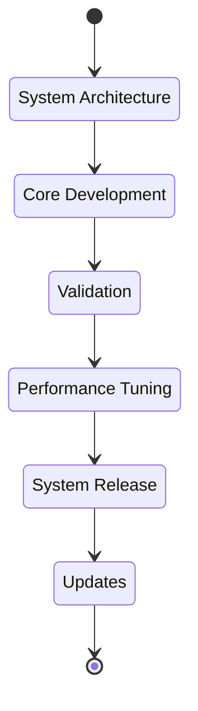

## See Also
- [[Relativity_Theory|Relativity Theory]]
- [[Differential_Geometry|Differential Geometry]]
- [[Computational_Methods|Computational Methods]]
- [[Engineering_Applications|Engineering Applications]]
- [[Software_Systems|Software Systems]]

## External Links
- [Stanford Encyclopedia - Spacetime](https://plato.stanford.edu/entries/spacetime/)
- [MIT OpenCourseWare - Differential Geometry](https://ocw.mit.edu/courses/mathematics/18-950-differential-geometry-fall-2008/)
- [Buckminster Fuller Institute](https://www.bfi.org/)
- [4D Design Principles](https://www.4ddesign.org/)

## Bibliography
1. Fuller, R. B. (1975). Synergetics: Explorations in the Geometry of Thinking
2. Wheeler, J. A. (1990). A Journey into Gravity and Spacetime
3. Misner, C. W., Thorne, K. S., & Wheeler, J. A. (1973). Gravitation
``` 