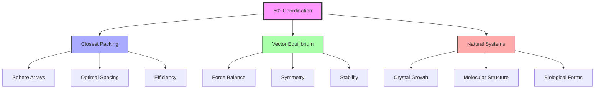
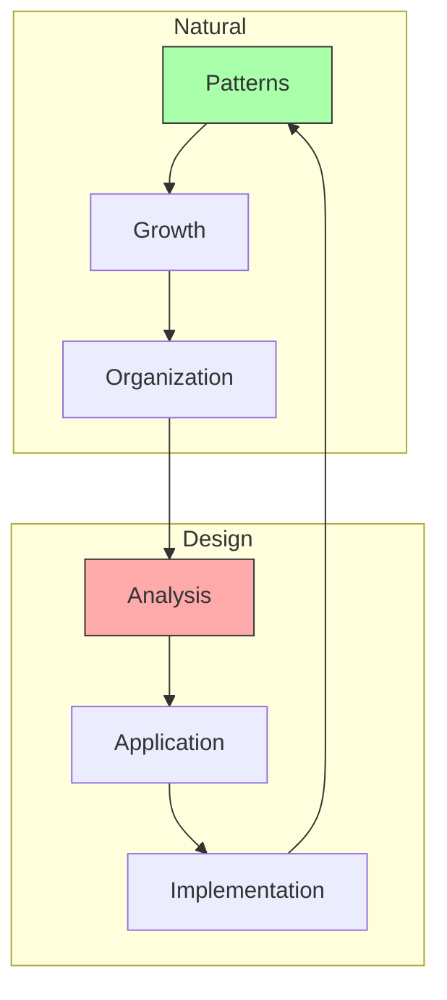
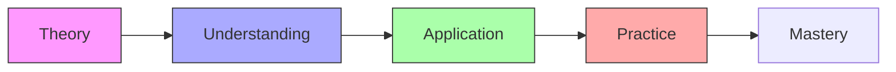
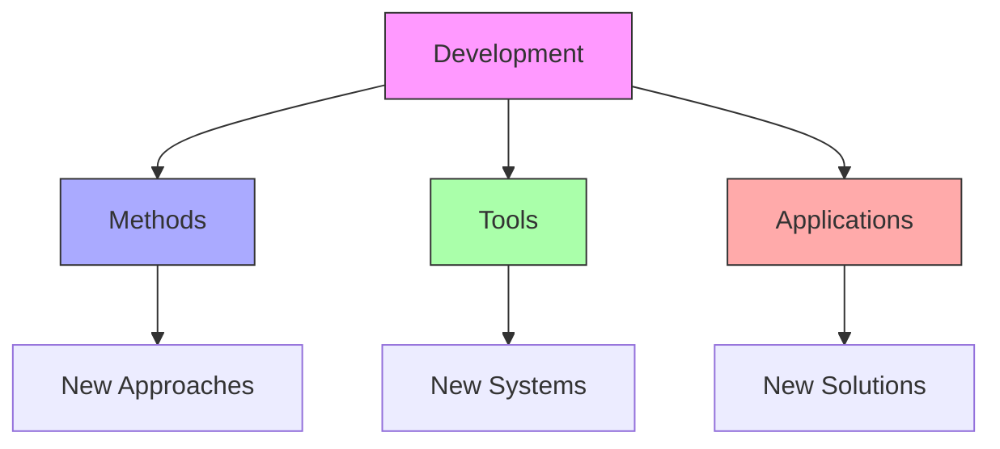

# 60 Degree Coordination

60 Degree Coordination represents the fundamental angular relationship found in nature's closest packing of spheres and forms the basis of [[concepts/Synergetics|Fuller's synergetic geometry]].

## Core Principles

### Geometric Foundation


### Key Properties
1. [[mathematics/Angular_Relationships|Angular Properties]]
   - 60° basic angle
   - Triangular coordination
   - Hexagonal patterns
   - Tetrahedral systems

2. [[mathematics/Spatial_Organization|Spatial Organization]]
   - Closest packing
   - Maximum efficiency
   - Natural patterns
   - System stability

## Mathematical Framework

### Geometric Analysis
```mermaid
mindmap
    root((60° Geometry))
        Triangulation
            [[Equilateral Triangles]]
            [[Tetrahedral Arrays]]
            [[Network Patterns]]
        Coordination
            [[Sphere Packing]]
            [[Vector Systems]]
            [[Force Distribution]]
        Applications
            [[Structural Design]]
            [[Natural Systems]]
            [[Crystal Growth]]
```

### Mathematical Properties
1. [[mathematics/Vector_Mathematics|Vector Relationships]]
   - Equal lengths
   - Angular coordination
   - Force distribution
   - System balance

2. [[mathematics/Geometric_Properties|Geometric Properties]]
   - Regular polyhedra
   - Space filling
   - Pattern formation
   - System efficiency

## Natural Applications

### Physical Systems
1. [[concepts/Crystal_Systems|Crystal Formation]]
   - Atomic arrangement
   - Molecular structure
   - Growth patterns
   - System organization

2. [[concepts/Biological_Systems|Biological Structures]]
   - Cell organization
   - Tissue patterns
   - Growth forms
   - Natural efficiency

### System Integration


## Design Applications

### Structural Systems
1. [[concepts/Geodesic_Dome|Geodesic Structures]]
   - Dome design
   - Force distribution
   - Structural efficiency
   - System stability

2. [[concepts/Tensegrity|Tensegrity Systems]]
   - Force balance
   - Structural integrity
   - System coordination
   - Pattern organization

### Design Framework
```mermaid
mindmap
    root((Design))
        Structure
            [[Geodesic Systems]]
            [[Tensegrity]]
            [[Space Frames]]
        Patterns
            [[Growth Forms]]
            [[Network Systems]]
            [[Organization]]
        Applications
            [[Architecture]]
            [[Engineering]]
            [[Biology]]
```

## Educational Integration

### Learning Framework
1. [[concepts/Design_Science_Education|Educational Methods]]
   - Geometric principles
   - Pattern recognition
   - System understanding
   - Application methods

2. [[concepts/Practical_Applications|Practical Training]]
   - Structure design
   - Pattern analysis
   - System integration
   - Implementation skills

### Teaching Methods


## Future Development

### Innovation Areas


### Implementation Path
1. [[concepts/System_Innovation|System Innovation]]
   - Method development
   - Tool creation
   - Application design
   - Pattern implementation

2. [[concepts/Global_Solutions|Global Solutions]]
   - Structure design
   - Pattern analysis
   - System integration
   - Implementation methods

## References

### Primary Sources
1. [[books/Synergetics_Book|Synergetics]]
2. [[books/Synergetics_2|Synergetics 2]]
3. [[books/Geodesic_Math|Geodesic Mathematics]]

### Related Resources
1. [[papers/Angular_Analysis|60° Coordination Analysis]]
2. [[papers/Natural_Patterns|Natural Pattern Studies]]
3. [[papers/Structural_Design|Structural Design Methods]]

## Notes
- Fundamental to natural organization
- Key to efficient structures
- Basis for synergetic geometry
- Universal pattern principle

## Tags
#geometry #mathematics #synergetics #structural-design #fuller-principle 