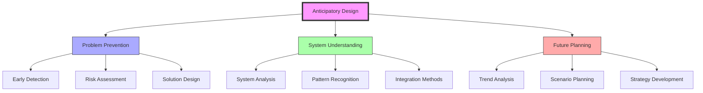
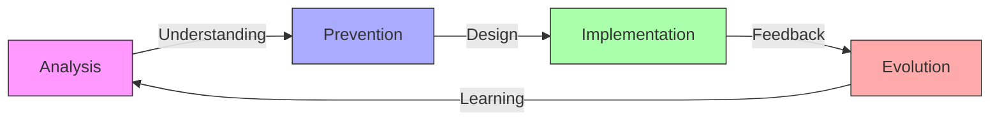
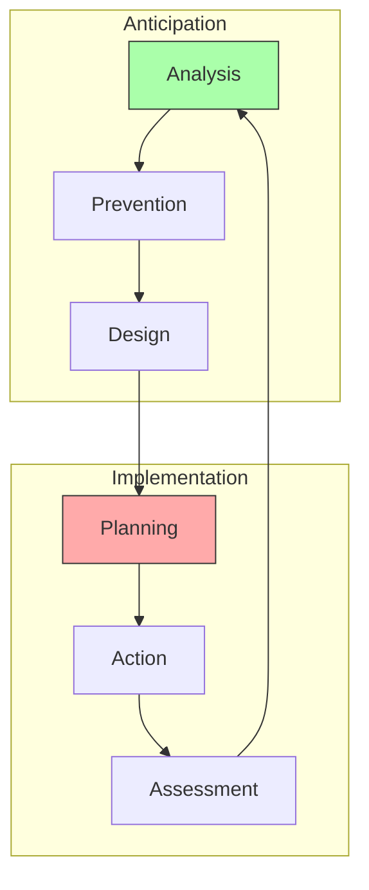
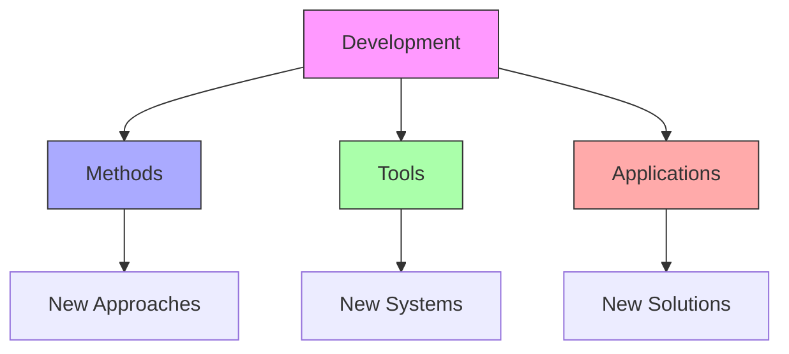
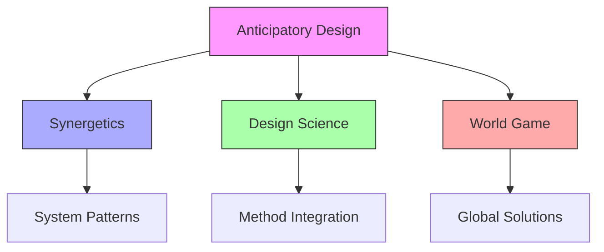

# Anticipatory Design

Anticipatory Design represents Fuller's systematic approach to identifying and solving problems before they manifest, integrating [[concepts/Comprehensive_Anticipatory_Design_Science|CADS]] principles with [[concepts/System_Wholeness|system wholeness]] understanding.

## Core Framework

### Design Philosophy


### Key Elements
1. [[concepts/Problem_Prevention|Prevention Strategy]]
   - Early identification
   - Risk assessment
   - Solution development
   - Implementation planning

2. [[concepts/System_Analysis|System Understanding]]
   - Pattern recognition
   - Relationship mapping
   - Dynamic modeling
   - Integration methods

## Methodological Framework

### Process Flow


### Implementation Strategy
1. [[concepts/Analysis_Methods|Analysis Process]]
   - System mapping
   - Pattern identification
   - Risk assessment
   - Trend analysis

2. [[concepts/Prevention_Strategy|Prevention Methods]]
   - Solution design
   - Resource planning
   - Implementation strategy
   - Impact assessment

## Integration with Design Science

### Design Framework


### Application Areas
1. [[concepts/World_Game|World Game Integration]]
   - Global simulation
   - Resource planning
   - Problem prevention
   - Solution testing

2. [[concepts/Design_Science|Design Science Methods]]
   - System analysis
   - Pattern recognition
   - Solution development
   - Implementation strategy

## Educational Framework

### Learning Methods
1. [[concepts/Design_Science_Education|Educational Integration]]
   - Anticipatory thinking
   - System understanding
   - Prevention methods
   - Solution design

2. [[concepts/Global_University|Global Implementation]]
   - Knowledge sharing
   - Resource access
   - Collaborative learning
   - Practice development

### Teaching Framework
```mermaid
mindmap
    root((Education))
        Theory
            [[Anticipation]]
            [[Prevention]]
            [[Systems]]
        Practice
            [[Analysis]]
            [[Design]]
            [[Implementation]]
        Application
            [[Projects]]
            [[Solutions]]
            [[Assessment]]
```

## Future Development

### Innovation Areas


### Implementation Path
1. [[concepts/Method_Development|Method Innovation]]
   - Analysis tools
   - Prevention strategies
   - Design methods
   - Implementation frameworks

2. [[concepts/Global_Solutions|Global Applications]]
   - System integration
   - Resource optimization
   - Problem prevention
   - Solution development

## Synergetic Integration

### System Relationships


### Application Framework
1. [[concepts/Pattern_Integration|Pattern Recognition]]
   - System analysis
   - Relationship mapping
   - Dynamic modeling
   - Integration methods

2. [[concepts/Solution_Development|Solution Design]]
   - Prevention strategies
   - Resource planning
   - Implementation methods
   - Impact assessment

## References

### Primary Sources
1. [[books/Operating_Manual_for_Spaceship_Earth|Operating Manual for Spaceship Earth]]
2. [[books/World_Design_Science_Decade|World Design Science Decade]]
3. [[books/Anticipatory_Design|Anticipatory Design Science]]

### Related Resources
1. [[papers/Prevention_Methods|Prevention Methodology]]
2. [[papers/System_Analysis|System Analysis Methods]]
3. [[papers/Implementation_Strategies|Implementation Frameworks]]

## Notes
- Foundation for preventive problem-solving
- Integration with design science principles
- Key to sustainable development
- Global implementation focus

## Tags
#design-science #anticipation #future-planning #systems-thinking #problem-solving #fuller-principle 