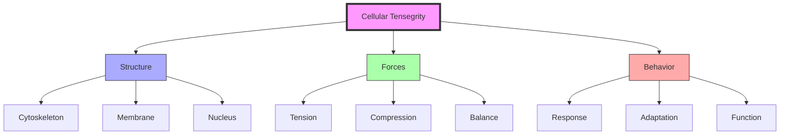
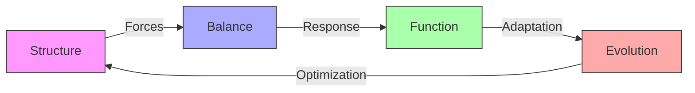
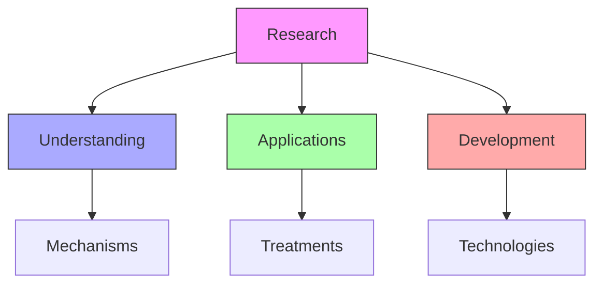
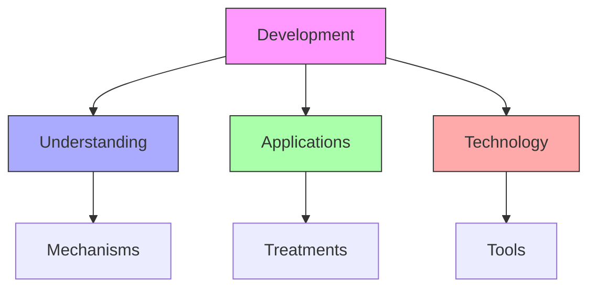

# Cellular Tensegrity

Cellular Tensegrity represents the biological application of [[concepts/Tensegrity|Fuller's tensegrity principles]], developed by [[people/Donald_Ingber|Donald E. Ingber]] to explain how cells structure themselves and respond to mechanical forces.

## Core Principles

### Structural Framework


### Key Elements
1. [[concepts/Cell_Structure|Structural Components]]
   - Microfilaments (tension)
   - Microtubules (compression)
   - Intermediate filaments
   - Nuclear matrix

2. [[concepts/Force_Distribution|Force Systems]]
   - Continuous tension
   - Discontinuous compression
   - Mechanical balance
   - Force transmission

## Biological Integration

### Cellular Systems
```mermaid
mindmap
    root((Cell Systems))
        Structure
            [[Cytoskeleton]]
            [[Membrane]]
            [[Nucleus]]
        Forces
            [[Tension]]
            [[Compression]]
            [[Balance]]
        Function
            [[Mechanics]]
            [[Signaling]]
            [[Adaptation]]
```

### System Properties
1. [[concepts/Mechanical_Properties|Mechanical Behavior]]
   - Shape stability
   - Force response
   - Structural adaptation
   - Dynamic equilibrium

2. [[concepts/Cellular_Functions|Functional Integration]]
   - Mechanotransduction
   - Signal processing
   - Gene expression
   - Cell behavior

## Tensegrity Principles

### Structural Analysis


### Force Distribution
1. [[concepts/Tensional_Forces|Tension Network]]
   - Continuous tension
   - Force distribution
   - Network stability
   - Dynamic response

2. [[concepts/Compression_Elements|Compression Elements]]
   - Local compression
   - Structural support
   - Force balance
   - System stability

## Applications

### Medical Applications
1. [[concepts/Disease_Understanding|Disease Mechanisms]]
   - Cancer mechanics
   - Tissue development
   - Pathological changes
   - Therapeutic targets

2. [[concepts/Therapeutic_Applications|Treatment Development]]
   - Drug design
   - Mechanical therapy
   - Tissue engineering
   - Regenerative medicine

### Research Framework


## Integration with Fuller's Work

### Conceptual Links
1. [[concepts/Tensegrity|Tensegrity Principles]]
   - Structural efficiency
   - Force distribution
   - System stability
   - Dynamic balance

2. [[concepts/Vector_Equilibrium|Vector Systems]]
   - Force patterns
   - Spatial organization
   - System dynamics
   - Energy distribution

### System Framework
```mermaid
mindmap
    root((Integration))
        Structure
            [[Tensegrity]]
            [[Vector Systems]]
            [[Force Balance]]
        Function
            [[Mechanics]]
            [[Dynamics]]
            [[Adaptation]]
        Applications
            [[Medicine]]
            [[Biology]]
            [[Engineering]]
```

## Research Directions

### Current Focus
1. [[concepts/Mechanobiology|Mechanobiology]]
   - Force sensing
   - Signal transduction
   - Gene regulation
   - Cell behavior

2. [[concepts/Clinical_Applications|Clinical Development]]
   - Disease treatment
   - Drug development
   - Tissue engineering
   - Therapeutic strategies

### Future Development


## Educational Integration

### Learning Framework
1. [[concepts/Cellular_Education|Educational Methods]]
   - Structural principles
   - Force dynamics
   - System behavior
   - Applications

2. [[concepts/Research_Training|Research Development]]
   - Experimental methods
   - Analysis techniques
   - Application development
   - Clinical translation

### Teaching Methods
```mermaid
mindmap
    root((Education))
        Theory
            [[Structure]]
            [[Forces]]
            [[Function]]
        Practice
            [[Methods]]
            [[Analysis]]
            [[Applications]]
        Research
            [[Development]]
            [[Translation]]
            [[Innovation]]
```

## References

### Primary Sources
1. [[papers/Ingber_1993|Cellular Tensegrity]] (Ingber, 1993)
2. [[papers/Ingber_2003|Mechanobiology]] (Ingber, 2003)
3. [[books/Synergetics|Synergetics]] (Fuller, 1975)

### Related Resources
1. [[papers/Cell_Mechanics|Cell Mechanics]]
2. [[papers/Tensegrity_Biology|Tensegrity in Biology]]
3. [[papers/Clinical_Applications|Clinical Applications]]

## Notes
- Bridge between Fuller's principles and biology
- Key to understanding cell mechanics
- Foundation for medical applications
- Continuing research potential

## Tags
#concept #biology #architecture #biomechanics #tensegrity #fuller-principle 