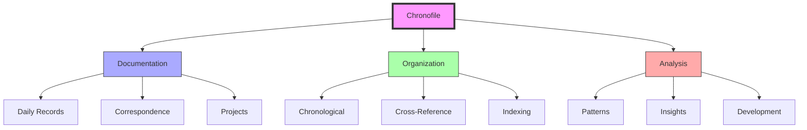
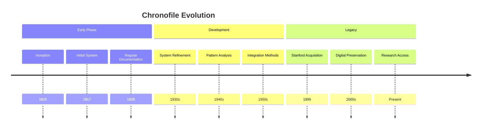
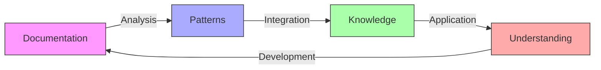
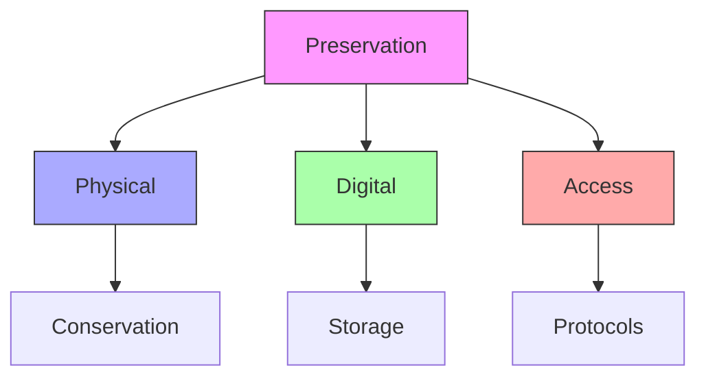
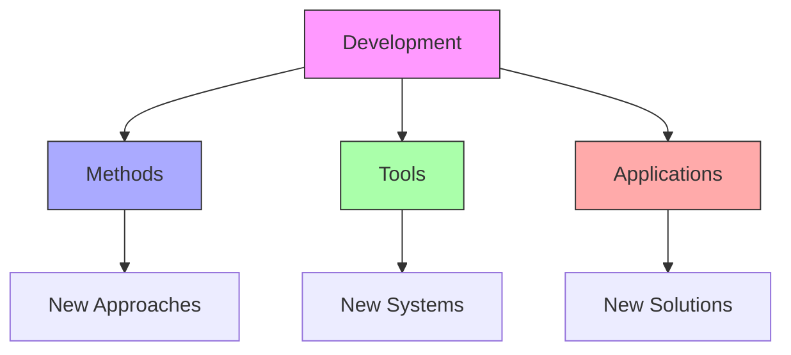

# The Chronofile

The Chronofile represents Fuller's systematic approach to documenting his life and work from 1915 until 1983, creating what may be the most detailed self-documented life in history.

## Core Framework

### Documentation System


### Key Elements
1. [[concepts/Documentation_Methods|Documentation Components]]
   - Daily activities
   - Correspondence
   - Project records
   - Personal reflections

2. [[concepts/Organization_System|Organizational Structure]]
   - Chronological order
   - Cross-referencing
   - Pattern recognition
   - Knowledge integration

## Historical Significance

### Development Timeline


### Documentation Scope
1. [[concepts/Personal_Records|Personal Documentation]]
   - Daily activities
   - Thoughts and reflections
   - Personal development
   - Life patterns

2. [[concepts/Professional_Records|Professional Documentation]]
   - Project development
   - Correspondence
   - Publications
   - Lectures

## Pattern Recognition

### Analysis Framework
```mermaid
mindmap
    root((Pattern Analysis))
        Documentation
            [[Daily Records]]
            [[Project Files]]
            [[Correspondence]]
        Organization
            [[Chronological]]
            [[Thematic]]
            [[Cross-Reference]]
        Insights
            [[Development]]
            [[Connections]]
            [[Evolution]]
```

### Recognition Methods
1. [[concepts/Pattern_Identification|Pattern Identification]]
   - Temporal patterns
   - Development sequences
   - Relationship networks
   - Evolution paths

2. [[concepts/Knowledge_Integration|Knowledge Integration]]
   - Cross-connections
   - System relationships
   - Development paths
   - Pattern synthesis

## Research Value

### Academic Applications
1. [[concepts/Historical_Research|Historical Studies]]
   - Life documentation
   - Project development
   - Thought evolution
   - Pattern analysis

2. [[concepts/Design_Science|Design Science Research]]
   - Method development
   - System evolution
   - Pattern recognition
   - Knowledge integration

### Research Framework


## Preservation Methods

### Physical Conservation
1. [[concepts/Archive_Preservation|Conservation Methods]]
   - Material protection
   - Environmental control
   - Access protocols
   - Damage prevention

2. [[concepts/Digital_Preservation|Digital Methods]]
   - Scanning systems
   - Digital storage
   - Access platforms
   - Backup protocols

### Preservation Framework


## Educational Integration

### Learning Applications
1. [[concepts/Design_Science_Education|Educational Methods]]
   - Pattern recognition
   - System understanding
   - Knowledge integration
   - Documentation methods

2. [[concepts/Research_Methods|Research Training]]
   - Archive analysis
   - Pattern identification
   - Knowledge synthesis
   - Application development

### Teaching Framework
```mermaid
mindmap
    root((Education))
        Methods
            [[Documentation]]
            [[Analysis]]
            [[Integration]]
        Applications
            [[Research]]
            [[Development]]
            [[Innovation]]
        Practice
            [[Skills]]
            [[Techniques]]
            [[Tools]]
```

## Future Development

### Innovation Areas


### Implementation Path
1. [[concepts/Digital_Innovation|Digital Development]]
   - Access methods
   - Analysis tools
   - Integration systems
   - Pattern recognition

2. [[concepts/Research_Applications|Research Applications]]
   - Historical studies
   - Pattern analysis
   - Knowledge synthesis
   - Application development

## References

### Primary Sources
1. [[books/Ideas_and_Integrities|Ideas and Integrities]]
2. [[books/Chronofile_Guide|Chronofile Documentation]]
3. [[books/Pattern_Recognition|Pattern Recognition Methods]]

### Related Resources
1. [[papers/Archive_Methods|Archival Methodology]]
2. [[papers/Pattern_Analysis|Pattern Analysis Methods]]
3. [[papers/Digital_Preservation|Digital Conservation]]

## Notes
- Most comprehensive self-documented life
- Key to understanding Fuller's development
- Pattern recognition resource
- Continuing research value

## Tags
#archive #documentation #fuller-studies #historical-record #legacy 