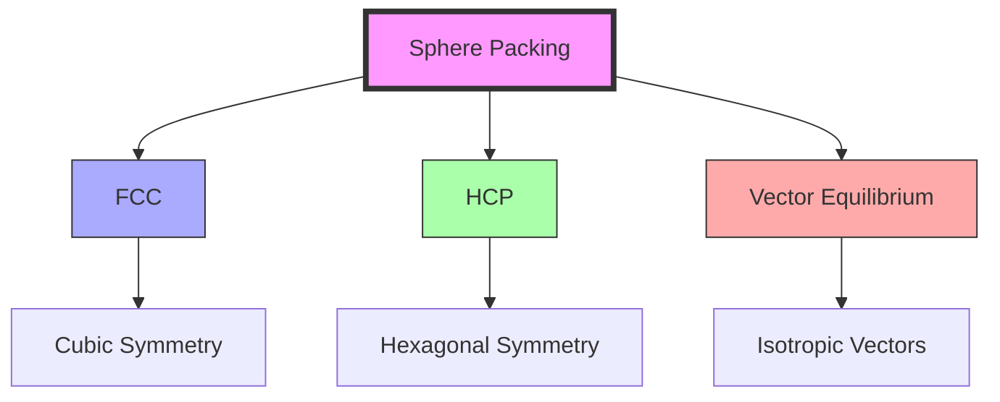
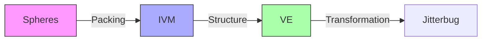

# Closest Packing of Spheres

Closest Packing of Spheres represents the most efficient arrangement of equal spheres in space, fundamental to [[concepts/Synergetics_Geometry|Synergetics]] and crystallography, with direct connections to the [[concepts/Vector_Equilibrium|Vector Equilibrium]] and [[concepts/Isotropic_Vector_Matrix|IVM]].

## Mathematical Foundation

### Packing Densities
1. Regular Arrangements
```yaml
packing_density:
  simple_cubic: 0.5235987755982989  # π/6
  body_centered_cubic: 0.6801975683890577  # π√3/8
  face_centered_cubic: 0.7404804896930611  # π/√18
  hexagonal_close_packed: 0.7404804896930611  # π/√18
```

2. Density Relationships
\[
\begin{align*}
\eta_{sc} &= \frac{\pi}{6} \approx 0.5236 \\
\eta_{bcc} &= \frac{\pi\sqrt{3}}{8} \approx 0.6802 \\
\eta_{fcc} &= \eta_{hcp} = \frac{\pi}{3\sqrt{2}} \approx 0.7405
\end{align*}
\]

### Coordination Numbers
```yaml
coordination:
  simple_cubic: 6
  body_centered_cubic: 8
  face_centered_cubic: 12
  hexagonal_close_packed: 12
  vector_equilibrium: 12
```

## Structural Relationships

### Geometric Framework


### Layer Arrangements
1. Stacking Sequences
```yaml
stacking_patterns:
  fcc: ABCABC
  hcp: ABABAB
  mixed: Various combinations
  symmetry:
    fcc: Cubic (Fm3m)
    hcp: Hexagonal (P6₃/mmc)
```

2. Layer Relationships
\[
\begin{align*}
h_{layer} &= 2R\sqrt{\frac{2}{3}} \\
d_{nearest} &= 2R \\
d_{layer} &= 2R\sqrt{\frac{6}{3}}
\end{align*}
\]
where R is sphere radius

## [[concepts/Vector_Equilibrium|Vector Equilibrium]] Integration

### Geometric Properties
1. VE Relationships
```yaml
ve_properties:
  vertices: 12
  edge_length: 2R
  radius: R√2
  volume_ratio: 8.485281374238571  # relative to tetrahedron
```

2. Spatial Organization
```mermaid
mindmap
    root((Packing Structure))
        FCC
            [[Cubic_Symmetry]]
            [[12_Neighbors]]
            [[ABCABC]]
        HCP
            [[Hexagonal_Symmetry]]
            [[12_Neighbors]]
            [[ABABAB]]
        VE
            [[Isotropic_Vectors]]
            [[12_Vertices]]
            [[24_Edges]]
```

## Crystallographic Applications

### Crystal Systems
1. Natural Occurrences
```yaml
crystal_examples:
  metals:
    fcc: [Cu, Al, Au, Ag]
    hcp: [Zn, Mg, Ti, Co]
    bcc: [Fe, Cr, W, Mo]
  minerals:
    cubic: [NaCl, CaF₂]
    hexagonal: [SiO₂, ZnO]
```

2. Structural Properties
\[
\begin{align*}
V_{unit} &= a^3 \text{ (cubic)} \\
V_{sphere} &= \frac{4}{3}\pi r^3 \\
\eta &= \frac{V_{spheres}}{V_{total}}
\end{align*}
\]

## [[concepts/Isotropic_Vector_Matrix|IVM]] Relationships

### Vector Systems
1. IVM Integration
```yaml
ivm_connections:
  vectors: 12
  symmetry: Isotropic
  coordination: Complete
  transformation: Continuous
```

2. Spatial Framework


## Mathematical Analysis

### Geometric Calculations
1. Distance Relationships
\[
\begin{align*}
d_{nn} &= 2R \text{ (nearest neighbor)} \\
d_{2nd} &= 2R\sqrt{2} \text{ (2nd neighbor)} \\
d_{3rd} &= 2R\sqrt{3} \text{ (3rd neighbor)}
\end{align*}
\]

2. Volume Relationships
```yaml
volume_ratios:
  sphere_to_cell:
    sc: 0.5235987755982989
    bcc: 0.6801975683890577
    fcc: 0.7404804896930611
  interstitial_spaces:
    tetrahedral: 0.0555555555555556
    octahedral: 0.2592592592592593
```

## Structural Applications

### Engineering Uses
1. [[concepts/Space_Frames|Space Frame Design]]
   - Load distribution
   - Structural efficiency
   - Material optimization
   - System stability

2. Material Design
   - Crystal engineering
   - Composite materials
   - Nano-structures
   - Metamaterials

### Application Framework
```mermaid
mindmap
    root((Applications))
        Engineering
            [[Space_Frames]]
            [[Structures]]
            [[Materials]]
        Science
            [[Crystallography]]
            [[Materials_Science]]
            [[Nanotechnology]]
        Design
            [[Architecture]]
            [[Product_Design]]
            [[System_Design]]
```

## References

### Primary Sources
1. [[books/Synergetics|Synergetics]] (Fuller, 1975)
2. [[papers/Sphere_Packing|Sphere Packing Mathematics]] (Conway & Sloane, 1993)
3. [[papers/Crystal_Structure|Crystal Structure Analysis]] (Kittel, 1996)
4. [[papers/Space_Frames|Space Frame Design]] (Edmondson, 1987)

### Related Concepts
- [[concepts/Vector_Equilibrium|Vector Equilibrium]]
- [[concepts/Isotropic_Vector_Matrix|Isotropic Vector Matrix]]
- [[concepts/Synergetics_Geometry|Synergetics Geometry]]
- [[concepts/Space_Frames|Space Frames]]

## Notes
- Maximum packing efficiency
- Natural occurrence in crystals
- Fundamental to structure
- Universal principle

## Tags
#geometry #mathematics #crystallography #structural-systems 