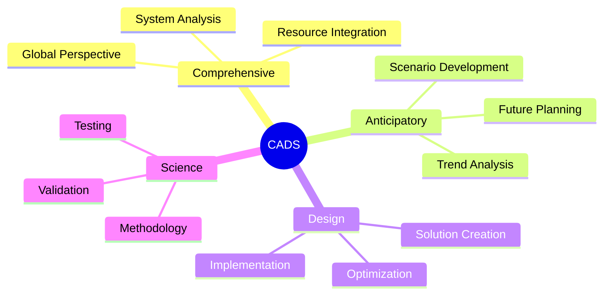
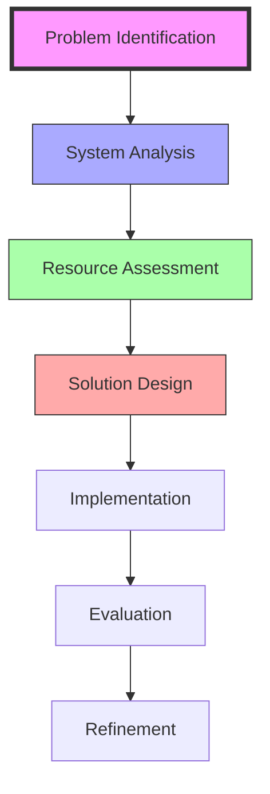
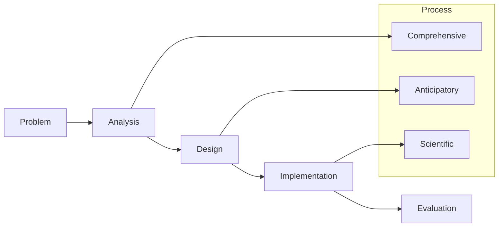
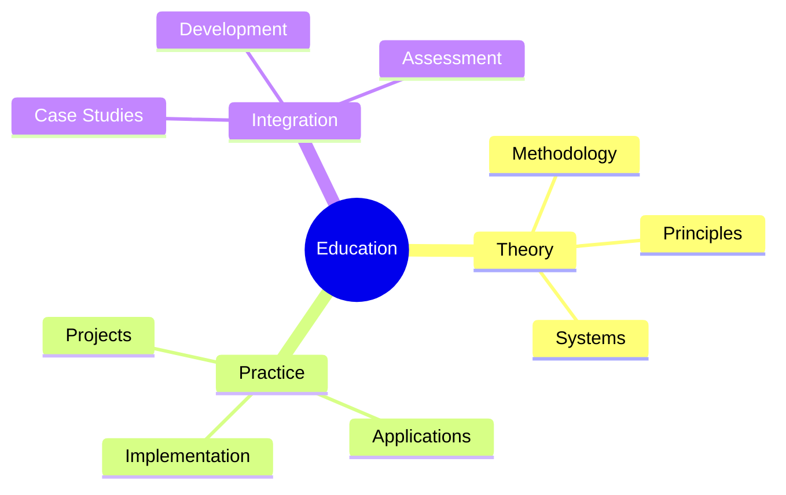
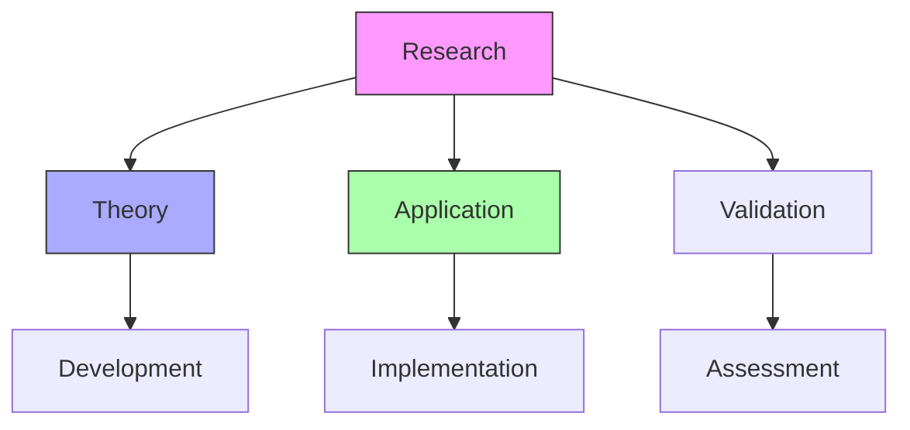
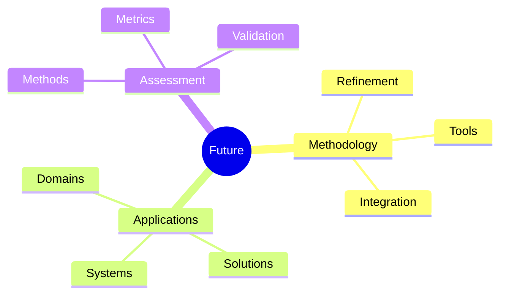

# Comprehensive Anticipatory Design Science

Comprehensive Anticipatory Design Science (CADS) is R. Buckminster Fuller's methodological framework for solving global problems through systematic, anticipatory, and comprehensive design thinking.

## Overview

### Definition
```yaml
cads:
  full_name: Comprehensive Anticipatory Design Science
  developer: R. Buckminster Fuller
  purpose: Systematic problem-solving methodology
  principles:
    - Comprehensive thinking
    - Anticipatory planning
    - Scientific method
    - Design integration
  applications:
    - Global problem-solving
    - Resource management
    - System design
    - Innovation development
```

### Core Components
1. Methodological Elements
   - Comprehensive analysis
   - Anticipatory planning
   - Scientific methodology
   - Design integration

2. System Approach
   - Holistic perspective
   - Future orientation
   - Resource optimization
   - Solution development

## Theoretical Framework

### Methodology Structure


### Key Principles
1. Comprehensive Thinking
   - System understanding
   - Resource analysis
   - Global perspective
   - Integration methods

2. Anticipatory Planning
   - Future scenarios
   - Trend analysis
   - Impact assessment
   - Strategic development

## Implementation Process

### Methodology Steps


### Application Areas
1. Global Systems
   - Resource management
   - Environmental planning
   - Social development
   - Economic systems

2. Design Solutions
   - Product development
   - System design
   - Infrastructure planning
   - Technology integration

## Problem-Solving Framework

### Methodology Application


### Solution Development
1. Analysis Phase
   - Problem definition
   - System mapping
   - Resource assessment
   - Constraint identification

2. Design Phase
   - Solution creation
   - Integration planning
   - Implementation strategy
   - Validation methods

## Educational Integration

### Learning Framework
1. Theoretical Foundation
   - Methodology understanding
   - System thinking
   - Design principles
   - Scientific methods

2. Practical Application
   - Case studies
   - Project development
   - Solution design
   - Implementation practice

### Educational Structure


## Research Applications

### Study Areas
1. Theoretical Research
   - Methodology development
   - System analysis
   - Design principles
   - Implementation methods

2. Applied Research
   - Case studies
   - Project implementation
   - Impact assessment
   - Solution validation

### Research Framework


## Future Development

### Innovation Areas
1. Methodology Enhancement
   - Process refinement
   - Tool development
   - Integration methods
   - Assessment systems

2. Application Expansion
   - New domains
   - System integration
   - Solution development
   - Implementation strategies

### Development Framework


## References

### Primary Sources
1. [[World Design Science Decade]] (1961-1974)
2. [[Operating Manual for Spaceship Earth]] (1969)
3. [[Critical Path]] (1981)

### Secondary Literature
1. [[Design Science Papers]]
2. [[Methodology Studies]]
3. [[Implementation Cases]]

## Notes
- Systematic problem-solving approach
- Future-oriented methodology
- Comprehensive system integration
- Scientific validation methods
- Continuous development focus

## Tags
#concept #design-science #methodology #systems-thinking #innovation 