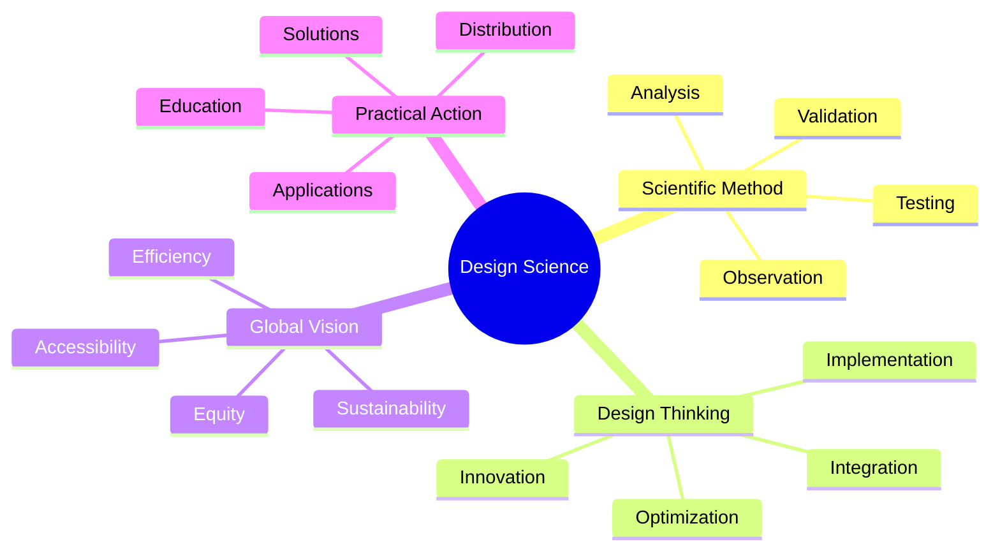
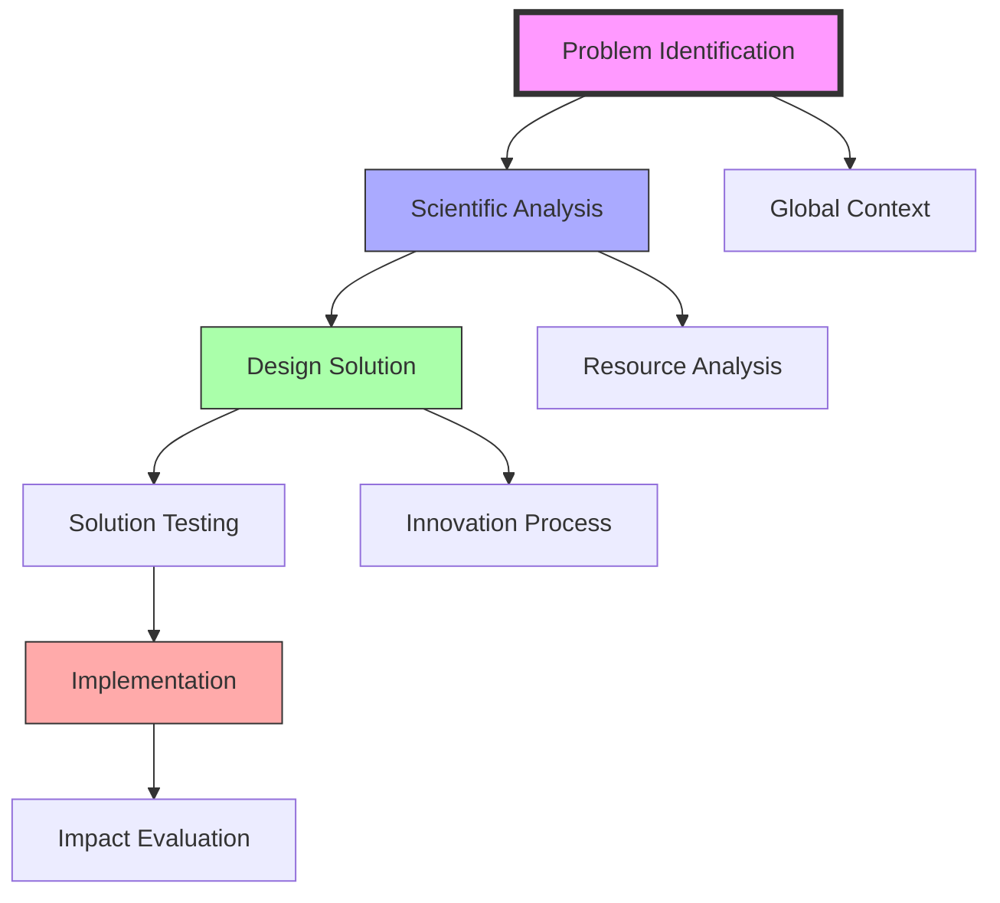
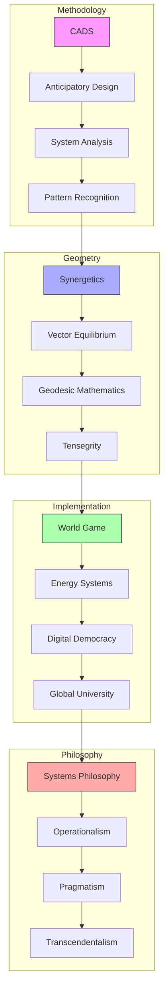
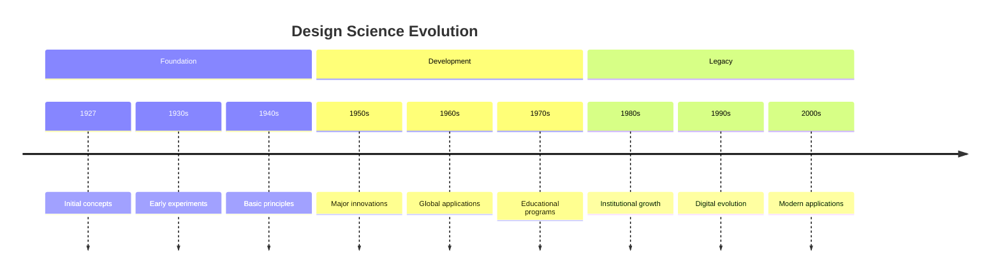
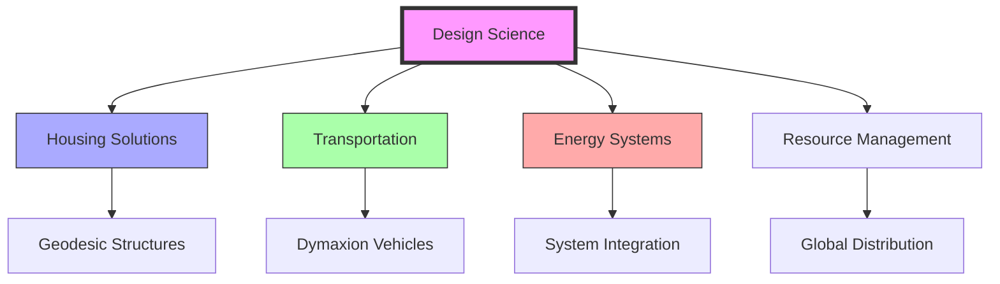

# Design Science

> Fuller's comprehensive methodology for solving global challenges through the integration of design thinking and scientific principles, aimed at "making the world work for 100% of humanity."

## Core Philosophy

### Foundational Principles


### Methodological Framework


## Epic Connections

### Knowledge Networks
```mermaid
mindmap
    root((Design Science))
        Methodological Foundations
            [[Comprehensive_Anticipatory_Design_Science|CADS Framework]]
            [[Anticipatory_Design|Forward Planning]]
            [[System_Analysis|Analysis Methods]]
            [[Pattern_Recognition|Pattern Understanding]]
        Geometric Principles
            [[Synergetics|Nature's Mathematics]]
            [[Vector_Equilibrium|Coordinate Systems]]
            [[Geodesic_Mathematics|Structural Principles]]
            [[Tensegrity|Force Distribution]]
        Implementation Systems
            [[World_Game|Global Solutions]]
            [[Energy_Systems|Resource Management]]
            [[Digital_Democracy|Democratic Evolution]]
            [[Global_University|Educational Network]]
        Philosophical Integration
            [[Systems_Philosophy|Systems Thinking]]
            [[Operationalism|Verification Methods]]
            [[Pragmatism|Practical Solutions]]
            [[Transcendentalism|Unity Vision]]
```

### System Weaving


### Integration Framework
```yaml
knowledge_framework:
  methodological_principles:
    cads:
      function: "Comprehensive planning"
      connection: "[[Comprehensive_Anticipatory_Design_Science]]"
    anticipatory_design:
      function: "Forward thinking"
      connection: "[[Anticipatory_Design]]"
    system_analysis:
      function: "Analysis methods"
      connection: "[[System_Analysis]]"
    pattern_recognition:
      function: "Pattern understanding"
      connection: "[[Pattern_Recognition]]"

  geometric_foundations:
    synergetics:
      principle: "Nature's mathematics"
      connection: "[[Synergetics]]"
    vector_equilibrium:
      principle: "Coordinate systems"
      connection: "[[Vector_Equilibrium]]"
    geodesic_mathematics:
      principle: "Structural principles"
      connection: "[[Geodesic_Mathematics]]"
    tensegrity:
      principle: "Force distribution"
      connection: "[[Tensegrity]]"

  implementation_systems:
    world_game:
      application: "Global solutions"
      connection: "[[World_Game]]"
    energy_systems:
      application: "Resource management"
      connection: "[[Energy_Systems]]"
    digital_democracy:
      application: "Democratic evolution"
      connection: "[[Digital_Democracy]]"
    global_university:
      application: "Educational network"
      connection: "[[Global_University]]"

  philosophical_integration:
    systems_philosophy:
      foundation: "Systems thinking"
      connection: "[[Systems_Philosophy]]"
    operationalism:
      foundation: "Verification methods"
      connection: "[[Operationalism]]"
    pragmatism:
      foundation: "Practical solutions"
      connection: "[[Pragmatism]]"
    transcendentalism:
      foundation: "Unity vision"
      connection: "[[Transcendentalism]]"
```

## Applications

### Key Implementations
- [[Geodesic_Dome]] development
- [[Dymaxion]] innovations
- [[World_Game]] methodology
- [[Energy_Systems]] design

### Solution Areas
- Housing systems
- Transportation
- Resource distribution
- Energy efficiency

## Research Methods

### Scientific Approach
- Systematic observation
- Data analysis
- Experimental design
- Validation methods

### Design Process


## Historical Development



## Educational Framework

### Learning Methods
- [[Design_Science_Education]]
- [[Systems_Education]]
- [[Pattern_Learning]]
- Practical application

### Teaching Tools
- Case studies
- Design exercises
- System models
- Practical projects

## Implementation Areas

### Current Applications
- Sustainable design
- Resource optimization
- System integration
- Global solutions

### Future Directions
- Digital innovation
- AI integration
- Sustainable systems
- Global networks

## Research Impact

### Areas of Influence
- [[System_Analysis]]
- [[Pattern_Recognition]]
- [[Energy_Systems]]
- [[Resource_Distribution]]

### Innovation Areas


## Global Impact

### Solution Areas
- Housing accessibility
- Resource efficiency
- Energy optimization
- Transportation systems

### Implementation Scope
- Local solutions
- Regional networks
- Global systems
- Universal access

## Modern Applications

### Contemporary Use
- Sustainable development
- Smart cities
- Resource management
- System optimization

### Future Development
- AI integration
- Digital systems
- Global networks
- Sustainable solutions

## References

### Primary Sources
- Fuller, R. B. (1969). *Operating Manual for Spaceship Earth*.
- Fuller, R. B. (1981). *Critical Path*.
- Fuller, R. B. (1963). *Ideas and Integrities*.

### Secondary Sources
- Edmondson, A. C. (2007). *A Fuller Explanation*.
- Applewhite, E. J. (1975). *Cosmic Fishing*.
- Snyder, J. (1980). *Buckminster Fuller: An Auto-Biographical Monograph*.

## See Also

- [[System_Analysis]]
- [[Pattern_Recognition]]
- [[Energy_Systems]]
- [[World_Game]]

## Notes

Design Science represents Fuller's comprehensive approach to solving global challenges through the integration of scientific methodology and design thinking, providing a framework for developing practical solutions that benefit humanity as a whole. 