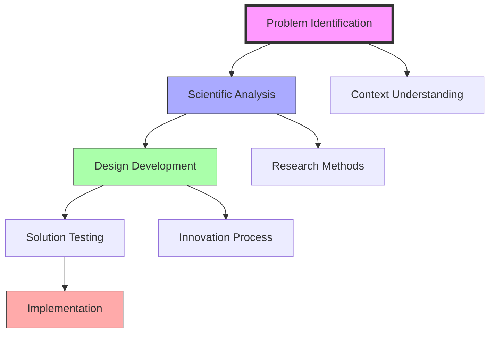
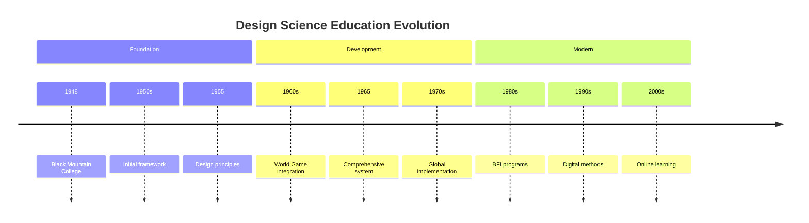
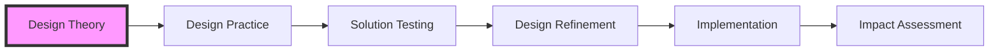
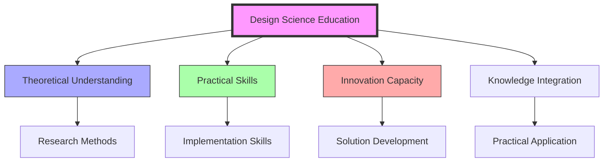

# Design Science Education

> Fuller's comprehensive educational methodology integrating [[Design_Science]], [[Systems_Education]], and [[Pattern_Learning]] to develop practical problem-solving capabilities through experiential learning and [[Natural_Patterns]] understanding.

## Core Philosophy

### Educational Framework
```mermaid
mindmap
    root((Design Science Education))
        Learning Principles
            [[Pattern_Recognition]]
            [[System_Analysis]]
            [[Natural_Patterns]]
            [[60_Degree_Coordination]]
        Design Methods
            [[Synergetics]]
            [[Tensegrity]]
            [[Geodesic_Mathematics]]
            [[Vector_Equilibrium]]
        Scientific Approach
            [[Energy_Systems]]
            [[Resource_Distribution]]
            [[System_Behavior]]
            [[Pattern_Formation]]
        Practical Skills
            [[Problem-Solving]]
            [[Prototyping]]
            [[Testing]]
            [[System_Innovation]]
```

### Learning Process


## Historical Development



## Educational Components

### Core Elements
- [[Pattern_Recognition]]: Understanding natural and geometric patterns
- [[System_Analysis]]: Comprehensive system evaluation methods
- [[Design_Science]]: Integrating design and scientific principles
- [[World_Game]]: Global problem-solving simulation
- [[Synergetics]]: Geometric and energetic understanding
- [[Natural_Patterns]]: Study of recurring patterns in nature

### Implementation Methods


## Teaching Methods

### Educational Approaches
- Project-based learning through [[World_Game]] simulations
- Experiential education using [[Geodesic_Mathematics]]
- Collaborative design incorporating [[Tensegrity]] principles
- Systems thinking based on [[Natural_Patterns]]

### Learning Tools
- [[Synergetics]] workshops
- [[System_Analysis]] models
- [[Pattern_Recognition]] labs
- [[Vector_Equilibrium]] demonstrations

## Institutional Implementation

### Educational Settings
- [[Black_Mountain_College]]
- [[Southern_Illinois_University]]
- [[Harvard_University]]
- [[Design_Science_Lab]]

### Program Types
- University courses
- Professional workshops
- Research programs
- Design studios

## Research Integration

### Areas of Study
- [[Design_Science]] methodology
- [[Systems_Education]] principles
- [[Pattern_Learning]] analysis
- [[Natural_Patterns]] research
- [[60_Degree_Coordination]] understanding
- [[Synergetics]] applications

### Application Areas
- [[Sustainable_Systems]] design
- [[Global_Solutions]] development
- [[Resource_Distribution]] management
- [[Energy_Systems]] optimization

## Educational Impact

### Learning Outcomes


### Skill Development
- Design thinking
- Scientific method
- Problem-solving
- Innovation capacity

## Modern Applications

### Contemporary Use
- Sustainable design
- Systems innovation
- Global solutions
- Resource optimization

### Digital Integration
- Online platforms
- Virtual labs
- Design tools
- Collaboration spaces

## Future Development

### Innovation Areas
- AI integration
- Virtual reality
- Digital twins
- Global networks

### Application Domains
- Sustainable development
- Smart cities
- Energy systems
- Resource management

## Educational Resources

### Teaching Materials
- [[Design_Science]] manuals
- [[System_Analysis]] guides
- [[Pattern_Recognition]] studies
- [[World_Game]] simulations
- [[Synergetics]] demonstrations
- [[Natural_Patterns]] documentation

### Learning Platforms
- [[BFI_Headquarters]] digital resources
- Online [[World_Game]] simulations
- Virtual [[Pattern_Learning]] labs
- [[Design_Science]] collaboration spaces

## Global Impact

### Implementation Areas
- [[Black_Mountain_College]]
- [[Southern_Illinois_University]]
- [[Harvard_University]]
- [[Design_Science_Lab]]
- [[BFI_Headquarters]]

### Network Development
- Global [[World_Game]] partnerships
- [[Design_Science]] research networks
- Educational exchanges through [[BFI_Headquarters]]
- Professional development via [[Design_Science_Lab]]

## References

### Primary Sources
- Fuller, R. B. (1969). *Education Automation*
- Fuller, R. B. (1981). *Critical Path*
- [[BFI_Archives]] Educational Materials
- [[Operating_Manual_for_Spaceship_Earth]]

### Secondary Sources
- Edmondson, A. C. (2007). *A Fuller Explanation*
- [[Black_Mountain_College]] Documentation
- Design Science Education Records
- [[Pattern_Learning]] Studies

## See Also

- [[Systems_Education]]
- [[Pattern_Learning]]
- [[Design_Science]]
- [[World_Game]]
- [[Synergetics]]
- [[Natural_Patterns]]
- [[60_Degree_Coordination]]

## Notes

Design Science Education represents Fuller's integrated approach to teaching design science principles through experiential learning and practical problem-solving, forming a cornerstone of his educational philosophy. It emphasizes the understanding of [[Natural_Patterns]], [[Synergetics]], and [[60_Degree_Coordination]] as fundamental to comprehensive design thinking. 