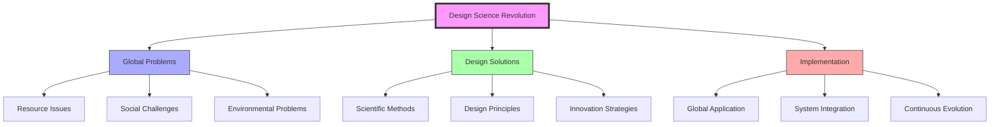
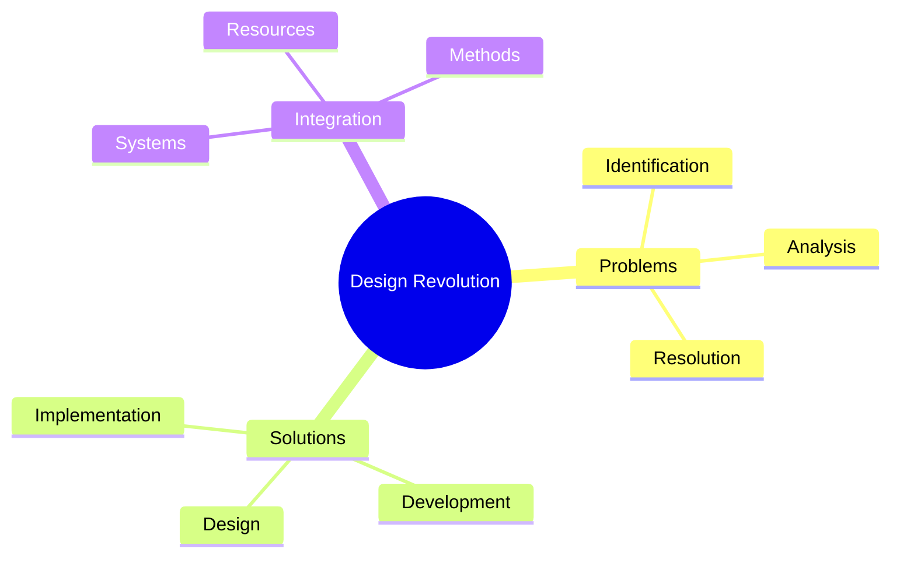
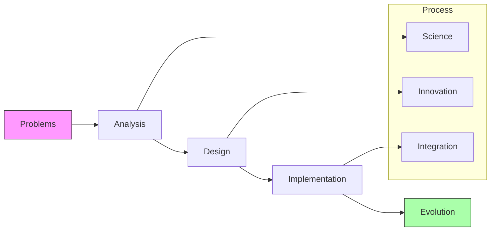
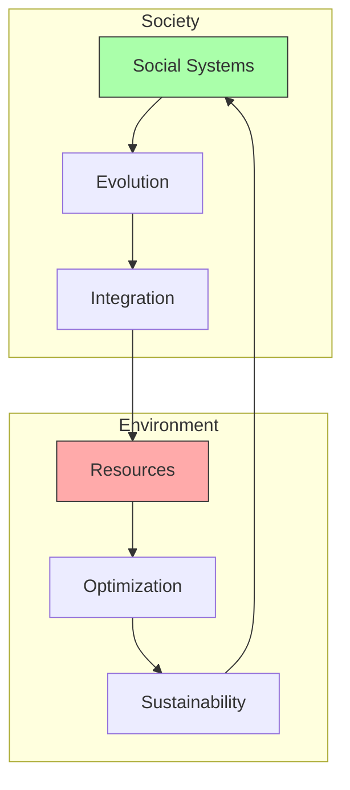
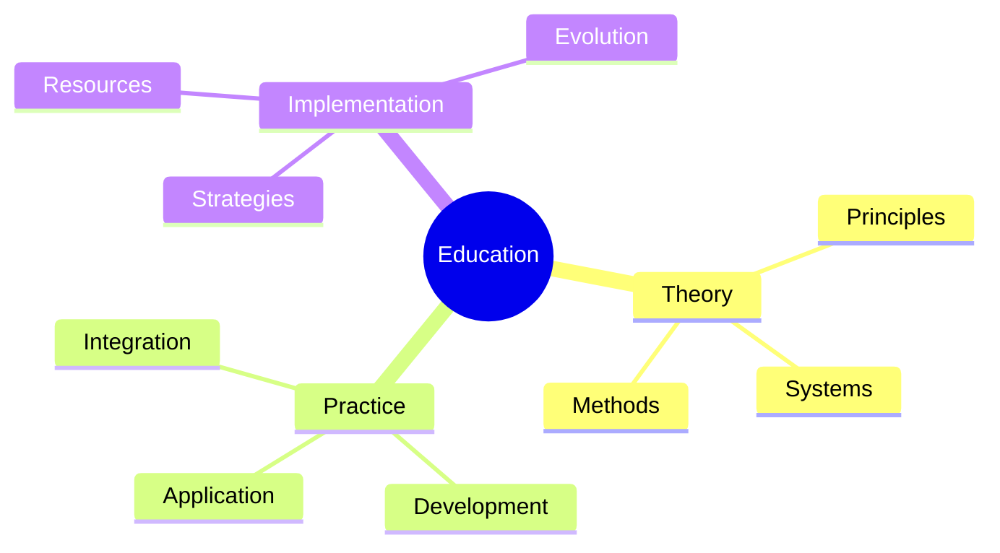
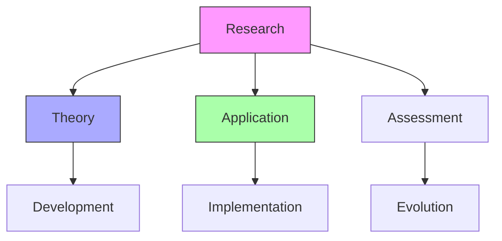
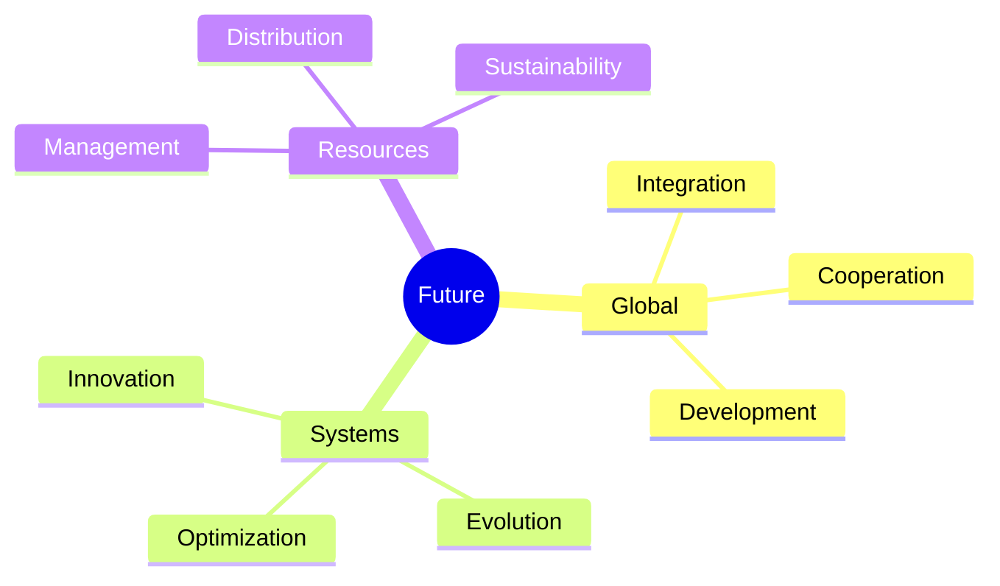

# Design Science Revolution

Design Science Revolution represents Fuller's vision for global transformation through the systematic application of design science principles to solve humanity's greatest challenges.

## Core Vision

### Transformational Framework

### Key Principles
1. Global Transformation
   - System redesign
   - Resource optimization
   - Social evolution
   - Environmental harmony

2. Design Integration
   - Scientific methods
   - Design principles
   - Innovation strategies
   - Implementation frameworks

## Strategic Framework

### Implementation Strategy

### Action Areas
1. Global Challenges
   - Resource distribution
   - Environmental issues
   - Social problems
   - Economic disparities

2. Design Solutions
   - System innovation
   - Resource optimization
   - Implementation methods
   - Continuous development

## Transformation Process

### Development Framework

### Implementation Methods
1. System Analysis
   - Problem identification
   - Resource assessment
   - Solution development
   - Implementation planning

2. Design Integration
   - Innovation methods
   - System coordination
   - Resource optimization
   - Continuous evolution

## Global Impact

### Transformation Areas

### Development Focus
1. Social Evolution
   - System transformation
   - Resource distribution
   - Global cooperation
   - Sustainable development

2. Environmental Integration
   - Resource management
   - System optimization
   - Environmental protection
   - Sustainable solutions

## Educational Framework

### Learning Integration
1. Design Education
   - System understanding
   - Problem-solving methods
   - Implementation strategies
   - Continuous development

2. Global Implementation
   - Knowledge distribution
   - Skill development
   - Resource sharing
   - Collaborative learning

### Teaching Methods

## Research Development

### Study Areas
1. Theoretical Research
   - System analysis
   - Design methods
   - Implementation strategies
   - Evolution patterns

2. Applied Research
   - Case studies
   - Implementation tests
   - Impact assessment
   - Development strategies

### Research Framework

## Future Vision

### Development Areas
1. System Evolution
   - Global integration
   - Resource optimization
   - Implementation methods
   - Continuous development

2. Innovation Focus
   - Design solutions
   - System transformation
   - Resource management
   - Sustainable development

### Vision Framework

## References

### Primary Sources
1. [[books/World_Design_Science_Decade|World Design Science Decade]]
2. [[books/Utopia_or_Oblivion|Utopia or Oblivion]]
3. [[books/Critical_Path|Critical Path]]

### Related Resources
1. [[papers/Design_Revolution|Design Revolution Papers]]
2. [[papers/Global_Transformation|Transformation Studies]]
3. [[papers/Implementation_Strategies|Implementation Methods]]

## Notes
- Global transformation vision
- Design science application
- System evolution focus
- Resource optimization
- Continuous development

## Tags
#design-science #revolution #transformation #global-change #innovation 