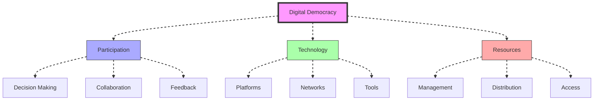
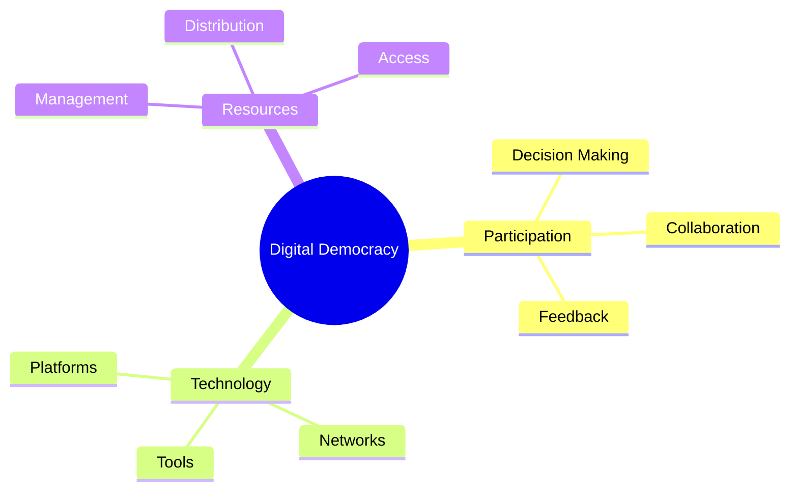
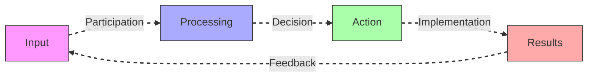
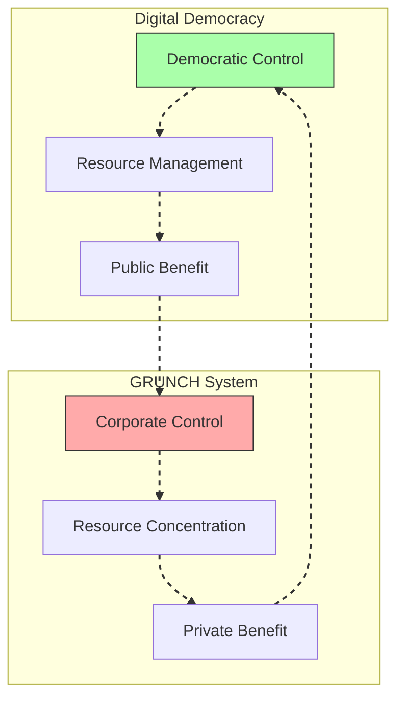
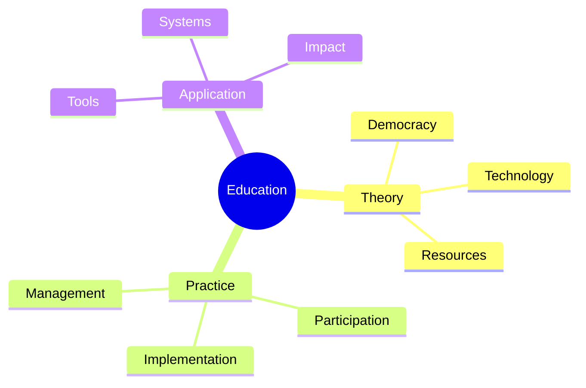
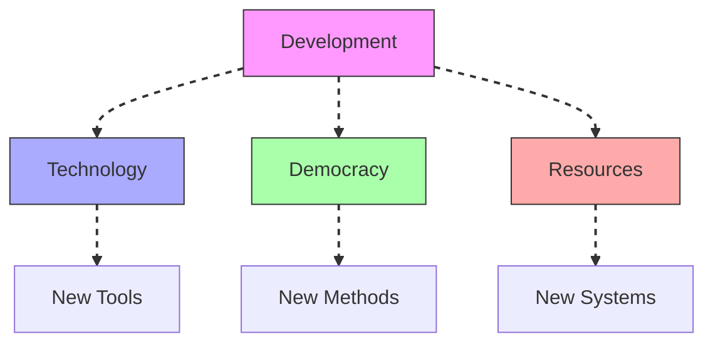

# Digital Democracy

Digital Democracy represents the technological implementation of [[concepts/USA_OS|USA Operating System]], enabling democratic participation and resource management through digital systems and networks.

## System Overview

## Core Components

### System Architecture

### Key Elements
1. [[concepts/Democratic_Systems|Democratic Framework]]
   - Participation methods
   - Decision processes
   - Feedback systems
   - Collaborative tools

2. [[concepts/Resource_Management|Resource Systems]]
   - Distribution networks
   - Access protocols
   - Management tools
   - Optimization methods

## Implementation Framework

### Process Flow

### System Integration
1. [[concepts/Platform_Development|Platform Architecture]]
   - User interfaces
   - Data systems
   - Network infrastructure
   - Security protocols

2. [[concepts/Democratic_Tools|Democratic Tools]]
   - Voting systems
   - Discussion platforms
   - Resource tracking
   - Decision support

## Response to GRUNCH

### Alternative Systems

### Transformation Strategy
1. [[concepts/Democratic_Transformation|Democratic Shift]]
   - Power distribution
   - Resource access
   - Decision rights
   - Public control

2. [[concepts/Resource_Democracy|Resource Democracy]]
   - Fair distribution
   - Equal access
   - Public management
   - Sustainable use

## Educational Integration

### Learning Framework

### Program Development
1. [[concepts/Digital_Literacy|Digital Literacy]]
   - System understanding
   - Tool proficiency
   - Critical thinking
   - Active participation

2. [[concepts/Global_University|Global Education]]
   - Democratic principles
   - Technical skills
   - Resource awareness
   - System participation

## Future Development

### Innovation Areas

### Implementation Path
1. [[concepts/System_Innovation|System Innovation]]
   - Platform development
   - Tool creation
   - Method enhancement
   - System integration

2. [[concepts/Global_Solutions|Global Implementation]]
   - Local deployment
   - Regional networks
   - Global integration
   - Impact assessment

## References

### Primary Sources
1. [[books/Operating_Manual_for_Spaceship_Earth|Operating Manual for Spaceship Earth]]
2. [[books/Critical_Path|Critical Path]]
3. [[books/Grunch_of_Giants|GRUNCH of Giants]]

### Related Resources
1. [[papers/Digital_Democracy|Digital Democracy Implementation]]
2. [[papers/Democratic_Systems|Democratic System Design]]
3. [[papers/Resource_Management|Resource Management Systems]]

## Notes
- Essential for democratic resource management
- Key to countering GRUNCH systems
- Foundation for participatory governance
- Platform for global collaboration

## Tags
#democracy #technology #governance #participation #digital-systems 