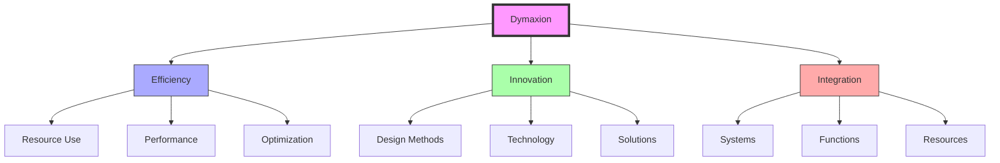
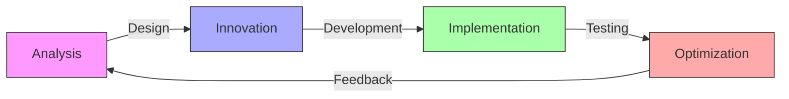
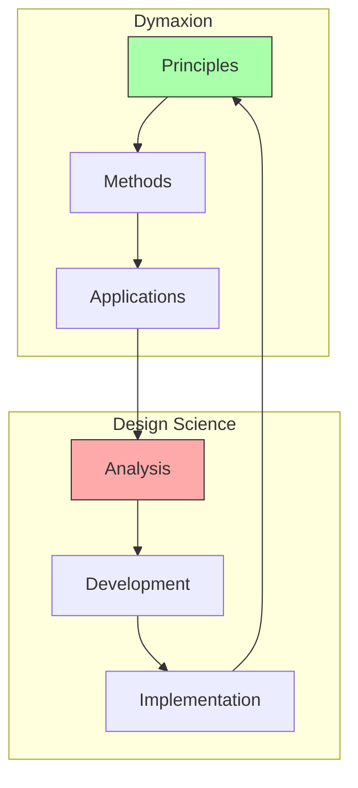
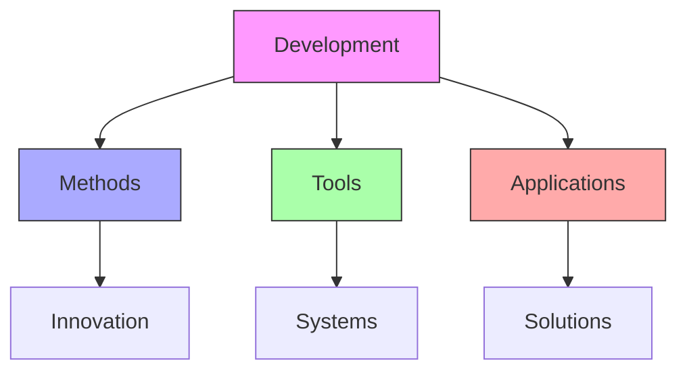

# Dymaxion

Dymaxion represents Fuller's fundamental principle of achieving maximum efficiency through minimal resource use, embodied in his approach to design, technology, and problem-solving.

## Core Principles

### Design Philosophy


### Key Elements
1. [[concepts/Efficiency_Principles|Efficiency Framework]]
   - Resource optimization
   - Performance maximization
   - System integration
   - Function enhancement

2. [[concepts/Innovation_Methods|Innovation Strategy]]
   - Design methodology
   - Technology integration
   - Solution development
   - Implementation methods

## Major Applications

### Dymaxion Projects
1. [[concepts/Dymaxion_House|Housing Innovation]]
   - Lightweight design
   - Factory production
   - Resource efficiency
   - Environmental integration

2. [[concepts/Dymaxion_Car|Transportation Systems]]
   - Aerodynamic design
   - Efficiency focus
   - Resource optimization
   - Performance enhancement

3. [[concepts/Dymaxion_Map|Global Visualization]]
   - Minimal distortion
   - System relationships
   - Resource mapping
   - Pattern recognition

### Implementation Framework
```mermaid
mindmap
    root((Applications))
        Housing
            [[Design]]
            [[Production]]
            [[Efficiency]]
        Transport
            [[Movement]]
            [[Energy]]
            [[Systems]]
        Visualization
            [[Mapping]]
            [[Analysis]]
            [[Planning]]
```

## Technical Framework

### Design Methods
1. [[concepts/Design_Science|Design Integration]]
   - System analysis
   - Resource optimization
   - Performance enhancement
   - Implementation strategy

2. [[concepts/Technology_Integration|Technology Framework]]
   - Innovation methods
   - System development
   - Resource management
   - Efficiency focus

### Development Process


## Integration with Design Science

### System Framework


### Application Areas
1. [[concepts/World_Game|Global Solutions]]
   - Resource management
   - System optimization
   - Problem-solving
   - Implementation strategy

2. [[concepts/Comprehensive_Anticipatory_Design_Science|CADS Integration]]
   - Anticipatory design
   - System thinking
   - Resource planning
   - Solution development

## Educational Integration

### Learning Framework
1. [[concepts/Design_Science_Education|Educational Methods]]
   - Efficiency principles
   - Innovation methods
   - System understanding
   - Application development

2. [[concepts/Global_University|Global Implementation]]
   - Knowledge sharing
   - Resource access
   - Practice development
   - Solution implementation

### Teaching Methods
```mermaid
mindmap
    root((Education))
        Theory
            [[Principles]]
            [[Methods]]
            [[Systems]]
        Practice
            [[Design]]
            [[Development]]
            [[Implementation]]
        Application
            [[Projects]]
            [[Solutions]]
            [[Assessment]]
```

## Modern Applications

### Contemporary Use
1. [[concepts/Sustainable_Design|Sustainability]]
   - Resource efficiency
   - System optimization
   - Environmental integration
   - Performance enhancement

2. [[concepts/Technology_Development|Technology]]
   - Innovation methods
   - System development
   - Resource management
   - Efficiency focus

### Innovation Framework


## References

### Primary Sources
1. [[books/Nine_Chains_to_the_Moon|Nine Chains to the Moon]]
2. [[books/Operating_Manual_for_Spaceship_Earth|Operating Manual for Spaceship Earth]]
3. [[books/Dymaxion_World|The Dymaxion World of Buckminster Fuller]]

### Related Resources
1. [[papers/Efficiency_Methods|Efficiency Methodology]]
2. [[papers/Innovation_Systems|Innovation Systems]]
3. [[papers/Implementation_Strategies|Implementation Methods]]

## Notes
- Fundamental principle of Fuller's work
- Integration of efficiency and innovation
- Continuing relevance in modern design
- Key to sustainable development

## Tags
#design-science #efficiency #innovation #systems-thinking #fuller-principle 