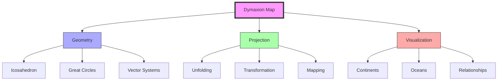
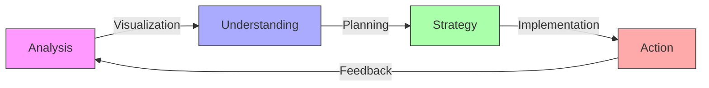
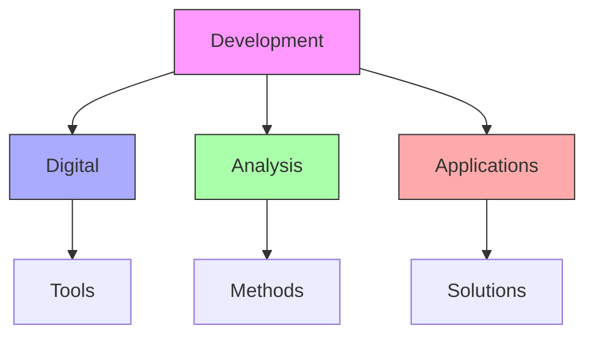
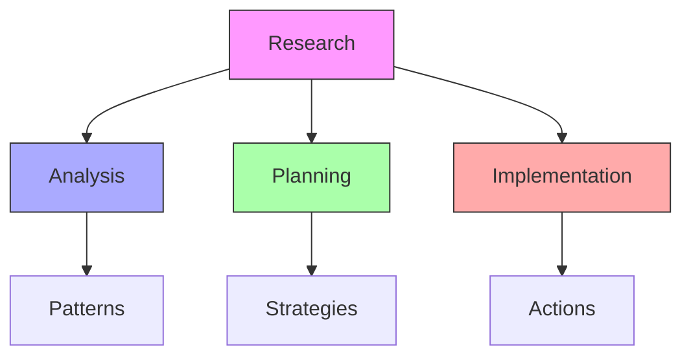

# Dymaxion Map

The Dymaxion Map represents Fuller's revolutionary approach to global visualization, using an icosahedral projection to minimize distortion and present Earth's continents as a single connected island in a world ocean.

![[Pasted image 20250227181534.png]]
## Core Principles

### Mathematical Foundation


### Key Features
1. [[concepts/Projection_System|Projection Properties]]
   - Minimal distortion
   - Area preservation
   - Distance accuracy
   - Connectivity focus

2. [[concepts/Visualization_Methods|Visual Framework]]
   - One-world island
   - Connected continents
   - Ocean context
   - Global relationships

## Technical Framework

### Geometric Basis
```mermaid
mindmap
    root((Geometry))
        Icosahedron
            [[20 Triangles]]
            [[30 Edges]]
            [[12 Vertices]]
        Projection
            [[Great Circles]]
            [[Vector Systems]]
            [[Surface Mapping]]
        Transformation
            [[Unfolding]]
            [[Arrangement]]
            [[Connection]]
```

### Mathematical Properties
1. [[concepts/Geometric_Properties|Geometric Analysis]]
   - Icosahedral symmetry
   - Area preservation
   - Angular relationships
   - Distance mapping

2. [[concepts/Projection_Mathematics|Projection Methods]]
   - Surface transformation
   - Coordinate mapping
   - Error minimization
   - Connection patterns

## Applications

### World Game Integration
1. [[concepts/Global_Visualization|Visualization Tools]]
   - Resource mapping
   - Flow analysis
   - Pattern recognition
   - System relationships

2. [[concepts/Strategic_Planning|Planning Applications]]
   - Global strategy
   - Resource distribution
   - Network analysis
   - Flow optimization

### Implementation Framework


## Educational Integration

### Learning Applications
1. [[concepts/Global_Education|Educational Methods]]
   - Global perspective
   - System relationships
   - Pattern recognition
   - Resource understanding

2. [[concepts/World_Game|World Game Applications]]
   - Simulation platform
   - Resource planning
   - Strategy development
   - Impact assessment

### Teaching Framework
```mermaid
mindmap
    root((Education))
        Theory
            [[Geometry]]
            [[Projection]]
            [[Systems]]
        Practice
            [[Visualization]]
            [[Analysis]]
            [[Planning]]
        Application
            [[Strategy]]
            [[Implementation]]
            [[Assessment]]
```

## Modern Development

### Digital Applications
1. [[concepts/Digital_Mapping|Digital Integration]]
   - Interactive systems
   - Dynamic visualization
   - Data mapping
   - Analysis tools

2. [[concepts/Global_Systems|System Applications]]
   - Resource tracking
   - Flow analysis
   - Network visualization
   - Pattern recognition

### Innovation Framework


## Research Value

### Analysis Applications
1. [[concepts/Global_Analysis|Global Studies]]
   - Pattern analysis
   - Resource distribution
   - Flow dynamics
   - System relationships

2. [[concepts/Strategic_Analysis|Strategic Planning]]
   - Resource allocation
   - Network optimization
   - Flow management
   - Impact assessment

### Research Framework


## References

### Primary Sources
1. [[books/Dymaxion_World|The Dymaxion World of Buckminster Fuller]]
2. [[books/Operating_Manual_for_Spaceship_Earth|Operating Manual for Spaceship Earth]]
3. [[books/World_Game|World Game Documentation]]

### Related Resources
1. [[papers/Map_Projection|Map Projection Analysis]]
2. [[papers/Global_Visualization|Global Visualization Methods]]
3. [[papers/Strategic_Planning|Strategic Planning Applications]]

## Notes
- Revolutionary approach to global visualization
- Key tool for World Game implementation
- Foundation for strategic planning
- Continuing relevance in digital age

## Tags
#cartography #design-science #visualization #global-systems #fuller-principle 