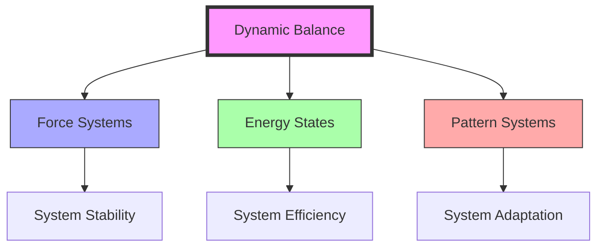

# Dynamic Balance

> Fuller's principle of equilibrium achieved through continuous adjustment and adaptation in complex systems, exemplified in [[Vector_Equilibrium]] and fundamental to [[Synergetics]].

## Core Principles

### Fundamental Concepts
```mermaid
mindmap
    root((Dynamic Balance))
        Force Systems
            [[Vector_Equilibrium]]
            [[Tensegrity]]
            [[Force_Distribution]]
            [[Structural_Stability]]
        Energy States
            [[Energy_Conservation]]
            [[Energy_Transformation]]
            [[System_Efficiency]]
            [[State_Changes]]
        Pattern Dynamics
            [[System_Behavior]]
            [[Flow_Patterns]]
            [[Adaptation_Processes]]
            [[Evolution_Patterns]]
        Natural Systems
            [[Living_Systems]]
            [[Growth_Patterns]]
            [[Natural_Patterns]]
            [[Ecosystem_Balance]]
```

### System Relationships


## Mathematical Framework

### Balance Equations
\[
\begin{align*}
\sum \vec{F} &= 0 \text{ (Force Balance)} \\
\sum E &= constant \text{ (Energy Conservation)} \\
\Delta S &\geq 0 \text{ (Entropy Principle)}
\end{align*}
\]

### System Properties
- Continuous adjustment
- Force distribution
- Energy conservation
- Pattern maintenance

## Applications

### Design Implementation
- [[Tensegrity]] structures
- [[Geodesic_Dome]] systems
- [[Energy_Systems]] design
- [[Living_Systems]] analysis

### System Integration


## Research Impact

### Areas of Influence
- [[System_Analysis]]: Dynamic system behavior
- [[Pattern_Recognition]]: Balance patterns
- [[Energy_Systems]]: Efficiency optimization
- [[Design_Science]]: Balanced design
- [[Living_Systems]]: Natural balance

### Innovation Areas
- [[Structural_Design]]: Force balance
- [[Energy_Efficiency]]: System optimization
- [[System_Behavior]]: Dynamic patterns
- [[Adaptation_Processes]]: System evolution

## Educational Applications

### Teaching Methods
- [[Systems_Education]]: System understanding
- [[Pattern_Learning]]: Balance recognition
- [[Design_Science_Education]]: Implementation
- [[Dynamic_Modeling]]: System simulation

### Learning Tools
- [[Physical_Models]]: Balance demonstration
- [[System_Diagrams]]: Force visualization
- [[Dynamic_Simulations]]: Behavior modeling
- [[Pattern_Analysis]]: Balance study

## Natural Examples

### Physical Systems
- Crystal formation
- Fluid dynamics
- Atmospheric systems
- Planetary motion

### Biological Systems
- Cellular homeostasis
- Ecosystem balance
- Population dynamics
- Growth patterns

## References

### Primary Sources
- Fuller, R. B. (1975). *Synergetics*
- Fuller, R. B. (1979). *Synergetics 2*
- [[BFI_Archives]] Research Materials
- [[Operating_Manual_for_Spaceship_Earth]]

### Secondary Sources
- Edmondson, A. C. (2007). *A Fuller Explanation*
- [[Design_Science_Lab]] Studies
- System Dynamics Research
- Balance Pattern Analysis

## See Also

- [[Vector_Equilibrium]]
- [[System_Behavior]]
- [[Energy_Systems]]
- [[Pattern_Recognition]]
- [[Living_Systems]]
- [[Natural_Patterns]]

## Notes

Dynamic Balance represents a fundamental principle in Fuller's work, demonstrating how systems maintain stability through continuous adjustment and adaptation. This concept bridges physical, biological, and designed systems, providing insights into sustainable and efficient design strategies. 