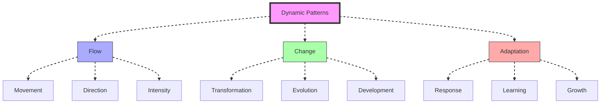
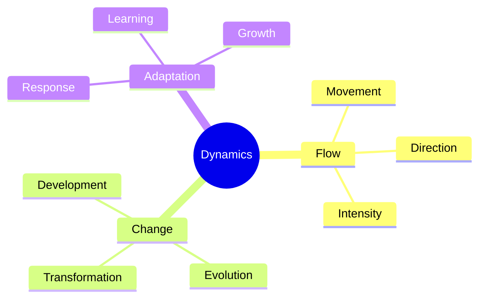
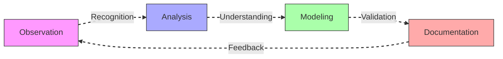
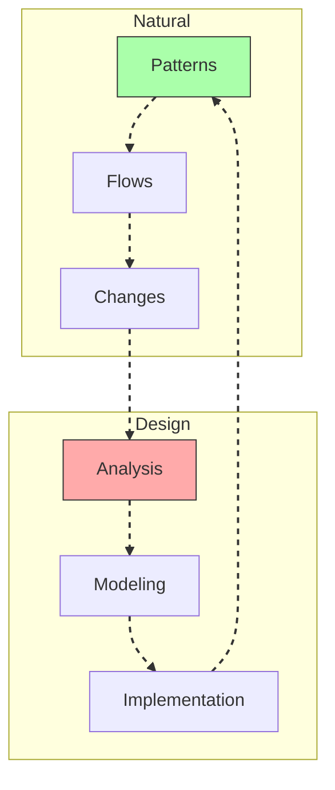
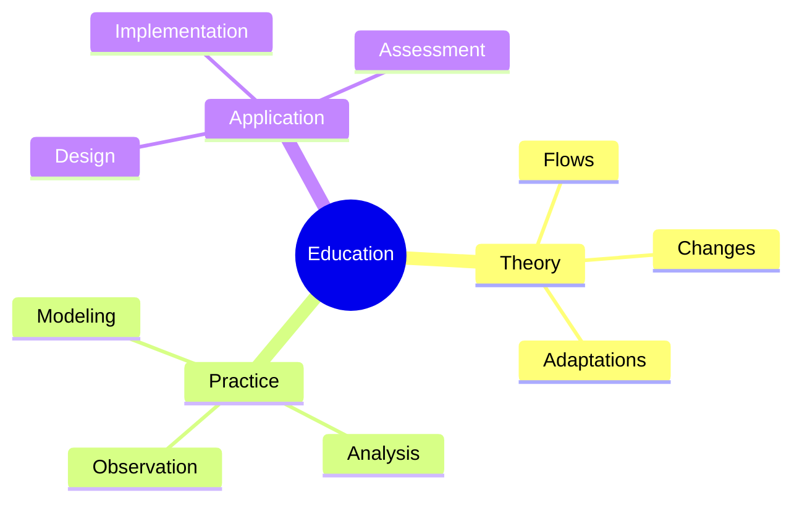
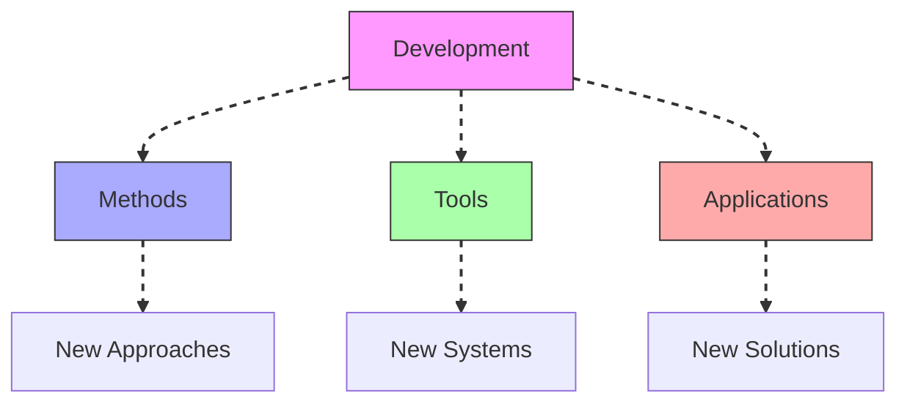

# Dynamic Patterns

Dynamic Patterns represent recurring behaviors and transformations within [[concepts/System_Behavior|complex systems]], integrating [[concepts/Pattern_Recognition|pattern recognition]] with [[concepts/System_Analysis|system analysis]] to understand flow and change.

## System Overview

## Core Components

### Pattern Framework

### Key Elements
1. [[concepts/Flow_Patterns|Flow Patterns]]
   - Movement analysis
   - Direction mapping
   - Intensity measurement
   - Pattern tracking

2. [[concepts/Change_Patterns|Change Patterns]]
   - Transformation analysis
   - Evolution tracking
   - Development mapping
   - Growth patterns

## Methodological Framework

### Analysis Process

### Implementation Strategy
1. [[concepts/Pattern_Analysis|Pattern Analysis]]
   - Flow observation
   - Change tracking
   - Adaptation mapping
   - Pattern validation

2. [[concepts/Dynamic_Modeling|Dynamic Modeling]]
   - System flows
   - Change processes
   - Adaptation mechanisms
   - Growth models

## Integration with Living Systems

### Dynamic Framework

### Application Areas
1. [[concepts/Living_Systems|Living Systems]]
   - Natural flows
   - Growth patterns
   - Adaptation processes
   - Evolution models

2. [[concepts/Design_Science|Design Science]]
   - Pattern application
   - Flow design
   - Change management
   - Adaptation strategies

## Educational Integration

### Learning Framework

### Program Development
1. [[concepts/Design_Science_Education|Design Science Education]]
   - Pattern analysis
   - Flow understanding
   - Change modeling
   - Adaptation study

2. [[concepts/Global_University|Global Education]]
   - Dynamic systems
   - Pattern recognition
   - Implementation methods
   - Impact assessment

## Future Development

### Innovation Areas

### Implementation Path
1. [[concepts/Pattern_Innovation|Pattern Innovation]]
   - Method development
   - Tool creation
   - Framework design
   - Validation systems

2. [[concepts/Global_Solutions|Global Solutions]]
   - Pattern application
   - Flow optimization
   - Change management
   - Impact assessment

## References

### Primary Sources
1. [[books/World_Design_Science_Decade|World Design Science Decade]]
2. [[books/Synergetics_Book|Synergetics]]
3. [[books/Dynamic_Systems|Dynamic Systems Analysis]]

### Related Resources
1. [[papers/Flow_Analysis|Flow Pattern Analysis]]
2. [[papers/Change_Patterns|Change Pattern Recognition]]
3. [[papers/Adaptation_Models|Adaptation Modeling]]

## Notes
- Essential for understanding system flows
- Key to change management
- Foundation for adaptation strategies
- Critical for system design

## Tags
#patterns #dynamics #systems-thinking #behavior #methodology 