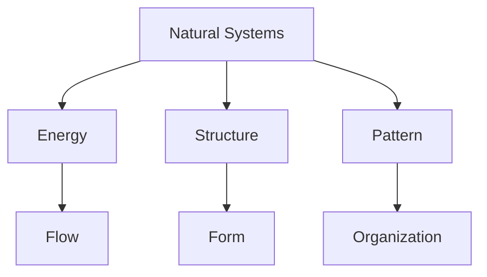
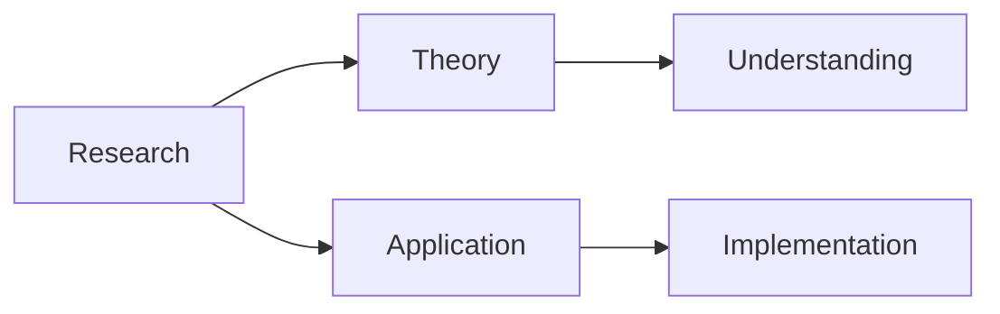
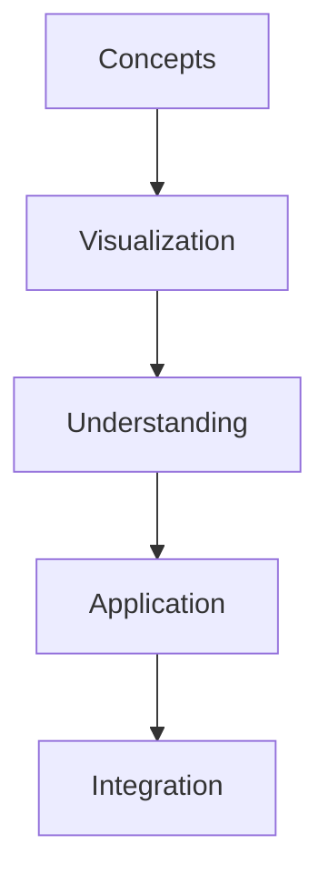
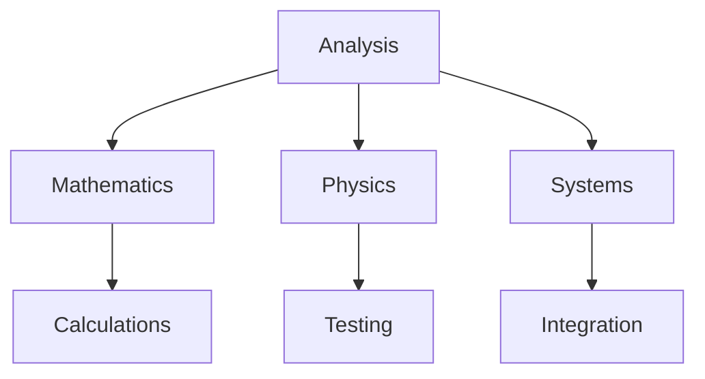
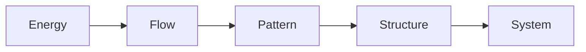

# Energetic-Synergetic Geometry

Energetic-Synergetic Geometry is R. Buckminster Fuller's comprehensive geometric system that integrates energy considerations with structural relationships, providing a unified approach to understanding nature's coordinate system.

## Overview

### Definition
```yaml
energetic_synergetic_geometry:
  creator: R. Buckminster Fuller
  principle: Integration of energy and geometry
  foundation:
    - Vector equilibrium
    - Closest packing
    - 60° coordination
    - Synergetic principles
  significance:
    - Nature's mathematics
    - Energy patterns
    - Structural efficiency
    - System dynamics
```

### Core Principles
1. Geometric Properties
   - Energy relationships
   - Vector systems
   - Structural patterns
   - Dynamic equilibrium

2. System Characteristics
   - Natural coordination
   - Energy efficiency
   - Pattern formation
   - System integration

## Mathematical Framework

### Geometric Principles
```mermaid
mindmap
    root((Energy Geometry))
        Structure
            [[Vector Systems]]
            [[Closest Packing]]
            [[Coordination]]
        Energy
            [[Force Patterns]]
            [[Dynamic Balance]]
            [[System Flow]]
        Integration
            [[Natural Systems]]
            [[Efficiency]]
            [[Optimization]]
```

### Mathematical Properties
1. Vector Mathematics
   - Energy vectors
   - Force relationships
   - System dynamics
   - Pattern metrics

2. Energy Analysis
   - Force distribution
   - System efficiency
   - Dynamic balance
   - Pattern formation

## Natural Systems

### Physical Manifestations
1. Atomic Level
   - [[Crystal Structure]]
   - [[Molecular Organization]]
   - [[Energy States]]
   - [[Force Fields]]

2. Macro Systems
   - [[Natural Forms]]
   - [[Growth Patterns]]
   - [[System Organization]]
   - [[Energy Flow]]

### System Framework


## Applications

### Implementation Areas
1. Physical Systems
   - [[Structural Design]]
   - [[Energy Systems]]
   - [[Material Science]]
   - [[System Dynamics]]

2. Theoretical Applications
   - [[Pattern Analysis]]
   - [[Energy Flow]]
   - [[System Organization]]
   - [[Efficiency Studies]]

### Application Framework
```mermaid
mindmap
    root((Applications))
        Physical
            [[Structure]]
            [[Energy]]
            [[Materials]]
        Theory
            [[Analysis]]
            [[Organization]]
            [[Efficiency]]
```

## Research Value

### Study Areas
1. Theoretical Research
   - Mathematical foundations
   - Energy patterns
   - System dynamics
   - Pattern formation

2. Applied Research
   - Structural applications
   - Energy systems
   - Material design
   - System optimization

### Research Framework


## Educational Applications

### Teaching Methods
1. Physical Models
   - Vector models
   - Energy displays
   - System demonstrations
   - Pattern tools

2. Digital Resources
   - Simulation software
   - Analysis tools
   - Interactive programs
   - Learning platforms

### Learning Framework


## Modern Applications

### Contemporary Use
1. Advanced Systems
   - [[Energy Design]]
   - [[Structural Analysis]]
   - [[Pattern Development]]
   - [[System Optimization]]

2. Innovation Areas
   - [[Smart Materials]]
   - [[Efficient Structures]]
   - [[Dynamic Systems]]
   - [[Energy Integration]]

### Innovation Framework
```mermaid
mindmap
    root((Innovation))
        Systems
            [[Energy]]
            [[Structure]]
            [[Patterns]]
        Development
            [[Materials]]
            [[Integration]]
            [[Optimization]]
```

## Technical Implementation

### Analysis Methods
1. Mathematical Analysis
   - Energy calculations
   - Vector analysis
   - Pattern studies
   - System modeling

2. Physical Testing
   - Structure behavior
   - Energy flow
   - System dynamics
   - Pattern formation

### Technical Framework


## System Dynamics

### Energy Patterns
1. Flow Analysis
   - Energy distribution
   - Force patterns
   - System balance
   - Dynamic equilibrium

2. Pattern Formation
   - Structure development
   - Energy organization
   - System evolution
   - Pattern stability

### Dynamic Framework


## Resources

### Documentation
- [[Technical Papers]]
- [[Research Studies]]
- [[Design Guides]]
- [[Application Notes]]

### Learning Materials
1. Educational Resources
   - [[Teaching Guides]]
   - [[Model Sets]]
   - [[Visual Aids]]
   - [[Practice Materials]]

2. Technical Resources
   - [[Analysis Tools]]
   - [[Design Software]]
   - [[Testing Systems]]
   - [[Evaluation Methods]]

## References
1. Fuller's Synergetics
2. Mathematical studies
3. Energy analysis
4. System dynamics
5. Application papers

## Notes
- Fundamental to Synergetics
- Integrates energy and structure
- Universal application
- Continuing relevance

## Tags
#concept #geometry #synergetics #energy #mathematics 