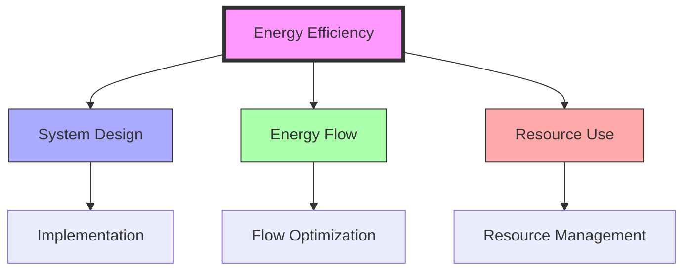

# Energy Efficiency

> Fuller's systematic approach to optimizing energy utilization and minimizing waste through [[Design_Science]] principles and [[System_Analysis]], fundamental to his vision of comprehensive anticipatory design.

## Core Principles

### Fundamental Concepts
```mermaid
mindmap
    root((Energy Efficiency))
        System Design
            [[Design_Science]]
            [[System_Optimization]]
            [[Resource_Management]]
            [[Waste_Reduction]]
        Energy Flow
            [[Energy_Systems]]
            [[Flow_Patterns]]
            [[Energy_Conservation]]
            [[Energy_Transformation]]
        Resource Use
            [[Resource_Distribution]]
            [[Material_Efficiency]]
            [[System_Integration]]
            [[Sustainable_Systems]]
        Implementation
            [[Design_Methods]]
            [[System_Analysis]]
            [[Performance_Metrics]]
            [[Optimization_Tools]]
```

### System Relationships


## Mathematical Framework

### Efficiency Metrics
\[
\begin{align*}
\eta &= \frac{E_{out}}{E_{in}} \text{ (System Efficiency)} \\
\Delta E_{waste} &= E_{in} - E_{out} \text{ (Energy Loss)} \\
ROI &= \frac{E_{saved}}{E_{invested}} \text{ (Return on Investment)}
\end{align*}
\]

### System Properties
- Maximum output
- Minimum waste
- Optimal distribution
- Sustainable operation

## Applications

### Design Implementation
- [[Dymaxion]] housing systems
- [[Geodesic_Dome]] structures
- [[Energy_Systems]] design
- [[Resource_Distribution]] networks

### System Integration


## Research Impact

### Areas of Influence
- [[Design_Science]]: Efficient design
- [[System_Analysis]]: Performance evaluation
- [[Energy_Systems]]: Flow optimization
- [[Resource_Distribution]]: Network efficiency
- [[Sustainable_Systems]]: Long-term viability

### Innovation Areas
- [[System_Optimization]]: Performance improvement
- [[Resource_Management]]: Efficient allocation
- [[Waste_Reduction]]: System efficiency
- [[Flow_Patterns]]: Energy distribution

## Educational Applications

### Teaching Methods
- [[Systems_Education]]: Efficiency principles
- [[Design_Science_Education]]: Implementation
- [[Pattern_Learning]]: Flow recognition
- [[Performance_Analysis]]: System evaluation

### Learning Tools
- [[System_Models]]: Efficiency demonstration
- [[Flow_Diagrams]]: Energy visualization
- [[Performance_Metrics]]: Evaluation tools
- [[Optimization_Methods]]: Enhancement techniques

## Natural Examples

### Physical Systems
- Natural energy flows
- Ecosystem efficiency
- Biological systems
- Growth patterns

### System Examples
- Solar energy capture
- Thermal regulation
- Material cycles
- Resource flows

## References

### Primary Sources
- Fuller, R. B. (1969). *Operating Manual for Spaceship Earth*
- Fuller, R. B. (1981). *Critical Path*
- [[BFI_Archives]] Energy Studies
- [[Design_Science]] Documentation

### Secondary Sources
- Edmondson, A. C. (2007). *A Fuller Explanation*
- [[Energy_Systems]] Research
- Efficiency Studies
- System Performance Analysis

## See Also

- [[Energy_Systems]]
- [[Design_Science]]
- [[System_Analysis]]
- [[Resource_Distribution]]
- [[Sustainable_Systems]]
- [[Flow_Patterns]]

## Notes

Energy Efficiency represents a core principle in Fuller's work, demonstrating how thoughtful design and system analysis can maximize resource utilization while minimizing waste. This concept is fundamental to sustainable design and comprehensive anticipatory design science. 