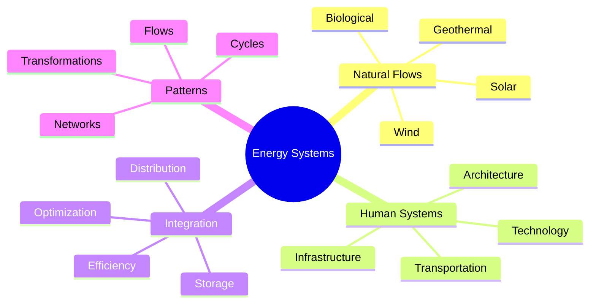
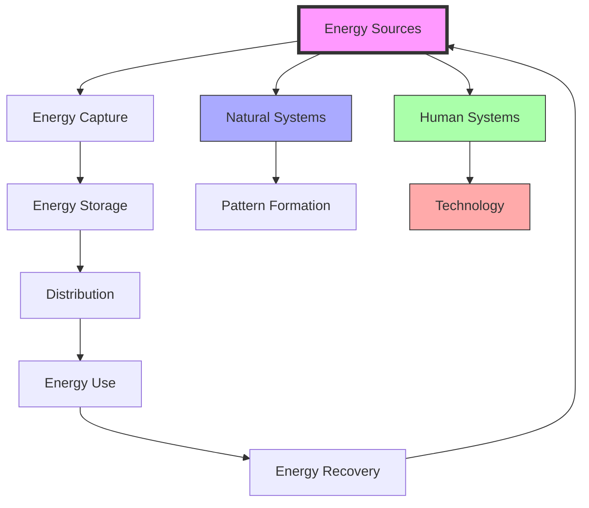
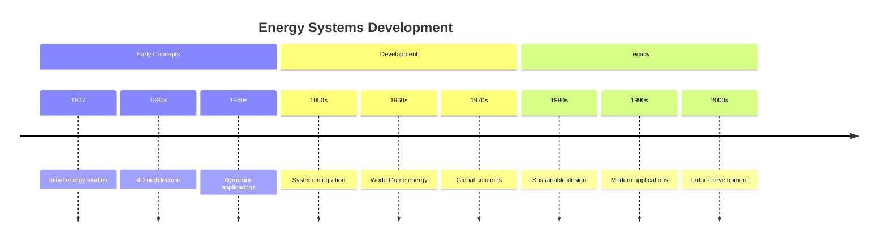
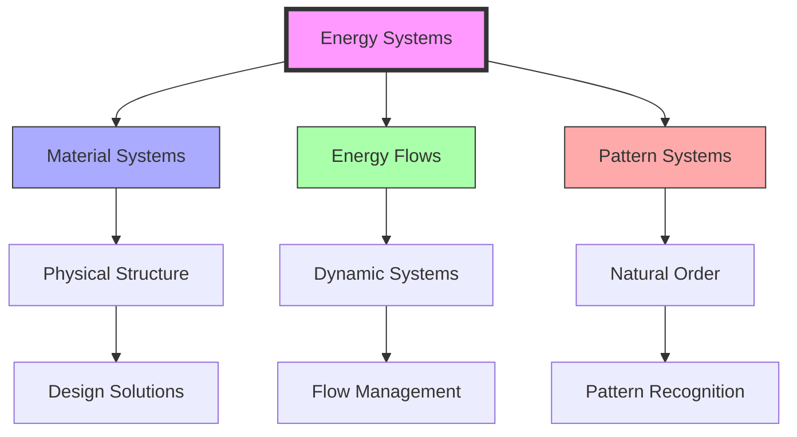

# Energy Systems

> Fuller's integrated approach to understanding, analyzing, and optimizing energy flows across natural and human-made systems, fundamental to his vision of [[Design_Science]] and [[Resource_Distribution]].

## Core Principles

### Energy-Synergy

### Fundamental Concepts
- Energy efficiency through [[Design_Science]]
- System integration via [[Pattern_Recognition]]
- Resource optimization using [[System_Analysis]]
- Sustainable cycles through [[Living_Systems]]

## System Architecture

### Energy Flow Patterns

## Applications

### Design Implementation
- [[Dymaxion]] housing systems
- [[Geodesic_Dome]] efficiency
- [[World_Game]] resource management
- Sustainable architecture

### System Integration
- Natural energy flows
- Built environment
- Transportation networks
- Resource distribution

## Research Areas

### Energy Patterns
- Natural system analysis
- Flow optimization
- Pattern recognition
- System efficiency

### Technology Development
- Sustainable solutions
- Energy storage
- Distribution systems
- Efficiency measures

## Timeline

## Implementation

### Design Principles
- Minimum energy paths
- Maximum efficiency
- System integration
- Resource optimization

### Practical Applications
- Building systems
- Transportation networks
- Resource management
- Infrastructure design

## Theoretical Framework

### Energy-Matter Relations

## Modern Applications

### Sustainable Design
- Renewable energy integration
- Efficient architecture
- Transportation systems
- Resource management

### Technology Integration
- Smart systems
- Energy monitoring
- Flow optimization
- Pattern analysis

## Research Impact

### Areas of Influence
- [[Design_Science]]
- [[System_Analysis]]
- [[Pattern_Recognition]]
- [[Resource_Distribution]]

### Current Research
- Sustainability studies
- System optimization
- Energy efficiency
- Pattern analysis

## Educational Applications

### Teaching Methods
- [[Design_Science_Education]]
- [[Systems_Education]]
- [[Pattern_Learning]]
- Practical implementation

### Learning Resources
- System models
- Case studies
- Design tools
- Analysis methods

## References

### Primary Sources
- Fuller, R. B. (1969). *Operating Manual for Spaceship Earth*.
- Fuller, R. B. (1981). *Critical Path*.

### Secondary Sources
- Edmondson, A. C. (2007). *A Fuller Explanation*.
- Snyder, J. (1980). *Buckminster Fuller: An Auto-Biographical Monograph*.

## See Also

- [[Resource_Distribution]]
- [[System_Analysis]]
- [[Pattern_Recognition]]
- [[Design_Science]]

## Notes

Energy Systems represent a fundamental aspect of Fuller's comprehensive approach to design and problem-solving, integrating natural patterns with human technological systems to achieve maximum efficiency and sustainability. 