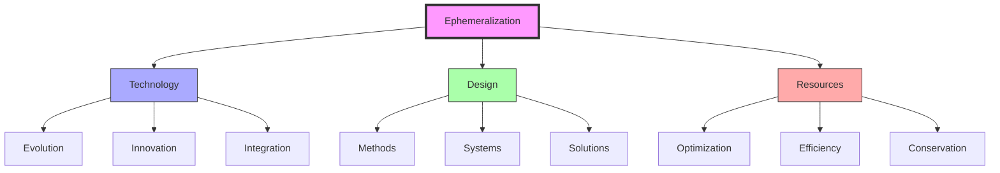
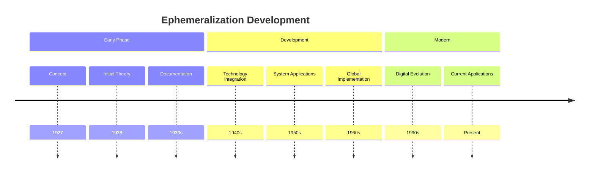
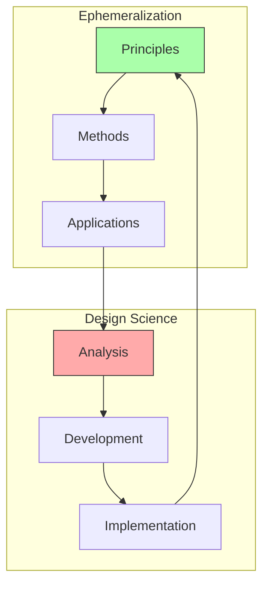
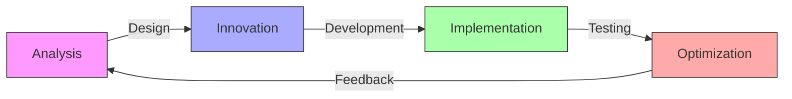
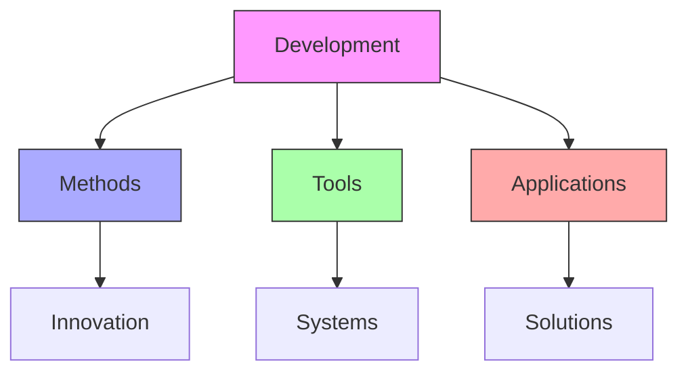

# Ephemeralization

Ephemeralization represents Fuller's principle of achieving progressively more with less through technological evolution and design innovation, forming a core component of his [[concepts/Design_Science|Design Science]] methodology.

## Core Principles

### Efficiency Framework


### Key Elements
1. [[concepts/Technology_Evolution|Technological Progress]]
   - System evolution
   - Innovation development
   - Integration methods
   - Performance enhancement

2. [[concepts/Resource_Optimization|Resource Management]]
   - Efficiency increase
   - Material reduction
   - Energy optimization
   - System integration

## Historical Development

### Evolution Timeline


### Development Framework
1. [[concepts/Concept_Evolution|Conceptual Development]]
   - Initial theory
   - System integration
   - Application methods
   - Modern evolution

2. [[concepts/Practical_Implementation|Implementation Strategy]]
   - Technology application
   - Resource management
   - System optimization
   - Performance enhancement

## Integration with Design Science

### System Framework


### Application Areas
1. [[concepts/World_Game|Global Solutions]]
   - Resource management
   - System optimization
   - Problem-solving
   - Implementation strategy

2. [[concepts/Comprehensive_Anticipatory_Design_Science|CADS Integration]]
   - Anticipatory design
   - System thinking
   - Resource planning
   - Solution development

## Technical Applications

### Implementation Methods
1. [[concepts/Technology_Integration|Technology Framework]]
   - System development
   - Innovation methods
   - Resource optimization
   - Performance enhancement

2. [[concepts/System_Development|System Evolution]]
   - Design integration
   - Resource management
   - Efficiency increase
   - Solution implementation

### Development Process


## Educational Integration

### Learning Framework
1. [[concepts/Design_Science_Education|Educational Methods]]
   - Efficiency principles
   - Innovation methods
   - System understanding
   - Application development

2. [[concepts/Global_University|Global Implementation]]
   - Knowledge sharing
   - Resource access
   - Practice development
   - Solution implementation

### Teaching Methods
```mermaid
mindmap
    root((Education))
        Theory
            [[Principles]]
            [[Methods]]
            [[Systems]]
        Practice
            [[Design]]
            [[Development]]
            [[Implementation]]
        Application
            [[Projects]]
            [[Solutions]]
            [[Assessment]]
```

## Modern Applications

### Contemporary Use
1. [[concepts/Digital_Evolution|Digital Technology]]
   - System optimization
   - Resource efficiency
   - Performance enhancement
   - Innovation methods

2. [[concepts/Sustainable_Development|Sustainability]]
   - Resource management
   - System integration
   - Efficiency increase
   - Environmental protection

### Innovation Framework


## Future Implications

### Development Areas
1. [[concepts/Technology_Future|Technological Evolution]]
   - System advancement
   - Innovation development
   - Resource optimization
   - Performance enhancement

2. [[concepts/Global_Solutions|Global Implementation]]
   - Resource management
   - System integration
   - Efficiency increase
   - Solution development

### Evolution Framework
```mermaid
mindmap
    root((Future))
        Technology
            [[Evolution]]
            [[Innovation]]
            [[Integration]]
        Systems
            [[Optimization]]
            [[Efficiency]]
            [[Management]]
        Applications
            [[Solutions]]
            [[Development]]
            [[Implementation]]
```

## References

### Primary Sources
1. [[books/Nine_Chains_to_the_Moon|Nine Chains to the Moon]]
2. [[books/Operating_Manual_for_Spaceship_Earth|Operating Manual for Spaceship Earth]]
3. [[books/Utopia_or_Oblivion|Utopia or Oblivion]]

### Related Resources
1. [[papers/Technology_Evolution|Technology Evolution]]
2. [[papers/Efficiency_Methods|Efficiency Methodology]]
3. [[papers/Implementation_Strategies|Implementation Methods]]

## Notes
- Core principle of Fuller's work
- Key to technological evolution
- Foundation for sustainable development
- Continuing relevance in digital age

## Tags
#efficiency #technology #design-science #innovation #systems-thinking #fuller-principle 