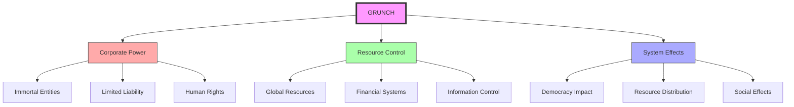
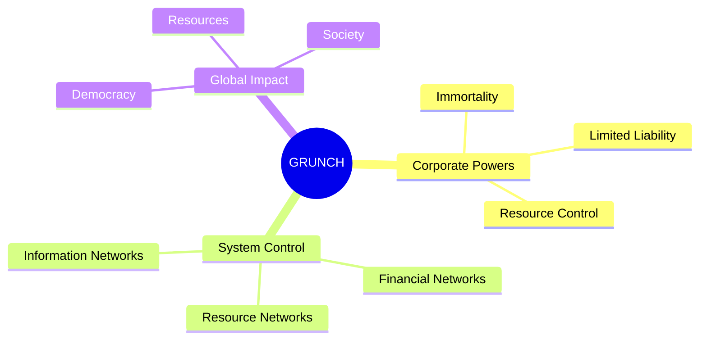
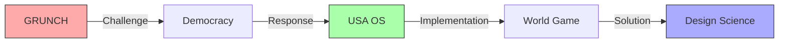
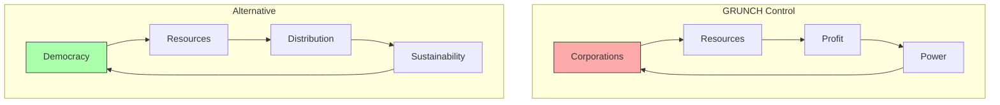
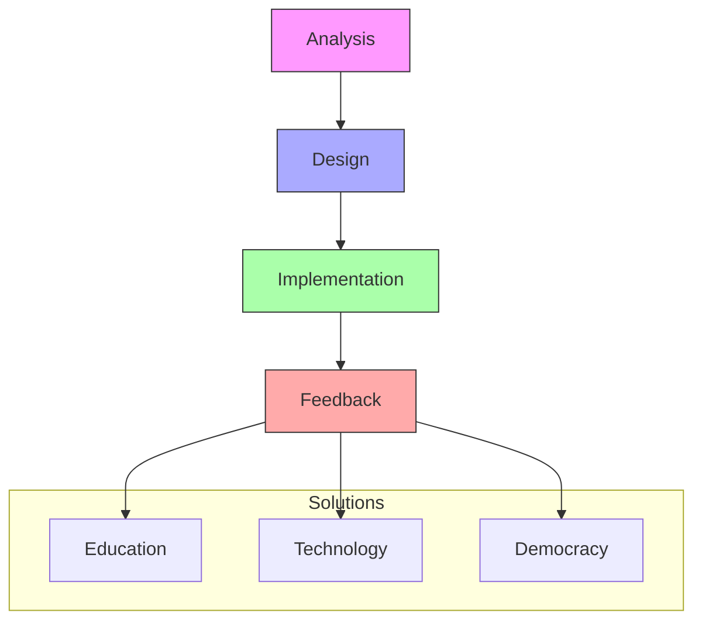
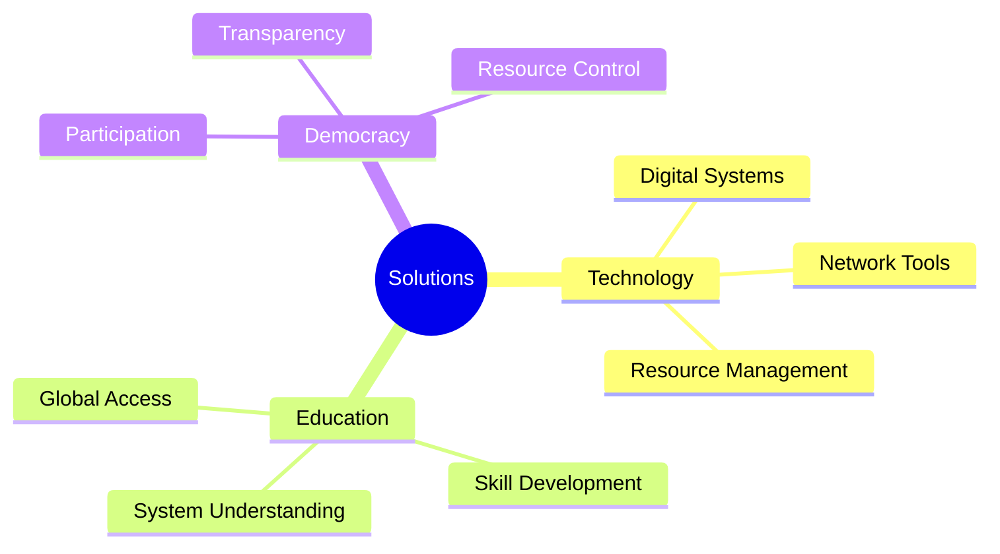

# GRUNCH

GRUNCH (GRoss UNiversal Cash Heist) is [[Buckminster_Fuller|Bucky Fuller]]'s analysis of how corporate entities have come to dominate global resources and economic systems, challenging traditional democratic institutions.

## System Overview

## Core Analysis

### Corporate Structure

### System Dynamics
1. Corporate Characteristics
   - Legal immortality
   - Human rights status
   - Limited liability
   - Resource control

2. System Effects
   - Democratic erosion
   - Resource concentration
   - Power centralization
   - Social impact

## Alternative Systems

### Democratic Responses

### Solution Framework
1. [[concepts/USA_OS|USA Operating System]]
   - Democratic principles
   - Resource management
   - System design
   - Global implementation

2. [[concepts/World_Game|World Game]]
   - Resource simulation
   - Global cooperation
   - Problem-solving
   - Strategic planning

## Resource Management

### Current System

### Transformation Strategy
1. [[concepts/Design_Science|Design Science Approach]]
   - Systematic analysis
   - Solution design
   - Implementation strategy
   - Feedback systems

2. [[concepts/General_Systems_Theory|General Systems Theory]]
   - System understanding
   - Pattern recognition
   - Dynamic modeling
   - Solution frameworks

## Implementation

### Strategic Response

### Action Areas
1. [[concepts/Digital_Democracy|Digital Democracy]]
   - Participation systems
   - Resource management
   - Decision-making
   - Transparency

2. [[concepts/Global_University|Global Education]]
   - Knowledge access
   - Skill development
   - Resource understanding
   - System comprehension

## Future Directions

### Development Areas

### Implementation Path
1. Analysis and Understanding
   - System mapping
   - Power structures
   - Resource flows
   - Impact assessment

2. Solution Development
   - Democratic systems
   - Resource management
   - Education access
   - Technology platforms

## References

### Primary Sources
1. [[books/Grunch_of_Giants|GRUNCH of Giants]] (1983)
2. [[books/Critical_Path|Critical Path]] (1981)
3. [[books/Operating_Manual_for_Spaceship_Earth|Operating Manual for Spaceship Earth]] (1969)
4. [[books/Utopia_or_Oblivion|Utopia or Oblivion]] (1969)
5. [[books/Synergetics|Synergetics: Explorations in the Geometry of Thinking]] (1975)
6. [[books/And_It_Came_to_Pass_Not_to_Stay|And It Came to Pass – Not to Stay]] (1976)

### Historical Context
1. [[concepts/East_India_Company|East India Company]] - Historical Corporate Power
2. [[concepts/Industrial_Revolution|Industrial Revolution]] - System Transformation
3. [[concepts/Bretton_Woods|Bretton Woods System]] - Financial Framework
4. [[concepts/Great_Depression|Great Depression]] - Economic Crisis
5. [[concepts/New_Deal|New Deal]] - Systemic Response
6. [[concepts/Military_Industrial_Complex|Military-Industrial Complex]] - Power Structure
7. [[concepts/Cold_War_Economics|Cold War Economics]] - Global Division
8. [[concepts/Information_Age|Information Age]] - System Evolution

### Contemporary Analysis
1. [[papers/Corporate_Power|Analysis of Corporate Power Structures]]
2. [[papers/Democratic_Solutions|Democratic Response to GRUNCH]]
3. [[papers/Resource_Management|Global Resource Management]]
4. [[papers/Digital_Democracy|Digital Democracy Implementation]]
5. [[papers/Global_Financial_System|Global Financial System Analysis]]
6. [[papers/Corporate_Influence|Corporate Influence on Democracy]]
7. [[papers/Resource_Distribution|Resource Distribution Patterns]]
8. [[papers/System_Transformation|System Transformation Methods]]

### Related Thinkers
1. [[people/Veblen_Thorstein|Thorstein Veblen]] - Institutional Analysis
2. [[people/Galbraith_John_Kenneth|John Kenneth Galbraith]] - Corporate Power
3. [[people/Chomsky_Noam|Noam Chomsky]] - System Critique
4. [[people/Klein_Naomi|Naomi Klein]] - Corporate Analysis
5. [[people/Stiglitz_Joseph|Joseph Stiglitz]] - Economic Systems
6. [[people/Harvey_David|David Harvey]] - Capital Analysis
7. [[people/Piketty_Thomas|Thomas Piketty]] - Capital Structure
8. [[people/Zuboff_Shoshana|Shoshana Zuboff]] - Surveillance Capitalism

### System Concepts
1. [[concepts/Design_Science|Design Science]] - Solution Framework
2. [[concepts/World_Game|World Game]] - Resource Management
3. [[concepts/USA_OS|USA Operating System]] - Democratic Framework
4. [[concepts/General_Systems_Theory|General Systems Theory]] - System Analysis
5. [[concepts/Cybernetics|Cybernetics]] - Control Systems
6. [[concepts/Network_Theory|Network Theory]] - Connection Analysis
7. [[concepts/Complex_Systems|Complex Systems]] - System Dynamics
8. [[concepts/Emergence|Emergence]] - System Behavior

### Modern Implementations
1. [[concepts/Digital_Democracy|Digital Democracy]] - Modern Tools
2. [[concepts/Blockchain|Blockchain Technology]] - System Trust
3. [[concepts/Distributed_Systems|Distributed Systems]] - Power Distribution
4. [[concepts/Open_Source|Open Source]] - Knowledge Access
5. [[concepts/Platform_Cooperativism|Platform Cooperativism]] - Alternative Models
6. [[concepts/Commons_Based_Peer_Production|Commons-Based Peer Production]]
7. [[concepts/Decentralized_Autonomous_Organizations|DAOs]] - New Structures
8. [[concepts/Social_Innovation|Social Innovation]] - System Change

### Economic Systems
1. [[concepts/Circular_Economy|Circular Economy]] - Resource Cycles
2. [[concepts/Sharing_Economy|Sharing Economy]] - Resource Access
3. [[concepts/Token_Economics|Token Economics]] - Value Systems
4. [[concepts/Regenerative_Economics|Regenerative Economics]] - System Health
5. [[concepts/Doughnut_Economics|Doughnut Economics]] - Balance Model
6. [[concepts/Steady_State_Economics|Steady State Economics]] - Sustainability
7. [[concepts/Post_Scarcity_Economy|Post-Scarcity Economy]] - Future Vision
8. [[concepts/Resource_Based_Economy|Resource-Based Economy]] - Alternative System

### Power Structures
1. [[concepts/Corporate_Personhood|Corporate Personhood]] - Legal Framework
2. [[concepts/Regulatory_Capture|Regulatory Capture]] - System Control
3. [[concepts/Lobbying_Systems|Lobbying Systems]] - Influence Networks
4. [[concepts/Financial_Networks|Financial Networks]] - Control Systems
5. [[concepts/Media_Ownership|Media Ownership]] - Information Control
6. [[concepts/Data_Monopolies|Data Monopolies]] - Modern Power
7. [[concepts/Platform_Capitalism|Platform Capitalism]] - Digital Control
8. [[concepts/Surveillance_Economics|Surveillance Economics]] - Information Power

### Solution Frameworks
1. [[concepts/Comprehensive_Anticipatory_Design_Science|CADS]] - Design Method
2. [[concepts/System_Innovation|System Innovation]] - Change Process
3. [[concepts/Pattern_Language|Pattern Language]] - System Design
4. [[concepts/Regenerative_Design|Regenerative Design]] - System Health
5. [[concepts/Social_Architecture|Social Architecture]] - Society Design
6. [[concepts/Knowledge_Commons|Knowledge Commons]] - Information Access
7. [[concepts/Democratic_Technology|Democratic Technology]] - Tool Design
8. [[concepts/Participatory_Systems|Participatory Systems]] - Engagement

### Future Directions
1. [[concepts/Post_Corporate_World|Post-Corporate World]] - Future Vision
2. [[concepts/Global_Brain|Global Brain]] - System Evolution
3. [[concepts/Collective_Intelligence|Collective Intelligence]] - Group Mind
4. [[concepts/System_Transformation|System Transformation]] - Change Process
5. [[concepts/Resource_Democracy|Resource Democracy]] - Access Rights
6. [[concepts/Knowledge_Democracy|Knowledge Democracy]] - Information Rights
7. [[concepts/Digital_Commons|Digital Commons]] - Shared Resources
8. [[concepts/Global_Citizenship|Global Citizenship]] - Human Unity

### Implementation Tools
1. [[tools/World_Game_Platform|World Game Platform]] - Simulation
2. [[tools/Resource_Mapping|Resource Mapping]] - Understanding
3. [[tools/System_Modeling|System Modeling]] - Analysis
4. [[tools/Network_Visualization|Network Visualization]] - Insight
5. [[tools/Decision_Support|Decision Support]] - Choice
6. [[tools/Collaboration_Platforms|Collaboration Platforms]] - Action
7. [[tools/Knowledge_Management|Knowledge Management]] - Learning
8. [[tools/Impact_Assessment|Impact Assessment]] - Evaluation

## Notes
- Fundamental analysis of corporate power
- Critical for understanding global systems
- Key to developing solutions
- Basis for democratic alternatives

## Tags
#economics #systems-thinking #power-structures #corporations #global-systems 