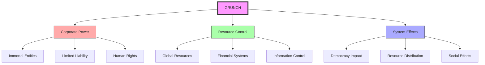
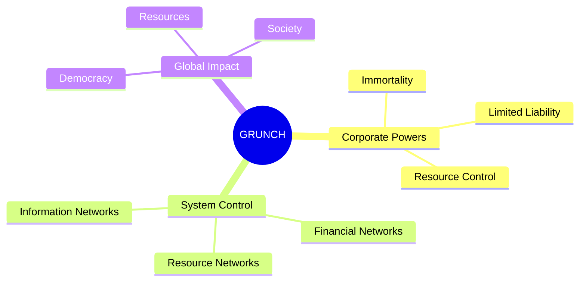
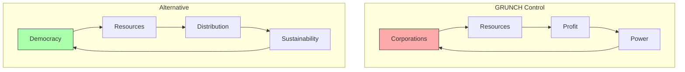
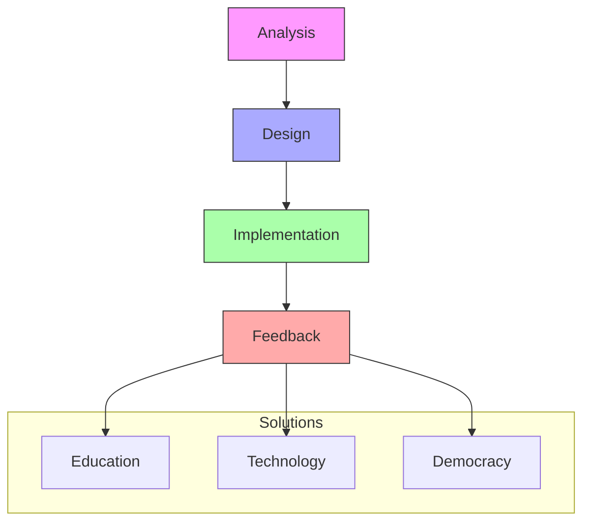
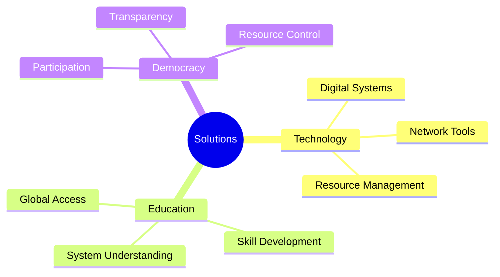

# GRUNCH

GRUNCH (GRoss UNiversal Cash Heist) is [[people/Fuller_Buckminster|R. Buckminster Fuller]]'s analysis of how corporate entities have come to dominate global resources and economic systems, challenging traditional democratic institutions.

## System Overview

## Core Analysis

### Corporate Structure

### System Dynamics
1. Corporate Characteristics
   - Legal immortality
   - Human rights status
   - Limited liability
   - Resource control

2. System Effects
   - Democratic erosion
   - Resource concentration
   - Power centralization
   - Social impact

## Alternative Systems

### Democratic Responses

### Solution Framework
1. [[concepts/USA_OS|USA Operating System]]
   - Democratic principles
   - Resource management
   - System design
   - Global implementation

2. [[concepts/World_Game|World Game]]
   - Resource simulation
   - Global cooperation
   - Problem-solving
   - Strategic planning

## Resource Management

### Current System

### Transformation Strategy
1. [[concepts/Design_Science|Design Science Approach]]
   - Systematic analysis
   - Solution design
   - Implementation strategy
   - Feedback systems

2. [[concepts/General_Systems_Theory|General Systems Theory]]
   - System understanding
   - Pattern recognition
   - Dynamic modeling
   - Solution frameworks

## Implementation

### Strategic Response

### Action Areas
1. [[concepts/Digital_Democracy|Digital Democracy]]
   - Participation systems
   - Resource management
   - Decision-making
   - Transparency

2. [[concepts/Global_University|Global Education]]
   - Knowledge access
   - Skill development
   - Resource understanding
   - System comprehension

## Future Directions

### Development Areas

### Implementation Path
1. Analysis and Understanding
   - System mapping
   - Power structures
   - Resource flows
   - Impact assessment

2. Solution Development
   - Democratic systems
   - Resource management
   - Education access
   - Technology platforms

## References

### Primary Sources
1. [[books/Grunch_of_Giants|GRUNCH of Giants]]
2. [[books/Critical_Path|Critical Path]]
3. [[books/Operating_Manual_for_Spaceship_Earth|Operating Manual for Spaceship Earth]]

### Related Resources
1. [[papers/Corporate_Power|Analysis of Corporate Power Structures]]
2. [[papers/Democratic_Solutions|Democratic Response to GRUNCH]]
3. [[papers/Resource_Management|Global Resource Management]]

## Notes
- Fundamental analysis of corporate power
- Critical for understanding global systems
- Key to developing solutions
- Basis for democratic alternatives

## Tags
#economics #systems-thinking #power-structures #corporations #global-systems 