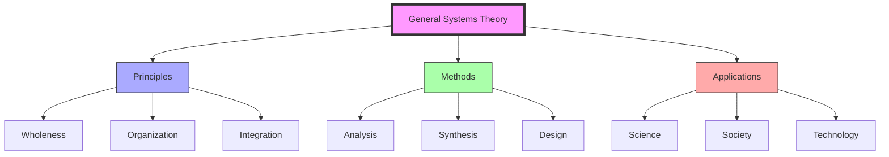
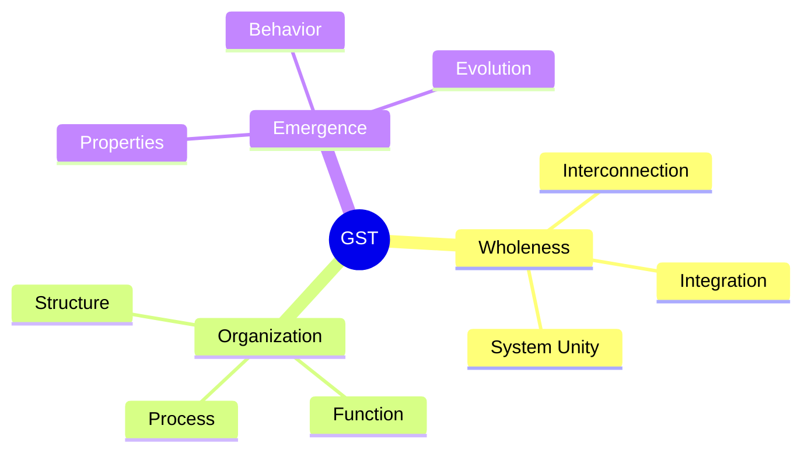
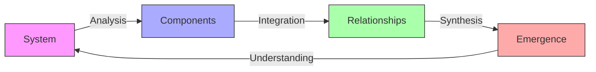
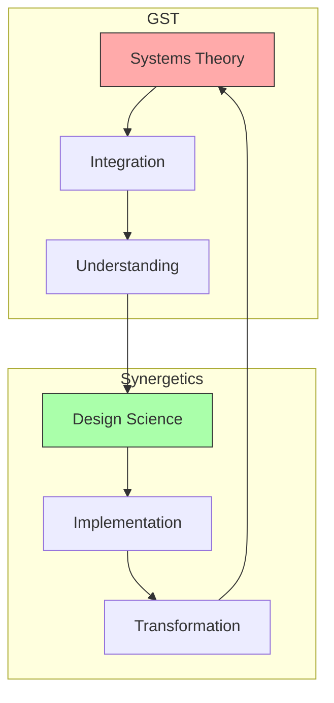
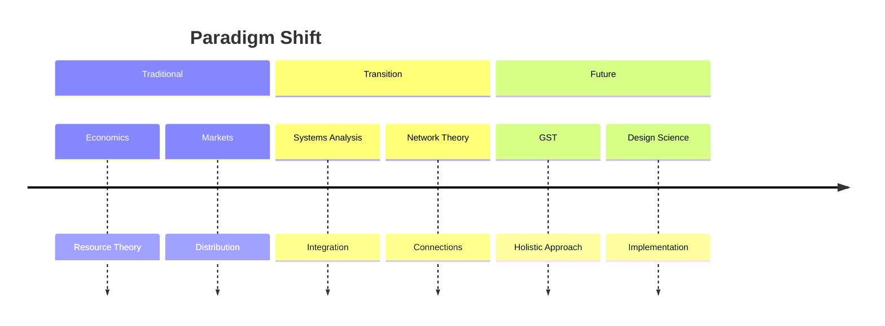
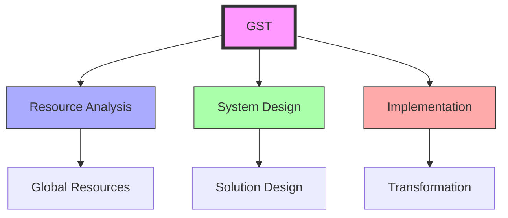
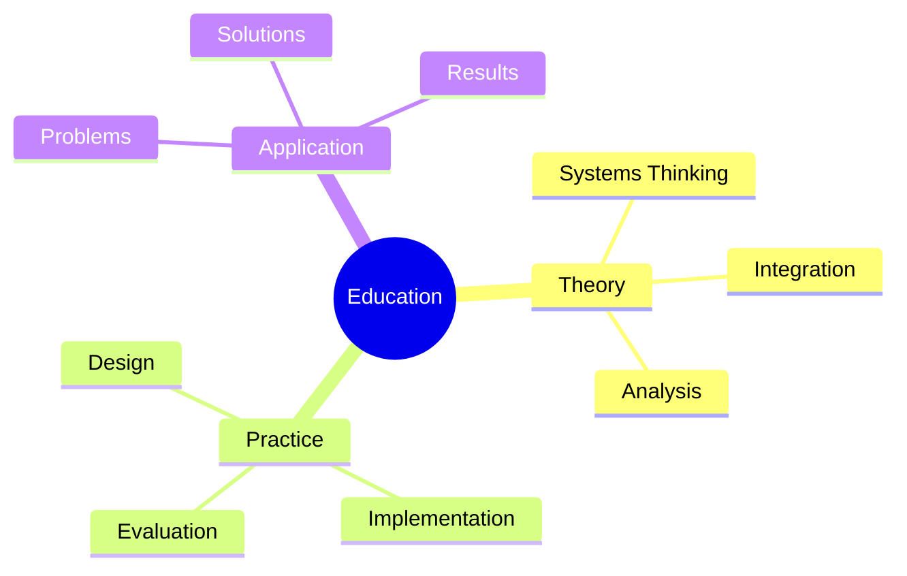
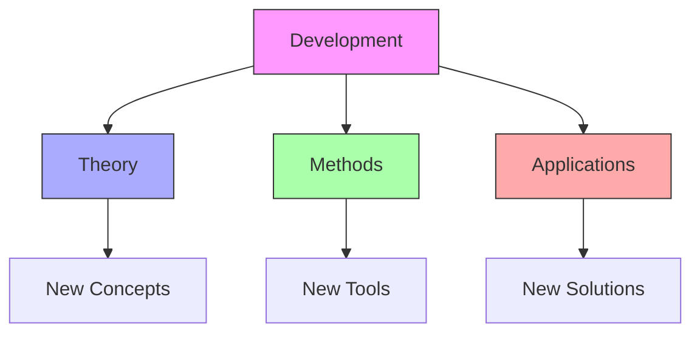

# General Systems Theory

General Systems Theory (GST) represents a comprehensive framework for understanding complex systems across disciplines, integrated with [[concepts/Synergetics|Fuller's synergetic approach]] to provide a holistic methodology for analyzing and designing solutions to global challenges.

## System Overview

## Core Principles

### Foundational Concepts

### System Properties
1. [[concepts/System_Wholeness|Wholeness]]
   - System integrity
   - Interconnectedness
   - Holistic behavior

2. [[concepts/System_Organization|Organization]]
   - Structural patterns
   - Functional relationships
   - Process dynamics

## Methodological Framework

### Analysis Methods

### Application Areas
1. [[concepts/Scientific_Systems|Scientific Applications]]
   - Complex systems
   - Natural phenomena
   - Research methods

2. [[concepts/Social_Systems|Social Applications]]
   - Organizational design
   - Social structures
   - Cultural systems

## Integration with Fuller's Work

### Synergetic Alignment

### Implementation Framework
1. [[concepts/Design_Science|Design Science Integration]]
   - System analysis
   - Solution design
   - Implementation
   - Feedback

2. [[concepts/World_Game|World Game Application]]
   - Global simulation
   - Resource management
   - Problem-solving
   - Strategic planning

## Economic Transformation

### From Economics to GST

### New Framework

## Educational Applications

### Learning Framework
1. [[concepts/Global_University|Global University]]
   - Systems thinking
   - Interdisciplinary approach
   - Practical application
   - Solution development

2. [[concepts/Design_Science_Education|Design Science Education]]
   - System analysis
   - Design methodology
   - Implementation skills
   - Feedback processes

### Educational Structure

## Future Development

### Innovation Areas

### Implementation Strategy
1. [[concepts/System_Innovation|System Innovation]]
   - Theory development
   - Method creation
   - Tool design
   - Solution implementation

2. [[concepts/Global_Solutions|Global Solutions]]
   - Problem analysis
   - Solution design
   - Implementation
   - Feedback integration

## References

### Primary Sources
1. [[books/General_System_Theory|General System Theory: Foundations, Development, Applications]]
2. [[papers/GST_Contribution|A Contribution to General Systems Theory]]
3. [[books/Systems_Science|Systems Science and Cybernetics]]

### Related Resources
1. [[papers/Systems_Thinking|Systems Thinking in Practice]]
2. [[papers/GST_Applications|Applications of General Systems Theory]]
3. [[papers/Future_Systems|Future of Systems Science]]

## Notes
- Fundamental shift in understanding complex systems
- Integration with Fuller's design science approach
- Key to solving global challenges
- Foundation for educational transformation

## Tags
#systems-thinking #methodology #science #interdisciplinary #theory 