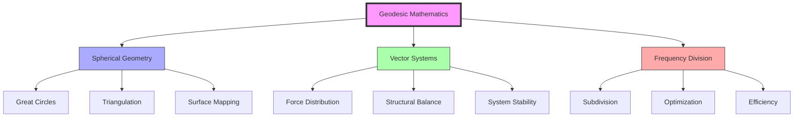
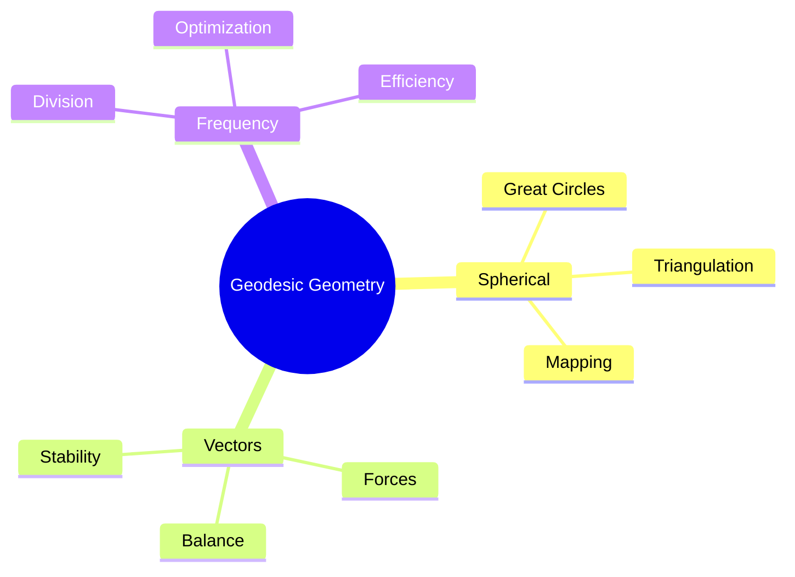
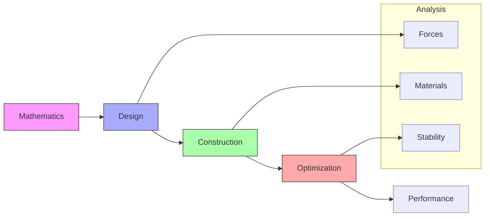
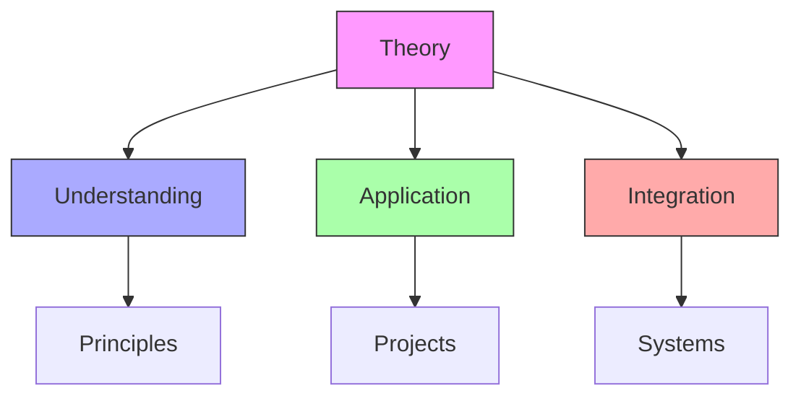
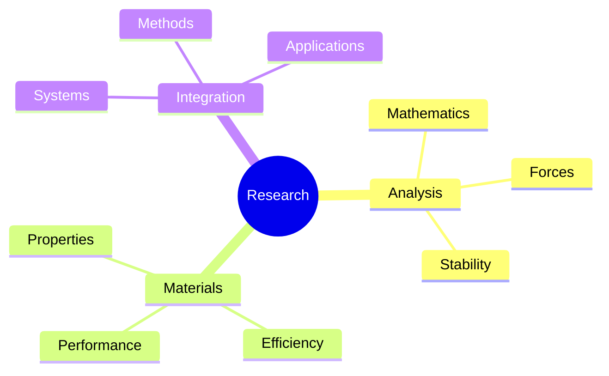
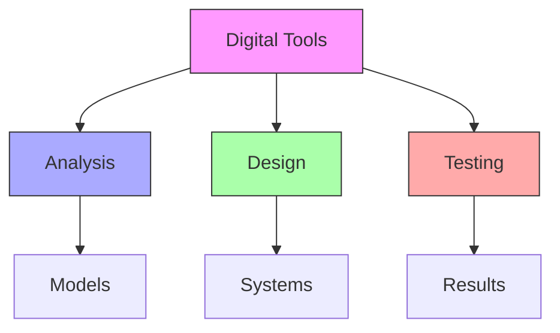
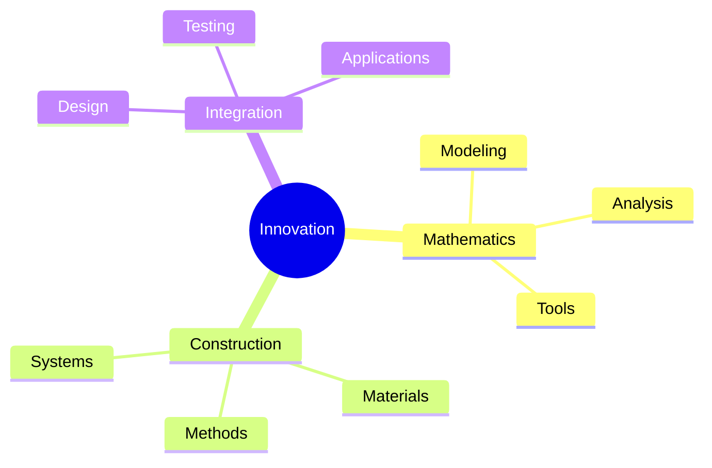

# Geodesic Mathematics

Geodesic Mathematics represents the mathematical foundation of [[concepts/Geodesic_Dome|geodesic structures]] and spherical systems, developed through [[people/Fuller_Buckminster|Fuller]]'s work in [[concepts/Synergetics|Synergetics]] and structural design.

## Mathematical Foundation

### Core Principles

### Mathematical Components
1. [[concepts/Spherical_Geometry|Spherical Systems]]
   - Great circle paths
   - Triangular subdivision
   - Surface mapping
   - Geodesic lines

2. [[concepts/Vector_Mathematics|Vector Analysis]]
   - Force distribution
   - Structural balance
   - System stability
   - Optimization methods

## Geometric Framework

### Structural Principles

### System Integration
1. [[concepts/Great_Circles|Great Circle Systems]]
   - Path optimization
   - Surface coverage
   - Structural efficiency
   - System integration

2. [[concepts/Frequency_Division|Frequency Analysis]]
   - Subdivision methods
   - Optimization techniques
   - Efficiency metrics
   - System balance

## Structural Applications

### Design Implementation
1. [[concepts/Geodesic_Dome|Dome Construction]]
   - Structural analysis
   - Force distribution
   - Material efficiency
   - System stability

2. [[concepts/Structural_Design|Design Methods]]
   - Mathematical modeling
   - Optimization techniques
   - Construction principles
   - System integration

### Construction Framework

## Educational Integration

### Teaching Methods
1. [[concepts/Martian_Math|Alternative Mathematics]]
   - Tetrahedral thinking
   - Spatial understanding
   - System relationships
   - Practical applications

2. [[concepts/Design_Science_Education|Educational Framework]]
   - Mathematical principles
   - Design integration
   - Construction methods
   - System analysis

### Learning Framework

## Research Applications

### Study Areas
1. [[concepts/Structural_Research|Structural Analysis]]
   - Mathematical modeling
   - Force distribution
   - System stability
   - Optimization methods

2. [[concepts/Material_Science|Material Integration]]
   - Material properties
   - Structural efficiency
   - System performance
   - Construction methods

### Research Framework

## Digital Implementation

### Computational Methods
1. [[concepts/Digital_Tools|Analysis Tools]]
   - Mathematical modeling
   - Force analysis
   - System simulation
   - Performance testing

2. [[concepts/Design_Software|Design Systems]]
   - CAD integration
   - Optimization tools
   - Construction planning
   - System analysis

### Digital Framework

## Future Development

### Innovation Areas
1. [[concepts/Mathematical_Innovation|Mathematical Evolution]]
   - Advanced modeling
   - System optimization
   - Integration methods
   - Analysis tools

2. [[concepts/Construction_Innovation|Construction Development]]
   - Material science
   - Building methods
   - System efficiency
   - Performance optimization

### Development Framework

## References

### Primary Sources
1. [[books/Synergetics_Book|Synergetics: Explorations in the Geometry of Thinking]]
2. [[books/Geodesic_Math|Geodesic Math and How to Use It]]
3. [[books/Dome_Builder|The Dome Builder's Handbook]]

### Related Resources
1. [[papers/Geodesic_Mathematics|Geodesic Mathematics and Applications]]
2. [[papers/Structural_Analysis|Structural Analysis of Geodesic Systems]]
3. [[papers/Construction_Methods|Geodesic Construction Methods]]

### Technical Documentation
1. [[docs/Mathematical_Models|Mathematical Modeling Guide]]
2. [[docs/Construction_Guide|Construction Implementation Guide]]
3. [[docs/Analysis_Methods|Structural Analysis Methods]]

## Notes
- Foundation of geodesic structure design
- Integration of mathematics and construction
- Focus on practical applications
- Continuous development of methods
- Digital tool integration
- Research expansion

## Tags
#mathematics #geometry #synergetics #structural-design #geodesic-systems 