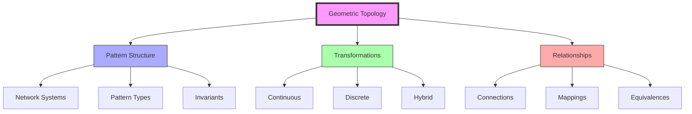
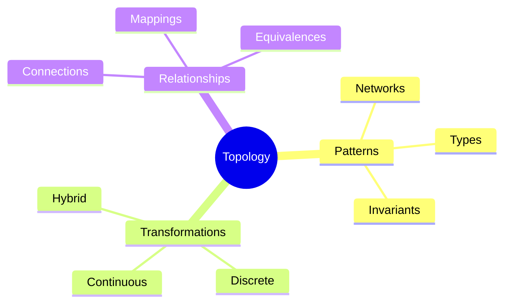
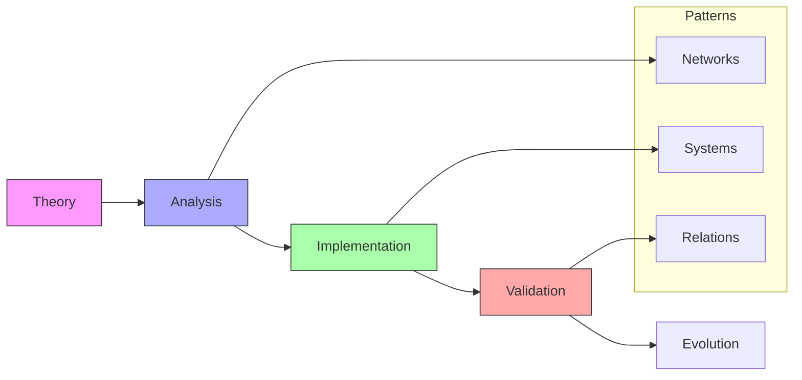
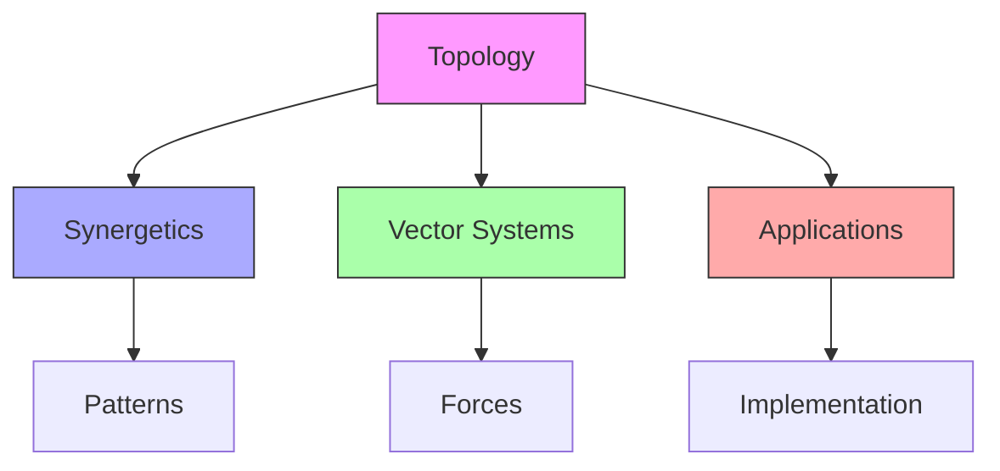
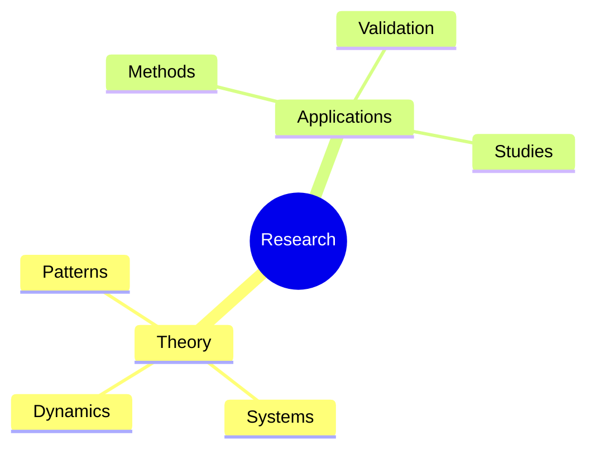
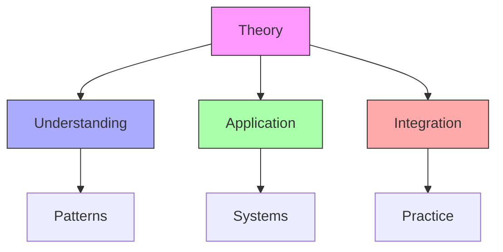
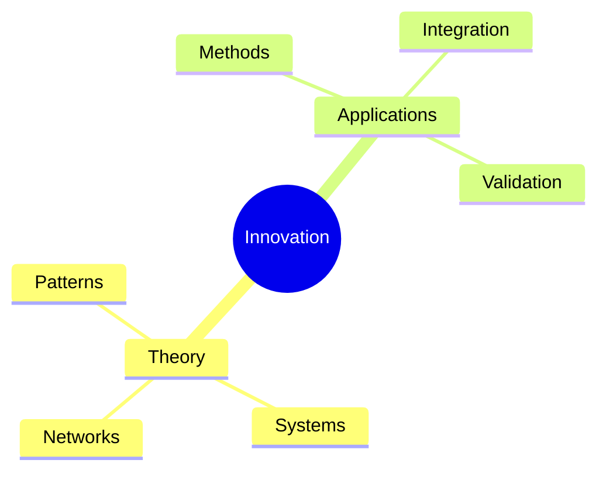

# Geometric Topology

Geometric Topology represents the mathematical study of patterns and relationships that remain invariant under continuous transformation, connecting [[concepts/Martian_Math|Martian Math]]'s tetrahedral approach with [[concepts/Synergetics|Fuller's synergetic principles]].

## Theoretical Foundation

### Core Framework

### Mathematical Components
1. [[concepts/Pattern_Systems|Pattern Structure]]
   - Network organization
   - Pattern classification
   - Invariant properties
   - System relationships

2. [[concepts/Transformation_Theory|Transformation Types]]
   - Continuous mappings
   - Discrete changes
   - Hybrid systems
   - Pattern preservation

## Pattern Integration

### System Framework

### Key Relationships
1. [[concepts/Network_Topology|Network Systems]]
   - Pattern structures
   - Connection types
   - System mappings
   - Transformation rules

2. [[concepts/Pattern_Transformation|Pattern Evolution]]
   - Change processes
   - Invariant properties
   - System dynamics
   - Relationship preservation

## Mathematical Applications

### Implementation Areas
1. [[concepts/Topological_Analysis|Pattern Analysis]]
   - Network studies
   - Transformation mapping
   - Invariant identification
   - System classification

2. [[concepts/Pattern_Applications|Pattern Implementation]]
   - System design
   - Network organization
   - Transformation planning
   - Relationship management

### Application Framework

## Integration with Fuller's Work

### Connection Points
1. [[concepts/Synergetics|Synergetic Systems]]
   - Pattern principles
   - Transformation rules
   - System relationships
   - Network dynamics

2. [[concepts/Vector_Equilibrium|Vector Systems]]
   - Geometric patterns
   - Force relationships
   - System balance
   - Dynamic transformations

### Integration Framework

## Research Applications

### Study Areas
1. [[concepts/Topological_Research|Theoretical Research]]
   - Pattern theory
   - Transformation studies
   - System dynamics
   - Network analysis

2. [[concepts/Pattern_Research|Applied Research]]
   - Implementation methods
   - System validation
   - Pattern verification
   - Relationship studies

### Research Framework

## Educational Integration

### Teaching Methods
1. [[concepts/Topology_Education|Educational Approach]]
   - Pattern understanding
   - System analysis
   - Transformation studies
   - Application methods

2. [[concepts/Pattern_Education|Pattern Learning]]
   - Network analysis
   - System dynamics
   - Relationship studies
   - Implementation practice

### Learning Framework

## Future Development

### Innovation Areas
1. [[concepts/Topology_Innovation|Theoretical Evolution]]
   - Pattern discovery
   - System development
   - Relationship mapping
   - Network evolution

2. [[concepts/Pattern_Innovation|Pattern Development]]
   - Application methods
   - System integration
   - Validation techniques
   - Implementation strategies

### Development Framework

## References

### Primary Sources
1. [[books/Geometric_Topology|Geometric Topology: Patterns and Transformations]]
2. [[books/Synergetics_Book|Synergetics: Explorations in the Geometry of Thinking]]
3. [[books/Pattern_Mathematics|Pattern Mathematics and Topology]]

### Related Resources
1. [[papers/Topological_Patterns|Topological Pattern Analysis]]
2. [[papers/System_Transformations|System Transformation Studies]]
3. [[papers/Pattern_Implementation|Pattern Implementation Methods]]

### Technical Documentation
1. [[docs/Pattern_Analysis|Pattern Analysis Guide]]
2. [[docs/Transformation_Methods|Transformation Methods Guide]]
3. [[docs/System_Implementation|System Implementation Guide]]

## Notes
- Connection between patterns and transformations
- Integration with Fuller's principles
- Focus on system relationships
- Pattern preservation through change
- Continuous development potential
- Research opportunities

## Tags
#mathematics #topology #geometry #patterns #networks 