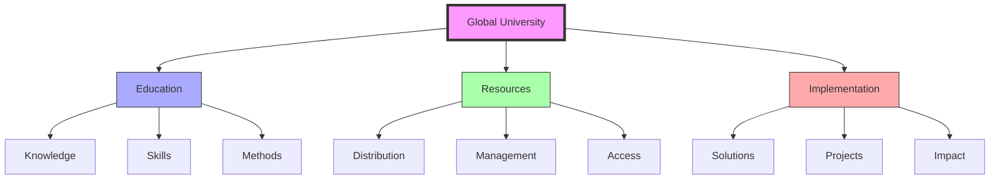
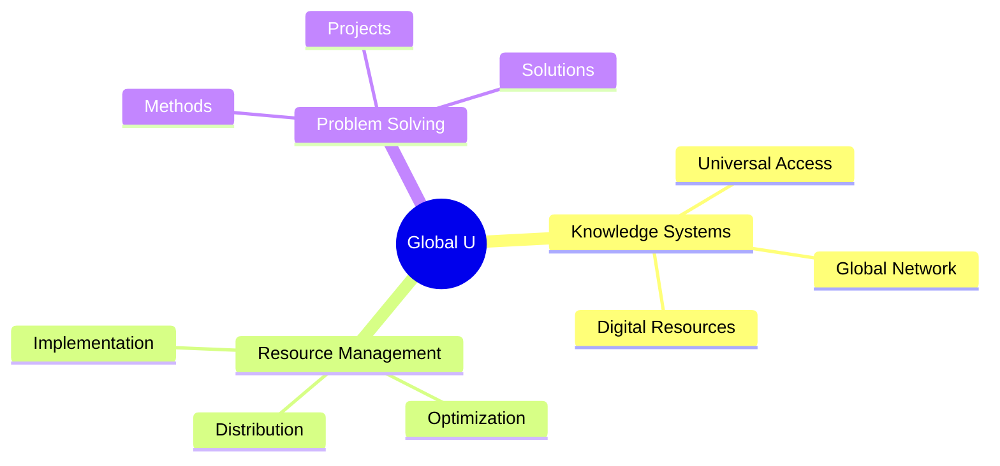
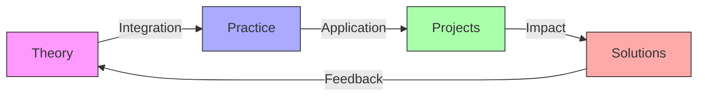
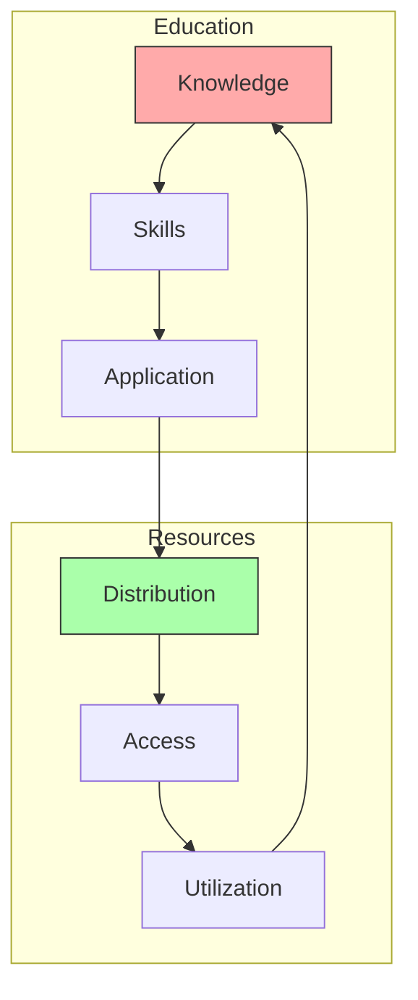
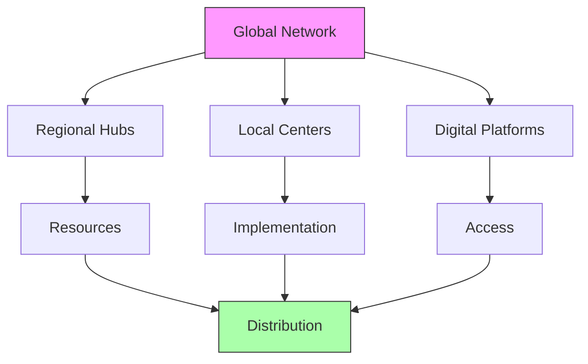
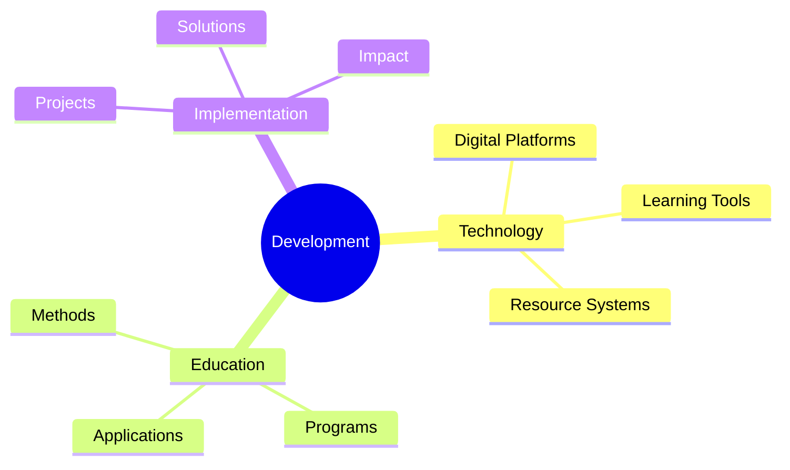

# Global University

The Global University represents [[people/Fuller_Buckminster|R. Buckminster Fuller]]'s vision of a worldwide educational system that integrates resource management, knowledge distribution, and practical problem-solving.

## System Overview

## Core Components

### Educational Framework

### Key Elements
1. [[concepts/Knowledge_Distribution|Knowledge Systems]]
   - Universal access
   - Digital resources
   - Global network
   - Learning tools

2. [[concepts/Resource_Education|Resource Management]]
   - Distribution systems
   - Optimization methods
   - Implementation strategies
   - Access protocols

## Educational Structure

### Learning Framework

### Program Areas
1. [[concepts/Design_Science_Education|Design Science]]
   - Systems thinking
   - Problem-solving
   - Resource management
   - Implementation

2. [[concepts/Global_Systems|Systems Education]]
   - Network dynamics
   - Resource flows
   - System integration
   - Impact assessment

## Resource Integration

### Management System

### Implementation Framework
1. [[concepts/Resource_Distribution|Distribution Systems]]
   - Global network
   - Access points
   - Resource flows
   - Management tools

2. [[concepts/Knowledge_Access|Access Systems]]
   - Digital platforms
   - Learning tools
   - Resource libraries
   - Implementation guides

## Global Network

### Network Structure

### Implementation Strategy
1. [[concepts/Network_Development|Network Development]]
   - Infrastructure
   - Connectivity
   - Access points
   - Resource flows

2. [[concepts/Global_Implementation|Implementation Systems]]
   - Project development
   - Resource allocation
   - Impact assessment
   - Feedback integration

## Future Development

### Innovation Areas

### Development Path
1. [[concepts/Educational_Innovation|Educational Innovation]]
   - Learning systems
   - Teaching methods
   - Resource integration
   - Impact assessment

2. [[concepts/Global_Solutions|Solution Development]]
   - Problem analysis
   - Design process
   - Implementation
   - Feedback systems

## References

### Primary Sources
1. [[Education_Automation|Education Automation]]
2. [[books/World_Game_Series|World Game Series]]
3. [[books/Operating_Manual_for_Spaceship_Earth|Operating Manual for Spaceship Earth]]

### Related Resources
1. [[papers/Global_Education|Global Education Systems]]
2. [[papers/Resource_Distribution|Resource Distribution Networks]]
3. [[papers/Knowledge_Systems|Knowledge System Design]]

## Notes
- Revolutionary approach to global education
- Integration of resources and knowledge
- Focus on practical problem-solving
- Platform for global collaboration

## Tags
#education #global-systems #resource-management #knowledge-distribution 