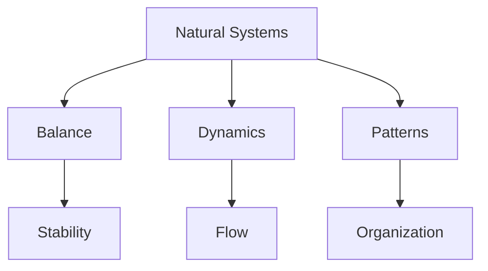
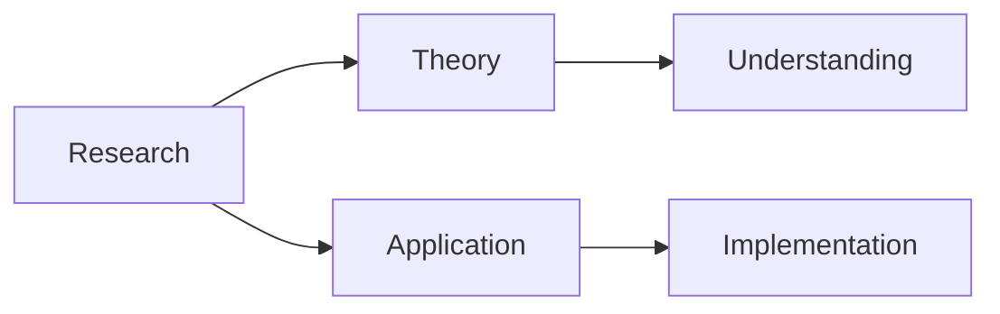
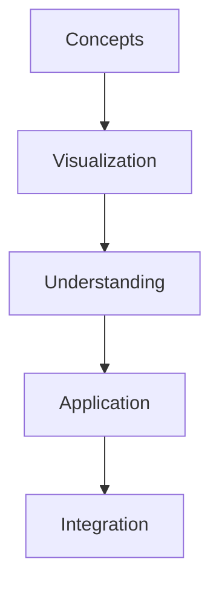
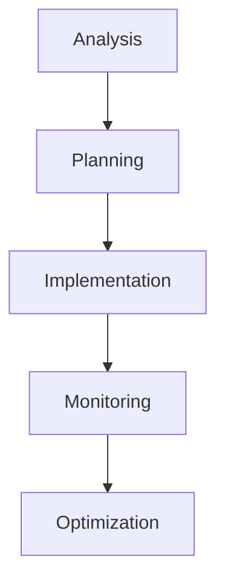

# Goldilocks Conjecture

The Goldilocks Conjecture is R. Buckminster Fuller's philosophical and mathematical principle suggesting that optimal conditions in natural and designed systems exist within specific balanced ranges, neither too much nor too little.

## Overview

### Definition
```yaml
goldilocks_conjecture:
  creator: R. Buckminster Fuller
  principle: Optimal balance in systems
  context: Tetrascroll development
  applications:
    - System design
    - Natural systems
    - Resource allocation
    - Balance optimization
  significance:
    - Design optimization
    - System efficiency
    - Natural balance
    - Resource management
```

### Core Principles
1. Balance Properties
   - Optimal conditions
   - System equilibrium
   - Resource efficiency
   - Dynamic stability

2. System Characteristics
   - Natural harmony
   - Balanced states
   - Efficient operation
   - Sustainable function

## Theoretical Framework

### Conceptual Structure
```mermaid
mindmap
    root((Goldilocks))
        Balance
            [[Optimal State]]
            [[Equilibrium]]
            [[Harmony]]
        Systems
            [[Natural Order]]
            [[Design Principles]]
            [[Resource Flow]]
        Application
            [[System Design]]
            [[Optimization]]
            [[Efficiency]]
```

### Philosophical Basis
1. System Theory
   - Balance principles
   - Optimal states
   - Natural harmony
   - System dynamics

2. Design Philosophy
   - Resource efficiency
   - Functional balance
   - System optimization
   - Sustainable design

## Natural Applications

### Physical Systems
1. Natural Balance
   - [[Ecosystem Balance]]
   - [[Resource Cycles]]
   - [[Energy Flow]]
   - [[System Stability]]

2. System Dynamics
   - [[Natural Patterns]]
   - [[Growth Systems]]
   - [[Balance Points]]
   - [[Stability States]]

### Natural Framework


## Design Applications

### Implementation Areas
1. System Design
   - [[Resource Allocation]]
   - [[System Balance]]
   - [[Efficiency Planning]]
   - [[Optimization Methods]]

2. Design Principles
   - [[Balance Points]]
   - [[Resource Flow]]
   - [[System Harmony]]
   - [[Sustainable Design]]

### Design Framework
```mermaid
mindmap
    root((Design))
        Balance
            [[Resources]]
            [[Systems]]
            [[Flow]]
        Optimization
            [[Efficiency]]
            [[Harmony]]
            [[Sustainability]]
```

## Research Value

### Study Areas
1. Theoretical Research
   - Balance principles
   - System dynamics
   - Optimization theory
   - Pattern analysis

2. Applied Research
   - Design applications
   - System implementation
   - Resource management
   - Efficiency studies

### Research Framework


## Educational Applications

### Teaching Methods
1. Conceptual Models
   - Balance demonstrations
   - System models
   - Pattern displays
   - Teaching tools

2. Digital Resources
   - Simulation software
   - Analysis tools
   - Interactive programs
   - Learning platforms

### Learning Framework


## Modern Applications

### Contemporary Use
1. System Design
   - [[Resource Systems]]
   - [[Balance Planning]]
   - [[Efficiency Design]]
   - [[Optimization Tools]]

2. Implementation Areas
   - [[Sustainable Systems]]
   - [[Resource Management]]
   - [[Balance Control]]
   - [[System Harmony]]

### Innovation Areas
```mermaid
mindmap
    root((Innovation))
        Systems
            [[Design]]
            [[Balance]]
            [[Efficiency]]
        Development
            [[Resources]]
            [[Management]]
            [[Optimization]]
```

## Practical Implementation

### Application Methods
1. System Analysis
   - Balance assessment
   - Resource evaluation
   - Efficiency metrics
   - Optimization studies

2. Implementation Process
   - Design planning
   - Resource allocation
   - System balance
   - Performance monitoring

### Implementation Framework


## System Optimization

### Balance Methods
1. Resource Management
   - Allocation planning
   - Flow control
   - Balance maintenance
   - Efficiency optimization

2. System Control
   - Balance monitoring
   - Adjustment methods
   - Performance tracking
   - Optimization tools

### Optimization Framework


## Resources

### Documentation
- [[Technical Papers]]
- [[Research Studies]]
- [[Design Guides]]
- [[Application Notes]]

### Learning Materials
1. Educational Resources
   - [[Teaching Guides]]
   - [[Model Sets]]
   - [[Visual Aids]]
   - [[Practice Materials]]

2. Technical Resources
   - [[Analysis Tools]]
   - [[Design Software]]
   - [[Balance Systems]]
   - [[Optimization Methods]]

## References
1. Fuller's Tetrascroll
2. System studies
3. Design science
4. Application papers
5. Research documents

## Notes
- Key design principle
- Universal application
- Natural system basis
- Continuing relevance

## Tags
#concept #philosophy #systems-thinking #optimization #balance 