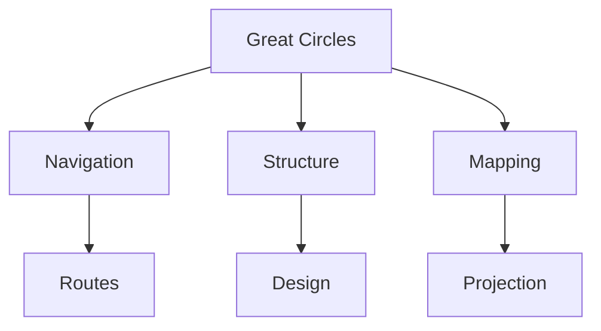
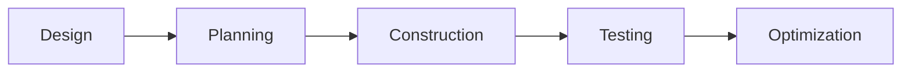
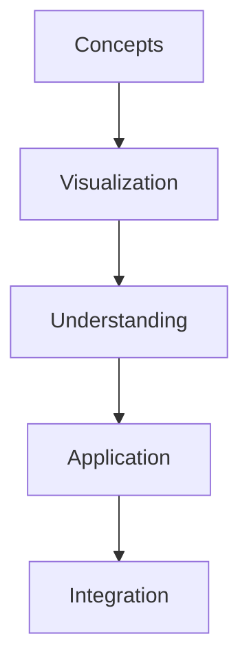
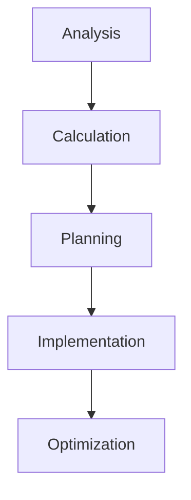

# Great Circles

Great Circles are the largest possible circles that can be drawn on a sphere's surface, representing the shortest distance between any two points on that surface. They are fundamental to R. Buckminster Fuller's geodesic mathematics and navigation systems.

## Overview

### Definition
```yaml
great_circles:
  definition: Maximum circles on sphere surface
  properties:
    - Shortest surface distance
    - Plane through sphere center
    - Equal hemisphere division
    - Constant curvature
  applications:
    - Navigation
    - Geodesic structures
    - Cartography
    - Spherical geometry
  significance:
    - Efficient paths
    - Structural design
    - Global planning
    - System organization
```

### Core Principles
1. Geometric Properties
   - Maximum circumference
   - Center through sphere
   - Equal division
   - Constant curvature

2. System Characteristics
   - Shortest paths
   - Structural efficiency
   - Navigation routes
   - Pattern formation

## Mathematical Framework

### Geometric Principles
```mermaid
mindmap
    root((Great Circles))
        Properties
            [[Maximum Size]]
            [[Center Plane]]
            [[Equal Division]]
        Applications
            [[Navigation]]
            [[Structure]]
            [[Mapping]]
        Mathematics
            [[Spherical Geometry]]
            [[Distance Calculation]]
            [[Path Planning]]
```

### Mathematical Properties
1. Spherical Geometry
   - Circle properties
   - Surface paths
   - Angular relationships
   - Distance calculations

2. System Analysis
   - Path optimization
   - Route planning
   - Structural design
   - Pattern formation

## Applications

### Implementation Areas
1. Navigation Systems
   - [[Maritime Navigation]]
   - [[Aviation Routes]]
   - [[Global Planning]]
   - [[Path Optimization]]

2. Structural Design
   - [[Geodesic Structures]]
   - [[Dome Design]]
   - [[Space Frames]]
   - [[Efficient Construction]]

### Application Framework


## Navigation Systems

### Route Planning
1. Maritime Navigation
   - Ocean routes
   - Distance calculation
   - Course plotting
   - Path optimization

2. Aviation Planning
   - Flight paths
   - Fuel efficiency
   - Route optimization
   - Distance minimization

### Navigation Framework
```mermaid
mindmap
    root((Navigation))
        Planning
            [[Route Design]]
            [[Path Optimization]]
            [[Distance Calculation]]
        Implementation
            [[Course Setting]]
            [[Path Following]]
            [[Route Adjustment]]
```

## Structural Applications

### Design Principles
1. Geodesic Structures
   - Dome design
   - Space frames
   - Structural efficiency
   - Load distribution

2. Construction Methods
   - Component layout
   - Assembly planning
   - Stability analysis
   - Performance optimization

### Design Framework


## Cartographic Use

### Mapping Applications
1. Global Projection
   - [[Dymaxion Map]]
   - [[Navigation Charts]]
   - [[Route Planning]]
   - [[Distance Mapping]]

2. System Design
   - [[Network Planning]]
   - [[Resource Distribution]]
   - [[Global Systems]]
   - [[Efficiency Planning]]

### Mapping Framework
```mermaid
mindmap
    root((Cartography))
        Projection
            [[Map Systems]]
            [[Route Display]]
            [[Distance Representation]]
        Planning
            [[Network Design]]
            [[System Organization]]
            [[Resource Planning]]
```

## Educational Value

### Teaching Methods
1. Physical Models
   - Sphere models
   - Path demonstrations
   - Structure displays
   - Teaching tools

2. Digital Resources
   - Visualization software
   - Interactive programs
   - Planning tools
   - Learning platforms

### Learning Framework


## Modern Applications

### Contemporary Use
1. Digital Navigation
   - [[GPS Systems]]
   - [[Route Planning]]
   - [[Network Design]]
   - [[Optimization Tools]]

2. Structural Design
   - [[Modern Architecture]]
   - [[Space Structures]]
   - [[Efficient Systems]]
   - [[Smart Buildings]]

### Innovation Areas
```mermaid
mindmap
    root((Innovation))
        Technology
            [[Digital Systems]]
            [[Smart Tools]]
            [[Automation]]
        Design
            [[Structures]]
            [[Networks]]
            [[Systems]]
```

## Technical Details

### Analysis Methods
1. Mathematical Analysis
   - Path calculation
   - Distance optimization
   - Route planning
   - System design

2. Implementation
   - Navigation systems
   - Structural design
   - Network planning
   - Efficiency optimization

### Technical Framework


## Resources

### Documentation
- [[Technical Papers]]
- [[Navigation Guides]]
- [[Design Manuals]]
- [[Application Notes]]

### Learning Materials
1. Educational Resources
   - [[Teaching Guides]]
   - [[Model Sets]]
   - [[Visual Aids]]
   - [[Practice Materials]]

2. Technical Resources
   - [[Calculation Tools]]
   - [[Planning Software]]
   - [[Design Systems]]
   - [[Analysis Tools]]

## References
1. Navigation manuals
2. Structural design guides
3. Mathematical studies
4. Application papers
5. Technical documentation

## Notes
- Fundamental to navigation
- Essential for geodesic design
- Wide application range
- Continuing relevance

## Tags
#concept #geometry #navigation #geodesics #mathematics 