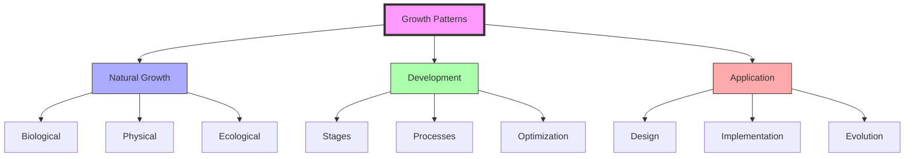
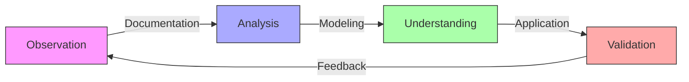
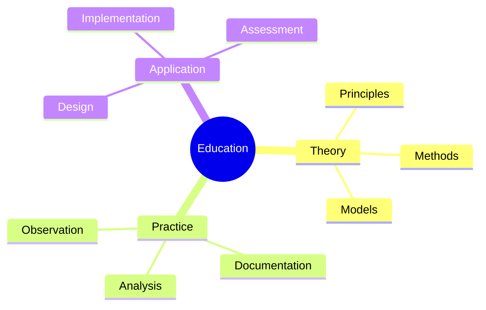

# Growth Patterns

Growth Patterns represent fundamental principles of development and expansion observed in [[concepts/Natural_Systems|natural systems]] and applied through [[concepts/Design_Science|design science]] to create sustainable and efficient solutions.

## System Overview

## Core Components

### Growth Types
1. [[concepts/Natural_Growth|Natural Growth]]
   - [[concepts/Biological_Growth|Biological development]]
   - [[concepts/Crystal_Growth|Crystalline formation]]
   - [[concepts/Population_Growth|Population dynamics]]
   - [[concepts/Ecosystem_Growth|Ecosystem development]]

2. [[concepts/System_Growth|System Growth]]
   - [[concepts/Network_Growth|Network development]]
   - [[concepts/Organization_Growth|Organizational evolution]]
   - [[concepts/Innovation_Growth|Innovation expansion]]
   - [[concepts/Knowledge_Growth|Knowledge development]]

### Growth Principles
1. [[concepts/Growth_Dynamics|Growth Dynamics]]
   - Development stages
   - Growth rates
   - Resource utilization
   - Optimization patterns

2. [[concepts/Growth_Constraints|Growth Constraints]]
   - Resource limitations
   - Environmental factors
   - System boundaries
   - Optimization limits

## Natural Applications

### Biological Systems
1. [[concepts/Living_Systems|Living Systems]]
   - Cell growth
   - Organism development
   - Population dynamics
   - Ecosystem evolution

2. [[concepts/Physical_Systems|Physical Systems]]
   - Crystal formation
   - Material development
   - Structure growth
   - Energy patterns

### System Applications
1. [[concepts/Design_Science|Design Integration]]
   - Growth modeling
   - Development planning
   - Resource optimization
   - System evolution

2. [[concepts/System_Innovation|Innovation Development]]
   - Pattern application
   - Growth strategies
   - Implementation methods
   - Evolution planning

## Research Methods

### Analysis Framework

### Study Methods
1. [[concepts/Growth_Analysis|Growth Analysis]]
   - Pattern identification
   - Development tracking
   - Rate measurement
   - Impact assessment

2. [[concepts/Growth_Tools|Research Tools]]
   - Monitoring systems
   - Analysis software
   - Modeling platforms
   - Validation methods

## Educational Integration

### Learning Framework

### Teaching Methods
1. [[concepts/Growth_Education|Educational Programs]]
   - Growth principles
   - Pattern analysis
   - Development studies
   - Application methods

2. [[concepts/Growth_Practice|Practical Training]]
   - Observation skills
   - Analysis techniques
   - Documentation methods
   - Implementation practices

## References

### Primary Sources
1. [[books/Growth_and_Form|On Growth and Form]]
2. [[books/Growth_Patterns|Natural Growth Patterns]]
3. [[books/System_Growth|System Growth and Development]]

### Related Resources
1. [[papers/Growth_Analysis|Growth Pattern Analysis]]
2. [[papers/Development_Studies|Development Pattern Studies]]
3. [[papers/Evolution_Research|Growth Evolution Research]]

## Notes
- Fundamental to understanding system development
- Key to sustainable design
- Essential for resource optimization
- Critical for system evolution

## Tags
#growth #patterns #development #systems-thinking #natural-systems 