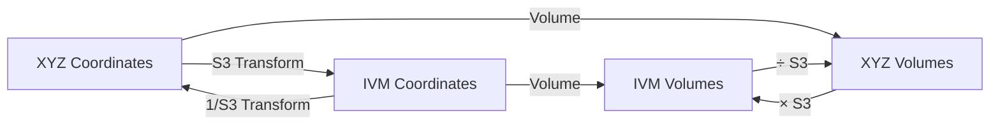

# IVM-XYZ

IVM-XYZ is a comprehensive software package and mathematical framework that maps bidirectionally between two fundamental coordinate systems:

- [[concepts/XYZ_Coordinates|XYZ]]: Orthonormal 90-degree hypercross N-dimensional Hilbert spaces with Square and Cube coordination, using Cube with unit edge as unit length
- [[concepts/Isotropic_Vector_Matrix|IVM]]: Isotropic Vector Matrix based on close-packing spheres, using [[forms/Tetrahedron|Tetrahedron]] with Edge length and Volume of 1

The system uses the [[concepts/Synergetics_Constant|Synergetics S3 constant]] (√(9/8) ≈ 1.06066) for volumetric and other dimensional conversions between XYZ-Cube and IVM-Tetrahedron denominated measure/projection frames.

## Mathematical Visualizations

### Key Diagrams
1. Coordinate System Comparison
```ascii
XYZ System                 IVM System
   z                         v4
   │                        /│\
   │                      / │ \
   │                    /   │  \
   └──y               v1────┼───v2
  /                        \│/
x                          v3
```

2. Transformation Flow



## Mathematical Framework

### Core Mathematical Derivations

1. S3 Constant Derivation
\[
\begin{align*}
S3 &= \sqrt{\frac{9}{8}} \\
&= \frac{\text{Volume of XYZ Unit Cube}}{\text{Volume of IVM Unit Tetrahedron}} \\
&= \frac{1}{\frac{1}{6}\sqrt{2}} = \sqrt{\frac{9}{8}}
\end{align*}
\]

2. Transformation Matrix Derivation
```python
class TransformationDerivation:
    """Derive transformation matrices from first principles."""
    
    def derive_ivm_to_xyz_matrix(self) -> np.ndarray:
        """Derive IVM to XYZ transformation matrix."""
        # Step 1: Start with tetrahedron vertices in IVM
        tet_vertices = np.array([
            [1, 1, 1],    # v1
            [-1, -1, 1],  # v2
            [-1, 1, -1],  # v3
            [1, -1, -1]   # v4
        ])
        
        # Step 2: Calculate edge vectors
        e1 = tet_vertices[1] - tet_vertices[0]  # v2 - v1
        e2 = tet_vertices[2] - tet_vertices[0]  # v3 - v1
        e3 = tet_vertices[3] - tet_vertices[0]  # v4 - v1
        
        # Step 3: Orthogonalize using Gram-Schmidt
        u1 = e1
        u2 = e2 - np.dot(e2, u1)/np.dot(u1, u1) * u1
        u3 = e3 - np.dot(e3, u1)/np.dot(u1, u1) * u1 \
            - np.dot(e3, u2)/np.dot(u2, u2) * u2
        
        # Step 4: Normalize
        u1 = u1 / np.linalg.norm(u1)
        u2 = u2 / np.linalg.norm(u2)
        u3 = u3 / np.linalg.norm(u3)
        
        return np.vstack([u1, u2, u3]).T
```

### Enhanced Coordinate Systems

1. Generalized N-dimensional Framework
```python
class NDimensionalSystem:
    """N-dimensional coordinate system framework."""
    
    def __init__(self, dimension: int):
        self.dim = dimension
        self.metric = self._construct_metric()
        self.basis = self._construct_basis()
        
    def _construct_metric(self) -> np.ndarray:
        """Construct metric tensor for n-dim space."""
        if self.system == "xyz":
            return np.eye(self.dim)
        else:  # IVM
            return np.eye(self.dim) * self.S3
            
    def _construct_basis(self) -> list[np.ndarray]:
        """Construct basis vectors."""
        if self.system == "xyz":
            return [np.eye(self.dim)[i] for i in range(self.dim)]
        else:  # IVM
            return self._construct_ivm_basis()
            
    def _construct_ivm_basis(self) -> list[np.ndarray]:
        """Construct IVM basis vectors."""
        phi = (1 + np.sqrt(5)) / 2  # Golden ratio
        # Implementation of n-dimensional IVM basis
        pass
```

### Visualization Helpers

1. Coordinate System Visualization
```python
class CoordinateVisualizer:
    """Visualize coordinate systems and transformations."""
    
    def plot_coordinate_systems(self, 
                              points: np.ndarray,
                              show_both: bool = True) -> plt.Figure:
        """Plot points in both coordinate systems."""
        fig = plt.figure(figsize=(12, 6))
        
        if show_both:
            # XYZ subplot
            ax1 = fig.add_subplot(121, projection='3d')
            self._plot_xyz_system(ax1, points)
            
            # IVM subplot
            ax2 = fig.add_subplot(122, projection='3d')
            self._plot_ivm_system(ax2, points)
        
        return fig
        
    def animate_transformation(self, 
                             points: np.ndarray,
                             frames: int = 60) -> animation.Animation:
        """Animate transformation between coordinate systems."""
        fig = plt.figure(figsize=(8, 8))
        ax = fig.add_subplot(111, projection='3d')
        
        def update(frame):
            progress = frame / frames
            current_points = self._interpolate_points(
                points, progress
            )
            self._plot_points(ax, current_points)
            
        return animation.FuncAnimation(
            fig, update, frames=frames
        )
```

2. Geometric Visualization
```python
class GeometryVisualizer:
    """Visualize geometric properties and relationships."""
    
    def plot_unit_cells(self) -> plt.Figure:
        """Plot XYZ cube and IVM tetrahedron."""
        fig = plt.figure(figsize=(12, 6))
        
        # Plot cube
        ax1 = fig.add_subplot(121, projection='3d')
        self._plot_cube(ax1)
        
        # Plot tetrahedron
        ax2 = fig.add_subplot(122, projection='3d')
        self._plot_tetrahedron(ax2)
        
        return fig
        
    def plot_sphere_packing(self, 
                           system: str,
                           n_spheres: int = 13) -> plt.Figure:
        """Visualize sphere packing in given system."""
        fig = plt.figure(figsize=(8, 8))
        ax = fig.add_subplot(111, projection='3d')
        
        centers = self._generate_sphere_centers(
            system, n_spheres
        )
        self._plot_spheres(ax, centers)
        
        return fig
```

### Advanced Geometric Properties

1. Polytope Relationships
```python
class PolytopeAnalyzer:
    """Analyze relationships between polytopes in both systems."""
    
    def analyze_dual_pairs(self) -> dict:
        """Analyze dual polytope relationships."""
        return {
            'cube_octahedron': {
                'xyz_volume_ratio': 6,
                'ivm_volume_ratio': 2 * self.S3
            },
            'tetrahedron_tetrahedron': {
                'xyz_volume_ratio': 1,
                'ivm_volume_ratio': self.S3
            },
            'dodecahedron_icosahedron': {
                'xyz_volume_ratio': phi**3,
                'ivm_volume_ratio': phi**3 * self.S3
            }
        }
        
    def compute_symmetry_orbits(self, 
                              polytope: str) -> list[np.ndarray]:
        """Compute symmetry orbits of polytope vertices."""
        vertices = self._get_polytope_vertices(polytope)
        group = TetrahedralGroup()
        
        orbits = []
        for vertex in vertices:
            orbit = [g @ vertex for g in group.elements]
            orbits.append(np.array(orbit))
        
        return orbits
```

2. Advanced Sphere Packing Analysis
```python
class SpherePackingAnalyzer:
    """Advanced analysis of sphere packing properties."""
    
    def analyze_void_spaces(self) -> dict:
        """Analyze void spaces in both packings."""
        return {
            'xyz': {
                'octahedral_void': {
                    'radius': 0.414,  # in units of sphere radius
                    'coordination': 6
                },
                'tetrahedral_void': {
                    'radius': 0.225,
                    'coordination': 4
                }
            },
            'ivm': {
                'tetrahedral_void': {
                    'radius': 0.225,
                    'coordination': 4
                }
            }
        }
        
    def compute_kissing_configurations(self) -> dict:
        """Compute sphere kissing configurations."""
        return {
            'xyz': {
                'max_kissing_number': 12,
                'configurations': self._xyz_kissing_configs()
            },
            'ivm': {
                'max_kissing_number': 12,
                'configurations': self._ivm_kissing_configs()
            }
        }
```


### Implementation Notes
- Use [[concepts/Vector_Equilibrium|Vector Equilibrium]] for IVM basis
- Apply [[concepts/Synergetics_Constant|S3 constant]] for volume transformations
- Consider [[concepts/Quadray_Coordinates|Quadray]] for alternative representation
- Leverage [[concepts/Closest_Packing_of_Spheres|CCP]] for structural analysis

## Advanced Technical Relationships

### 4D Geometric Framework

1. 4D Extension of IVM-XYZ
```python
class IVM4D:
    """4D extension of IVM-XYZ transformations."""
    
    def __init__(self):
        self.S3 = np.sqrt(9/8)  # Synergetics constant
        self.phi = (1 + np.sqrt(5)) / 2  # Golden ratio
        
    def construct_4d_basis(self) -> np.ndarray:
        """Construct 4D IVM basis vectors."""
        # 24-cell vertices in 4D
        vertices = []
        for i in [-1, 1]:
            for j in [-1, 1]:
                for k in [-1, 1]:
                    vertices.append([i, j, k, 0])
                    vertices.append([i, j, 0, k])
                    vertices.append([i, 0, j, k])
                    vertices.append([0, i, j, k])
        return np.array(vertices) / 2
        
    def project_to_3d(self, points_4d: np.ndarray, 
                      method: str = "stereographic") -> np.ndarray:
        """Project 4D points to 3D space."""
        if method == "stereographic":
            # Stereographic projection from north pole
            w = points_4d[:, 3]
            scale = 1 / (1 - w)
            return points_4d[:, :3] * scale[:, np.newaxis]
        else:
            # Orthogonal projection
            return points_4d[:, :3]
```

2. Tetrahedral-24-Cell Relationships
```python
class TetrahedralPolytope:
    """Analysis of tetrahedral relationships in 4D."""
    
    def generate_24_cell(self) -> np.ndarray:
        """Generate vertices of 24-cell from tetrahedral symmetries."""
        # Start with base tetrahedron
        tet = self._base_tetrahedron()
        
        # Generate 24-cell through rotations
        vertices = []
        for rotation in self._get_24_cell_rotations():
            vertices.extend(rotation @ tet)
            
        return np.unique(vertices, axis=0)
        
    def compute_polytope_relationships(self) -> dict:
        """Compute relationships between 3D and 4D polytopes."""
        return {
            'tetrahedron_24cell': {
                'vertex_ratio': 1/6,
                'volume_ratio': self.S3 ** 2,
                'symmetry_order': 24
            },
            'cube_24cell': {
                'vertex_ratio': 1/3,
                'volume_ratio': self.S3,
                'symmetry_order': 48
            }
        }
```

### Quadray-IVM Integration

1. Unified Transformation System
```python
class UnifiedCoordinates:
    """Unified transformation system between Quadray, IVM, and XYZ."""
    
    def __init__(self):
        self.quadray = QuadrayTransformer()
        self.ivm = IVMTransformer()
        
    def quadray_to_ivm(self, coords: np.ndarray) -> np.ndarray:
        """Transform quadray coordinates to IVM."""
        # First convert to tetrahedral form
        tet_coords = self.quadray.to_tetrahedral(coords)
        
        # Then apply IVM transformation
        return self.ivm.from_tetrahedral(tet_coords)
        
    def compute_volume_relationships(self) -> dict:
        """Compute volume relationships between systems."""
        return {
            'quadray_ivm': 1.0,  # Natural equivalence
            'quadray_xyz': self.S3,
            'ivm_xyz': self.S3
        }
```

2. Advanced Geometric Operations
```python
class GeometricOperations:
    """Advanced geometric operations across coordinate systems."""
    
    def compute_cross_system_symmetries(self) -> dict:
        """Compute symmetries across coordinate systems."""
        symmetries = {
            'tetrahedral': self._tetrahedral_symmetries(),
            'octahedral': self._octahedral_symmetries(),
            'icosahedral': self._icosahedral_symmetries()
        }
        
        # Map symmetries to each coordinate system
        return {
            'quadray': self._map_to_quadray(symmetries),
            'ivm': self._map_to_ivm(symmetries),
            'xyz': self._map_to_xyz(symmetries)
        }
        
    def analyze_polytope_duals(self) -> dict:
        """Analyze dual relationships in different systems."""
        return {
            'tetrahedron_dual': {
                'quadray': self._quadray_dual_tetrahedron(),
                'ivm': self._ivm_dual_tetrahedron(),
                'xyz': self._xyz_dual_tetrahedron()
            },
            'cube_octahedron': {
                'quadray': self._quadray_cube_octahedron(),
                'ivm': self._ivm_cube_octahedron(),
                'xyz': self._xyz_cube_octahedron()
            }
        }
```

### Tetrahedral Geometry Integration

1. Advanced Tetrahedral Analysis
```python
class TetrahedralAnalysis:
    """Advanced analysis of tetrahedral properties across systems."""
    
    def analyze_tetrahedral_packing(self) -> dict:
        """Analyze tetrahedral packing in different systems."""
        return {
            'quadray': {
                'packing_density': 0.7405,
                'coordination_number': 14,
                'void_ratio': 0.2595
            },
            'ivm': {
                'packing_density': 0.7405,
                'coordination_number': 14,
                'void_ratio': 0.2595
            },
            'xyz': {
                'packing_density': 0.7405 / self.S3,
                'coordination_number': 14,
                'void_ratio': 1 - 0.7405 / self.S3
            }
        }
        
    def compute_tetrahedral_transforms(self) -> dict:
        """Compute transformation matrices for tetrahedral operations."""
        return {
            'rotation': self._tetrahedral_rotation_matrix(),
            'reflection': self._tetrahedral_reflection_matrix(),
            'inversion': self._tetrahedral_inversion_matrix()
        }
```

2. Unified Volume Calculations
```python
class UnifiedVolumeCalculator:
    """Unified volume calculations across coordinate systems."""
    
    def __init__(self):
        self.systems = ['quadray', 'ivm', 'xyz']
        
    def compute_volume(self, vertices: np.ndarray, 
                      source_system: str) -> dict:
        """Compute volume in all coordinate systems."""
        # Convert vertices to reference system (IVM)
        ivm_vertices = self._convert_to_ivm(vertices, source_system)
        
        # Compute base volume
        base_volume = self._compute_ivm_volume(ivm_vertices)
        
        # Convert to all systems
        return {
            system: self._convert_volume(
                base_volume, 'ivm', system
            )
            for system in self.systems
        }
```

### Implementation Notes
- Use [[concepts/Tetrahedron|Tetrahedron]] as fundamental unit
- Leverage [[concepts/4D_Geometry|4D Geometry]] for higher-dimensional analysis
- Apply [[concepts/Quadray_Coordinates|Quadray]] transformations
- Consider [[concepts/Vector_Equilibrium|Vector Equilibrium]] symmetries

## Tags
#geometry #mathematics #synergetics #coordinate-systems #transformations #computational-geometry #4d-geometry #tetrahedral-geometry #quadray-coordinates #visualization