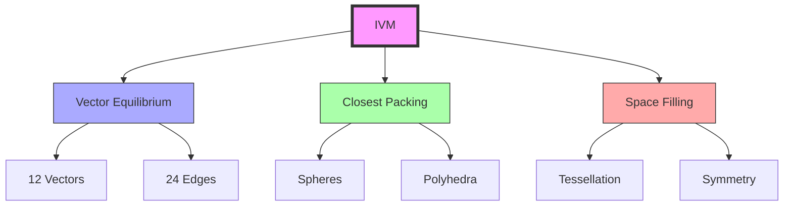
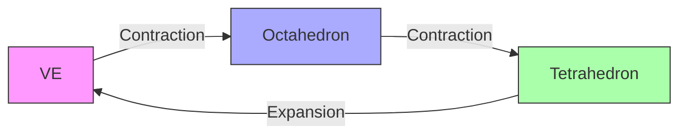

# Isotropic Vector Matrix

The Isotropic Vector Matrix (IVM) represents the fundamental space-filling coordinate system of [[concepts/Synergetics_Geometry|Synergetics]], based on the [[concepts/Vector_Equilibrium|Vector Equilibrium]] and [[concepts/Closest_Packing_of_Spheres|closest-packed spheres]].

## Mathematical Structure

### Coordinate System
1. Vector Relationships
```yaml
ivm_vectors:
  primary_vectors: 12
  vector_length: 1  # normalized
  angular_spacing: 60°
  coordination: 
    closest_packed: true
    omni_triangulated: true
```

2. Spatial Organization
\[
\vec{v}_i = \begin{cases}
(\pm 1, \pm 1, 0) & \text{4 vectors} \\
(\pm 1, 0, \pm 1) & \text{4 vectors} \\
(0, \pm 1, \pm 1) & \text{4 vectors}
\end{cases}
\]

### Geometric Properties
1. Basic Units
```yaml
structural_units:
  tetrahedron:
    volume: 1  # normalized
    edges: 4
    faces: 4
  octahedron:
    volume: 4
    edges: 12
    faces: 8
  vector_equilibrium:
    volume: 8.485281374238571
    edges: 24
    faces: 14
```

2. Transformation Matrix
\[
T_{IVM} = \begin{bmatrix}
1 & -\frac{1}{2} & -\frac{1}{2} \\
0 & \frac{\sqrt{3}}{2} & -\frac{\sqrt{3}}{6} \\
0 & 0 & \frac{\sqrt{6}}{3}
\end{bmatrix}
\]

## Space-Filling Properties

### Structural Framework


### Packing Relationships
1. [[concepts/Closest_Packing_of_Spheres|Sphere Packing]]
```yaml
packing_efficiency:
  cubic: 0.5235987755982989
  closest_packed: 0.7404804896930611
  ivm_ratio: 1.4142135623730951
```

2. Coordination Numbers
```yaml
coordination:
  sphere_contacts: 12
  edge_vectors: 24
  face_triangles: 20
  structural_vertices: 12
```

## Transformational Systems

### [[concepts/Jitterbug_Transformation|Jitterbug Dynamics]]
1. Phase Transformations
```yaml
transformations:
  ve_to_octahedron:
    volume_ratio: 0.4714045207910317
    symmetry: preserved
  octahedron_to_tetrahedron:
    volume_ratio: 0.2500000000000000
    symmetry: reduced
```

2. Energy States


## Structural Applications

### System Integration
1. [[concepts/Geodesic_Mathematics|Geodesic Systems]]
   - Frequency modulation
   - Spherical projection
   - Great circle paths
   - Structural efficiency

2. [[concepts/Space_Frames|Space Frame Design]]
   - Load distribution
   - Force balancing
   - Material optimization
   - System stability

### Construction Framework
```mermaid
mindmap
    root((IVM Applications))
        Architecture
            [[Space_Frames]]
            [[Geodesic_Domes]]
            [[Tensegrity]]
        Engineering
            [[Force_Distribution]]
            [[Load_Bearing]]
            [[Stability]]
        Materials
            [[Crystal_Structure]]
            [[Molecular_Design]]
            [[Nano_Engineering]]
```

## Mathematical Analysis

### Vector Relationships
\[
\begin{align*}
\sum_{i=1}^{12} \vec{v}_i &= \vec{0} \text{ (equilibrium)} \\
|\vec{v}_i| &= 1 \text{ (normalized)} \\
\angle(\vec{v}_i, \vec{v}_j) &= 60° \text{ or } 90° \\
\end{align*}
\]

### Symmetry Operations
1. Rotational Symmetry
```yaml
symmetry_groups:
  point_group: Oh
  order: 48
  operations:
    rotations: 24
    reflections: 24
```

2. Translation Symmetry
```yaml
translations:
  vectors: [a₁, a₂, a₃]
  basis: face-centered cubic
  space_group: Fm3m
```

## Integration with [[concepts/Synergetics_Geometry|Synergetics]]

### Geometric Framework
1. Basic Relationships
   - [[concepts/Vector_Equilibrium|VE]] as unit cell
   - [[concepts/Closest_Packing_of_Spheres|Sphere packing]] principles
   - [[concepts/Jitterbug_Transformation|Dynamic transformations]]
   - [[concepts/Space_Frames|Structural applications]]

2. System Properties
   - Omni-triangulated stability
   - Isotropic vector distribution
   - Space-filling capability
   - Energy efficiency

## References

### Primary Sources
1. [[books/Synergetics|Synergetics]] (Fuller, 1975)
2. [[books/Synergetics_2|Synergetics 2]] (Fuller, 1979)
3. [[papers/IVM_Analysis|IVM Analysis]] (Edmondson, 1987)
4. [[papers/Space_Structures|Space Structures]] (Clinton, 1971)

### Related Concepts
- [[concepts/Vector_Equilibrium|Vector Equilibrium]]
- [[concepts/Synergetics_Geometry|Synergetics Geometry]]
- [[concepts/Closest_Packing_of_Spheres|Closest Packing of Spheres]]
- [[concepts/Jitterbug_Transformation|Jitterbug Transformation]]

## Notes
- Fundamental to synergetic geometry
- Based on closest sphere packing
- Enables dynamic transformations
- Universal structural system

## Tags
#geometry #synergetics #mathematics #space-filling #structural-systems 