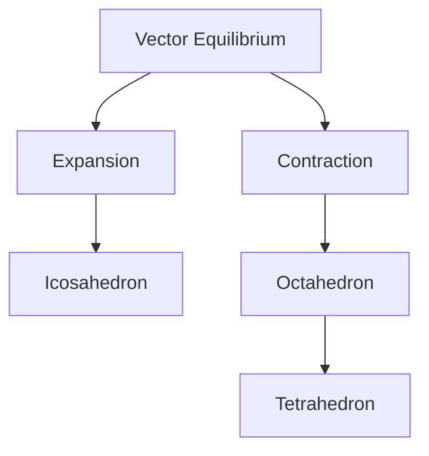
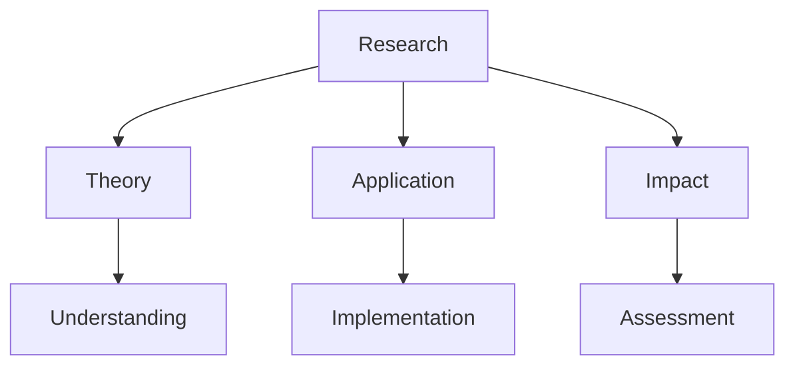
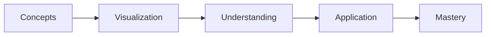
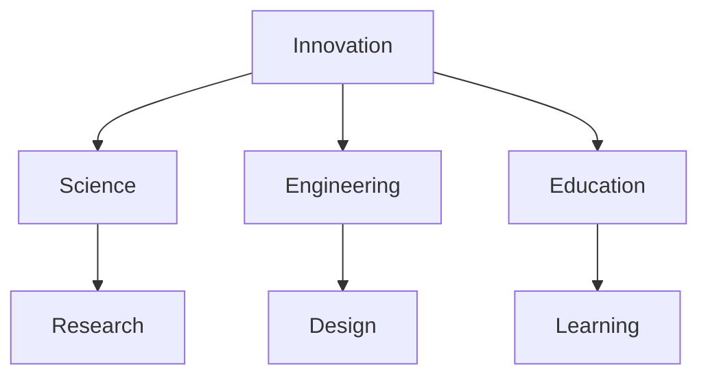

# Jitterbug Transformation

The Jitterbug Transformation is a geometric transformation discovered by R. Buckminster Fuller that demonstrates the dynamic relationship between polyhedral forms, particularly the Vector Equilibrium's transformation through various symmetrical states.

## Overview

### Definition
```yaml
jitterbug_transformation:
  discoverer: R. Buckminster Fuller
  primary_form: Vector Equilibrium (Cuboctahedron)
  transformation_sequence:
    - Vector Equilibrium
    - Icosahedron
    - Octahedron
    - Tetrahedron
  significance: Demonstrates geometric dynamics and system transformations
  applications:
    - Structural design
    - Molecular transformation
    - Dynamic systems
    - Educational models
```

### Key Characteristics
1. Geometric Properties
   - Symmetrical transformations
   - Volume changes
   - Angular relationships
   - Structural continuity

2. Dynamic Features
   - Continuous motion
   - Reversible states
   - Symmetry preservation
   - Energy patterns

## Mathematical Framework

### Geometric Principles
```mermaid
mindmap
    root((Jitterbug))
        States
            [[Vector Equilibrium]]
            [[Icosahedron]]
            [[Octahedron]]
            [[Tetrahedron]]
        Properties
            [[Symmetry]]
            [[Volume]]
            [[Angles]]
        Dynamics
            [[Motion]]
            [[Transformation]]
            [[Energy]]
```

### Transformation Sequence
1. Initial State (VE)
   - Twelve vertices
   - Twenty-four edges
   - Eight triangular faces
   - Six square faces

2. Intermediate States
   - Icosahedral phase
   - Octahedral phase
   - Tetrahedral phase
   - Collapsed state

## Dynamic Behavior

### Motion Analysis


### Energy States
1. Equilibrium Points
   - Stable configurations
   - Energy minima
   - Symmetry patterns
   - Force balance

2. Transition States
   - Dynamic motion
   - Energy flow
   - Structural changes
   - Pattern evolution

## Applications

### Scientific Uses
1. Molecular Science
   - [[Molecular Transformation]]
   - [[Chemical Structures]]
   - [[Atomic Arrangements]]
   - [[Material Design]]

2. Engineering Applications
   - [[Structural Design]]
   - [[Dynamic Systems]]
   - [[Mechanical Motion]]
   - [[Energy Systems]]

### Implementation Areas
```mermaid
mindmap
    root((Applications))
        Science
            [[Molecular Studies]]
            [[Material Science]]
            [[Chemistry]]
        Engineering
            [[Structures]]
            [[Mechanics]]
            [[Systems]]
        Education
            [[Geometry]]
            [[Dynamics]]
            [[Transformation]]
```

## Research Value

### Study Areas
1. Geometric Research
   - Transformation patterns
   - Symmetry operations
   - Volume relationships
   - Dynamic properties

2. Application Studies
   - Implementation methods
   - System design
   - Educational use
   - Practical applications

### Research Framework


## Educational Applications

### Teaching Methods
1. Physical Models
   - Construction kits
   - Demonstration models
   - Interactive displays
   - Teaching tools

2. Digital Resources
   - Animation software
   - Simulation tools
   - Interactive programs
   - Visual guides

### Learning Framework


## Technical Implementation

### Construction Methods
1. Physical Models
   - Material selection
   - Joint design
   - Assembly methods
   - Motion mechanisms

2. Digital Models
   - 3D modeling
   - Animation systems
   - Simulation tools
   - Analysis software

### Technical Framework
```mermaid
mindmap
    root((Implementation))
        Physical
            [[Materials]]
            [[Joints]]
            [[Assembly]]
        Digital
            [[Modeling]]
            [[Animation]]
            [[Simulation]]
```

## Modern Applications

### Contemporary Use
1. Scientific Research
   - Molecular design
   - Material science
   - System dynamics
   - Structure analysis

2. Engineering Design
   - Mechanical systems
   - Structural design
   - Dynamic modeling
   - Energy systems

### Innovation Areas


## Resources

### Documentation
- [[Technical Papers]]
- [[Research Studies]]
- [[Application Guides]]
- [[Educational Materials]]

### Learning Tools
1. Physical Resources
   - [[Construction Kits]]
   - [[Demonstration Models]]
   - [[Teaching Tools]]

2. Digital Resources
   - [[Simulation Software]]
   - [[Animation Tools]]
   - [[Interactive Programs]]

## References
1. Fuller's Synergetics
2. Research papers
3. Application studies
4. Educational materials
5. Technical guides

## Notes
- Key to understanding geometric dynamics
- Demonstrates system transformations
- Valuable educational tool
- Wide application potential

## Tags
#concept #geometry #transformation #synergetics #vector-equilibrium 