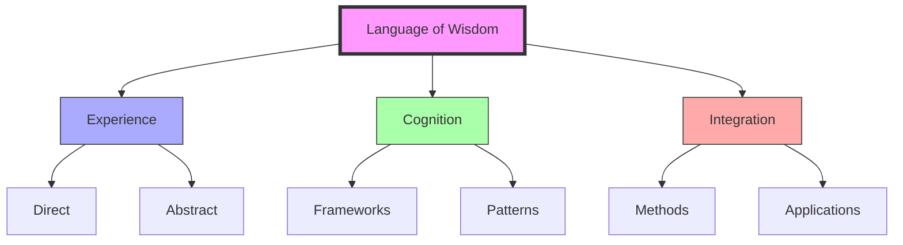

# Language of Wisdom

Language of Wisdom (LoW) is a bottom-up documentation approach to understanding cognitive frameworks and experiential perspectives, developed through the [[organizations/Math4Wisdom|Math4Wisdom]] community and led by [[people/Jere_Northrop|Jere Northrop]] and [[people/Andrius_Kulikauskas|Andrius Kulikauskas]].

## Core Framework

### Foundational Elements
1. Cognitive Documentation
   - Experiential perspectives
   - Abstract thinking
   - Direct experience
   - Consciousness limits

2. Knowledge Systems
   - Mental frameworks
   - Thought patterns
   - Understanding structures
   - Learning processes

### Theoretical Structure
```mermaid
mindmap
    root((Language of Wisdom))
        Experience
            [[Direct]]
            [[Abstract]]
            [[Integration]]
        Cognition
            [[Frameworks]]
            [[Patterns]]
            [[Systems]]
        Application
            [[Learning]]
            [[Understanding]]
            [[Development]]
```

## Cognitive Frameworks

### Mental Models
1. Experiential Patterns
   - Direct observation
   - Abstract thinking
   - Integration methods
   - Understanding development

2. Knowledge Integration
   - Framework development
   - System integration
   - Pattern recognition
   - Learning processes

### Implementation Methods
1. Documentation Tools
   - [[concepts/Wondrous_Wisdom|Wondrous Wisdom]]
   - [[concepts/Active_Inference|Active Inference]]
   - [[concepts/Pattern_Recognition|Pattern Recognition]]
   - [[concepts/System_Analysis|System Analysis]]

2. Practical Applications
   - Learning systems
   - Knowledge development
   - Understanding frameworks
   - Integration methods

## Study Program

### Research Areas
1. Cognitive Studies
   - Mental frameworks
   - Thought patterns
   - Learning processes
   - Understanding development

2. Integration Methods
   - Framework development
   - System integration
   - Pattern recognition
   - Knowledge building

### Development Framework


## Practical Applications

### Educational Implementation
1. Study Programs
   - [[organizations/Math4Wisdom|Math4Wisdom]] integration
   - Learning frameworks
   - Knowledge development
   - Understanding methods

2. Research Applications
   - Cognitive investigation
   - Framework development
   - System integration
   - Practical implementation

### Development Areas
1. Current Research
   - Framework documentation
   - Pattern recognition
   - System integration
   - Application development

2. Future Directions
   - Method expansion
   - Integration development
   - Application growth
   - Community engagement

## Community Integration

### Learning Communities
1. Study Groups
   - [[organizations/Math4Wisdom|Math4Wisdom]]
   - Research teams
   - Learning networks
   - Knowledge communities

2. Collaborative Networks
   - Research partnerships
   - Educational connections
   - Community engagement
   - Knowledge sharing

## References

### Primary Sources
1. Math4Wisdom documentation
2. Research materials
3. Study group resources
4. Educational content

### Related Concepts
- [[concepts/Wondrous_Wisdom|Wondrous Wisdom]]
- [[concepts/Active_Inference|Active Inference]]
- [[concepts/Pattern_Recognition|Pattern Recognition]]
- [[concepts/System_Analysis|System Analysis]]

## Notes
- Bottom-up documentation approach
- Focus on cognitive frameworks
- Integration with other systems
- Practical applications

## Tags
#language #wisdom #cognitive-frameworks #knowledge-systems 