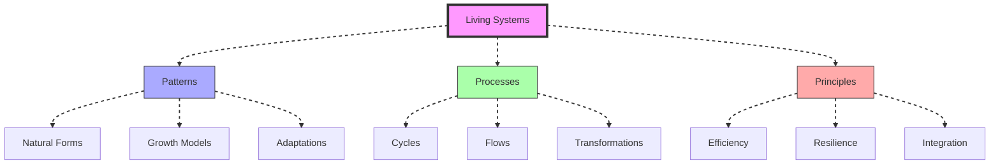
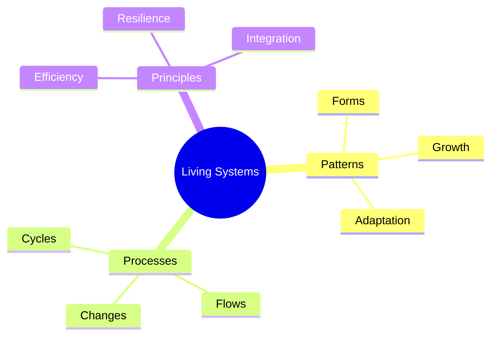
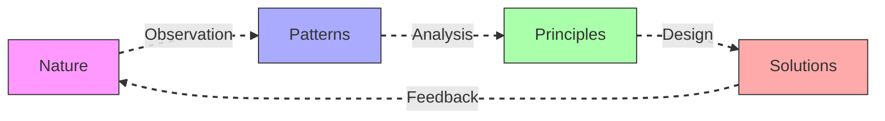
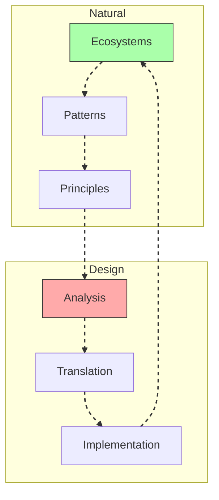
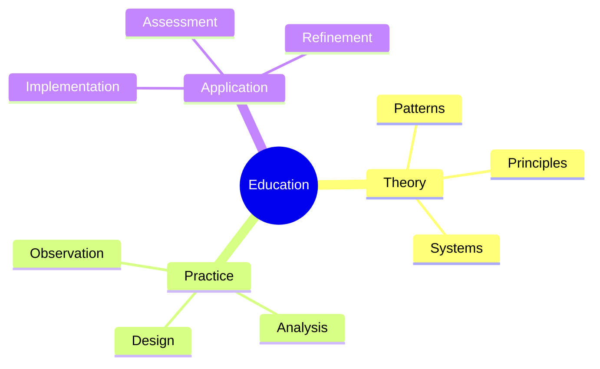
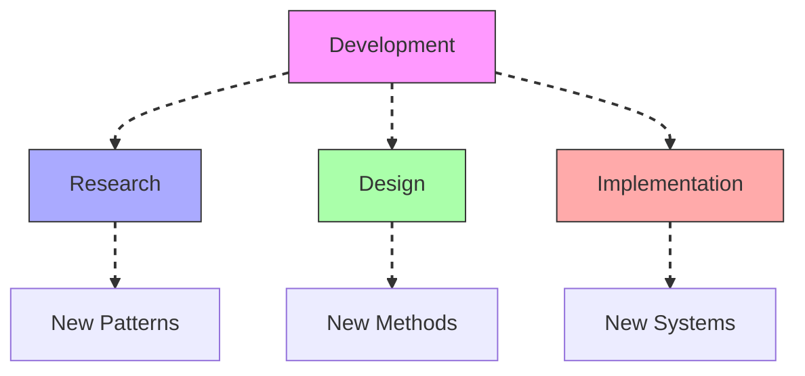

# Living Systems

Living Systems represents the integration of [[concepts/System_Wholeness|system wholeness]] principles with [[concepts/Design_Science|design science]], drawing inspiration from nature's sustainable and efficient patterns.

## System Overview

## Core Components

### Natural Patterns

### Key Elements
1. [[concepts/Natural_Systems|Natural Systems]]
   - Growth patterns
   - Adaptation methods
   - Efficiency principles
   - Integration models

2. [[concepts/System_Dynamics|System Dynamics]]
   - Flow patterns
   - Cycle processes
   - Transformation methods
   - Feedback loops

## Design Integration

### Pattern Application

### Implementation Framework
1. [[concepts/Biomimicry|Biomimicry Principles]]
   - Pattern recognition
   - System analysis
   - Design translation
   - Implementation methods

2. [[concepts/Ecological_Design|Ecological Design]]
   - Sustainable patterns
   - Resource cycles
   - Energy flows
   - Material systems

## System Applications

### Design Areas

### Implementation Strategy
1. [[concepts/Sustainable_Design|Sustainable Design]]
   - Resource efficiency
   - Energy optimization
   - Material cycles
   - Waste elimination

2. [[concepts/Regenerative_Systems|Regenerative Systems]]
   - Self-renewal
   - Adaptation
   - Resilience
   - Growth patterns

## Educational Integration

### Learning Framework

### Program Development
1. [[concepts/Systems_Education|Systems Education]]
   - Pattern recognition
   - System analysis
   - Design principles
   - Implementation methods

2. [[concepts/Design_Science_Education|Design Science Education]]
   - Natural systems
   - Living patterns
   - Design translation
   - Application methods

## Future Development

### Innovation Areas

### Implementation Path
1. [[concepts/System_Innovation|System Innovation]]
   - Pattern discovery
   - Method development
   - System design
   - Implementation strategies

2. [[concepts/Global_Solutions|Global Solutions]]
   - Sustainable systems
   - Resource optimization
   - Energy efficiency
   - Waste elimination

## References

### Primary Sources
1. [[books/Operating_Manual_for_Spaceship_Earth|Operating Manual for Spaceship Earth]]
2. [[books/Synergetics_Book|Synergetics]]
3. [[books/Design_Science|Design Science]]

### Related Resources
1. [[papers/Living_Systems|Living Systems Theory]]
2. [[papers/Biomimicry|Biomimicry Principles]]
3. [[papers/Ecological_Design|Ecological Design Methods]]

## Notes
- Foundation for sustainable design
- Integration of natural patterns
- Key to system efficiency
- Basis for regenerative solutions

## Tags
#systems-thinking #sustainability #ecology #design-science #living-systems 