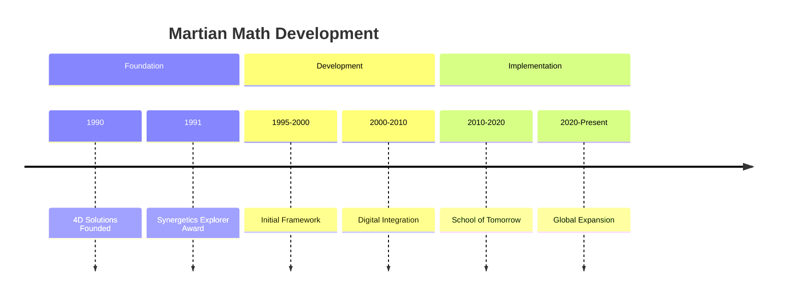
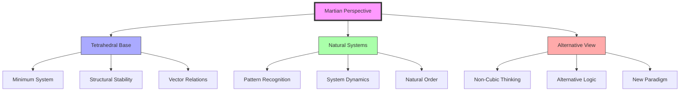
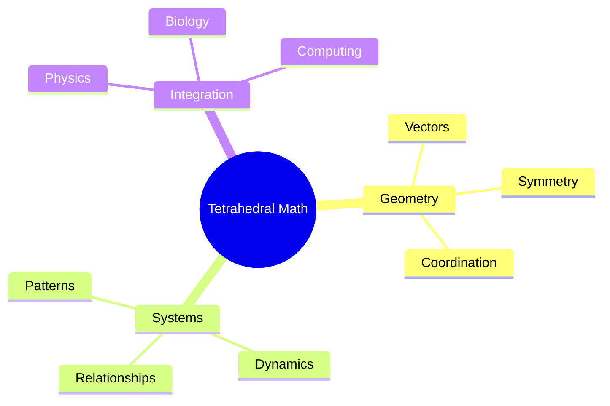
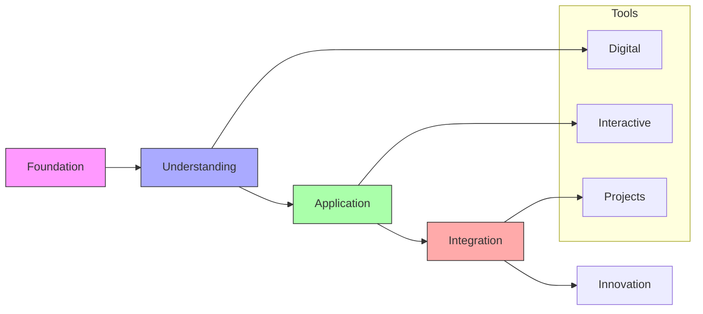
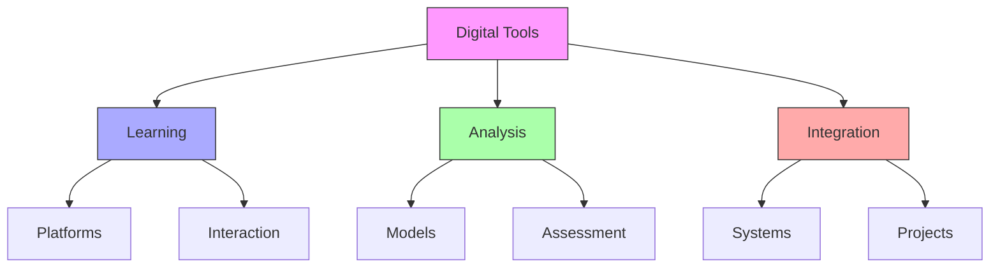
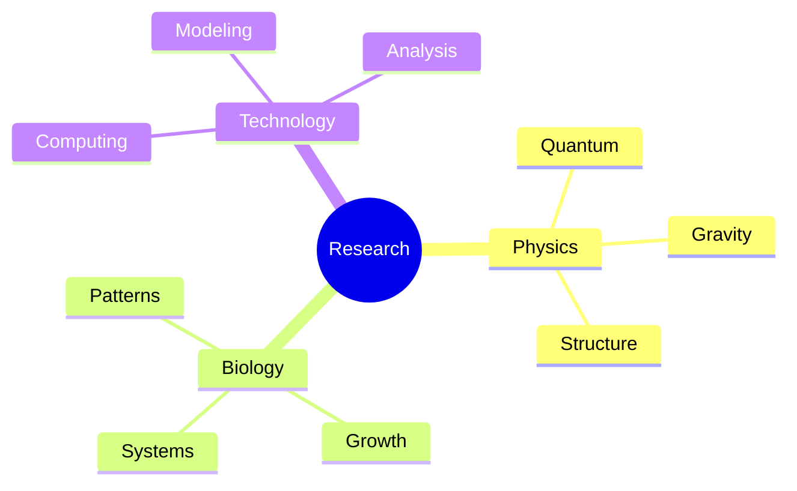
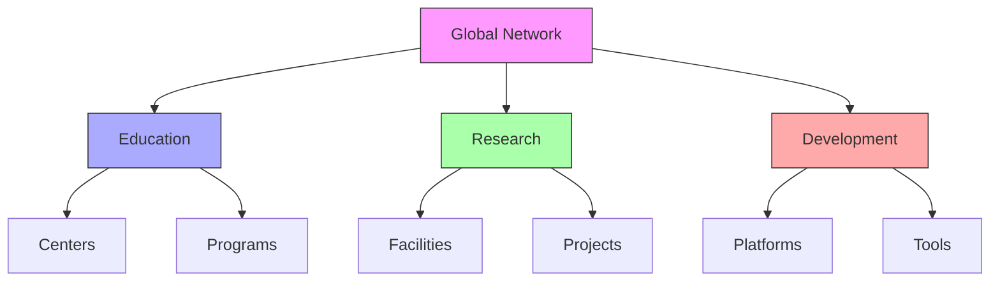
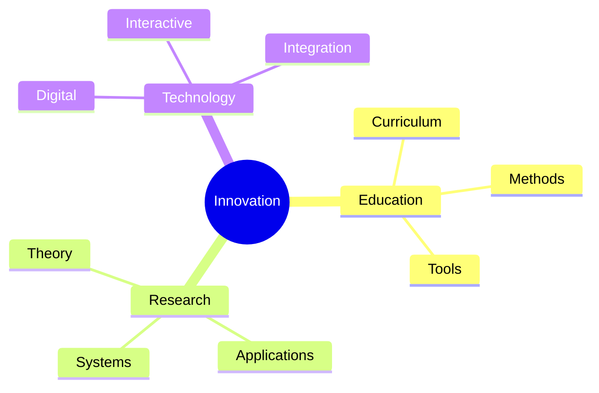

# Martian Math

Martian Math represents an alternative mathematical framework developed by [[people/Kirby_Urner|Kirby Urner]], integrating [[concepts/Synergetics|Fuller's Synergetics]] with educational mathematics through tetrahedral rather than cubic thinking. This approach, developed at [[places/Portland|Portland]]'s [[School_of_Tomorrow|School of Tomorrow]], offers a fundamental reimagining of mathematical education.

## Historical Development

### Origins and Evolution

### Key Influences
1. [[people/Fuller_Buckminster|Buckminster Fuller]]
   - [[concepts/Synergetics|Synergetics principles]]
   - [[concepts/Vector_Equilibrium|Vector mathematics]]
   - [[concepts/System_Wholeness|System thinking]]
   - [[concepts/Design_Science|Design methodology]]

2. Modern Mathematics
   - [[concepts/Quantum_Geometry|Quantum theory]]
   - [[concepts/Geometric_Topology|Topological studies]]
   - [[concepts/Digital_Mathematics|Computational methods]]
   - [[concepts/Pattern_Recognition|Pattern analysis]]

## Philosophical Foundation

### Conceptual Framework

### Core Philosophy
1. [[concepts/Tetrahedral_Thinking|Tetrahedral Basis]]
   - Minimum structural system
   - Natural coordination
   - System stability
   - Vector relationships

2. [[concepts/Alternative_Mathematics|Alternative Framework]]
   - Non-cubic perspective
   - Natural patterns
   - System dynamics
   - Integrated approach

## Mathematical Structure

### Geometric Foundation

### Mathematical Components
1. [[concepts/Vector_Mathematics|Vector Systems]]
   - Tetrahedral coordinates
   - Angular relationships
   - Spatial patterns
   - System dynamics

2. [[concepts/System_Mathematics|System Integration]]
   - Pattern recognition
   - Dynamic relationships
   - Natural systems
   - Computational methods

## Educational Implementation

### Teaching Framework
1. [[concepts/Design_Science_Education|Educational Methods]]
   - Project-based learning
   - Interactive systems
   - Digital integration
   - Pattern recognition

2. [[concepts/School_of_Tomorrow|Curriculum Development]]
   - [[concepts/Digital_Mathematics|Digital tools]]
   - [[concepts/Interactive_Learning|Interactive methods]]
   - [[concepts/Project_Based_Learning|Project work]]
   - [[concepts/System_Integration|Integration]]

### Learning Pathways

## Digital Integration

### Computational Framework
1. [[concepts/Digital_Tools|Digital Implementation]]
   - Interactive platforms
   - Visualization tools
   - Computational models
   - Analysis systems

2. [[concepts/Educational_Technology|Educational Technology]]
   - Learning platforms
   - Interactive tools
   - Project management
   - Assessment systems

### Technology Framework

## Research Applications

### Scientific Integration
1. [[concepts/Quantum_Systems|Quantum Applications]]
   - Spacetime geometry
   - Quantum gravity
   - Tetrahedral models
   - System relationships

2. [[concepts/Biological_Systems|Biological Systems]]
   - Natural patterns
   - Growth systems
   - Structural analysis
   - Dynamic relationships

### Research Framework

## Global Network

### Implementation Centers
1. [[School_of_Tomorrow|Primary Location]]
   - Curriculum development
   - Teacher training
   - Research center
   - Digital hub

2. [[concepts/Global_Network|Network Development]]
   - Educational centers
   - Research facilities
   - Digital platforms
   - Collaboration hubs

### Network Structure

## Future Directions

### Development Areas
1. [[concepts/Educational_Innovation|Educational Evolution]]
   - Curriculum expansion
   - Digital integration
   - Global implementation
   - Research development

2. [[concepts/Mathematical_Innovation|Mathematical Development]]
   - Theoretical expansion
   - Application areas
   - Integration methods
   - System evolution

### Innovation Framework

## References

### Primary Sources
1. [[books/Digital_Mathematics|Digital Mathematics Curriculum]]
2. [[books/Martian_Math|Martian Math: An Alternative Approach]]
3. [[books/Synergetics_Book|Synergetics: Explorations in the Geometry of Thinking]]

### Related Resources
1. [[papers/Tetrahedral_Thinking|Tetrahedral Thinking in Mathematics]]
2. [[papers/Alternative_Mathematics|Alternative Mathematical Frameworks]]
3. [[papers/Educational_Innovation|Educational Innovation in Mathematics]]

### Online Resources
1. [[resources/Digital_Repository|4D Solutions Digital Repository]]
2. [[resources/Educational_Platform|School of Tomorrow Platform]]
3. [[resources/Research_Database|Martian Math Research Database]]

## Notes
- Integration of Fuller's principles with mathematics education
- Alternative to traditional cubic thinking
- Focus on practical applications
- Digital implementation emphasis
- Global network development
- Continuous innovation and evolution

## Tags
#mathematics #education #geometry #synergetics #tetrahedral-thinking #digital-learning #system-integration 