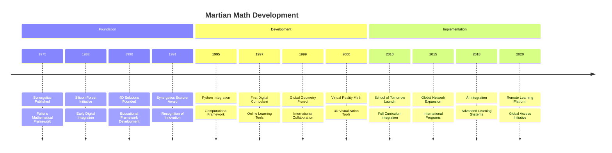
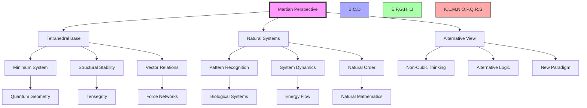
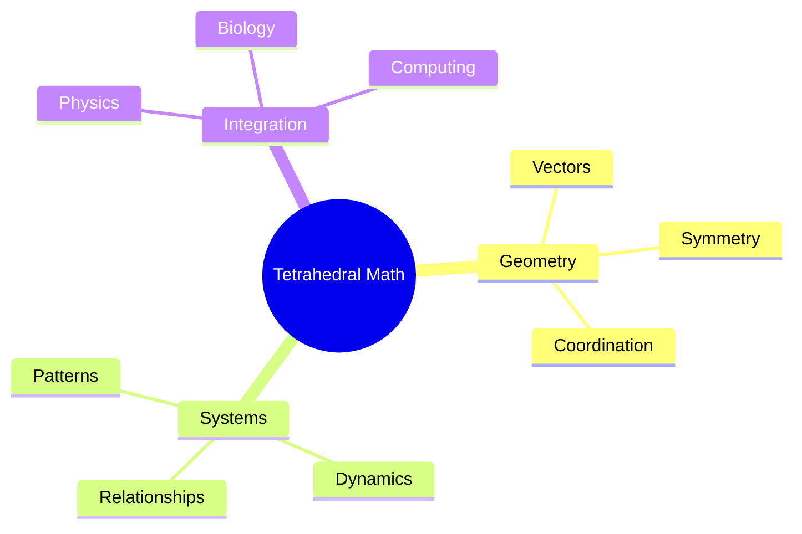
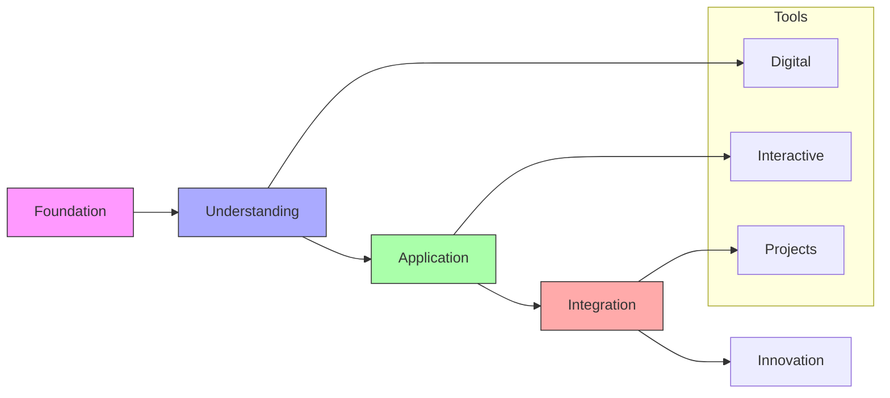
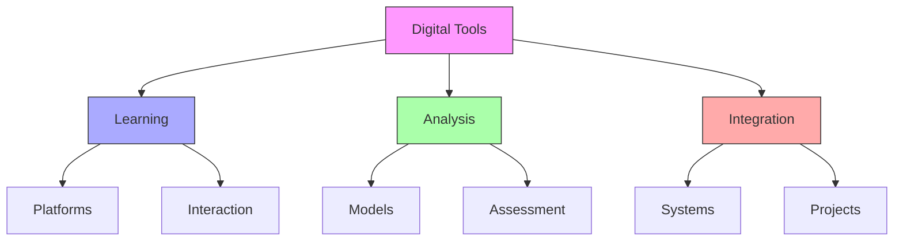
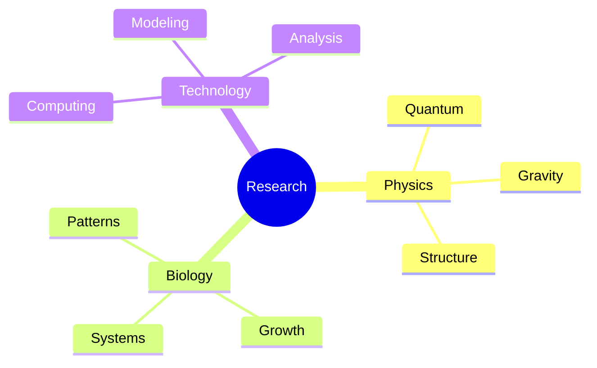
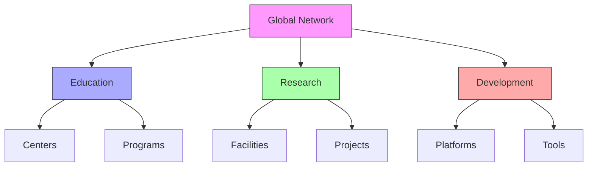
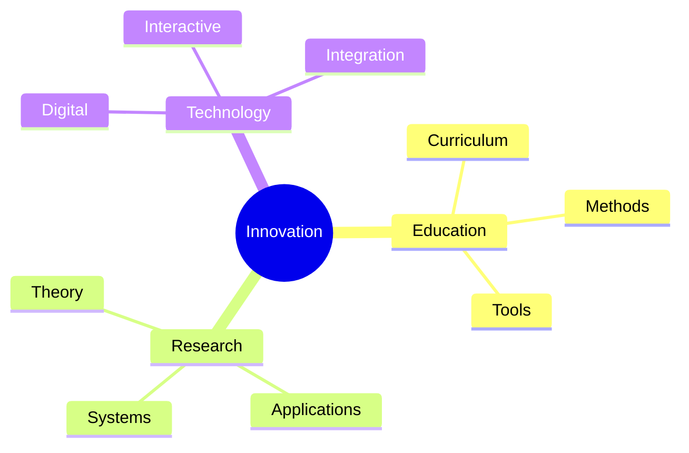

# Martian Math

Martian Math represents an alternative mathematical framework developed by [[people/Kirby_Urner|Kirby Urner]], integrating [[concepts/Synergetics|Fuller's Synergetics]] with educational mathematics through tetrahedral rather than cubic thinking. This approach, developed at [[places/Portland|Portland]]'s [[School_of_Tomorrow|School of Tomorrow]], offers a fundamental reimagining of mathematical education aligned with [[concepts/Comprehensive_Anticipatory_Design_Science|Fuller's CADS principles]].

## Historical Development

### Origins and Evolution

### Key Influences
1. [[people/Fuller_Buckminster|Buckminster Fuller]]
   - [[concepts/Synergetics|Synergetics principles]] (1975-1979)
   - [[concepts/Vector_Equilibrium|Vector mathematics]] in nature
   - [[concepts/System_Wholeness|System thinking]] approach
   - [[concepts/Design_Science|Design methodology]] integration
   - [[concepts/Geodesic_Mathematics|Geodesic mathematics]]

2. [[concepts/Silicon_Forest|Silicon Forest]] Connection
   - [[organizations/4D_Solutions|4D Solutions]] development
   - [[concepts/Digital_Mathematics|Digital integration]]
   - [[concepts/Python_Education|Python programming]]
   - [[concepts/Open_Source_Education|Open source]] principles

3. [[concepts/Educational_Innovation|Educational Evolution]]
   - [[concepts/Project_Based_Learning|Project-based approach]]
   - [[concepts/STEM_Integration|STEM integration]]
   - [[concepts/Digital_Literacy|Digital literacy]]
   - [[concepts/Global_Education|Global perspective]]

## Philosophical Foundation

### Conceptual Framework

### Core Philosophy
1. [[concepts/Tetrahedral_Thinking|Tetrahedral Basis]]
   - Connection to [[concepts/Vector_Equilibrium|VE]]
   - [[concepts/Natural_Systems|Natural system]] alignment
   - [[concepts/Structural_Efficiency|Structural efficiency]]
   - [[concepts/Energy_Mathematics|Energy mathematics]]

2. [[concepts/Alternative_Mathematics|Alternative Framework]]
   - [[concepts/Non_Euclidean|Non-Euclidean geometry]]
   - [[concepts/Pattern_Language|Pattern recognition]]
   - [[concepts/System_Dynamics|Dynamic systems]]
   - [[concepts/Quantum_Mathematics|Quantum integration]]

## Mathematical Structure

### Geometric Foundation

### Mathematical Components
1. [[concepts/Vector_Mathematics|Vector Systems]]
   - Tetrahedral coordinates
   - Angular relationships
   - Spatial patterns
   - System dynamics

2. [[concepts/System_Mathematics|System Integration]]
   - Pattern recognition
   - Dynamic relationships
   - Natural systems
   - Computational methods

## Educational Implementation

### Teaching Framework
1. [[concepts/Design_Science_Education|Educational Methods]]
   - Project-based learning
   - Interactive systems
   - Digital integration
   - Pattern recognition

2. [[concepts/School_of_Tomorrow|Curriculum Development]]
   - [[concepts/Digital_Mathematics|Digital tools]]
   - [[concepts/Interactive_Learning|Interactive methods]]
   - [[concepts/Project_Based_Learning|Project work]]
   - [[concepts/System_Integration|Integration]]

### Learning Pathways

## Digital Integration

### Computational Framework
1. [[concepts/Digital_Tools|Digital Implementation]]
   - Interactive platforms
   - Visualization tools
   - Computational models
   - Analysis systems

2. [[concepts/Educational_Technology|Educational Technology]]
   - Learning platforms
   - Interactive tools
   - Project management
   - Assessment systems

### Technology Framework

## Research Applications

### Scientific Integration
1. [[concepts/Quantum_Systems|Quantum Applications]]
   - Spacetime geometry
   - Quantum gravity
   - Tetrahedral models
   - System relationships

2. [[concepts/Biological_Systems|Biological Systems]]
   - Natural patterns
   - Growth systems
   - Structural analysis
   - Dynamic relationships

### Research Framework

## Global Network

### Implementation Centers
1. [[School_of_Tomorrow|Primary Location]]
   - Curriculum development
   - Teacher training
   - Research center
   - Digital hub

2. [[concepts/Global_Network|Network Development]]
   - Educational centers
   - Research facilities
   - Digital platforms
   - Collaboration hubs

### Network Structure

## Future Directions

### Development Areas
1. [[concepts/Educational_Innovation|Educational Evolution]]
   - Curriculum expansion
   - Digital integration
   - Global implementation
   - Research development

2. [[concepts/Mathematical_Innovation|Mathematical Development]]
   - Theoretical expansion
   - Application areas
   - Integration methods
   - System evolution

### Innovation Framework

## Educational Applications

### Modern Integration
1. [[concepts/Digital_Learning|Digital Platform]]
   - [[tools/Virtual_Reality_Math|VR Mathematics]]
   - [[tools/Augmented_Reality_Learning|AR Integration]]
   - [[tools/Interactive_Geometry|3D Geometry Tools]]
   - [[tools/Computational_Thinking|Programming Integration]]

2. [[concepts/Global_Classroom|Global Implementation]]
   - [[networks/School_Network|International Schools]]
   - [[platforms/Learning_Management|Digital Platform]]
   - [[tools/Collaboration_Tools|Remote Learning]]
   - [[systems/Assessment_Framework|Modern Assessment]]

### Research Directions
1. [[concepts/Quantum_Education|Quantum Integration]]
   - [[research/Quantum_Geometry|Geometric Foundations]]
   - [[research/Spacetime_Mathematics|Spacetime Models]]
   - [[research/Pattern_Recognition|Pattern Analysis]]
   - [[research/System_Dynamics|Dynamic Systems]]

2. [[concepts/Biological_Mathematics|Biological Systems]]
   - [[research/Growth_Patterns|Natural Growth]]
   - [[research/System_Evolution|Evolution Models]]
   - [[research/Energy_Flow|Energy Systems]]
   - [[research/Pattern_Formation|Pattern Development]]

## References

### Primary Sources
1. [[books/Digital_Mathematics|Digital Mathematics Curriculum]] (1995)
2. [[books/Martian_Math|Martian Math: An Alternative Approach]] (1997)
3. [[books/Synergetics_Education|Synergetics in Education]] (1982)
4. [[papers/Tetrahedral_Mathematics|Foundations of Tetrahedral Mathematics]] (1990)
5. [[documents/Python_Education|Python in Mathematics Education]] (1999)
6. [[research/Virtual_Mathematics|Virtual Reality in Mathematics]] (2015)

### Historical Documents
1. [[archives/Fuller_Mathematics|Fuller's Mathematical Notes]] (1975-1983)
2. [[archives/Silicon_Forest_Initiative|Silicon Forest Educational Program]] (1985)
3. [[archives/4D_Solutions|4D Solutions Development History]] (1990-2020)
4. [[archives/School_Tomorrow|School of Tomorrow Foundation]] (2010)

### Contemporary Research
1. [[papers/Digital_Integration|Digital Mathematics Integration]] (2020)
2. [[papers/Global_Implementation|Global Educational Implementation]] (2018)
3. [[papers/Virtual_Learning|Virtual Mathematics Learning]] (2019)
4. [[papers/Quantum_Education|Quantum Mathematics Education]] (2021)

## Notes
- Integration with [[concepts/Design_Science|Design Science]]
- Connection to [[concepts/World_Game|World Game]] principles
- Alignment with [[concepts/Global_Education|Global Education]]
- Foundation for [[concepts/Future_Education|Future Education]]

## Tags
#mathematics #education #geometry #synergetics #tetrahedral-thinking #digital-learning #system-integration #design-science #future-education 