# Mermaid Style Guide for Autonomous Agents

## Overview

This style guide provides standards and patterns for creating Mermaid diagrams in the context of autonomous agents and system documentation.

## General Principles

### Color Scheme
```yaml
standard_colors:
  main_node: "#f9f"  # Primary/Root nodes
  sub_node: "#aaf"   # Secondary/Category nodes
  detail_node: "#afa" # Tertiary/Detail nodes
  leaf_node: "#faa"  # Final/Implementation nodes
  
stroke_styles:
  primary: "stroke:#333,stroke-width:4px"
  secondary: "stroke:#333,stroke-width:2px"
  standard: "stroke:#333"
```

### Standard Class Definitions
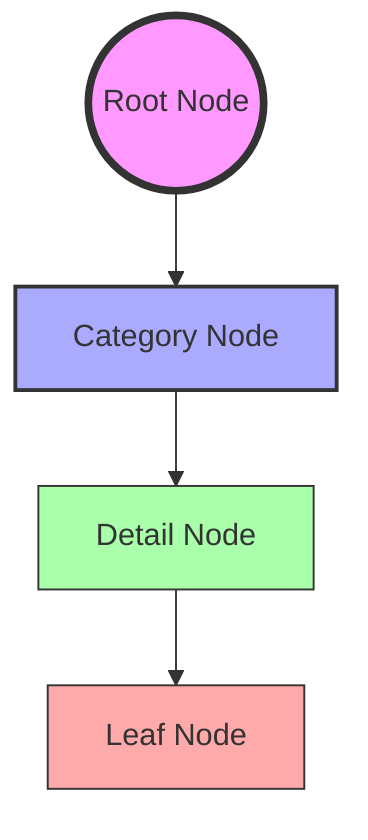

## Diagram Types and Use Cases

### 1. System Architecture (graph TD)
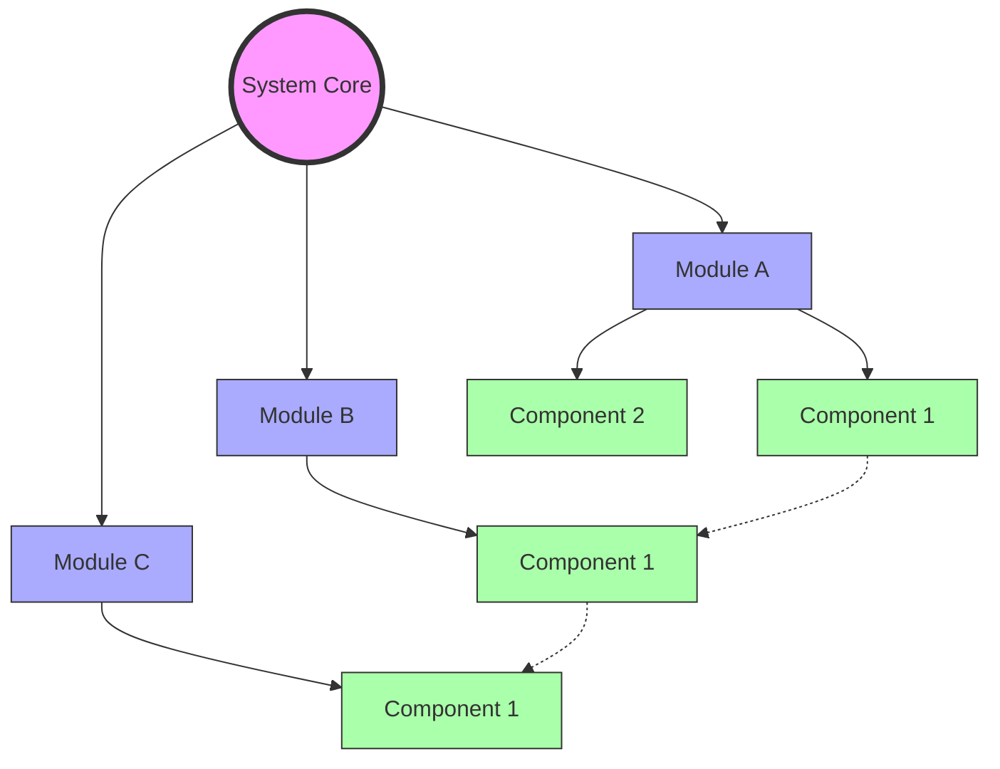

### 2. Process Flows (flowchart)
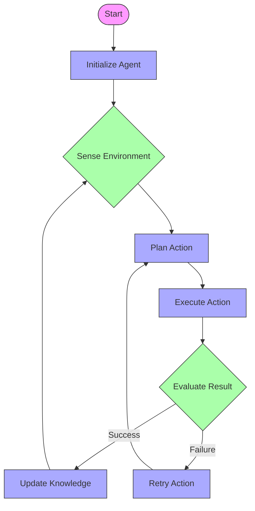

### 3. State Machines (stateDiagram-v2)
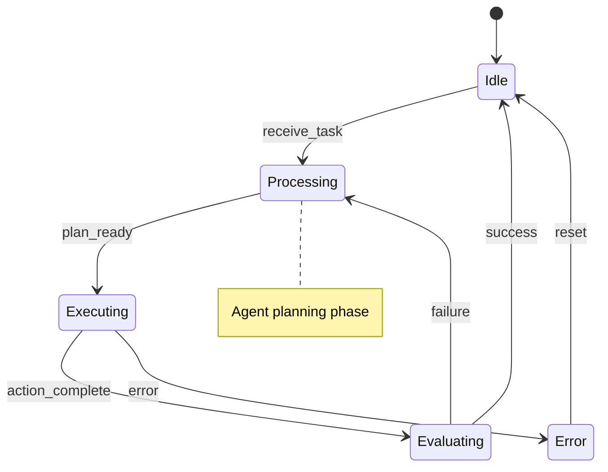

### 4. Sequence Diagrams (for Agent Interactions)
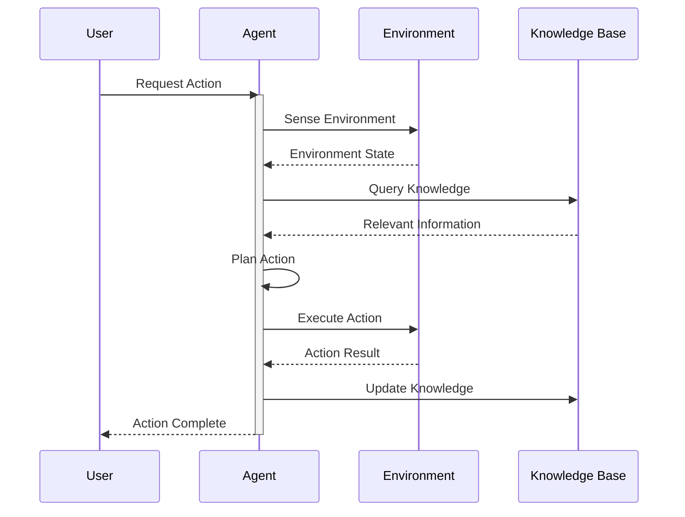

### 5. Hierarchical Systems (graph TD with subgraphs)
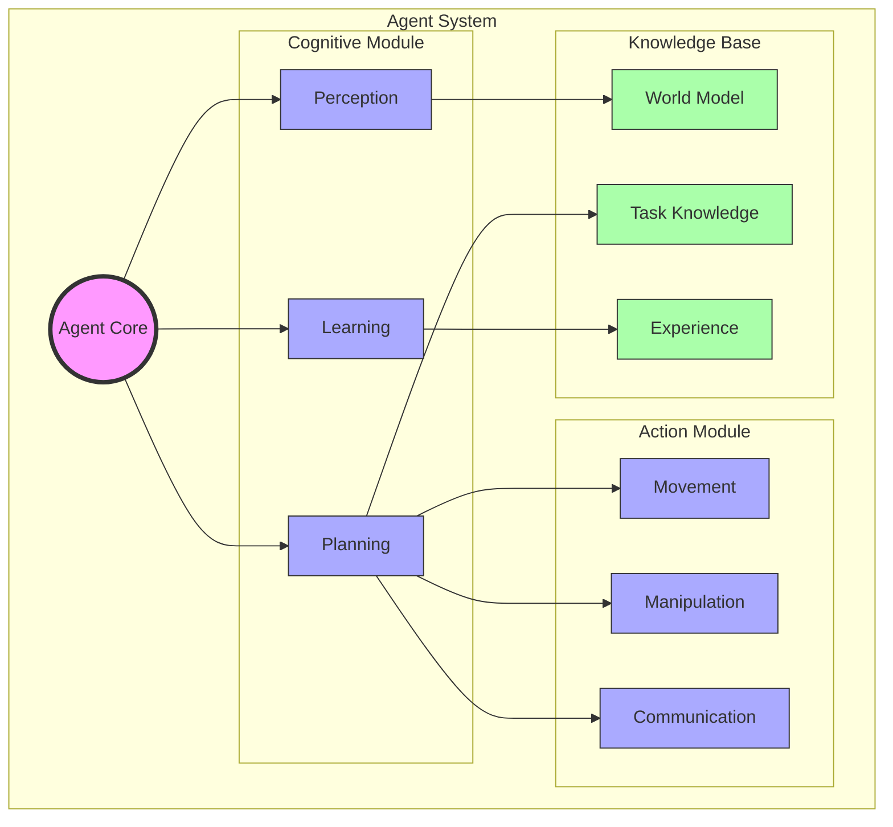

## Best Practices

### 1. Node Naming Conventions
```yaml
naming_conventions:
  root_nodes: "ALL_CAPS or PascalCase with (( ))"
  category_nodes: "PascalCase with [ ]"
  detail_nodes: "CamelCase with [ ]"
  action_nodes: "verbNoun with ( )"
```

### 2. Relationship Types
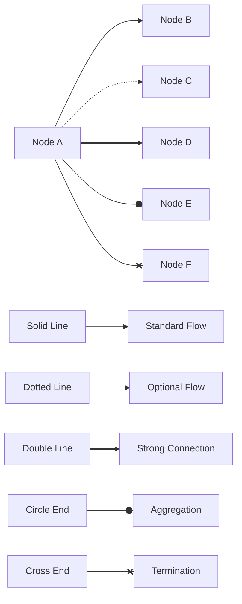

### 3. Subgraph Organization
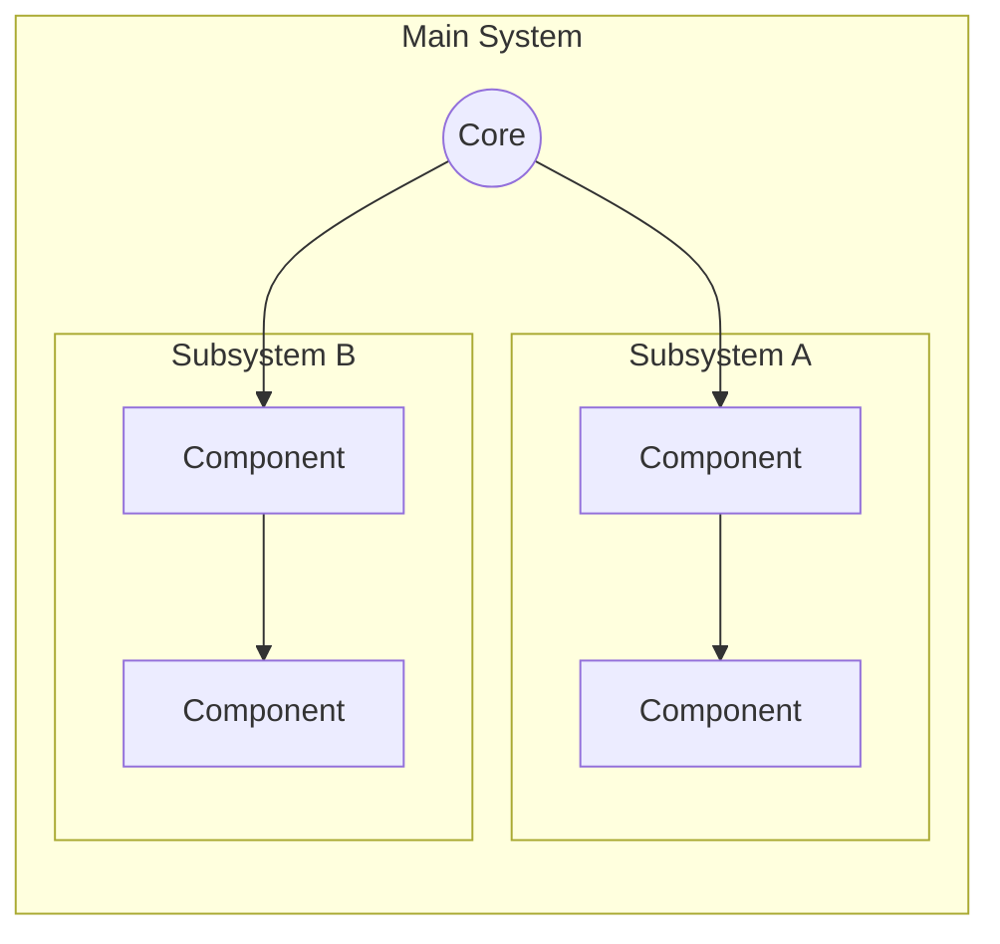

### 4. Documentation Comments
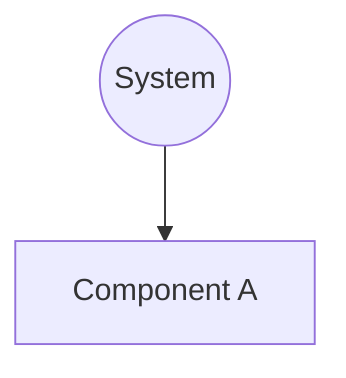

## Implementation Examples

### 1. Agent Architecture
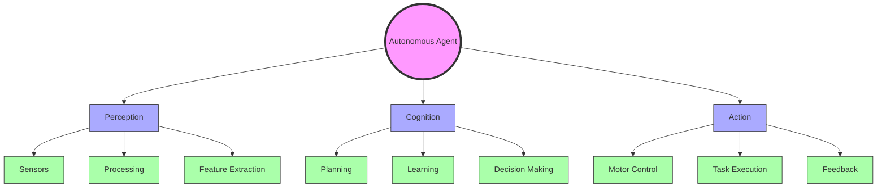

### 2. Knowledge Integration
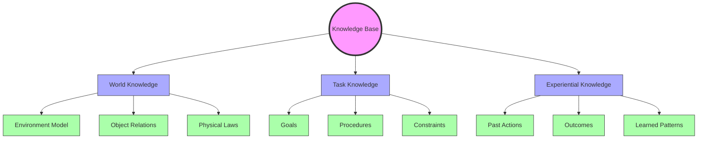

## Maintenance and Updates

### Version Control
- Use clear commit messages for diagram updates
- Document significant changes in diagram structure
- Maintain backward compatibility when possible

### Quality Checks
- Verify all nodes are properly connected
- Ensure consistent styling across diagrams
- Check for proper nesting in subgraphs
- Validate relationship logic

## References

1. [Mermaid JS Documentation](https://mermaid.js.org/)
2. [Graph Theory Fundamentals](https://en.wikipedia.org/wiki/Graph_theory)
3. [System Architecture Patterns](https://en.wikipedia.org/wiki/Architectural_pattern)

## Tags
#documentation #diagrams #system-design #autonomous-agents #visualization 