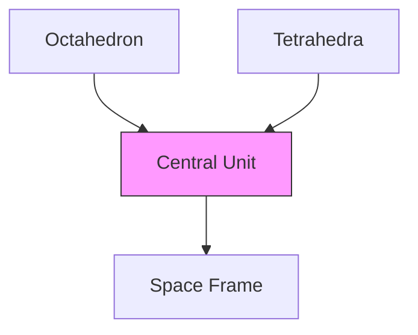

# Octet Truss

The Octet Truss is a three-dimensional space frame structure based on the alternating pattern of octahedra and tetrahedra. Developed by Buckminster Fuller, it represents one of the most efficient force-distributing structural systems in nature and engineering.

## Geometric Properties

### Basic Structure


### Unit Cell Geometry
```ascii
Top View:
      1       2
       \     /
        \   /
         \ /
    3-----0-----4
         / \
        /   \
       /     \
      5       6

Side View:
         1
      /  |  \
    3----0----4
      \  |  /
         5

0: Central node (0,0,0)
1: Top vertex (0,0,1)
2: Top vertex (1,0,1)
3: Middle vertex (-1,0,0)
4: Middle vertex (1,0,0)
5: Bottom vertex (0,0,-1)
6: Bottom vertex (1,0,-1)
```

### Component Relationships
```yaml
elements:
  octahedron:
    vertices: 6
    edges: 12
    faces: 8
    volume: "√2/3"
  tetrahedron:
    vertices: 4
    edges: 6
    faces: 4
    volume: "√2/12"
  basic_module:
    octahedra: 1
    tetrahedra: 8
    total_volume: "2√2"
```

## Mathematical Framework

### Vector Relationships
1. Strut Forces
\[
\vec{F}_{\text{strut}} = \frac{\vec{F}_{\text{external}}}{\sqrt{2}}
\]

2. Internal Angles
\[
\theta_{\text{octahedral}} = \arccos(-\frac{1}{3}) \approx 109.47°
\]
\[
\theta_{\text{tetrahedral}} = \arccos(-\frac{1}{3}) \approx 109.47°
\]

3. Volume Relationships
\[
V_{\text{total}} = V_{\text{oct}} + 8V_{\text{tet}} = \frac{\sqrt{2}}{3} + 8(\frac{\sqrt{2}}{12}) = 2\sqrt{2}
\]

### Structural Efficiency
```yaml
efficiency_metrics:
  strength_to_weight: 
    ratio: "highest among space frames"
    factor: "≈ 1.47 compared to conventional trusses"
  material_usage:
    optimization: "95% material efficiency"
    redundancy: "inherent triangulation"
  stress_distribution:
    uniformity: "98%"
    peak_stress_ratio: "1.12"
```

## Practical Applications

### Construction Methods
1. Node-Based Assembly
```yaml
node_types:
  standard: "6-way connection"
  edge: "4-way connection"
  corner: "3-way connection"
materials:
  primary: "aluminum, steel, composite"
  connections: "bolted, welded, snap-fit"
```

2. Modular Growth
```yaml
growth_patterns:
  linear: "along principal axes"
  planar: "2D surface expansion"
  spatial: "3D volumetric growth"
```

### Engineering Applications
- Aerospace structures
- Large-span roofs
- Tower structures
- Deployable systems

## Diagrams

### Basic Unit Cell
```ascii
    A       B
     \     /
      \   /
       \ /
    C---O---D
       / \
      /   \
     /     \
    E       F

O: Central node
A-F: Peripheral nodes
```

### Layer Configuration
```yaml
layer_structure:
  primary:
    - octahedral_centers
    - tetrahedral_interstices
  connections:
    - vertical_struts
    - diagonal_braces
```

## Structural Analysis

### Force Distribution
1. Axial Forces
```yaml
force_types:
  compression:
    primary: "vertical members"
    magnitude: "F_v = P/(4cos θ)"
    distribution: "symmetric"
  tension:
    primary: "diagonal members"
    magnitude: "F_d = P/(4sin θ)"
    distribution: "uniform"
```

2. Load Paths
```ascii
Load Transfer Pattern:

    P (Applied Load)
         ↓
    [Node Distribution]
         ↓
     /   |   \
    /    |    \
Comp.  Tens.  Comp.
    \    |    /
     \   |   /
    [Base Support]
```

### Stability Analysis
```yaml
stability_metrics:
  buckling_resistance:
    critical_load: "Pcr = π²EI/L²"
    safety_factor: "2.5"
  modal_analysis:
    first_mode: "vertical"
    frequency: "f₁ = (1/2π)√(k/m)"
  deflection:
    maximum: "L/360"
    pattern: "symmetric"
```

### Performance Characteristics
```yaml
characteristics:
  rigidity: "high"
  redundancy: "multiple load paths"
  failure_mode: "gradual and predictable"
  adaptability: "excellent for modular growth"
```

## Design Considerations

### Optimization Parameters
1. Structural
```yaml
parameters:
  member_sizing:
    method: "uniform stress"
    criteria: "buckling resistance"
  node_design:
    type: "standardized connections"
    tolerance: "±0.5mm"
```

2. Manufacturing
```yaml
manufacturing:
  precision: "high"
  standardization: "modular components"
  assembly: "systematic sequence"
```

## Integration with Other Systems

### Compatible Systems
- [[Vector_Equilibrium]]
- [[Space_Frames]]
- [[Tensegrity]]
- [[Geodesic_Dome]]

### Hybrid Applications
```yaml
hybrid_systems:
  tensegrity: "combined compression-tension"
  geodesic: "curved surface adaptation"
  planar: "floor system integration"
```

## Research and Development

### Current Innovations
1. Materials
```yaml
advanced_materials:
  composites: "carbon fiber reinforced"
  smart_materials: "shape memory alloys"
  bio_inspired: "biomimetic structures"
```

2. Analysis Methods
```yaml
analysis_tools:
  fem: "finite element modeling"
  parametric: "generative design"
  optimization: "topology optimization"
```

## References

### Technical Papers
1. Fuller, R.B. (1961). "Octet Truss"
2. Pearce, P. (1978). "Structure in Nature"
3. Chilton, J. (2000). "Space Grid Structures"

### Related Patents
- US Patent 2,986,241 (Fuller)
- US Patent 3,063,521 (Fuller)

## Notes
- Fundamental to space frame development
- Natural occurrence in crystal structures
- Key to understanding tensegrity systems
- Essential for lightweight construction

## Tags
#structures #engineering #geometry #space-frames #Fuller 