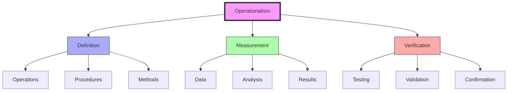
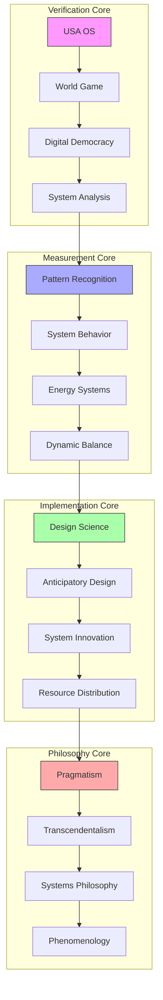
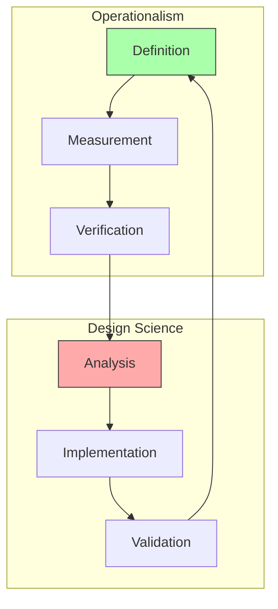
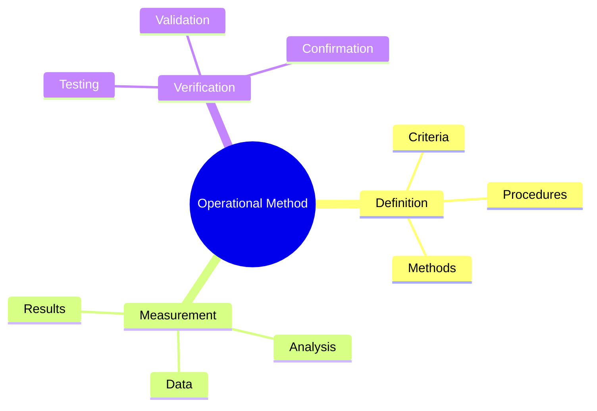

# Operationalism

Operationalism represents a philosophical and methodological approach that influenced Fuller's [[concepts/Design_Science|Design Science]], emphasizing the importance of defining concepts through specific operations and measurements.

## Core Principles

### Philosophical Framework


### Key Elements
1. Operational Definitions
   - Measurable criteria
   - Specific procedures
   - Clear methods
   - Verifiable results

2. Verification Process
   - Data collection
   - Analysis methods
   - Result validation
   - Confirmation procedures

## Epic Connections

### Verification Networks
```mermaid
mindmap
    root((Operationalism))
        System Verification
            [[USA_OS|Operating System Validation]]
            [[World_Game|Resource Verification]]
            [[Digital_Democracy|Network Validation]]
            [[System_Analysis|Analysis Methods]]
        Measurement Systems
            [[Pattern_Recognition|Pattern Validation]]
            [[System_Behavior|Behavior Verification]]
            [[Energy_Systems|Flow Measurement]]
            [[Dynamic_Balance|Equilibrium Testing]]
        Implementation Methods
            [[Design_Science|Method Validation]]
            [[Anticipatory_Design|Planning Verification]]
            [[System_Innovation|Evolution Testing]]
            [[Resource_Distribution|Distribution Validation]]
        Philosophical Integration
            [[Pragmatism|Practical Verification]]
            [[Transcendentalism|Unity Validation]]
            [[Systems_Philosophy|Systems Verification]]
            [[Phenomenology|Experience Validation]]
```

### System Weaving


### Integration Framework
```yaml
operational_networks:
  system_verification:
    usa_os:
      method: "Operating system validation"
      connection: "[[USA_OS]]"
    world_game:
      method: "Resource verification"
      connection: "[[World_Game]]"
    digital_democracy:
      method: "Network validation"
      connection: "[[Digital_Democracy]]"
    system_analysis:
      method: "Analysis methods"
      connection: "[[System_Analysis]]"

  measurement_systems:
    pattern_recognition:
      system: "Pattern validation"
      connection: "[[Pattern_Recognition]]"
    system_behavior:
      system: "Behavior verification"
      connection: "[[System_Behavior]]"
    energy_systems:
      system: "Flow measurement"
      connection: "[[Energy_Systems]]"
    dynamic_balance:
      system: "Equilibrium testing"
      connection: "[[Dynamic_Balance]]"

  implementation_methods:
    design_science:
      method: "Method validation"
      connection: "[[Design_Science]]"
    anticipatory_design:
      method: "Planning verification"
      connection: "[[Anticipatory_Design]]"
    system_innovation:
      method: "Evolution testing"
      connection: "[[System_Innovation]]"
    resource_distribution:
      method: "Distribution validation"
      connection: "[[Resource_Distribution]]"

  philosophical_integration:
    pragmatism:
      framework: "Practical verification"
      connection: "[[Pragmatism]]"
    transcendentalism:
      framework: "Unity validation"
      connection: "[[Transcendentalism]]"
    systems_philosophy:
      framework: "Systems verification"
      connection: "[[Systems_Philosophy]]"
    phenomenology:
      framework: "Experience validation"
      connection: "[[Phenomenology]]"
```

### USA OS Integration
```mermaid
mindmap
    root((USA OS Verification))
        System Protocols
            [[System_Analysis|Analysis Methods]]
            [[Pattern_Recognition|Pattern Testing]]
            [[System_Behavior|Behavior Validation]]
            [[Energy_Systems|Flow Verification]]
        Resource Validation
            [[Resource_Distribution|Distribution Testing]]
            [[World_Game|Simulation Verification]]
            [[Digital_Democracy|Network Testing]]
            [[Global_University|Education Validation]]
        Implementation Testing
            [[Design_Science|Method Testing]]
            [[Anticipatory_Design|Planning Validation]]
            [[System_Innovation|Evolution Testing]]
            [[Pattern_Formation|Development Verification]]
        Philosophical Methods
            [[Pragmatism|Practical Testing]]
            [[Transcendentalism|Unity Verification]]
            [[Systems_Philosophy|Systems Validation]]
            [[Phenomenology|Experience Testing]]
```

## Integration with Fuller's Work

### Design Science Connection


### Application Areas
1. [[concepts/System_Analysis|System Analysis]]
   - Operational definitions
   - Measurement methods
   - Verification procedures
   - Result validation

2. [[concepts/Pattern_Recognition|Pattern Recognition]]
   - Pattern definition
   - Measurement criteria
   - Analysis methods
   - Verification processes

## Methodological Framework

### Analysis Process


### Implementation Strategy
1. [[concepts/System_Innovation|System Innovation]]
   - Operational design
   - Measurement systems
   - Verification methods
   - Result validation

2. [[concepts/Design_Science|Design Integration]]
   - Method definition
   - Process measurement
   - System verification
   - Result confirmation

## Educational Applications

### Learning Framework
1. [[concepts/Design_Science_Education|Educational Methods]]
   - Operational learning
   - Measurement skills
   - Verification techniques
   - Result analysis

2. [[concepts/Global_University|Global Implementation]]
   - Standard methods
   - Universal measures
   - Verification systems
   - Result sharing

### Teaching Methods


## Influence on Fuller's Work

### Key Impacts
1. Design Methods
   - Operational definitions
   - Measurement systems
   - Verification procedures
   - Result validation

2. System Development
   - Process definition
   - Analysis methods
   - Testing procedures
   - Validation systems

## References

### Primary Sources
1. [[books/Operational_Philosophy|The Logic of Modern Physics]]
2. [[books/Design_Science|Design Science Methods]]
3. [[books/Synergetics_Book|Synergetics]]

### Related Resources
1. [[papers/Operational_Method|The Operational Method]]
2. [[papers/Design_Verification|Design Verification Methods]]
3. [[papers/System_Validation|System Validation Procedures]]

## Notes
- Critical influence on Fuller's methodology
- Integration with design science methods
- Focus on measurable results
- Verification-based approach

## Tags
#philosophy #methodology #verification #measurement #systems-thinking 