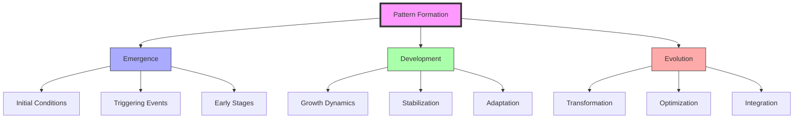
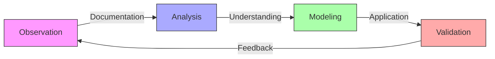
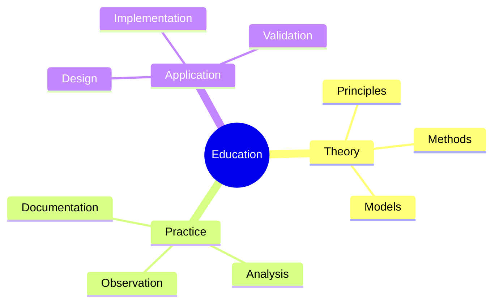

# Pattern Formation

Pattern Formation represents the study of how patterns emerge, develop, and evolve in [[concepts/Natural_Systems|natural]] and [[concepts/Design_Science|designed systems]], integrating principles from [[concepts/Pattern_Recognition|pattern recognition]] with [[concepts/Dynamic_Patterns|dynamic behavior]] understanding.

## System Overview

## Core Components

### Formation Principles
1. [[concepts/Emergence_Patterns|Emergence Dynamics]]
   - Initial conditions
   - Triggering mechanisms
   - Early development
   - Pattern stabilization

2. [[concepts/Growth_Dynamics|Growth Processes]]
   - Development stages
   - Scaling patterns
   - Adaptation methods
   - Integration processes

### Pattern Types
1. [[concepts/Natural_Patterns|Natural Patterns]]
   - [[concepts/Crystal_Formation|Crystalline growth]]
   - [[concepts/Biological_Growth|Biological development]]
   - [[concepts/Ecological_Patterns|Ecosystem patterns]]
   - [[concepts/Weather_Patterns|Atmospheric systems]]

2. [[concepts/Design_Patterns|Designed Patterns]]
   - [[concepts/Structural_Growth|Structural development]]
   - [[concepts/Network_Formation|Network evolution]]
   - [[concepts/System_Organization|System organization]]
   - [[concepts/Innovation_Patterns|Innovation development]]

## Integration with Systems

### Natural Systems
1. [[concepts/Living_Systems|Biological Applications]]
   - Cell development
   - Tissue formation
   - Organism growth
   - Population patterns

2. [[concepts/Physical_Systems|Physical Applications]]
   - Crystal growth
   - Material formation
   - Energy patterns
   - Force distributions

### Design Applications
1. [[concepts/Design_Science|Design Integration]]
   - Pattern-based design
   - Growth modeling
   - Development planning
   - Evolution strategies

2. [[concepts/System_Innovation|Innovation Methods]]
   - Pattern discovery
   - Development methods
   - Implementation strategies
   - Evolution planning

## Research Methods

### Analysis Framework

### Study Methods
1. [[concepts/Pattern_Analysis|Pattern Analysis]]
   - Formation tracking
   - Development mapping
   - Evolution modeling
   - Validation methods

2. [[concepts/Pattern_Tools|Research Tools]]
   - Documentation systems
   - Analysis software
   - Modeling platforms
   - Validation frameworks

## Educational Integration

### Learning Framework

### Teaching Methods
1. [[concepts/Pattern_Education|Educational Programs]]
   - Formation principles
   - Development studies
   - Evolution analysis
   - Application methods

2. [[concepts/Pattern_Practice|Practical Training]]
   - Observation skills
   - Analysis techniques
   - Documentation methods
   - Implementation practices

## References

### Primary Sources
1. [[books/Pattern_Formation|Pattern Formation in Nature]]
2. [[books/Growth_and_Form|On Growth and Form]]
3. [[books/Pattern_Development|Pattern Development Studies]]

### Related Resources
1. [[papers/Formation_Analysis|Pattern Formation Analysis]]
2. [[papers/Growth_Studies|Growth Pattern Studies]]
3. [[papers/Evolution_Patterns|Pattern Evolution Research]]

## Notes
- Essential for understanding system development
- Key to pattern-based design
- Foundation for growth analysis
- Critical for system evolution

## Tags
#patterns #dynamics #emergence #systems-thinking #natural-systems 