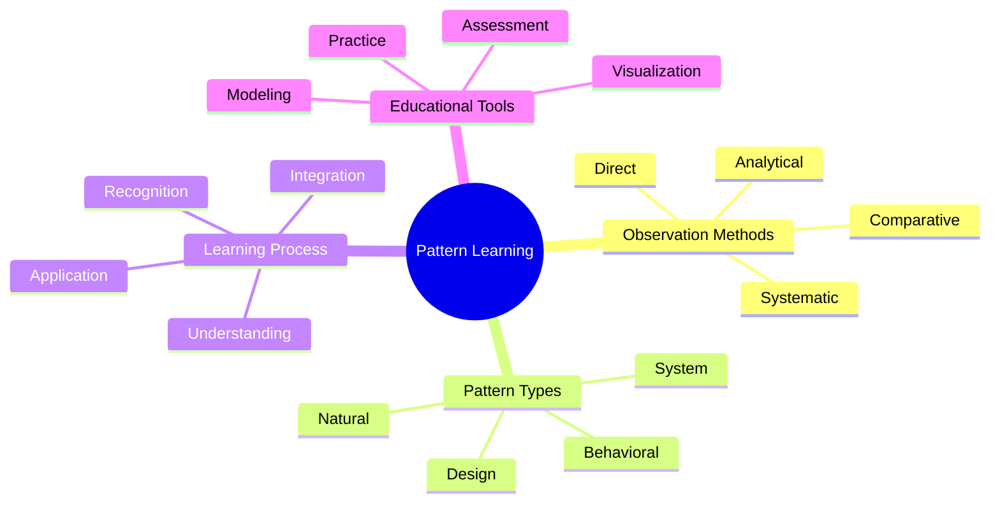
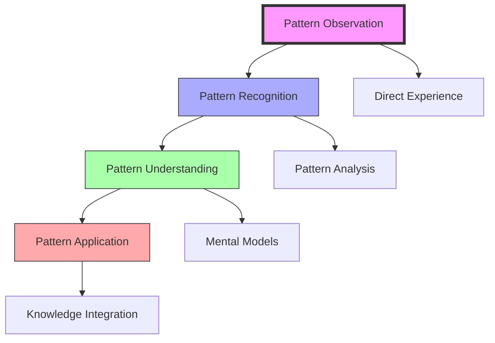
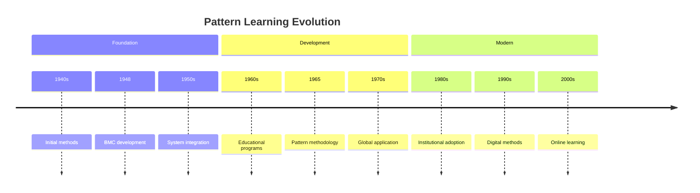
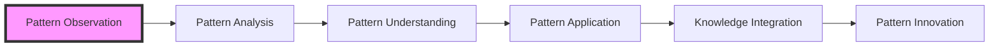
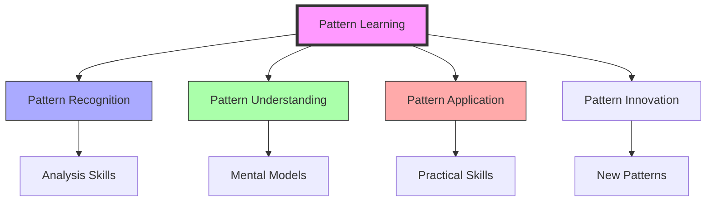

# Pattern Learning

> Fuller's systematic approach to developing pattern recognition and understanding through experiential learning, fundamental to his [[Systems_Education]] and [[Design_Science]] methodologies.

## Core Methodology

### Learning Framework

### Learning Process

## Historical Development

## Educational Methods

### Teaching Approaches
- [[Systems_Education]]
- [[Design_Science_Education]]
- Experiential learning
- Project-based work

### Learning Tools
- Visual models
- System diagrams
- Design exercises
- Pattern analysis

## Implementation

### Educational Settings
- [[Black_Mountain_College]]
- [[Southern_Illinois_University]]
- [[Design_Science_Lab]]
- [[BFI_Headquarters]]

### Teaching Methods

## Pattern Categories

### Natural Patterns
- Growth patterns
- Flow patterns
- Structural patterns
- Energy patterns

### System Patterns
- Organization patterns
- Behavior patterns
- Evolution patterns
- Integration patterns

## Learning Components

### Core Elements
- Pattern observation
- Systematic analysis
- Understanding development
- Practical application

### Educational Tools
- Visual aids
- System models
- Design projects
- Analysis frameworks

## Research Impact

### Areas of Influence
- [[Pattern_Recognition]]
- [[System_Analysis]]
- [[Design_Science]]
- [[World_Game]]

### Learning Innovation
- Teaching methods
- Analysis tools
- Application frameworks
- Assessment systems

## Modern Applications

### Contemporary Use
- Design education
- Systems thinking
- Pattern analysis
- Innovation development

### Digital Integration
- Online learning
- Virtual tools
- Interactive models
- Digital assessment

## Educational Framework

### Learning Objectives

### Teaching Methods
- Direct observation
- Systematic analysis
- Practical application
- Project integration

## Future Development

### Innovation Areas
- Digital platforms
- AI integration
- Virtual reality
- Interactive tools

### Application Domains
- Design education
- Systems thinking
- Innovation training
- Pattern analysis

## References

### Primary Sources
- Fuller, R. B. (1969). *Education Automation*.
- Fuller, R. B. (1975). *Synergetics*.
- [[BFI_Archives]] Educational Materials

### Secondary Sources
- Edmondson, A. C. (2007). *A Fuller Explanation*.
- [[Black_Mountain_College]] Documentation
- Educational Program Records

## See Also

- [[Systems_Education]]
- [[Pattern_Recognition]]
- [[Design_Science_Education]]
- [[System_Analysis]]

## Notes

Pattern Learning represents Fuller's systematic approach to developing pattern recognition and understanding through experiential learning and practical application, forming a core component of his educational methodology. 