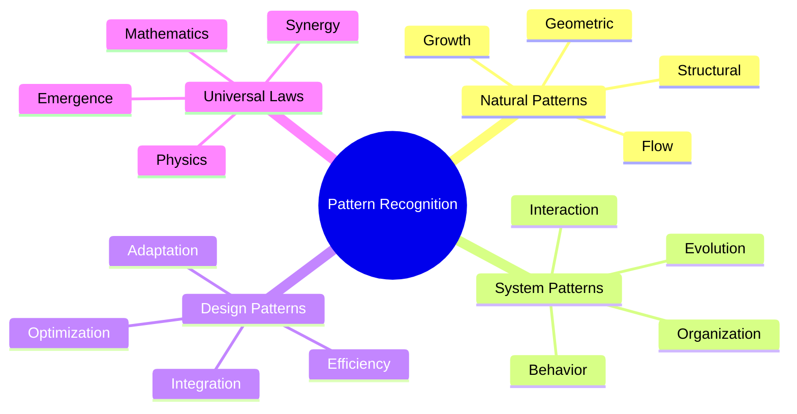
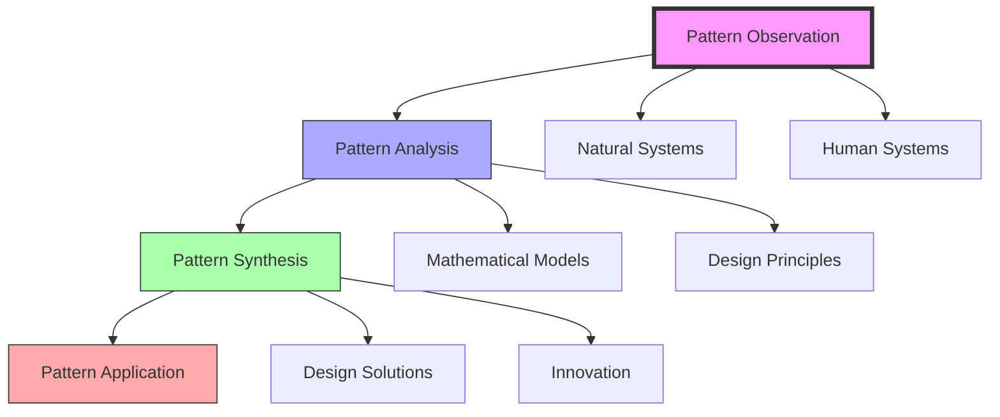
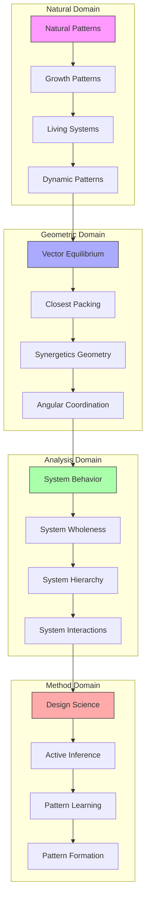
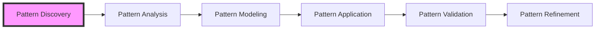
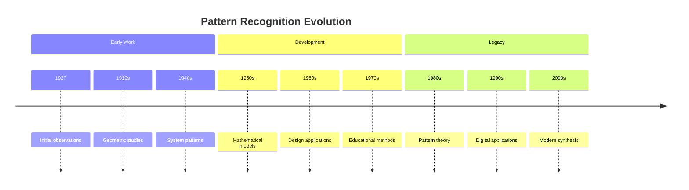

# Pattern Recognition

> Fuller's systematic approach to identifying, analyzing, and applying universal patterns found in nature and human systems, fundamental to his [[Design_Science]] methodology and [[System_Analysis]].

## Core Principles

### Pattern Hierarchy


### Methodological Framework


## Epic Connections

### Knowledge Networks
```mermaid
mindmap
    root((Pattern Recognition))
        Natural Systems
            [[Natural_Patterns|Nature's Language]]
            [[Growth_Patterns|Evolution Dynamics]]
            [[Living_Systems|Biological Patterns]]
            [[Dynamic_Patterns|System Behavior]]
        Geometric Foundations
            [[Vector_Equilibrium|Coordinate Systems]]
            [[Closest_Packing_of_Spheres|Spatial Patterns]]
            [[Synergetics_Geometry|Nature's Mathematics]]
            [[60_Degree_Coordination|Angular Relations]]
        System Analysis
            [[System_Behavior|Dynamic Analysis]]
            [[System_Wholeness|Holistic Understanding]]
            [[System_Hierarchy|Organizational Patterns]]
            [[System_Interactions|Network Dynamics]]
        Methodological Integration
            [[Design_Science|Design Methods]]
            [[Active_Inference|Learning Systems]]
            [[Pattern_Learning|Educational Methods]]
            [[Pattern_Formation|Development Process]]
```

### System Weaving


### Integration Framework
```yaml
pattern_networks:
  natural_systems:
    natural_patterns:
      role: "Nature's language"
      connection: "[[Natural_Patterns]]"
    growth_patterns:
      role: "Evolution dynamics"
      connection: "[[Growth_Patterns]]"
    living_systems:
      role: "Biological patterns"
      connection: "[[Living_Systems]]"
    dynamic_patterns:
      role: "System behavior"
      connection: "[[Dynamic_Patterns]]"

  geometric_foundations:
    vector_equilibrium:
      principle: "Coordinate systems"
      connection: "[[Vector_Equilibrium]]"
    closest_packing:
      principle: "Spatial patterns"
      connection: "[[Closest_Packing_of_Spheres]]"
    synergetics_geometry:
      principle: "Nature's mathematics"
      connection: "[[Synergetics_Geometry]]"
    angular_coordination:
      principle: "Angular relations"
      connection: "[[60_Degree_Coordination]]"

  system_analysis:
    system_behavior:
      function: "Dynamic analysis"
      connection: "[[System_Behavior]]"
    system_wholeness:
      function: "Holistic understanding"
      connection: "[[System_Wholeness]]"
    system_hierarchy:
      function: "Organizational patterns"
      connection: "[[System_Hierarchy]]"
    system_interactions:
      function: "Network dynamics"
      connection: "[[System_Interactions]]"

  methodological_integration:
    design_science:
      method: "Design methods"
      connection: "[[Design_Science]]"
    active_inference:
      method: "Learning systems"
      connection: "[[Active_Inference]]"
    pattern_learning:
      method: "Educational methods"
      connection: "[[Pattern_Learning]]"
    pattern_formation:
      method: "Development process"
      connection: "[[Pattern_Formation]]"
```

### Pattern Applications
```mermaid
mindmap
    root((Applications))
        Design Implementation
            [[Geodesic_Dome|Structural Patterns]]
            [[Tensegrity|Force Patterns]]
            [[Space_Frames|Framework Patterns]]
            [[Energy_Systems|Flow Patterns]]
        System Development
            [[System_Innovation|Evolution Patterns]]
            [[System_Development|Growth Patterns]]
            [[System_Analysis|Analysis Patterns]]
            [[System_Behavior|Behavior Patterns]]
        Educational Methods
            [[Pattern_Learning|Learning Patterns]]
            [[Systems_Education|Teaching Patterns]]
            [[Design_Science_Education|Design Patterns]]
            [[Global_University|Knowledge Patterns]]
        Future Integration
            [[Digital_Democracy|Network Patterns]]
            [[World_Game|Resource Patterns]]
            [[Anticipatory_Design|Planning Patterns]]
            [[System_Innovation|Development Patterns]]
```

## Applications

### Design Implementation
- [[Geodesic_Dome]] structures
- [[Tensegrity]] systems
- [[Energy_Systems]] optimization
- [[Resource_Distribution]]

### System Analysis
- Natural system patterns
- Technological systems
- Social organizations
- Resource flows

## Research Methods

### Pattern Discovery
- Systematic observation
- Cross-disciplinary analysis
- Mathematical modeling
- System mapping

### Pattern Application


## Educational Framework

### Learning Methods
- [[Pattern_Learning]]
- [[Systems_Education]]
- Experiential observation
- Applied analysis

### Teaching Tools
- Visual models
- Case studies
- Practical exercises
- System simulations

## Pattern Categories

### Natural Patterns
- Growth patterns
- Flow patterns
- Structural patterns
- Energy patterns

### Design Patterns
- Efficiency patterns
- Integration patterns
- Optimization patterns
- Innovation patterns

## Historical Development



## Implementation

### Practical Methods
- Observation protocols
- Analysis frameworks
- Application guidelines
- Validation methods

### Tools and Techniques
- Mathematical models
- Visual mapping
- System diagrams
- Pattern libraries

## Modern Applications

### Contemporary Use
- Sustainable design
- Systems thinking
- Digital innovation
- Resource planning

### Future Directions
- AI applications
- Pattern algorithms
- System optimization
- Design automation

## Research Impact

### Areas of Influence
- [[Design_Science]]
- [[System_Analysis]]
- [[Energy_Systems]]
- [[Resource_Distribution]]

### Current Research
- Pattern algorithms
- System modeling
- Design optimization
- Educational methods

## References

### Primary Sources
- Fuller, R. B. (1975). *Synergetics*.
- Fuller, R. B. (1979). *Synergetics 2*.

### Secondary Sources
- Edmondson, A. C. (2007). *A Fuller Explanation*.
- Applewhite, E. J. (1975). *Cosmic Fishing*.

## See Also

- [[System_Analysis]]
- [[Design_Science]]
- [[Pattern_Learning]]
- [[Systems_Education]]

## Notes

Pattern Recognition forms the foundation of Fuller's approach to understanding and designing systems, providing a methodological framework for identifying and applying universal patterns across disciplines. 