# Pragmatism

Pragmatism represents a philosophical approach that influenced Fuller's [[concepts/Design_Science|Design Science]], emphasizing practical consequences and real-world solutions over abstract theory.

## Core Principles

### Philosophical Framework


### Key Elements
1. Practical Focus
   - Solution orientation
   - Real-world testing
   - Experiential learning
   - Impact assessment

2. Methodological Approach
   - Action-based inquiry
   - Experimental validation
   - Result verification
   - Continuous improvement

## Epic Connections

### Philosophical Networks

```mermaid
graph TD
    P((Pragmatism)) --> OS[Operating Systems]
    P --> DM[Design Methods]
    P --> VS[Verification Systems]
    P --> IF[Implementation Framework]

    %% Operating Systems Details
    OS --> |Democratic Framework| USA[USA OS]
    OS --> |Resource Management| WG[World Game]
    OS --> |Network Systems| DD[Digital Democracy]
    OS --> |Knowledge Distribution| GU[Global University]

    %% Nested OS Details
    USA --> USA1[Participatory Systems]
    USA --> USA2[Governance Models]
    USA --> USA3[Decision Frameworks]
    
    WG --> WG1[Resource Allocation]
    WG --> WG2[Global Simulation]
    WG --> WG3[Scenario Planning]
    
    DD --> DD1[Digital Voting]
    DD --> DD2[Network Governance]
    DD --> DD3[Distributed Systems]
    
    GU --> GU1[Knowledge Networks]
    GU --> GU2[Learning Systems]
    GU --> GU3[Educational Platforms]

    %% Design Methods Details
    DM --> |Practical Solutions| DS[Design Science]
    DM --> |Forward Planning| AD[Anticipatory Design]
    DM --> |Continuous Improvement| SI[System Innovation]
    DM --> |System Understanding| PR[Pattern Recognition]

    %% Nested Design Details
    DS --> DS1[Solution Framework]
    DS --> DS2[Design Principles]
    DS --> DS3[Implementation Methods]
    
    AD --> AD1[Future Modeling]
    AD --> AD2[Predictive Systems]
    AD --> AD3[Planning Tools]
    
    SI --> SI1[Innovation Cycles]
    SI --> SI2[System Evolution]
    SI --> SI3[Improvement Methods]
    
    PR --> PR1[Pattern Analysis]
    PR --> PR2[Recognition Systems]
    PR --> PR3[Learning Models]

    %% Verification Systems Details
    VS --> |Measurement Methods| OP[Operationalism]
    VS --> |Analysis Tools| SA[System Analysis]
    VS --> |Development Process| PF[Pattern Formation]
    VS --> |Dynamic Response| SB[System Behavior]

    %% Implementation Framework Details
    IF --> |Resource Management| RD[Resource Distribution]
    IF --> |Flow Networks| ES[Energy Systems]
    IF --> |Structural Systems| SF[Space Frames]
    IF --> |Force Networks| TN[Tensegrity]

    %% Styling
    classDef mainNode fill:#f9f,stroke:#333,stroke-width:2px
    classDef subNode fill:#aaf,stroke:#333
    classDef detailNode fill:#afa,stroke:#333
    classDef leafNode fill:#faa,stroke:#333

    class P mainNode
    class OS,DM,VS,IF subNode
    class USA,WG,DD,GU,DS,AD,SI,PR,OP,SA,PF,SB,RD,ES,SF,TN detailNode
    class USA1,USA2,USA3,WG1,WG2,WG3,DD1,DD2,DD3,GU1,GU2,GU3,DS1,DS2,DS3,AD1,AD2,AD3,SI1,SI2,SI3,PR1,PR2,PR3 leafNode
```


### System Weaving


### Integration Framework
```yaml
pragmatic_networks:
  operating_systems:
    usa_os:
      principle: "Democratic framework"
      connection: "[[USA_OS]]"
    world_game:
      principle: "Resource management"
      connection: "[[World_Game]]"
    digital_democracy:
      principle: "Network systems"
      connection: "[[Digital_Democracy]]"
    global_university:
      principle: "Knowledge distribution"
      connection: "[[Global_University]]"

  design_methods:
    design_science:
      method: "Practical solutions"
      connection: "[[Design_Science]]"
    anticipatory_design:
      method: "Forward planning"
      connection: "[[Anticipatory_Design]]"
    system_innovation:
      method: "Continuous improvement"
      connection: "[[System_Innovation]]"
    pattern_recognition:
      method: "System understanding"
      connection: "[[Pattern_Recognition]]"

  verification_systems:
    operationalism:
      system: "Measurement methods"
      connection: "[[Operationalism]]"
    system_analysis:
      system: "Analysis tools"
      connection: "[[System_Analysis]]"
    pattern_formation:
      system: "Development process"
      connection: "[[Pattern_Formation]]"
    system_behavior:
      system: "Dynamic response"
      connection: "[[System_Behavior]]"

  implementation_framework:
    resource_distribution:
      framework: "Resource management"
      connection: "[[Resource_Distribution]]"
    energy_systems:
      framework: "Flow networks"
      connection: "[[Energy_Systems]]"
    space_frames:
      framework: "Structural systems"
      connection: "[[Space_Frames]]"
    tensegrity:
      framework: "Force networks"
      connection: "[[Tensegrity]]"
```

### USA OS Integration

```mermaid
graph TD
    %% Main Integration Hub
    ROOT((USA OS Integration)) --> VM[Verification Methods]
    ROOT --> IT[Implementation Tools]
    ROOT --> DF[Design Framework]
    ROOT --> PB[Philosophical Base]

    %% Verification Methods Detail
    VM --> |Analysis Protocols| SA[System Analysis]
    VM --> |Pattern Verification| PR[Pattern Recognition]
    VM --> |Behavior Testing| SB[System Behavior]
    VM --> |Flow Validation| ES[Energy Systems]

    %% Nested Verification Details
    SA --> SA1[Data Analysis]
    SA --> SA2[System Metrics]
    SA --> SA3[Validation Tools]

    PR --> PR1[Pattern Detection]
    PR --> PR2[Recognition Models]
    PR --> PR3[Learning Systems]

    SB --> SB1[Behavior Models]
    SB --> SB2[Testing Frameworks]
    SB --> SB3[Response Analysis]

    ES --> ES1[Energy Flow]
    ES --> ES2[System Efficiency]
    ES --> ES3[Resource Optimization]

    %% Implementation Tools Detail
    IT --> |Resource Protocols| RD[Resource Distribution]
    IT --> |Network Protocols| DD[Digital Democracy]
    IT --> |Simulation Tools| WG[World Game]
    IT --> |Education Protocols| GU[Global University]

    %% Nested Implementation Details
    RD --> RD1[Resource Allocation]
    RD --> RD2[Distribution Networks]
    RD --> RD3[Management Systems]

    DD --> DD1[Digital Governance]
    DD --> DD2[Network Systems]
    DD --> DD3[Participation Tools]

    WG --> WG1[Simulation Models]
    WG --> WG2[Game Theory]
    WG --> WG3[Strategic Planning]

    GU --> GU1[Learning Networks]
    GU --> GU2[Knowledge Systems]
    GU --> GU3[Educational Tools]

    %% Design Framework Detail
    DF --> |Method Protocols| DS[Design Science]
    DF --> |Planning Protocols| AD[Anticipatory Design]
    DF --> |Evolution Protocols| SI[System Innovation]
    DF --> |Development Protocols| PF[Pattern Formation]

    %% Nested Design Details
    DS --> DS1[Design Methods]
    DS --> DS2[Solution Framework]
    DS --> DS3[Implementation]

    AD --> AD1[Future Planning]
    AD --> AD2[Predictive Models]
    AD --> AD3[Strategy Development]

    SI --> SI1[Innovation Systems]
    SI --> SI2[Evolution Framework]
    SI --> SI3[Improvement Cycles]

    PF --> PF1[Pattern Development]
    PF --> PF2[Formation Models]
    PF --> PF3[Growth Systems]

    %% Philosophical Base Detail
    PB --> |Measurement Framework| OP[Operationalism]
    PB --> |Unity Framework| TR[Transcendentalism]
    PB --> |Systems Framework| SP[Systems Philosophy]
    PB --> |Experience Framework| PH[Phenomenology]

    %% Styling
    classDef mainNode fill:#f9f,stroke:#333,stroke-width:2px
    classDef subNode fill:#aaf,stroke:#333
    classDef detailNode fill:#afa,stroke:#333
    classDef leafNode fill:#faa,stroke:#333

    class ROOT mainNode
    class VM,IT,DF,PB subNode
    class SA,PR,SB,ES,RD,DD,WG,GU,DS,AD,SI,PF,OP,TR,SP,PH detailNode
    class SA1,SA2,SA3,PR1,PR2,PR3,SB1,SB2,SB3,ES1,ES2,ES3,RD1,RD2,RD3,DD1,DD2,DD3,WG1,WG2,WG3,GU1,GU2,GU3,DS1,DS2,DS3,AD1,AD2,AD3,SI1,SI2,SI3,PF1,PF2,PF3 leafNode
```


## Integration with Fuller's Work

### Design Science Connection


### Application Areas
1. [[concepts/Design_Science|Design Science]]
   - Problem-solving methodology
   - Solution implementation
   - Impact assessment
   - Continuous improvement

2. [[concepts/World_Game|World Game]]
   - Practical simulation
   - Resource management
   - Solution testing
   - Result validation

## Methodological Framework

### Problem-Solving Process


### Implementation Strategy
1. [[concepts/System_Innovation|System Innovation]]
   - Problem identification
   - Solution design
   - Implementation
   - Result assessment

2. [[concepts/Comprehensive_Anticipatory_Design_Science|CADS Integration]]
   - Anticipatory thinking
   - Practical solutions
   - System integration
   - Impact evaluation

## Educational Applications

### Learning Framework
1. [[concepts/Design_Science_Education|Educational Integration]]
   - Practical learning
   - Experiential methods
   - Solution-focused
   - Result-oriented

2. [[concepts/Global_University|Global Implementation]]
   - Real-world problems
   - Practical solutions
   - Global impact
   - Local implementation

### Teaching Methods


## Influence on Fuller's Work

### Key Impacts
1. Design Approach
   - Solution focus
   - Practical testing
   - Result validation
   - Impact assessment

2. System Development
   - Problem-solving methods
   - Implementation strategies
   - Result evaluation
   - Continuous improvement

## Historical Evolution

### Timeline


### Key Figures and Contributions

#### Foundational Thinkers


### Historical Centers of Development

#### Geographic Nexus


### Intellectual Lineage
```yaml
pragmatic_lineage:
  ancient_foundations:
    heraclitus:
      principle: "Flux and change"
      influence: "[[Dynamic_Patterns]]"
    aristotle:
      principle: "Practical wisdom"
      influence: "[[System_Behavior]]"
    
  modern_founders:
    peirce:
      contributions:
        - "Scientific method"
        - "Semiotics"
        - "Logic"
      connections:
        - "[[Pattern_Recognition]]"
        - "[[System_Analysis]]"
    
    james:
      contributions:
        - "Psychology"
        - "Religious experience"
        - "Truth theory"
      connections:
        - "[[Living_Systems]]"
        - "[[System_Wholeness]]"
    
    dewey:
      contributions:
        - "Education"
        - "Democracy"
        - "Experience"
      connections:
        - "[[Design_Science_Education]]"
        - "[[Digital_Democracy]]"
    
  fuller_integration:
    design_science:
      principles:
        - "Comprehensive anticipatory"
        - "Resource efficiency"
        - "System integration"
      connections:
        - "[[Comprehensive_Anticipatory_Design_Science]]"
        - "[[Energy_Efficiency]]"
        - "[[System_Innovation]]"
    
    modern_applications:
      computational:
        - "Digital systems"
        - "Network theory"
        - "Information processing"
      connections:
        - "[[USA_OS]]"
        - "[[Digital_Democracy]]"
        - "[[Pattern_Recognition]]"
```

### Key Locations and Institutions

#### Historical Sites
1. [[places/Metaphysical_Club|Cambridge Metaphysical Club]]
   - Founded: 1872
   - Location: Cambridge, Massachusetts
   - Key Members: Peirce, James, Holmes, Wright
   - Significance: Birthplace of pragmatism

2. [[places/Columbia_University|Columbia University]]
   - Period: 1904-1930
   - Key Figure: John Dewey
   - Contributions: Educational pragmatism
   - Legacy: Laboratory School model

3. [[places/University_of_Chicago|Chicago School]]
   - Period: 1894-1904
   - Key Figures: Dewey, Mead
   - Focus: Social pragmatism
   - Impact: Democratic education

#### Modern Centers
1. [[places/Black_Mountain_College|Black Mountain College]]
   - Period: 1933-1957
   - Connection: Fuller's work
   - Focus: Experimental education
   - Legacy: Design science integration

2. [[places/MIT|Massachusetts Institute of Technology]]
   - Period: 1940s-present
   - Focus: Technical pragmatism
   - Applications: Design science
   - Impact: Computational methods

## References

### Primary Sources
1. [[books/Pragmatism|Pragmatism: A New Name for Some Old Ways of Thinking]]
2. [[books/Design_Science|Design Science Methods]]
3. [[books/Operating_Manual_for_Spaceship_Earth|Operating Manual for Spaceship Earth]]

### Related Resources
1. [[papers/Pragmatic_Method|The Pragmatic Method]]
2. [[papers/Design_Science_Philosophy|Design Science Philosophy]]
3. [[papers/Practical_Solutions|Practical Solution Development]]

## Notes
- Fundamental influence on Fuller's methodology
- Integration with design science principles
- Focus on practical solutions
- Result-oriented approach

## Tags
#philosophy #methodology #design-science #problem-solving #practicality 

## Modern Computational Extensions

### Active Inference Integration


### Free Energy Connections
```yaml
computational_pragmatism:
  free_energy_principle:
    core_alignment:
      - principle: "Uncertainty minimization"
        pragmatic_parallel: "Practical problem solving"
        connection: "[[Active_Inference]]"
      - principle: "Belief updating"
        pragmatic_parallel: "Experiential learning"
        connection: "[[Pattern_Recognition]]"
      - principle: "Action selection"
        pragmatic_parallel: "Practical implementation"
        connection: "[[System_Behavior]]"
    
  active_inference_integration:
    generative_models:
      - framework: "Internal world models"
        pragmatic_use: "Anticipatory planning"
        connection: "[[Anticipatory_Design]]"
      - framework: "Predictive processing"
        pragmatic_use: "Solution testing"
        connection: "[[System_Analysis]]"
    
    perception_action:
      - cycle: "Sensory-motor integration"
        pragmatic_aspect: "Action-based learning"
        connection: "[[Living_Systems]]"
      - cycle: "Environmental interaction"
        pragmatic_aspect: "Real-world testing"
        connection: "[[System_Interactions]]"

  computational_methods:
    variational_inference:
      - method: "Probabilistic modeling"
        pragmatic_application: "Uncertainty handling"
        connection: "[[Pattern_Recognition]]"
      - method: "Belief optimization"
        pragmatic_application: "Solution refinement"
        connection: "[[System_Innovation]]"
```

### Modern Applications

#### Computational Framework


### Research Integration

#### Active Inference Institute Collaboration
1. [[organizations/Active_Inference_Institute|Research Programs]]
   - Pragmatic AI development
   - System behavior modeling
   - Learning frameworks
   - Implementation strategies

2. [[concepts/Cognitive_Security|COGSEC Integration]]
   - Practical security measures
   - System protection
   - Threat mitigation
   - Response optimization

### Modern Theoretical Framework

#### Computational Principles


#### Implementation Methods
1. [[concepts/Pattern_Recognition|Pattern Systems]]
   - Machine learning integration
   - Predictive modeling
   - System optimization
   - Adaptive behavior

2. [[concepts/System_Innovation|Innovation Framework]]
   - Computational solutions
   - Digital transformation
   - System evolution
   - Process optimization

### Future Directions

#### Emerging Technologies
