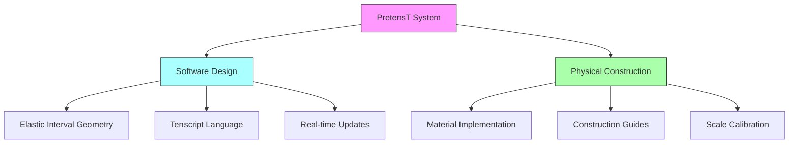
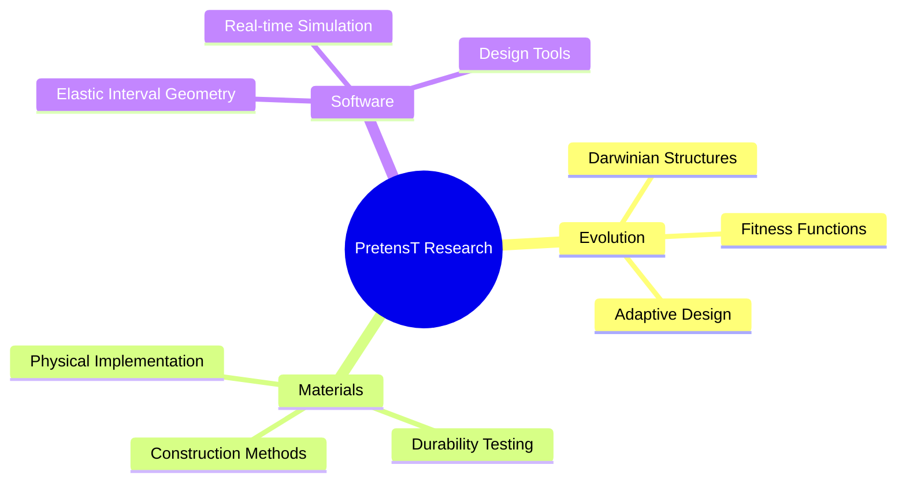

# PretensT

## Overview
PretensT is an advanced software and physical implementation project for exploring [[Tensegrity]] structures through computational design and real-world construction. Building on [[Buckminster_Fuller]]'s principles and [[Kenneth_Snelson]]'s artistic explorations, PretensT extends tensegrity research into both virtual and physical domains.

## Core Components

### Software Implementation
- **[[Elastic_Interval_Geometry|Elastic Interval Geometry]]** - Custom physics engine
- **[[Tenscript]]** - Domain-specific language for tensegrity design
- **Dual Implementation**:
  - Native version (Rust-based design tool)
  - Web version (Construction assistant)

### Key Features


## Technical Framework

### Design Principles
1. **Pure Force Dynamics**
   - Continuous tension
   - Floating compression
   - [[Vector_Equilibrium|Vector Equilibrium]] principles

2. **Modular Architecture**
   - [[Tensegrity_Modules|Tensegrity Modules]] ("bricks")
   - Component fusion methodology
   - Scalable design patterns

### Implementation Stack
- **Backend**: Rust for performance
- **Frontend**: Web interface for accessibility
- **Physics**: Custom [[Elastic_Interval_Geometry|Elastic Interval Geometry]] engine
- **Design**: [[Tenscript]] language for structure definition

## Applications

### Physical Projects
1. **Notable Implementations**:
   - "Bouncy Wooden Sphere" (2024)
   - "Twisted Torque" (2024)
   - "Glass and LED" (2022)
   - "120-Strut Brass Bubble" (2021)

2. **Construction Methods**:
   - Adjustable tensegrity systems
   - Material-specific adaptations
   - Scale-variable implementations

### Research Directions


## Historical Context

### Intellectual Lineage
- [[Buckminster_Fuller]] - Theoretical foundation
- [[Kenneth_Snelson]] - Artistic exploration
- [[Tom_Flemons]] - Biological applications

### Innovation Timeline
- 1960s: Initial tensegrity exploration by Snelson
- Present: PretensT's computational and physical implementation

## Technical Details

### Elastic Interval Geometry
```python
class ElasticInterval:
    def __init__(self):
        self.forces = VectorField()
        self.tension = ContinuousTensor()
        self.compression = FloatingMatrix()
```

### Construction Protocol
1. **Virtual Design**
   - Script composition in Tenscript
   - Real-time simulation
   - Force analysis

2. **Physical Implementation**
   - Material selection
   - Component preparation
   - Assembly sequence
   - Tension calibration

## Future Directions

### Development Goals
1. **Software Enhancement**
   - Advanced simulation capabilities
   - Improved user interface
   - Extended Tenscript functionality

2. **Physical Applications**
   - New material explorations
   - Scale variations
   - Application-specific adaptations

### Research Objectives
- Evolutionary design optimization
- Material behavior studies
- Construction methodology refinement

## Resources

### Project Links
- [GitHub Repository](https://github.com/elastic-interval/tensegrity-lab)
- [Project Documentation](https://elastic-interval.github.io/pretenst/)

### Related Concepts
- [[Tensegrity]]
- [[Vector_Equilibrium]]
- [[Synergetics]]
- [[Elastic_Interval_Geometry]]
- [[Tenscript]]

## References
1. PretensT Project Documentation
2. Elastic Interval Geometry Specifications
3. [[Buckminster_Fuller|Fuller's]] Tensegrity Principles
4. [[Kenneth_Snelson|Snelson's]] Artistic Implementations

---

🏷️ **Tags**: #tensegrity #computational-design #physical-construction #elastic-interval #synergetics 