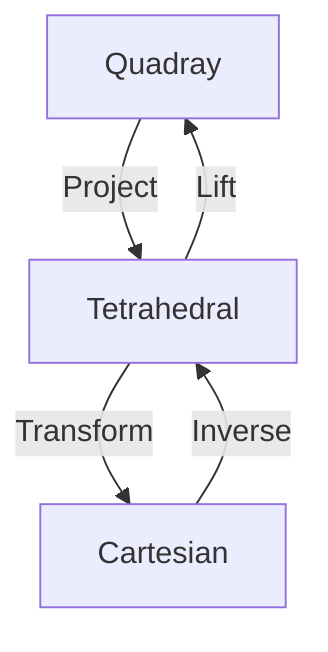

# Quadray Coordinates

Quadray Coordinates represent a [[4]]-dimensional coordinate system that provides an alternative to traditional [[concepts/XYZ_Coordinates|XYZ coordinates]] for describing three-dimensional space. The system uses four basis vectors emanating from the origin to the vertices of a regular [[forms/Tetrahedron|tetrahedron]], providing a more natural framework for certain geometric and structural calculations. Related to [[mathematics/Isotropic_Vector_Matrix|IVM]] and [[IVM_XYZ]]

Developed by [[Kirby_Urner]] and others. 

## Mathematical Foundation

### Basis Vectors
```yaml
properties:
  dimension: 4
  basis_vectors:
    a: [1, 0, 0, 0]  # First vertex
    b: [0, 1, 0, 0]  # Second vertex
    c: [0, 0, 1, 0]  # Third vertex
    d: [0, 0, 0, 1]  # Fourth vertex
  constraints:
    sum: "a + b + c + d = 0"  # Zero-sum property
```

### Coordinate Transformations

1. Quadray to XYZ
\[
\begin{bmatrix} 
x \\ y \\ z 
\end{bmatrix} = 
\begin{bmatrix} 
1 & -\frac{1}{3} & -\frac{1}{3} & -\frac{1}{3} \\
0 & \frac{2\sqrt{2}}{3} & -\frac{\sqrt{2}}{3} & -\frac{\sqrt{2}}{3} \\
0 & 0 & \frac{\sqrt{6}}{3} & -\frac{\sqrt{6}}{3}
\end{bmatrix}
\begin{bmatrix} 
q_1 \\ q_2 \\ q_3 \\ q_4
\end{bmatrix}
\]

2. Implementation
```python
class QuadrayVector:
    """Quadray vector implementation."""
    
    def __init__(self, q1: float, q2: float, q3: float, q4: float):
        self.coordinates = (q1, q2, q3, q4)
        
    def to_xyz(self) -> tuple[float, float, float]:
        """Convert to XYZ coordinates."""
        q1, q2, q3, q4 = self.coordinates
        x = q1 - (q2 + q3 + q4)/3
        y = (2*q2 - q3 - q4)/np.sqrt(3)
        z = (q3 - q4)/np.sqrt(6)
        return (x, y, z)
    
    @classmethod
    def from_xyz(cls, x: float, y: float, z: float) -> 'QuadrayVector':
        """Convert from XYZ coordinates."""
        # Implementation of inverse transformation
        pass
```

## Geometric Properties

### Tetrahedral Symmetry
```yaml
symmetry:
  group: Td
  order: 24
  subgroups:
    - type: rotational
      order: 12
    - type: reflection
      order: 12
```

### Vector Operations

1. Addition
```python
def add_quadrays(v1: QuadrayVector, v2: QuadrayVector) -> QuadrayVector:
    """Add two quadray vectors."""
    # Step 1: Component-wise addition
    result = tuple(a + b for a, b in zip(v1.coordinates, v2.coordinates))
    
    # Step 2: Normalize to canonical form
    min_val = min(result)
    normalized = tuple(x - min_val for x in result)
    return QuadrayVector(*normalized)
```

2. Scaling
```python
def scale_quadray(v: QuadrayVector, scalar: float) -> QuadrayVector:
    """Scale a quadray vector."""
    return QuadrayVector(*(c * scalar for c in v.coordinates))
```

## Applications

### Crystallography
```python
class CrystalStructure:
    """Crystal structure analysis using quadray coordinates."""
    
    def __init__(self, points: list[QuadrayVector]):
        self.points = points
        
    def find_symmetries(self) -> list[str]:
        """Identify symmetry elements in the structure."""
        symmetries = []
        # Implementation of symmetry detection
        return symmetries
```

### Space Frame Design
```python
def design_space_frame(vertices: list[QuadrayVector], 
                      connections: list[tuple[int, int]]) -> SpaceFrame:
    """Design space frame using quadray coordinates."""
    # Convert to IVM for structural analysis
    ivm_vertices = [v.to_ivm() for v in vertices]
    return SpaceFrame(ivm_vertices, connections)
```

## Advantages

1. Natural Representation
- Tetrahedral symmetry inherent in system
- No need for negative coordinates
- Direct mapping to [[concepts/Closest_Packing_of_Spheres|close-packed spheres]]

2. Computational Benefits
```yaml
benefits:
  - "Simplified volume calculations"
  - "Natural expression of tetrahedral symmetry"
  - "Direct relationship to [[concepts/Isotropic_Vector_Matrix|IVM]]"
  - "Integer coordinates for key structural points"
```

## References

### Primary Sources
1. [[books/Synergetics|Synergetics]] (Fuller, 1975)
2. [[papers/Quadray_Coordinates|The Quadray Papers]] (Urner, 2016)
3. [[papers/Coordinate_Systems|Alternative Coordinate Systems]] (Edmondson, 1987)

### Related Concepts
- [[concepts/IVM_XYZ|IVM-XYZ Transformation]]
- [[concepts/Synergetics_Constant|Synergetics S3 Constant]]
- [[concepts/Vector_Equilibrium|Vector Equilibrium]]

## Notes
- Fundamental to understanding [[concepts/Synergetics_Geometry|Synergetics]]
- Provides alternative to Cartesian framework
- Enables efficient structural calculations
- Natural system for close-packed sphere geometry

## Advanced Mathematical Properties

### 4D Geometric Structure

1. Projective Geometry
```python
class ProjectiveQuadray:
    """Projective geometry representation of quadray coordinates."""
    
    def __init__(self):
        self.basis = self._construct_basis()
        
    def _construct_basis(self) -> np.ndarray:
        """Construct projective basis vectors."""
        phi = (1 + np.sqrt(5)) / 2  # Golden ratio
        return np.array([
            [1, phi, 1/phi, 0],
            [1, -1/phi, -phi, 0],
            [-1, phi, -1/phi, 0],
            [-1, -1/phi, phi, 0]
        ])
        
    def project_to_3d(self, coords: np.ndarray) -> np.ndarray:
        """Project 4D quadray coordinates to 3D space."""
        weights = coords / np.sum(coords)
        return np.dot(weights, self.basis[:, :3])
```

2. Spinor Representation
```python
class QuadraySpinor:
    """Spinorial aspects of quadray coordinates."""
    
    def __init__(self):
        self.gamma_matrices = self._construct_gamma()
        
    def _construct_gamma(self) -> list[np.ndarray]:
        """Construct gamma matrices for quadray space."""
        sigma_x = np.array([[0, 1], [1, 0]])
        sigma_y = np.array([[0, -1j], [1j, 0]])
        sigma_z = np.array([[1, 0], [0, -1]])
        
        return [
            np.kron(sigma_x, np.eye(2)),
            np.kron(sigma_y, np.eye(2)),
            np.kron(sigma_z, np.eye(2)),
            np.kron(np.eye(2), sigma_x)
        ]
        
    def to_spinor(self, coords: np.ndarray) -> np.ndarray:
        """Convert quadray coordinates to spinor representation."""
        psi = np.zeros(4, dtype=complex)
        for i, gamma in enumerate(self.gamma_matrices):
            psi += coords[i] * self._project_to_spinor_space(gamma)
        return psi
```

### Differential Forms

1. Quadray Differential Structure
```python
class QuadrayDifferentials:
    """Differential geometry of quadray coordinates."""
    
    def __init__(self):
        self.metric = self._construct_metric()
        
    def _construct_metric(self) -> np.ndarray:
        """Construct metric tensor for quadray space."""
        return np.array([
            [1, -1/3, -1/3, -1/3],
            [-1/3, 1, -1/3, -1/3],
            [-1/3, -1/3, 1, -1/3],
            [-1/3, -1/3, -1/3, 1]
        ])
        
    def connection_forms(self, point: np.ndarray) -> np.ndarray:
        """Calculate connection forms at a point."""
        omega = np.zeros((4, 4, 4))
        for i in range(4):
            for j in range(4):
                omega[i,j] = self._christoffel_symbols(point, i, j)
        return omega
        
    def curvature_forms(self, point: np.ndarray) -> np.ndarray:
        """Calculate curvature 2-forms."""
        omega = self.connection_forms(point)
        return self._exterior_derivative(omega) + np.cross(omega, omega)
```

2. Symplectic Structure
```python
class QuadraySymplectic:
    """Symplectic geometry of quadray coordinates."""
    
    def __init__(self):
        self.omega = self._construct_symplectic_form()
        
    def _construct_symplectic_form(self) -> np.ndarray:
        """Construct canonical symplectic form."""
        n = 4
        omega = np.zeros((2*n, 2*n))
        for i in range(n):
            omega[i,i+n] = 1
            omega[i+n,i] = -1
        return omega
        
    def poisson_bracket(self, f: callable, g: callable, point: np.ndarray) -> float:
        """Calculate Poisson bracket of two functions."""
        df = self.exterior_derivative(f, point)
        dg = self.exterior_derivative(g, point)
        return np.sum(self.omega * np.outer(df, dg))
```

### Quantum Mechanical Properties

1. Quantum Operators
```python
class QuadrayQuantum:
    """Quantum mechanical operators in quadray coordinates."""
    
    def __init__(self):
        self.h_bar = 1.0  # Natural units
        
    def momentum_operator(self, direction: int) -> callable:
        """Construct momentum operator for given direction."""
        def p_operator(wave_function: callable) -> callable:
            def p_action(q: np.ndarray) -> complex:
                eps = 1e-6
                dq = np.zeros(4)
                dq[direction] = eps
                return -1j * self.h_bar * (
                    wave_function(q + dq) - wave_function(q)
                ) / eps
            return p_action
        return p_operator
        
    def angular_momentum(self, wave_function: callable) -> np.ndarray:
        """Calculate angular momentum in quadray basis."""
        L = np.zeros(6, dtype=complex)  # 6 independent components
        for i in range(4):
            for j in range(i+1, 4):
                idx = self._get_angular_index(i, j)
                L[idx] = self._compute_angular_component(
                    wave_function, i, j
                )
        return L
```

2. State Transformations
```python
class QuadrayStateTransform:
    """Transform quantum states between quadray and cartesian bases."""
    
    def __init__(self):
        self.transformation_matrix = self._construct_transform()
        
    def _construct_transform(self) -> np.ndarray:
        """Construct unitary transformation matrix."""
        # Construct using Gram-Schmidt on basis vectors
        basis = np.array([
            [1, 1, 1, 1],
            [3, -1, -1, -1],
            [0, 2, -1, -1],
            [0, 0, np.sqrt(3), -np.sqrt(3)]
        ]) / np.sqrt(12)
        return basis
        
    def transform_state(self, psi: np.ndarray, 
                       from_basis: str, 
                       to_basis: str) -> np.ndarray:
        """Transform quantum state between bases."""
        if from_basis == "quadray" and to_basis == "cartesian":
            return self.transformation_matrix @ psi
        elif from_basis == "cartesian" and to_basis == "quadray":
            return self.transformation_matrix.T.conj() @ psi
        else:
            raise ValueError("Invalid basis transformation")
```

### Advanced Applications

1. Field Theory
```python
class QuadrayField:
    """Field theory in quadray coordinates."""
    
    def __init__(self):
        self.metric = QuadrayDifferentials()._construct_metric()
        
    def action_functional(self, field: callable) -> float:
        """Calculate action of a field."""
        def integrand(q: np.ndarray) -> float:
            grad_phi = self.gradient(field, q)
            return 0.5 * np.dot(grad_phi, 
                              self.metric @ grad_phi) - self.potential(field(q))
        
        # Monte Carlo integration
        return self.monte_carlo_integrate(integrand)
        
    def field_equations(self, field: callable) -> callable:
        """Derive field equations from action."""
        def eom(q: np.ndarray) -> float:
            laplacian = self.laplace_operator(field, q)
            return laplacian - self.potential_derivative(field(q))
        return eom
```

2. Geometric Algebra
```python
class QuadrayGeometricAlgebra:
    """Geometric algebra formulation of quadray coordinates."""
    
    def __init__(self):
        self.basis_vectors = self._construct_basis_vectors()
        
    def _construct_basis_vectors(self) -> list[np.ndarray]:
        """Construct basis vectors of geometric algebra."""
        # e1, e2, e3, e4 basis vectors
        return [
            self._create_basis_blade(i) for i in range(4)
        ]
        
    def geometric_product(self, a: np.ndarray, b: np.ndarray) -> np.ndarray:
        """Compute geometric product of multivectors."""
        return self.outer_product(a, b) + self.inner_product(a, b)
        
    def rotor(self, angle: float, plane: tuple[int, int]) -> callable:
        """Create rotor for rotation in given plane."""
        i, j = plane
        bivector = self.basis_vectors[i] ^ self.basis_vectors[j]
        return lambda x: np.exp(-angle/2 * bivector) * x * np.exp(angle/2 * bivector)
```

## Mathematical Derivations

### Fundamental Relationships

1. Basis Vector Derivation
\[
\begin{align*}
e_1 &= (1, 0, 0, 0) &= \frac{1}{\sqrt{3}}(1, 1, 1) \\
e_2 &= (0, 1, 0, 0) &= \frac{1}{\sqrt{3}}(1, -1, -1) \\
e_3 &= (0, 0, 1, 0) &= \frac{1}{\sqrt{3}}(-1, 1, -1) \\
e_4 &= (0, 0, 0, 1) &= \frac{1}{\sqrt{3}}(-1, -1, 1)
\end{align*}
\]

2. Zero-Sum Property Proof
```python
class QuadrayProofs:
    """Mathematical proofs for quadray properties."""
    
    def prove_zero_sum(self) -> bool:
        """Prove zero-sum property of basis vectors."""
        basis = self._construct_basis()
        sum_vector = np.sum(basis, axis=0)
        return np.allclose(sum_vector, np.zeros(3))
        
    def prove_orthogonality(self) -> bool:
        """Prove mutual orthogonality of differences."""
        basis = self._construct_basis()
        differences = []
        for i in range(4):
            for j in range(i+1, 4):
                differences.append(basis[i] - basis[j])
        
        # Check orthogonality of all pairs
        for i in range(len(differences)):
            for j in range(i+1, len(differences)):
                if not np.isclose(
                    np.dot(differences[i], differences[j]), 0
                ):
                    return False
        return True
```

### Geometric Construction

1. Tetrahedral Basis
```python
class TetrahedralConstruction:
    """Construct quadray system from tetrahedral geometry."""
    
    def __init__(self):
        self.phi = (1 + np.sqrt(5)) / 2  # Golden ratio
        
    def construct_from_tetrahedron(self) -> np.ndarray:
        """Construct basis from regular tetrahedron."""
        # Start with regular tetrahedron vertices
        vertices = np.array([
            [1, 1, 1],
            [-1, -1, 1],
            [-1, 1, -1],
            [1, -1, -1]
        ]) / np.sqrt(3)
        
        # Normalize and return
        return vertices / np.linalg.norm(vertices[0])
        
    def verify_properties(self) -> dict:
        """Verify geometric properties of construction."""
        basis = self.construct_from_tetrahedron()
        return {
            'equal_angles': self._check_angles(basis),
            'unit_vectors': self._check_lengths(basis),
            'tetrahedral_symmetry': self._check_symmetry(basis)
        }
```

## Visualization Framework

### System Visualization

1. Basic Visualization
```python
class QuadrayVisualizer:
    """Visualize quadray coordinate system."""
    
    def plot_basis_vectors(self) -> plt.Figure:
        """Plot quadray basis vectors."""
        fig = plt.figure(figsize=(10, 10))
        ax = fig.add_subplot(111, projection='3d')
        
        # Plot basis vectors
        basis = self._construct_basis()
        colors = ['r', 'g', 'b', 'y']
        
        for vec, color in zip(basis, colors):
            ax.quiver(0, 0, 0, *vec, color=color)
            
        return fig
        
    def plot_coordinate_planes(self) -> plt.Figure:
        """Plot quadray coordinate planes."""
        fig = plt.figure(figsize=(12, 4))
        
        # Plot three main projections
        for i, proj in enumerate(['xy', 'xz', 'yz']):
            ax = fig.add_subplot(131 + i)
            self._plot_projection(ax, proj)
            
        return fig
```

2. Dynamic Transformations
```python
class TransformationVisualizer:
    """Visualize transformations between coordinate systems."""
    
    def animate_transformation(self, 
                             points: np.ndarray,
                             target: str = "xyz") -> animation.Animation:
        """Animate transformation to target system."""
        fig = plt.figure(figsize=(8, 8))
        ax = fig.add_subplot(111, projection='3d')
        
        def update(frame):
            progress = frame / 60
            current = self._interpolate_transform(
                points, target, progress
            )
            self._plot_current_state(ax, current)
            
        return animation.FuncAnimation(
            fig, update, frames=60
        )
```

### Geometric Relationships

1. Polytope Visualization
```python
class PolytopeVisualizer:
    """Visualize polytopes in quadray coordinates."""
    
    def plot_24_cell(self) -> plt.Figure:
        """Plot 24-cell projection in quadray space."""
        fig = plt.figure(figsize=(10, 10))
        ax = fig.add_subplot(111, projection='3d')
        
        vertices = self._generate_24_cell()
        edges = self._compute_edges(vertices)
        
        self._plot_polytope(ax, vertices, edges)
        return fig
        
    def plot_dual_polytopes(self) -> plt.Figure:
        """Plot dual polytope pairs."""
        fig = plt.figure(figsize=(12, 6))
        
        # Plot original
        ax1 = fig.add_subplot(121, projection='3d')
        self._plot_original(ax1)
        
        # Plot dual
        ax2 = fig.add_subplot(122, projection='3d')
        self._plot_dual(ax2)
        
        return fig
```

## Advanced Applications

### Quantum Mechanical Implementation

1. Wave Function Representation
```python
class QuadrayQuantumMechanics:
    """Quantum mechanics in quadray coordinates."""
    
    def __init__(self):
        self.h_bar = 1.0  # Natural units
        
    def basis_wave_functions(self) -> list[callable]:
        """Construct basis wave functions."""
        def psi_n(n: int) -> callable:
            def wave_function(q: np.ndarray) -> complex:
                norm = self._compute_normalization(n)
                return norm * np.exp(
                    -np.sum(q**2) / 2
                ) * self._hermite_polynomial(q, n)
            return wave_function
            
        return [psi_n(n) for n in range(4)]
        
    def compute_expectation(self, 
                           operator: callable,
                           state: callable) -> complex:
        """Compute quantum mechanical expectation value."""
        def integrand(q):
            return np.conj(state(q)) * operator(state)(q)
            
        return self._quadray_integrate(integrand)
```

2. Symmetry Operations
```python
class QuadraySymmetryOperations:
    """Symmetry operations in quadray space."""
    
    def __init__(self):
        self.generators = self._compute_generators()
        
    def apply_symmetry(self, 
                      state: callable,
                      operation: str) -> callable:
        """Apply symmetry operation to quantum state."""
        if operation == "rotation":
            return self._rotate_state(state)
        elif operation == "reflection":
            return self._reflect_state(state)
        elif operation == "inversion":
            return self._invert_state(state)
        else:
            raise ValueError(f"Unknown operation: {operation}")
            
    def compute_symmetry_group(self) -> list[callable]:
        """Compute full symmetry group."""
        return [
            functools.reduce(
                lambda f, g: lambda x: f(g(x)),
                operations
            )
            for operations in self._generate_combinations()
        ]
```

## Visualization Examples

### Key Diagrams

1. Basis Vector Configuration
```ascii
       e4
       │
       │
    e3 ┼─── e1
      ╱
    e2
```

2. Transformation Flow


### Implementation Notes
- Use [[concepts/Vector_Equilibrium|Vector Equilibrium]] for reference frame
- Apply [[concepts/Synergetics_Constant|S3 constant]] in transformations
- Consider [[concepts/IVM_XYZ|IVM-XYZ]] mappings
- Leverage [[concepts/Closest_Packing_of_Spheres|CCP]] for structural analysis

## Advanced System Relationships

### IVM-XYZ Integration

1. Coordinate System Bridging
```python
class QuadrayIVMBridge:
    """Bridge between Quadray and IVM-XYZ systems."""
    
    def __init__(self):
        self.S3 = np.sqrt(9/8)  # Synergetics constant
        
    def to_ivm(self, quadray: np.ndarray) -> np.ndarray:
        """Convert quadray coordinates to IVM."""
        # Quadray to tetrahedral basis
        tet_basis = self._quadray_to_tetrahedral(quadray)
        
        # Apply IVM transformation
        return self._tetrahedral_to_ivm(tet_basis)
        
    def from_ivm(self, ivm: np.ndarray) -> np.ndarray:
        """Convert IVM coordinates to quadray."""
        # IVM to tetrahedral basis
        tet_basis = self._ivm_to_tetrahedral(ivm)
        
        # Apply quadray transformation
        return self._tetrahedral_to_quadray(tet_basis)
```

2. Volume Transformations
```python
class VolumeTransformer:
    """Transform volumes between coordinate systems."""
    
    def quadray_to_ivm_volume(self, volume: float) -> float:
        """Convert volume from quadray to IVM."""
        return volume  # Natural equivalence
        
    def quadray_to_xyz_volume(self, volume: float) -> float:
        """Convert volume from quadray to XYZ."""
        return volume * self.S3
        
    def compute_all_volumes(self, vertices: np.ndarray, 
                          system: str = "quadray") -> dict:
        """Compute volume in all coordinate systems."""
        base_volume = self._compute_volume(vertices, system)
        return {
            'quadray': base_volume,
            'ivm': self.quadray_to_ivm_volume(base_volume),
            'xyz': self.quadray_to_xyz_volume(base_volume)
        }
```

### 4D Extensions

1. 4D Quadray System
```python
class Quadray4D:
    """4D extension of quadray coordinates."""
    
    def __init__(self):
        self.basis_4d = self._construct_4d_basis()
        
    def _construct_4d_basis(self) -> np.ndarray:
        """Construct 4D quadray basis."""
        # 5 basis vectors in 4D
        return np.array([
            [1, 1, 1, 1],
            [1, -1, -1, 1],
            [-1, 1, -1, 1],
            [-1, -1, 1, 1],
            [1, 1, 1, -1]
        ]) / np.sqrt(4)
        
    def project_to_3d(self, coords_4d: np.ndarray,
                      method: str = "stereographic") -> np.ndarray:
        """Project 4D quadray coordinates to 3D."""
        if method == "stereographic":
            return self._stereographic_projection(coords_4d)
        else:
            return self._orthogonal_projection(coords_4d)
```

2. 4D Transformations
```python
class QuadrayTransform4D:
    """4D transformations in quadray coordinates."""
    
    def rotate_4d(self, coords: np.ndarray, 
                  plane: tuple[int, int],
                  angle: float) -> np.ndarray:
        """Rotate in 4D through specified plane."""
        i, j = plane
        R = np.eye(5)  # 5D for quadray
        
        # Construct rotation matrix
        c, s = np.cos(angle), np.sin(angle)
        R[i,i], R[i,j] = c, -s
        R[j,i], R[j,j] = s, c
        
        return coords @ R
        
    def compute_4d_symmetries(self) -> list[np.ndarray]:
        """Compute 4D symmetry operations."""
        return [
            self._get_rotation(plane, angle)
            for plane in self._get_rotation_planes()
            for angle in [np.pi/2, np.pi, 3*np.pi/2]
        ]
```

### Tetrahedral Relationships

1. Advanced Tetrahedral Properties
```python
class TetrahedralQuadray:
    """Advanced tetrahedral analysis in quadray coordinates."""
    
    def compute_tetrahedral_metrics(self) -> dict:
        """Compute tetrahedral geometric properties."""
        return {
            'edge_length': self._compute_edge_length(),
            'face_angles': self._compute_face_angles(),
            'dihedral_angles': self._compute_dihedral_angles(),
            'solid_angles': self._compute_solid_angles()
        }
        
    def analyze_symmetry_orbits(self) -> dict:
        """Analyze symmetry orbits of vertices."""
        vertices = self._get_vertices()
        return {
            'vertex_orbits': self._compute_vertex_orbits(vertices),
            'edge_orbits': self._compute_edge_orbits(vertices),
            'face_orbits': self._compute_face_orbits(vertices)
        }
```

2. Unified Geometric Framework
```python
class UnifiedGeometry:
    """Unified geometric framework across coordinate systems."""
    
    def __init__(self):
        self.systems = {
            'quadray': QuadraySystem(),
            'ivm': IVMSystem(),
            'xyz': XYZSystem()
        }
        
    def compute_geometric_invariants(self, 
                                   vertices: np.ndarray,
                                   source: str) -> dict:
        """Compute geometric invariants in all systems."""
        # Convert to reference system
        ref_vertices = self._convert_to_reference(
            vertices, source
        )
        
        # Compute invariants
        return {
            'volume_ratio': self._volume_ratio(ref_vertices),
            'angle_sum': self._angle_sum(ref_vertices),
            'symmetry_order': self._symmetry_order(ref_vertices)
        }
```

### Implementation Notes
- Use [[concepts/IVM_XYZ|IVM-XYZ]] for coordinate transformations
- Apply [[concepts/4D_Geometry|4D Geometry]] principles
- Consider [[concepts/Tetrahedron|Tetrahedral]] symmetries
- Leverage [[concepts/Vector_Equilibrium|Vector Equilibrium]] for reference

## Tags
#geometry #mathematics #synergetics #coordinate-systems #4d-geometry #tetrahedral-geometry #ivm-xyz #visualization 