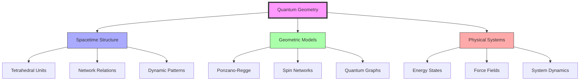
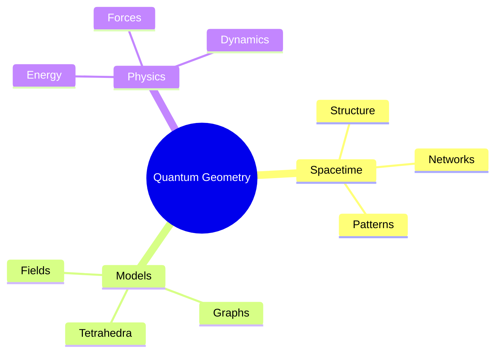
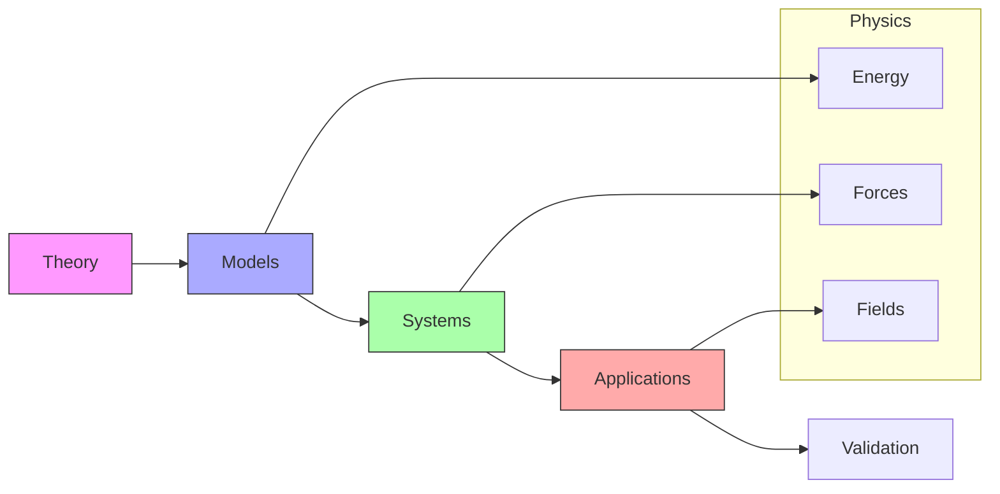
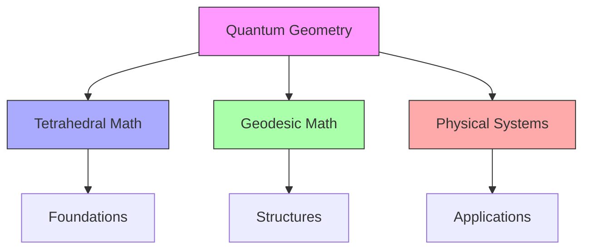
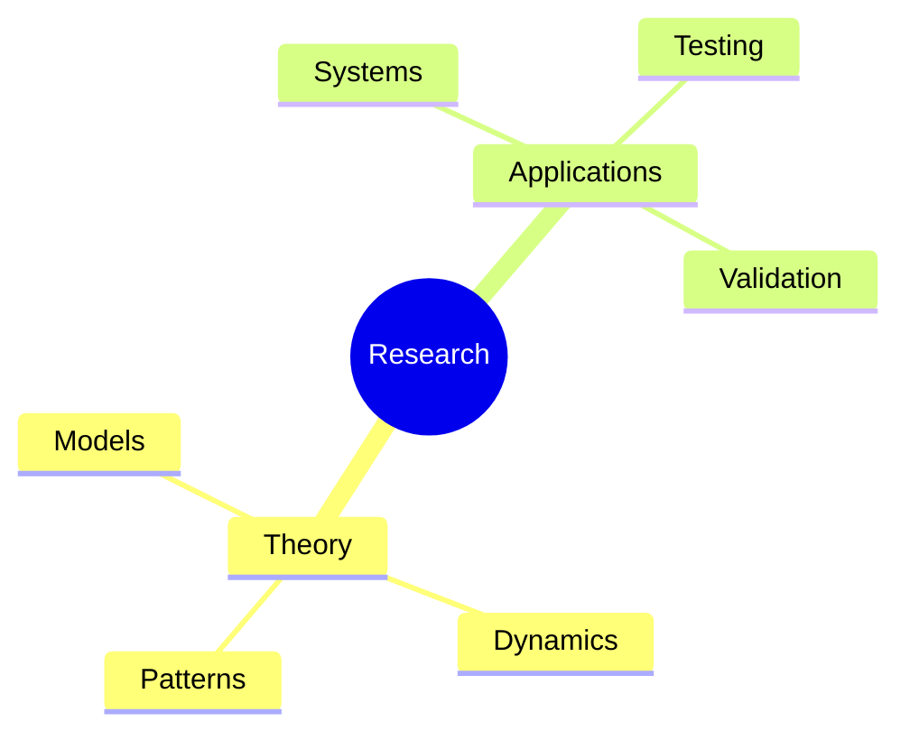
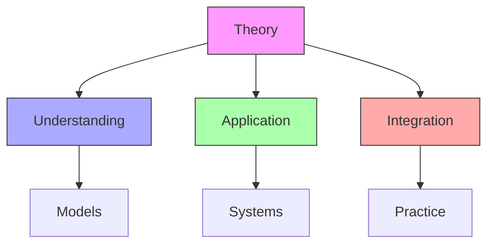
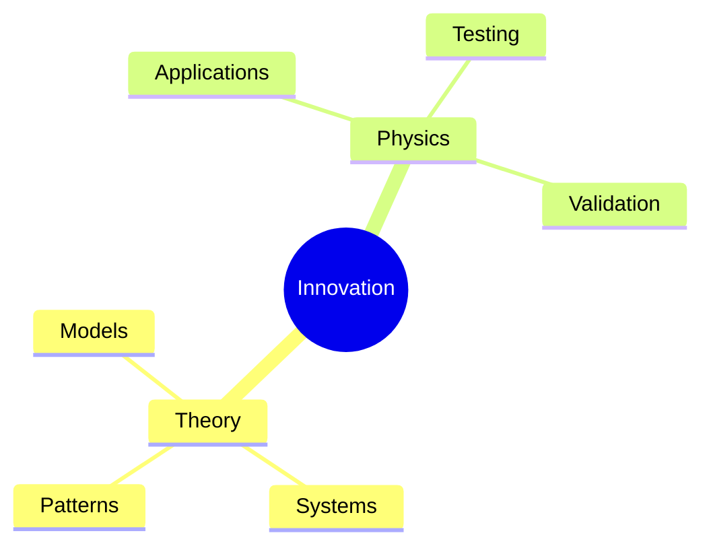

# Quantum Geometry

Quantum Geometry represents the mathematical bridge between [[concepts/Synergetics|Fuller's geometric principles]] and quantum physics, particularly explored through [[concepts/Martian_Math|Martian Math]]'s tetrahedral approach and [[concepts/Geodesic_Mathematics|geodesic mathematics]].

## Theoretical Foundation

### Core Framework

### Mathematical Components
1. [[concepts/Spacetime_Mathematics|Spacetime Structure]]
   - Tetrahedral units
   - Network relationships
   - Dynamic patterns
   - System evolution

2. [[concepts/Quantum_Models|Quantum Systems]]
   - Ponzano-Regge models
   - Spin networks
   - Quantum graphs
   - Energy states

## Geometric Integration

### System Framework

### Key Relationships
1. [[concepts/Tetrahedral_Systems|Tetrahedral Framework]]
   - Fundamental units
   - Network structures
   - System relationships
   - Dynamic patterns

2. [[concepts/Quantum_Networks|Network Systems]]
   - Energy states
   - Force fields
   - System dynamics
   - Pattern evolution

## Physical Applications

### Implementation Areas
1. [[concepts/Quantum_Physics|Physical Systems]]
   - Energy models
   - Force distributions
   - Field patterns
   - System dynamics

2. [[concepts/Geometric_Models|Geometric Applications]]
   - Structural analysis
   - Pattern recognition
   - System modeling
   - Dynamic simulation

### Application Framework

## Mathematical Connections

### Integration Points
1. [[concepts/Martian_Math|Tetrahedral Mathematics]]
   - Geometric foundations
   - System relationships
   - Pattern recognition
   - Dynamic models

2. [[concepts/Geodesic_Mathematics|Geodesic Systems]]
   - Structural patterns
   - Force distributions
   - System dynamics
   - Network relationships

### Connection Framework

## Research Applications

### Study Areas
1. [[concepts/Quantum_Research|Theoretical Research]]
   - Mathematical models
   - System dynamics
   - Pattern analysis
   - Network studies

2. [[concepts/Physical_Applications|Applied Research]]
   - System implementation
   - Model validation
   - Pattern verification
   - Dynamic testing

### Research Framework

## Educational Integration

### Teaching Methods
1. [[concepts/Quantum_Education|Educational Approach]]
   - Theoretical foundations
   - System understanding
   - Pattern recognition
   - Application methods

2. [[concepts/Physical_Education|Physical Integration]]
   - System modeling
   - Dynamic analysis
   - Pattern studies
   - Application development

### Learning Framework

## Future Development

### Innovation Areas
1. [[concepts/Quantum_Innovation|Theoretical Evolution]]
   - Model development
   - System integration
   - Pattern discovery
   - Dynamic analysis

2. [[concepts/Physical_Innovation|Physical Development]]
   - Application methods
   - System validation
   - Pattern verification
   - Dynamic testing

### Development Framework

## References

### Primary Sources
1. [[books/Quantum_Geometry|Quantum Geometry: A Framework for Quantum Gravity]]
2. [[books/Synergetics_Book|Synergetics: Explorations in the Geometry of Thinking]]
3. [[books/Spacetime_Physics|Spacetime Physics and Geometry]]

### Related Resources
1. [[papers/Quantum_Models|Quantum Geometric Models]]
2. [[papers/Physical_Systems|Physical System Applications]]
3. [[papers/Integration_Methods|System Integration Methods]]

### Technical Documentation
1. [[docs/Mathematical_Framework|Mathematical Framework Guide]]
2. [[docs/Physical_Models|Physical Modeling Guide]]
3. [[docs/System_Integration|System Integration Guide]]

## Notes
- Bridge between geometry and quantum physics
- Integration of tetrahedral and geodesic principles
- Focus on system relationships and patterns
- Continuous theoretical development
- Practical physical applications
- Research expansion opportunities

## Tags
#mathematics #physics #geometry #quantum-systems #spacetime 