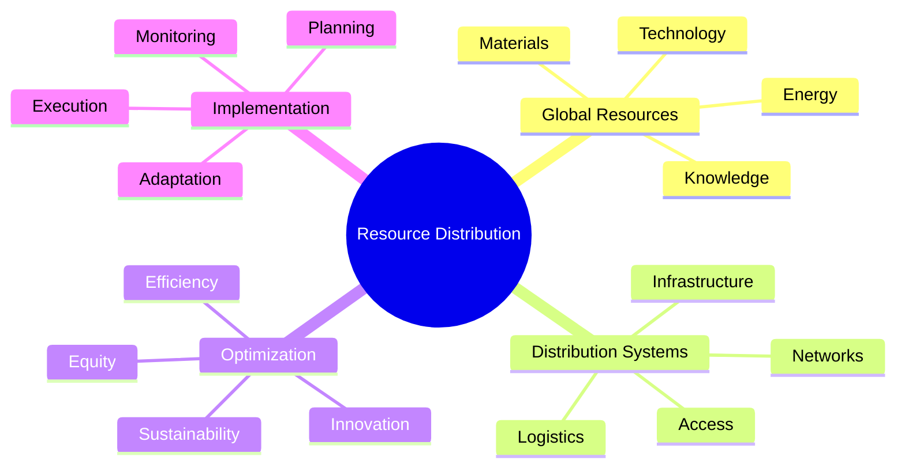
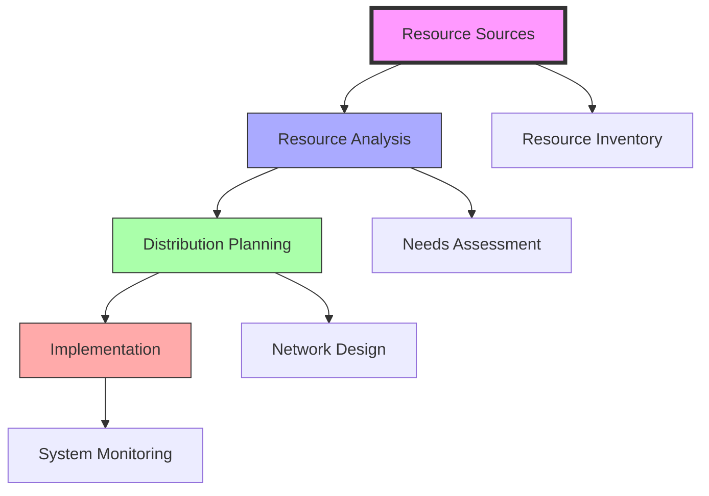
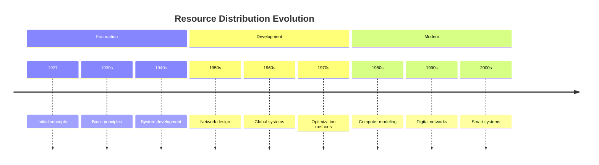

# Resource Distribution

> Fuller's comprehensive framework for understanding and optimizing the flow of global resources to benefit all humanity, central to his [[World_Game]] and [[Design_Science]] methodologies.

## Core Principles

### Distribution Framework

### System Flow

## Applications

### Implementation Areas
- [[Energy_Systems]] distribution
- [[World_Game]] resources
- Material allocation
- Knowledge sharing

### System Types
- Physical resources
- Energy networks
- Information systems
- Technology transfer

## Research Methods

### Analysis Tools
- System mapping
- Flow analysis
- Network optimization
- Impact assessment

### Distribution Models

## Historical Development

## System Components

### Network Elements
- Distribution nodes
- Transportation links
- Storage facilities
- Access points

### Resource Types
- Physical materials
- Energy resources
- Information flows
- Technology systems

## Implementation

### Practical Methods
- Network design
- System optimization
- Flow management
- Access improvement

### Development Process
- Planning phase
- Implementation phase
- Monitoring phase
- Optimization phase

## Educational Framework

### Learning Methods
- [[Systems_Education]]
- [[Pattern_Learning]]
- Network analysis
- System design

### Teaching Tools
- System models
- Case studies
- Practical exercises
- Simulation tools

## Research Impact

### Areas of Influence
- [[Design_Science]]
- [[System_Analysis]]
- [[Pattern_Recognition]]
- [[World_Game]]

### Current Research
- Network optimization
- System efficiency
- Access improvement
- Sustainability methods

## Modern Applications

### Contemporary Use
- Smart distribution
- Resource sharing
- Network optimization
- System integration

### Future Directions
- AI optimization
- Digital networks
- Smart systems
- Global integration

## Global Impact

### Solution Areas
- Resource access
- System efficiency
- Network design
- Distribution equity

### Implementation Scope
- Local networks
- Regional systems
- Global distribution
- Universal access

## References

### Primary Sources
- Fuller, R. B. (1969). *Operating Manual for Spaceship Earth*.
- Fuller, R. B. (1981). *Critical Path*.
- World Game Workshop Documentation

### Secondary Sources
- Edmondson, A. C. (2007). *A Fuller Explanation*.
- [[BFI_Archives]] Documentation
- System Analysis Studies

## See Also

- [[World_Game]]
- [[Design_Science]]
- [[System_Analysis]]
- [[Energy_Systems]]

## Notes

Resource Distribution represents a fundamental aspect of Fuller's approach to global problem-solving, focusing on the efficient and equitable distribution of resources to benefit all humanity through systematic design and implementation. 