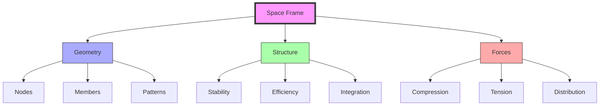

# Space Frames

Space Frames represent a fundamental structural system combining geometric principles with engineering efficiency to create lightweight, strong, and versatile three-dimensional frameworks. These structures distribute forces through a network of interconnected members, achieving remarkable strength-to-weight ratios.

## Core Principles

### Basic Grid Patterns
```ascii
Square Grid:          Triangular Grid:
+----+----+----+     /\  /\  /\
|    |    |    |    /  \/  \/  \
+----+----+----+    \  /\  /\  /
|    |    |    |     \/  \/  \/
+----+----+----+     /\  /\  /\
|    |    |    |    /  \/  \/  \
+----+----+----+    \  /\  /\  /

Diagonal Grid:        Hybrid Grid:
\  |  /  \  |  /    +--\/--+--/\
 \ | /    \ | /     |  /\  |  \/
  \|/      \|/      +\/--\+/--+
  /|\      /|\      |/    \|  /
 / | \    / | \     +--\/--+--\
/  |  \  /  |  \    |  /\  |  /
```

### Structural Framework


### Layer Configurations
```ascii
Single Layer:         Double Layer:
    Top View             Section
  o---o---o          o===o===o
  |   |   |          |   |   |
  o---o---o          o===o===o
  |   |   |          |   |   |
  o---o---o          o===o===o

Triple Layer:         Connection Detail:
   Section              Node Joint
o===o===o                 o
|   |   |              / | \
o===o===o             o--o--o
|   |   |              \ | /
o===o===o                o

o: Node
-: Member (horizontal)
|: Member (vertical)
=: Double member
```

### Fundamental Types
1. Single-Layer Systems
```yaml
characteristics:
  depth: "one structural layer"
  typical_span: "up to 20m"
  applications: "roofs, canopies"
  efficiency: "moderate"
```

2. Double-Layer Systems
```yaml
characteristics:
  depth: "two parallel layers"
  typical_span: "20-100m"
  applications: "large roofs, floors"
  efficiency: "high"
```

3. Triple-Layer Systems
```yaml
characteristics:
  depth: "three parallel layers"
  typical_span: ">100m"
  applications: "super-spans"
  efficiency: "very high"
```

## Technical Framework

### Mathematical Foundations
1. Node Coordination
\[
N = \frac{(L+1)(W+1)(D+1)}{k}
\]
Where:
- N = Number of nodes
- L,W,D = Length, Width, Depth in modules
- k = Pattern factor

2. Member Relations
\[
M = \frac{3N}{2} - (L+W+D) + 1
\]
Where M = Number of members

3. Deflection Analysis
\[
\delta_{\text{max}} = \frac{5wL^4}{384EI} \cdot \alpha
\]
Where:
- δ = Maximum deflection
- w = Distributed load
- L = Span length
- E = Elastic modulus
- I = Moment of inertia
- α = Configuration factor

### Load Distribution Patterns
```ascii
Vertical Load Transfer:

    ↓ ↓ ↓ ↓ ↓ ↓
    ============
    \  /  \  /
     \/    \/
      \    /
       \  /
        \/

Lateral Load Response:

    →→→
    ============
    \  /|  \  /
     \/ |   \/
      \ |   /
       \|  /
        \|/
```

### Load Distribution
```yaml
force_patterns:
  axial:
    compression: "primary in verticals"
    tension: "diagonals and horizontals"
  moments:
    primary: "at connections"
    secondary: "in members"
  shear:
    distribution: "through triangulation"
```

## Advanced Configurations

### Pattern Types
1. [[Octet_Truss]] Based
```yaml
characteristics:
  geometry: "octahedron-tetrahedron"
  efficiency: "highest"
  complexity: "moderate"
  fabrication: "standardized"
```

2. Square Grid
```yaml
characteristics:
  geometry: "cubic arrangement"
  efficiency: "good"
  complexity: "low"
  fabrication: "simple"
```

3. Triangulated
```yaml
characteristics:
  geometry: "triangular grid"
  efficiency: "very good"
  complexity: "moderate"
  fabrication: "moderate"
```

### Connection Systems
```yaml
node_types:
  ball_node:
    strength: "high"
    cost: "high"
    flexibility: "maximum"
  welded:
    strength: "very high"
    cost: "moderate"
    flexibility: "minimal"
  bolted:
    strength: "good"
    cost: "low"
    flexibility: "moderate"
```

## Practical Applications

### Implementation Examples
1. Large Span Structures
- Crystal Palace (London)
- Centre Pompidou (Paris)
- British Museum Great Court

2. High-Rise Integration
- John Hancock Center (Chicago)
- Bank of China Tower (Hong Kong)
- Hearst Tower (New York)

### Construction Methods
```yaml
assembly_types:
  ground_assembly:
    method: "piece by piece"
    equipment: "minimal"
    time: "longer"
  lift_in:
    method: "pre-assembled sections"
    equipment: "heavy crane"
    time: "moderate"
  sliding:
    method: "progressive launching"
    equipment: "specialized"
    time: "efficient"
```

## Performance Analysis

### Structural Behavior
1. Static Analysis
```yaml
parameters:
  deflection:
    limit: "span/360"
    control: "depth ratio"
  stress:
    distribution: "uniform"
    optimization: "member sizing"
```

2. Dynamic Response
```yaml
considerations:
  frequency:
    natural: "avoid resonance"
    damping: "inherent"
  wind:
    vortex: "critical"
    mitigation: "shape optimization"
```

### Optimization Methods
1. Topology Optimization
\[
\min_{\rho} \sum_{e=1}^{N} \rho_e v_e
\]
Subject to:
\[
K(\rho)u = f
\]

2. Size Optimization
```yaml
objectives:
  weight: "minimize"
  deflection: "constrain"
  stress: "limit"
  cost: "consider"
```

## Integration with Other Systems

### Compatible Systems
- [[Geodesic_Dome]]
- [[Tensegrity]]
- [[Vector_Equilibrium]]
- [[Octet_Truss]]

### Hybrid Applications
```yaml
combinations:
  tensegrity:
    benefit: "reduced weight"
    complexity: "high"
  membrane:
    benefit: "weather protection"
    complexity: "moderate"
  composite:
    benefit: "enhanced performance"
    complexity: "variable"
```

## Future Developments

### Advanced Materials
```yaml
innovations:
  composites:
    type: "fiber reinforced"
    benefit: "weight reduction"
  smart_materials:
    type: "adaptive"
    benefit: "response control"
  bio_materials:
    type: "sustainable"
    benefit: "environmental"
```

### Digital Integration
1. Parametric Design
```yaml
tools:
  generative:
    purpose: "form finding"
    method: "algorithmic"
  analysis:
    purpose: "performance"
    method: "FEA"
```

2. Fabrication
```yaml
methods:
  additive:
    type: "3D printing"
    scale: "component"
  robotic:
    type: "assembly"
    scale: "system"
```

## References

### Technical Standards
1. ASCE 7: Minimum Design Loads
2. Eurocode 3: Steel Structures
3. ISO 14347: Fatigue Testing

### Key Publications
1. Chilton, J. (2000). Space Grid Structures
2. Makowski, Z.S. (1981). Analysis, Design and Construction of Space Frames
3. Ramaswamy, G.S. (2002). Analysis of Space Structures

## Notes
- Critical for large-span architecture
- Efficient material utilization
- Adaptable to various geometries
- Integration with modern materials
- Digital design potential

## Tags
#structures #engineering #geometry #architecture #design #space-frames 