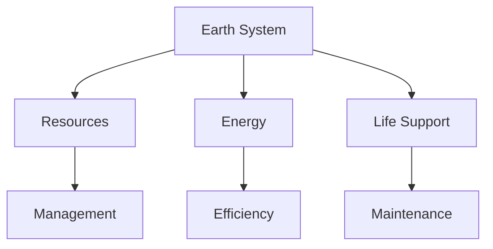
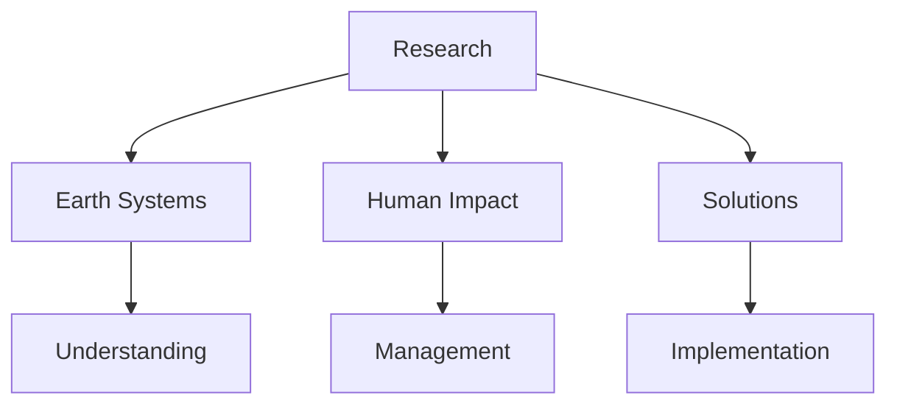

# Spaceship Earth

Spaceship Earth is R. Buckminster Fuller's metaphorical concept describing Earth as a spacecraft, emphasizing our planet's finite resources and humanity's role as its crew.

## Overview

### Definition
```yaml
spaceship_earth:
  creator: R. Buckminster Fuller
  introduced: 1963
  publication: Operating Manual for Spaceship Earth (1969)
  core_concept: Earth as integrated system
  key_aspects:
    - Resource management
    - Global cooperation
    - Systems thinking
    - Environmental stewardship
```

### Fundamental Principles
1. System Integration
   - Planetary unity
   - Resource cycles
   - Energy flows
   - Life support systems

2. Crew Responsibilities
   - Resource stewardship
   - Global cooperation
   - System maintenance
   - Future planning

## Philosophical Framework

### Core Ideas
```mermaid
mindmap
    root((Spaceship Earth))
        Resources
            [[Finite Resources]]
            [[Energy Systems]]
            [[Resource Cycles]]
        Operations
            [[System Management]]
            [[Global Cooperation]]
            [[Maintenance]]
        Crew
            [[Human Responsibility]]
            [[Global Citizenship]]
            [[Collective Action]]
```

### Key Concepts
1. Planetary Systems
   - Ecological cycles
   - Resource flows
   - Energy dynamics
   - Life support systems

2. Human Role
   - System stewardship
   - Resource management
   - Global cooperation
   - Future planning

## Environmental Implications

### Resource Management
1. Natural Systems
   - [[Ecological Cycles]]
   - [[Resource Flows]]
   - [[Energy Systems]]
   - [[Biodiversity]]

2. Human Systems
   - [[Resource Allocation]]
   - [[Energy Use]]
   - [[Waste Management]]
   - [[Sustainable Practices]]

### System Dynamics


## Global Applications

### Implementation Areas
1. Environmental Policy
   - Resource conservation
   - Energy efficiency
   - Pollution control
   - Climate action

2. Social Systems
   - Global cooperation
   - Education
   - Healthcare
   - Infrastructure

### Action Framework
```mermaid
mindmap
    root((Applications))
        Policy
            [[Environmental Law]]
            [[Resource Policy]]
            [[Energy Planning]]
        Practice
            [[Conservation]]
            [[Efficiency]]
            [[Innovation]]
        Education
            [[Global Awareness]]
            [[System Understanding]]
            [[Action Training]]
```

## Educational Value

### Learning Objectives
1. System Understanding
   - Earth systems
   - Resource cycles
   - Human impact
   - Global interconnections

2. Action Development
   - Problem-solving
   - Resource management
   - Cooperation skills
   - Future planning

### Educational Framework


## Modern Relevance

### Contemporary Issues
1. Environmental Challenges
   - Climate change
   - Resource depletion
   - Pollution
   - Biodiversity loss

2. Global Solutions
   - Sustainable development
   - Renewable energy
   - Circular economy
   - International cooperation

### Current Applications
```mermaid
mindmap
    root((Modern Use))
        Environment
            [[Climate Action]]
            [[Conservation]]
            [[Restoration]]
        Society
            [[Global Cooperation]]
            [[Education]]
            [[Innovation]]
```

## Research Impact

### Study Areas
1. Environmental Science
   - Earth systems
   - Climate dynamics
   - Resource cycles
   - Biodiversity

2. Social Science
   - Global cooperation
   - Human behavior
   - Policy development
   - Education systems

### Research Directions


## Cultural Influence

### Impact Areas
1. Environmental Movement
   - Conservation
   - Sustainability
   - Global awareness
   - Action initiatives

2. Social Change
   - Global consciousness
   - Cooperation
   - Innovation
   - Education

### Cultural Effects
```mermaid
mindmap
    root((Influence))
        Awareness
            [[Environmental]]
            [[Global]]
            [[Systemic]]
        Action
            [[Conservation]]
            [[Innovation]]
            [[Cooperation]]
```

## Resources

### Documentation
- [[Operating Manual]]
- [[Research Papers]]
- [[Educational Materials]]
- [[Implementation Guides]]

### Learning Materials
1. Educational Resources
   - [[Teaching Guides]]
   - [[Learning Tools]]
   - [[Action Plans]]

2. Research Materials
   - [[System Studies]]
   - [[Impact Analysis]]
   - [[Future Planning]]

## References
1. Fuller's writings
2. Environmental studies
3. System analyses
4. Impact assessments
5. Educational resources

## Notes
- Fundamental to Fuller's worldview
- Increasingly relevant today
- Guides global solutions
- Promotes systemic thinking

## Tags
#concept #philosophy #sustainability #global-systems #ecology 